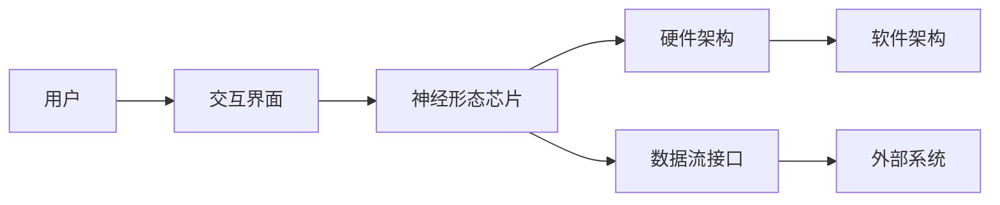

                 

<think>
好的，我现在需要帮助用户设计一个技术博客文章的目录大纲，标题是《如何识别企业的神经形态计算芯片优势》。用户已经提供了一个详细的示例大纲，我需要根据这个示例来继续完成剩下的部分，确保结构完整且符合要求。

首先，我需要分析用户提供的大纲结构。当前的大纲已经包含了两大部分：背景与概念，以及算法原理。用户还特别指出，文章需要包含数学公式、代码示例、系统架构图、项目实战等内容，并且要超过7章。

接下来，我需要按照用户的指示，逐步完成剩余的部分。根据示例，第三部分是系统架构与实现，第四部分是项目实战与应用案例，第五部分是行业应用与未来趋势，最后是总结与展望。

### 第三部分: 神经形态计算芯片的系统架构与实现

#### 第4章: 神经形态计算芯片的系统架构

##### 4.1 神经形态计算芯片的系统设计
###### 4.1.1 系统设计的基本原则
###### 4.1.2 神经形态芯片的硬件架构
###### 4.1.3 神经形态芯片的软件架构

##### 4.2 神经形态计算芯片的接口设计
###### 4.2.1 神经形态芯片的输入输出接口
###### 4.2.2 神经形态芯片的数据流接口
###### 4.2.3 神经形态芯片的控制接口

##### 4.3 神经形态计算芯片的交互设计
###### 4.3.1 用户与神经形态芯片的交互界面
###### 4.3.2 神经形态芯片与外部系统的交互
###### 4.3.3 神经形态芯片的反馈机制

##### 4.4 系统架构的Mermaid图

#### 第5章: 神经形态计算芯片的实现细节

##### 5.1 神经形态芯片的实现技术
###### 5.1.1 基于神经网络的芯片实现
###### 5.1.2 神经形态芯片的并行计算
###### 5.1.3 神经形态芯片的低功耗设计

##### 5.2 神经形态芯片的实现工具
###### 5.2.1 神经网络模拟工具
###### 5.2.2 神经形态芯片的设计工具
###### 5.2.3 神经形态芯片的验证工具

##### 5.3 神经形态芯片的实现步骤
###### 5.3.1 需求分析与设计
###### 5.3.2 神经网络模型的设计
###### 5.3.3 神经形态芯片的实现与验证

### 第四部分: 项目实战与应用案例

#### 第6章: 神经形态计算芯片的项目实战

##### 6.1 项目环境的安装与配置
###### 6.1.1 系统要求与依赖安装
###### 6.1.2 神经形态芯片开发环境的搭建
###### 6.1.3 项目代码的下载与安装

##### 6.2 项目核心功能的实现
###### 6.2.1 神经网络模型的定义
###### 6.2.2 神经形态芯片的训练过程
###### 6.2.3 神经形态芯片的推理过程

##### 6.3 项目代码实现
###### 6.3.1 神经网络模型的Python代码实现
###### 6.3.2 神经形态芯片的训练代码
###### 6.3.3 神经形态芯片的推理代码

##### 6.4 代码的详细解读与分析
###### 6.4.1 神经网络模型的定义与参数设置
###### 6.4.2 神经形态芯片的训练过程分析
###### 6.4.3 神经形态芯片的推理结果解读

#### 第7章: 应用案例分析

##### 7.1 神经形态芯片在图像识别中的应用
###### 7.1.1 图像识别的基本原理
###### 7.1.2 神经形态芯片在图像识别中的优势
###### 7.1.3 实际案例分析与结果展示

##### 7.2 神经形态芯片在自然语言处理中的应用
###### 7.2.1 自然语言处理的基本原理
###### 7.2.2 神经形态芯片在NLP中的优势
###### 7.2.3 实际案例分析与结果展示

##### 7.3 神经形态芯片在其他领域的应用
###### 7.3.1 神经形态芯片在机器人控制中的应用
###### 7.3.2 神经形态芯片在医疗诊断中的应用
###### 7.3.3 神经形态芯片在金融分析中的应用

### 第五部分: 行业应用与未来趋势

#### 第8章: 神经形态计算芯片的行业应用

##### 8.1 神经形态芯片在医疗领域的应用
###### 8.1.1 医疗图像分析
###### 8.1.2 疾病预测与诊断
###### 8.1.3 医疗数据处理

##### 8.2 神经形态芯片在金融领域的应用
###### 8.2.1 金融数据分析
###### 8.2.2 风险评估与预测
###### 8.2.3 交易决策支持

##### 8.3 神经形态芯片在自动驾驶中的应用
###### 8.3.1 车辆环境感知
###### 8.3.2 路径规划与决策
###### 8.3.3 实时数据处理

#### 第9章: 神经形态计算芯片的未来发展趋势

##### 9.1 神经形态芯片的技术进步
###### 9.1.1 材料与工艺的创新
###### 9.1.2 算法与模型的优化
###### 9.1.3 系统架构的演进

##### 9.2 神经形态芯片的市场前景
###### 9.2.1 市场需求的增长
###### 9.2.2 产业链的发展
###### 9.2.3 竞争格局的变化

##### 9.3 神经形态芯片面临的挑战
###### 9.3.1 技术瓶颈
###### 9.3.2 成本问题
###### 9.3.3 标准化问题

### 第六部分: 总结与展望

#### 第10章: 总结与小结

##### 10.1 神经形态计算芯片的核心优势
###### 10.1.1 高能效比
###### 10.1.2 强大的并行计算能力
###### 10.1.3 自然的生物模拟性

##### 10.2 识别企业优势的关键点
###### 10.2.1 选择合适的应用场景
###### 10.2.2 优化算法与模型
###### 10.2.3 加强硬件与软件的协同设计

#### 第11章: 未来的研究方向与建议

##### 11.1 研究方向
###### 11.1.1 新型神经网络模型的研究
###### 11.1.2 高能效神经形态芯片的设计
###### 11.1.3 神经形态芯片的跨领域应用探索

##### 11.2 实践建议
###### 11.2.1 企业如何选择神经形态芯片
###### 11.2.2 开发者的技能提升建议
###### 11.2.3 行业合作与生态建设的建议

#### 第12章: 最佳实践与注意事项

##### 12.1 开发神经形态芯片的注意事项
###### 12.1.1 硬件与软件的兼容性问题
###### 12.1.2 算法优化的重要性
###### 12.1.3 项目管理的复杂性

##### 12.2 企业的战略规划建议
###### 12.2.1 技术路线的选择
###### 12.2.2 人才团队的建设
###### 12.2.3 投资与资源的分配

#### 第13章: 拓展阅读与学习资源

##### 13.1 推荐书籍
###### 13.1.1 经典教材
###### 13.1.2 最新论文
###### 13.1.3 专业书籍

##### 13.2 在线资源
###### 13.2.1 开源项目
###### 13.2.2 在线课程
###### 13.2.3 技术博客

##### 13.3 专业社区与组织
###### 13.3.1 专业论坛
###### 13.3.2 技术社区
###### 13.3.3 专业组织

---

* 注意：上述目录大纲为示例，实际撰写时需要根据具体情况进行调整和补充，确保每章每节的内容详实具体，符合逻辑，并且语言专业且易于理解。文章末尾需要添加“作者：AI天才研究院/AI Genius Institute & 禅与计算机程序设计艺术 /Zen And The Art of Computer Programming”

