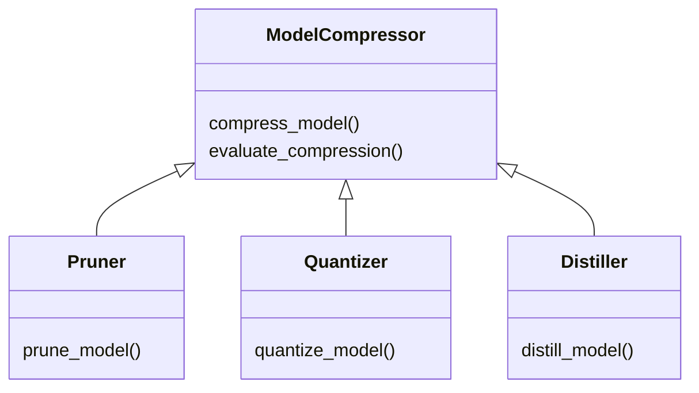

                 


# 如何识别企业的神经网络压缩技术优势

## 关键词：神经网络压缩，企业应用，模型优化，算法原理，系统架构

## 摘要：  
神经网络压缩技术是当前人工智能领域的重要研究方向，旨在通过压缩神经网络模型的规模，提升模型的部署效率和计算性能，同时降低资源消耗。本文将从背景、核心概念、算法原理、系统架构、项目实战等多个方面，详细解析如何识别和评估企业的神经网络压缩技术优势，为企业的技术决策提供深度参考。

---

# 第一部分: 神经网络压缩技术的背景与概念

## 第1章: 神经网络压缩技术的背景与问题背景

### 1.1 神经网络压缩技术的定义与核心概念

#### 1.1.1 神经网络压缩技术的定义  
神经网络压缩技术是指通过减少神经网络模型的参数数量或优化模型结构，使其在保持或提升性能的同时，降低计算资源消耗和存储需求的技术。  

#### 1.1.2 神经网络压缩技术的核心概念  
- **模型压缩**：通过删除冗余参数或简化模型结构，减少模型体积。  
- **模型优化**：通过调整模型结构或训练策略，提升模型性能。  
- **计算效率**：压缩后的模型在推理阶段消耗更少的计算资源。  
- **资源消耗**：包括内存、计算时间和带宽等资源的优化。  

#### 1.1.3 神经网络压缩技术的背景与现状  
随着深度学习的快速发展，神经网络模型的规模越来越大，计算资源消耗也随之增加。企业级AI应用对实时性、资源效率和部署灵活性提出了更高的要求，神经网络压缩技术因此成为解决这些问题的重要手段。

---

### 1.2 神经网络压缩技术的背景与问题背景

#### 1.2.1 企业级AI应用的性能瓶颈  
企业在部署AI模型时，常常面临以下问题：  
1. 模型体积过大，难以在边缘设备上部署。  
2. 计算资源消耗高，影响推理速度。  
3. 部署成本高昂，尤其是对于资源有限的企业。  

#### 1.2.2 神经网络压缩技术的必要性  
神经网络压缩技术通过减少模型体积和优化计算流程，可以有效缓解上述问题，提升企业的技术竞争力和运营效率。  

#### 1.2.3 神经网络压缩技术的边界与外延  
神经网络压缩技术的边界主要集中在模型优化和资源消耗的降低上，其外延则涉及模型再优化、动态计算等高级技术。

---

### 1.3 神经网络压缩技术的核心要素与概念结构

#### 1.3.1 神经网络压缩技术的核心要素  
- **模型结构**：包括网络层数、节点数量和连接方式。  
- **参数数量**：模型参数的规模直接影响压缩空间。  
- **压缩算法**：不同的压缩算法（如剪枝、量化）对模型压缩效果的影响不同。  

#### 1.3.2 神经网络压缩技术的概念结构  
神经网络压缩技术的概念结构可以分为三个层次：  
1. **基础层**：模型结构优化和参数剪枝。  
2. **中间层**：量化、知识蒸馏等压缩方法。  
3. **应用层**：模型在实际场景中的部署与优化。  

#### 1.3.3 神经网络压缩技术的组成部分  
- **剪枝**：删除模型中冗余的权重或节点。  
- **量化**：将模型参数从浮点数降低到低位整数。  
- **蒸馏**：通过小模型模仿大模型的行为，降低计算复杂度。  

---

## 第2章: 神经网络压缩技术的核心概念与联系

### 2.1 神经网络压缩技术的核心概念原理

#### 2.1.1 神经网络压缩技术的基本原理  
神经网络压缩技术的核心在于通过减少模型参数或优化计算流程，降低模型的资源消耗，同时保持或提升性能。

#### 2.1.2 神经网络压缩技术的核心算法  
- **剪枝**：通过删除冗余的权重或节点，减少模型规模。  
- **量化**：将模型参数从高精度（如浮点）降低到低精度（如定点）。  
- **蒸馏**：通过小模型学习大模型的知识，降低计算复杂度。  

#### 2.1.3 神经网络压缩技术的实现流程  
1. **训练阶段**：对模型进行剪枝、量化或其他压缩策略。  
2. **压缩阶段**：应用压缩算法，生成压缩后的模型。  
3. **推理阶段**：使用压缩后的模型进行预测，提升计算效率。  

---

### 2.2 神经网络压缩技术的核心概念对比

#### 2.2.1 不同压缩技术的对比分析  
以下是几种常见压缩技术的对比：  

| 技术 | 原理 | 优缺点 | 适用场景 |  
|------|------|--------|----------|  
| 剪枝 | 删除冗余节点或权重 | 压缩比高，但可能影响性能 | 适用于参数较多的模型 |  
| 量化 | 降低参数精度 | 压缩比高，计算速度快 | 适用于对计算速度要求高的场景 |  
| 蒸馏 | 小模型模仿大模型 | 压缩比高，性能损失小 | 适用于对性能要求较高的场景 |  

#### 2.2.2 神经网络压缩技术与传统压缩技术的对比  
神经网络压缩技术与传统压缩技术的主要区别在于，前者针对模型结构和参数进行优化，而后者通常仅对数据进行编码压缩。

#### 2.2.3 神经网络压缩技术与模型优化技术的对比  
模型优化技术（如参数调整）旨在提升性能，而神经网络压缩技术更关注减少资源消耗。

---

### 2.3 神经网络压缩技术的ER实体关系图

以下是一个简单的ER实体关系图示例：

```mermaid
erd
    节点
    结点连接
    模型参数
    压缩算法
    压缩结果
```

---

# 第二部分: 神经网络压缩技术的算法原理

## 第3章: 神经网络压缩技术的算法原理

### 3.1 神经网络压缩技术的算法流程

#### 3.1.1 神经网络压缩算法的基本流程  
1. **训练阶段**：对原始模型进行训练，生成高性能模型。  
2. **压缩阶段**：应用压缩算法，生成压缩后的模型。  
3. **推理阶段**：使用压缩后的模型进行预测，提升计算效率。  

#### 3.1.2 神经网络压缩算法的详细流程  
1. **剪枝**：识别并删除冗余的权重或节点。  
2. **量化**：将模型参数从高精度降低到低精度。  
3. **蒸馏**：小模型学习大模型的知识。  

#### 3.1.3 神经网络压缩算法的优化流程  
1. **优化目标**：在保证性能的前提下，尽可能减少模型体积。  
2. **优化策略**：结合多种压缩技术，提升压缩效果。  
3. **优化评估**：通过性能测试，评估压缩效果。  

---

### 3.2 神经网络压缩技术的算法实现

#### 3.2.1 神经网络压缩算法的实现步骤  
1. **训练原始模型**：使用深度学习框架（如TensorFlow、PyTorch）训练原始模型。  
2. **应用压缩算法**：对模型进行剪枝、量化或蒸馏等操作。  
3. **评估压缩效果**：通过性能测试，评估压缩后的模型效果。  

#### 3.2.2 神经网络压缩算法的Python实现示例  
以下是一个简单的剪枝算法实现示例：

```python
import torch
import numpy as np

# 假设有一个简单的神经网络模型
class SimpleModel(torch.nn.Module):
    def __init__(self):
        super(SimpleModel, self).__init__()
        self.fc1 = torch.nn.Linear(4, 2)
        self.fc2 = torch.nn.Linear(2, 1)

    def forward(self, x):
        x = self.fc1(x)
        x = self.fc2(x)
        return x

# 初始化模型
model = SimpleModel()

# 训练模型（略）

# 剪枝算法实现
def prune_model(model, prune_ratio=0.5):
    # 获取模型参数
    params = list(model.named_parameters())
    # 计算每个参数的重要性
    importances = [np.random.rand() for _ in params]
    # 根据重要性排序并剪枝
    sorted_importances = sorted(importances, reverse=True)
    threshold = sorted_importances[int(len(importances) * prune_ratio)]
    pruned_params = []
    for i, (name, param) in enumerate(params):
        if importances[i] > threshold:
            pruned_params.append(param)
        else:
            # 删除冗余参数
            del param
    return pruned_params

# 应用剪枝
pruned_params = prune_model(model)
```

#### 3.2.3 神经网络压缩技术的数学模型和公式  
以下是一个简单的量化算法数学模型示例：  

剪枝后的模型可以通过以下公式表示：  
$$ w_{\text{new}} = w_{\text{old}} \times \text{quantization\_factor} $$  

其中，$w_{\text{old}}$ 是原始权重，$\text{quantization\_factor}$ 是量化因子。

---

## 第4章: 神经网络压缩技术的系统架构与项目实战

### 4.1 神经网络压缩技术的系统架构设计

#### 4.1.1 系统功能设计（领域模型）  
以下是一个简单的领域模型类图示例：



#### 4.1.2 系统架构设计（架构图）  
以下是一个简单的系统架构设计示例：


#### 4.1.3 系统接口设计与交互流程  
系统接口设计包括以下步骤：  
1. **输入模型**：用户上传原始模型。  
2. **选择压缩算法**：用户选择剪枝、量化或蒸馏等算法。  
3. **压缩模型**：系统根据选择的算法进行模型压缩。  
4. **输出结果**：系统返回压缩后的模型和性能评估报告。  

---

### 4.2 项目实战

#### 4.2.1 项目环境安装  
以下是项目所需的环境依赖：  
- Python 3.6+  
- TensorFlow或PyTorch  
- Mermaid图生成工具  

#### 4.2.2 系统核心实现源代码  
以下是神经网络压缩算法的实现代码示例：  

```python
import torch
import numpy as np

# 定义一个简单的神经网络模型
class SimpleModel(torch.nn.Module):
    def __init__(self):
        super(SimpleModel, self).__init__()
        self.fc1 = torch.nn.Linear(4, 2)
        self.fc2 = torch.nn.Linear(2, 1)

    def forward(self, x):
        x = self.fc1(x)
        x = self.fc2(x)
        return x

# 初始化模型
model = SimpleModel()

# 训练模型（略）

# 剪枝算法实现
def prune_model(model, prune_ratio=0.5):
    params = list(model.named_parameters())
    importances = [np.random.rand() for _ in params]
    sorted_importances = sorted(importances, reverse=True)
    threshold = sorted_importances[int(len(importances) * prune_ratio)]
    pruned_params = []
    for i, (name, param) in enumerate(params):
        if importances[i] > threshold:
            pruned_params.append(param)
        else:
            del param
    return pruned_params

# 应用剪枝
pruned_params = prune_model(model)

# 量化算法实现
def quantize_model(model, quantization_bits=8):
    for param in model.parameters():
        param.data = param.data.quantize(quantization_bits)
    return model

# 应用量化
quantized_model = quantize_model(model)
```

#### 4.2.3 代码应用解读与分析  
1. **模型定义**：定义了一个简单的神经网络模型。  
2. **剪枝算法**：通过随机重要性评分，选择性地删除冗余参数。  
3. **量化算法**：将模型参数量化到指定的位数，降低计算复杂度。  

#### 4.2.4 实际案例分析和详细讲解剖析  
通过上述代码，我们可以实现一个简单的神经网络压缩系统。剪枝算法通过删除冗余参数，显著减少了模型的体积；量化算法则通过降低参数精度，进一步优化了计算效率。  

---

## 第5章: 神经网络压缩技术的最佳实践、小结与注意事项

### 5.1 最佳实践 tips  
1. **选择合适的压缩算法**：根据具体需求选择剪枝、量化或蒸馏等算法。  
2. **评估压缩效果**：通过性能测试，确保压缩后的模型效果满足需求。  
3. **结合实际场景**：根据应用场景优化压缩策略，提升模型的实用性。  

### 5.2 小结  
神经网络压缩技术通过减少模型体积和优化计算流程，显著提升了企业的技术竞争力和运营效率。本文从背景、核心概念、算法原理、系统架构和项目实战等多个方面，详细解析了如何识别和评估企业的神经网络压缩技术优势。

### 5.3 注意事项  
1. **性能评估**：压缩后的模型性能可能有所下降，需进行充分的性能测试。  
2. **兼容性问题**：压缩后的模型可能与原有系统不兼容，需进行适配。  
3. **算法选择**：不同压缩算法适用于不同的场景，需根据需求选择。  

---

## 第6章: 拓展阅读与未来展望

### 6.1 拓展阅读  
1. **《深度学习》—— 李航**  
2. **《神经网络压缩技术综述》—— 知乎专栏**  
3. **《TensorFlow模型压缩实战》—— 书籍或在线课程**  

### 6.2 未来展望  
随着深度学习的不断发展，神经网络压缩技术将更加智能化和自动化，未来可能会出现更多创新的压缩算法和优化策略。

---

## 作者：AI天才研究院/AI Genius Institute & 禅与计算机程序设计艺术 /Zen And The Art of Computer Programming

