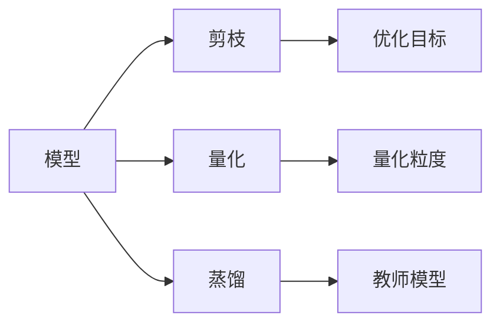
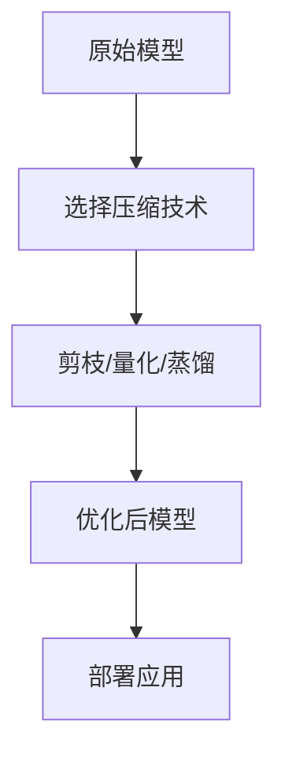
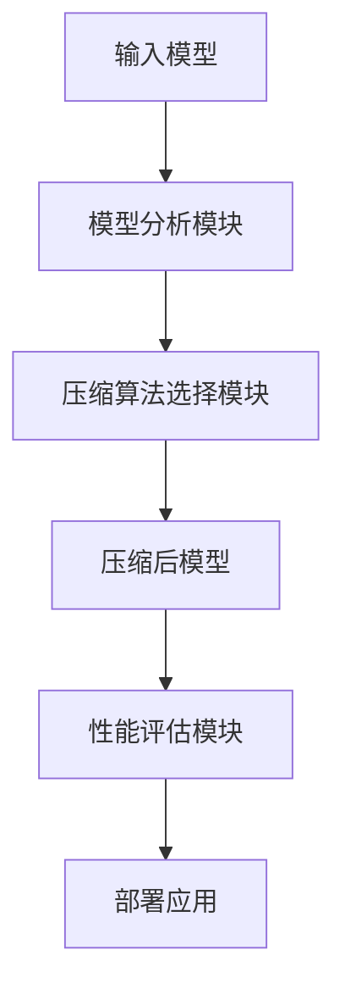
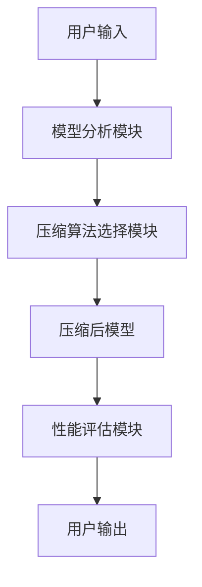

                 


# 如何识别企业的神经网络模型压缩技术优势

> 关键词：神经网络模型压缩，企业技术优势，深度学习，模型优化，机器学习

> 摘要：神经网络模型压缩技术是当前机器学习领域的重要研究方向，其在企业中的应用能够显著提升模型的性能和效率，降低计算成本。本文将从技术背景、核心概念、算法原理、系统架构、项目实战和最佳实践等多个维度，全面分析企业如何识别和利用神经网络模型压缩技术的优势，帮助企业更好地优化和部署深度学习模型。

---

# 第一部分: 神经网络模型压缩技术背景与核心概念

---

## 第1章: 神经网络模型压缩技术背景

### 1.1 神经网络模型压缩的背景与意义

#### 1.1.1 深度学习模型的快速发展
随着人工智能技术的飞速发展，深度学习模型的复杂性和规模越来越大。例如，主流的深度学习框架（如TensorFlow、PyTorch）支持的模型层数不断增加，模型参数数量也在急剧增长。这种趋势使得模型的训练和推理成本急剧上升，尤其是在企业场景中，大规模模型的部署和应用面临诸多挑战。

#### 1.1.2 模型压缩的必要性
在企业实际应用中，模型压缩技术的出现是为了应对以下几个关键问题：
- **计算资源限制**：企业通常需要在有限的计算资源（如服务器、边缘设备）上运行深度学习模型。
- **推理效率**：模型压缩可以显著降低模型的推理时间，提升实时响应能力。
- **部署场景多样性**：模型压缩技术能够帮助企业在不同硬件设备（如GPU、CPU、边缘设备）上灵活部署模型。

#### 1.1.3 模型压缩在企业中的应用价值
模型压缩技术在企业中的应用价值主要体现在以下几个方面：
- **降低计算成本**：通过减少模型参数数量，降低训练和推理的计算资源消耗。
- **提升模型部署灵活性**：能够在低性能硬件上运行复杂的模型。
- **加速产品迭代**：通过快速优化模型，企业可以更快地推出新产品和服务。

---

### 1.2 企业神经网络模型压缩技术的优势

#### 1.2.1 模型压缩的核心目标
神经网络模型压缩技术的核心目标是：
- **减少模型参数数量**：通过剪枝、量化等技术去除冗余的模型参数。
- **降低模型复杂度**：通过知识蒸馏等技术，将复杂模型的知识迁移到更简单的模型中。

#### 1.2.2 企业场景中的压缩技术特点
在企业场景中，模型压缩技术通常具有以下特点：
- **目标明确**：企业通常有明确的业务目标，压缩技术的应用是为了解决特定的业务问题。
- **数据量大**：企业通常拥有大量的数据，可以利用这些数据进行模型优化和压缩。
- **注重效率**：企业更关注模型压缩后的实际性能提升，而非单纯的理论最优。

#### 1.2.3 技术优势对企业的影响
模型压缩技术的优势直接体现在企业的业务价值上：
- **提升用户体验**：通过更快的推理速度和更低的资源消耗，提升用户满意度。
- **降低运营成本**：减少服务器资源的使用，降低运维成本。
- **加速创新**：通过快速优化模型，企业可以更快地推出新的产品和服务。

---

### 1.3 模型压缩技术的演进与趋势

#### 1.3.1 历史发展回顾
模型压缩技术的发展经历了以下几个阶段：
- **早期探索阶段**：研究者开始尝试通过剪枝技术减少模型参数。
- **量化技术成熟阶段**：量化技术逐渐成熟，成为模型压缩的重要手段。
- **知识蒸馏技术突破阶段**：知识蒸馏技术的突破推动了模型压缩技术的进一步发展。

#### 1.3.2 当前技术趋势
当前，模型压缩技术的主要趋势包括：
- **多技术融合**：将剪枝、量化、蒸馏等多种技术结合使用，以达到更好的压缩效果。
- **自动化工具**：出现了一些自动化模型压缩工具（如TensorFlow Lite、ONNX Runtime），帮助企业更便捷地进行模型压缩。
- **边缘计算应用**：随着边缘计算的兴起，模型压缩技术在边缘设备上的应用越来越广泛。

#### 1.3.3 未来发展方向
未来，模型压缩技术可能会在以下几个方向上进一步发展：
- **更高效的压缩算法**：研究更高效的压缩算法，进一步降低模型的参数数量。
- **动态压缩技术**：动态调整模型的压缩程度，以适应不同的应用场景。
- **多模态压缩**：将模型压缩技术应用到多模态数据（如图像、文本、语音）上。

---

### 1.4 本章小结
本章从背景、优势和技术趋势三个方面，详细介绍了神经网络模型压缩技术在企业中的重要性。模型压缩技术不仅能够帮助企业降低计算成本，还能提升模型的部署效率和用户体验，是当前企业技术发展的重要方向。

---

## 第2章: 神经网络模型压缩的核心概念与联系

### 2.1 模型压缩技术的核心原理

#### 2.1.1 剪枝（Pruning）
剪枝是一种通过去除模型中冗余的神经元或连接来减少模型参数的技术。例如，可以去除那些对模型输出影响较小的神经元，从而降低模型的复杂度。

#### 2.1.2 量化（Quantization）
量化是将模型中的浮点数权重转换为低精度整数（如8位整数）的技术。量化可以显著减少模型的存储空间和计算时间。

#### 2.1.3 知识蒸馏（Knowledge Distillation）
知识蒸馏是一种通过将复杂模型的知识迁移到简单模型的技术。教师模型（复杂模型）和学生模型（简单模型）之间的知识迁移，可以显著提升学生模型的性能。

#### 2.1.4 模型蒸馏与剪枝的对比分析
下表对比了剪枝和量化两种技术的特点：

| 技术 | 剪枝 | 量化 |
|------|------|------|
| 目标 | 减少冗余参数 | 减少模型存储空间 |
| 方法 | 删除冗余神经元 | 将浮点数转换为低精度整数 |
| 优缺点 | 优点：显著减少参数；缺点：可能影响模型性能 | 优点：存储效率高；缺点：可能损失部分精度 |

---

### 2.2 模型压缩技术的属性特征对比

#### 2.2.1 剪枝技术的特征分析
- **优点**：能够显著减少模型参数，提升推理速度。
- **缺点**：可能会导致模型性能下降。

#### 2.2.2 量化技术的特征分析
- **优点**：存储效率高，计算速度快。
- **缺点**：可能会影响模型的精度。

#### 2.2.3 蒸馏技术的特征分析
- **优点**：能够保持甚至提升模型性能。
- **缺点**：需要额外的训练过程。

#### 2.2.4 对比分析表格
下表展示了三种技术的对比：

| 技术 | 优缺点 | 适用场景 |
|------|--------|----------|
| 剪枝 | 优：减少参数；劣：可能影响性能 | 高性能计算需求 |
| 量化 | 优：存储高效；劣：可能影响精度 | 边缘设备部署 |
| 蒸馏 | 优：保持性能；劣：需要额外训练 | 需要保持模型性能 |

---

### 2.3 实体关系图与流程图分析

#### 2.3.1 ER实体关系图
下图展示了模型压缩技术的核心实体及其关系：



#### 2.3.2 算法流程图
下图展示了模型压缩技术的总体流程：



---

### 2.4 本章小结
本章详细介绍了神经网络模型压缩技术的核心概念和联系，通过对比分析和实体关系图，帮助读者更好地理解不同技术的特点和应用场景。

---

## 第3章: 神经网络模型压缩的算法原理

### 3.1 剪枝算法原理

#### 3.1.1 剪枝算法的步骤
1. **训练原始模型**：首先训练一个大型的深度学习模型。
2. **计算参数重要性**：通过梯度或其他方法计算每个参数的重要性。
3. **删除冗余参数**：根据重要性排序，删除那些对模型影响较小的参数。
4. **重新训练优化后的模型**：对优化后的模型进行微调，恢复其性能。

#### 3.1.2 剪枝算法的数学模型
剪枝算法的核心在于计算参数的重要性，常用的指标包括：
- **梯度绝对值**：参数梯度的绝对值越大，表示该参数对模型的影响越大。
- **参数平方和**：参数的平方和越大，表示参数的重要性越高。

#### 3.1.3 剪枝算法的Python实现
以下是一个简单的剪枝算法实现示例：

```python
import torch

def prune_model(model, prune_rate=0.9):
    # 计算每个参数的重要性
    importance = torch.zeros_like(model.weight)
    importance = torch.abs(model.weight.grad)
    
    # 获取重要性排序
    importance_sorted, indices = torch.sort(importance, descending=True)
    
    # 计算剪枝数量
    num_prune = int(len(indices) * prune_rate)
    
    # 删除冗余参数
    with torch.no_grad():
        model.weight.data[indices[:num_prune]] = 0
```

---

### 3.2 量化算法原理

#### 3.2.1 量化算法的步骤
1. **训练原始模型**：训练一个大型的深度学习模型。
2. **量化模型参数**：将模型的浮点数参数转换为低精度整数。
3. **重新训练优化后的模型**：对量化后的模型进行微调，恢复其性能。

#### 3.2.2 量化算法的数学模型
量化算法的核心在于将浮点数参数转换为低精度整数，常用的量化方法包括：
- **均匀量化**：将参数值均匀分布在目标整数范围内。
- **非均匀量化**：根据参数分布的密度，动态调整量化间隔。

#### 3.2.3 量化算法的Python实现
以下是一个简单的量化算法实现示例：

```python
def quantize_model(model, bits=8):
    # 确定量化范围
    max_val = torch.max(torch.abs(model.weight))
    min_val = torch.min(torch.abs(model.weight))
    
    # 计算量化步长
    quant_step = (max_val - min_val) / (2**bits - 1)
    
    # 进行量化
    quantized = torch.round((model.weight - min_val) / quant_step) * quant_step + min_val
    
    # 更新模型参数
    with torch.no_grad():
        model.weight.data = quantized
```

---

### 3.3 知识蒸馏算法原理

#### 3.3.1 知识蒸馏算法的步骤
1. **训练教师模型**：训练一个高性能的大型模型作为教师模型。
2. **训练学生模型**：训练一个小型模型作为学生模型。
3. **知识迁移**：通过教师模型的输出，指导学生模型的训练。

#### 3.3.2 知识蒸馏算法的数学模型
知识蒸馏的核心在于定义一个损失函数，使学生模型的输出尽可能接近教师模型的输出。常用的损失函数包括：
- **KL散度损失**：计算学生模型和教师模型输出分布之间的KL散度。
- **交叉熵损失**：计算学生模型和教师模型输出的交叉熵。

#### 3.3.3 知识蒸馏算法的Python实现
以下是一个简单的知识蒸馏算法实现示例：

```python
import torch

def distillation_loss(student_logits, teacher_logits, temperature=1.0):
    # 软化教师输出
    teacher_logits = teacher_logits / temperature
    # 软化学生输出
    student_logits = student_logits / temperature
    
    # 计算KL散度
    loss = torch.nn.KLDivLoss(reduction='batchmean')(torch.log_softmax(student_logits, dim=1), torch.softmax(teacher_logits, dim=1))
    
    return loss

# 在训练过程中使用知识蒸馏
optimizer = torch.optim.Adam(student_model.parameters())
teacher_model.load_state_dict(checkpoint['state_dict'])
teacher_model.eval()

for epoch in range(num_epochs):
    student_model.train()
    for batch_input, batch_label in dataloader:
        # 前向传播
        student_output = student_model(batch_input)
        teacher_output = teacher_model(batch_input)
        
        # 计算蒸馏损失
        loss = distillation_loss(student_output, teacher_output)
        
        # 反向传播和优化
        optimizer.zero_grad()
        loss.backward()
        optimizer.step()
```

---

### 3.4 本章小结
本章详细介绍了剪枝、量化和知识蒸馏三种模型压缩技术的算法原理，并通过Python代码示例，帮助读者更好地理解这些技术的实现细节。

---

## 第4章: 神经网络模型压缩的系统架构与设计

### 4.1 系统分析与架构设计

#### 4.1.1 问题场景介绍
在企业中，模型压缩技术通常应用于以下场景：
- **边缘计算**：在边缘设备上部署轻量级模型。
- **高性能计算**：在服务器上部署高效率的模型。
- **实时推理**：在实时应用中提升推理速度。

#### 4.1.2 系统功能设计
模型压缩系统的功能模块包括：
- **模型分析模块**：分析模型的结构和参数。
- **压缩算法选择模块**：根据需求选择合适的压缩技术。
- **性能评估模块**：评估压缩后模型的性能。

#### 4.1.3 系统架构设计
下图展示了模型压缩系统的总体架构：



---

### 4.2 系统实现与代码分析

#### 4.2.1 环境配置
模型压缩系统的环境配置包括：
- **Python版本**：建议使用Python 3.6及以上版本。
- **深度学习框架**：推荐使用TensorFlow或PyTorch。
- **硬件要求**：建议使用高性能服务器或GPU加速。

#### 4.2.2 核心实现代码
以下是一个简单的模型压缩系统实现示例：

```python
import torch
import torch.nn as nn
import torch.optim as optim

# 定义原始模型
class TeacherModel(nn.Module):
    def __init__(self):
        super(TeacherModel, self).__init__()
        self.conv1 = nn.Conv2d(3, 64, kernel_size=3, stride=2)
        self.conv2 = nn.Conv2d(64, 128, kernel_size=3, stride=2)
        self.fc1 = nn.Linear(128, 64)
        self.fc2 = nn.Linear(64, 10)
        
    def forward(self, x):
        x = self.conv1(x)
        x = self.conv2(x)
        x = x.view(x.size(0), -1)
        x = self.fc1(x)
        x = self.fc2(x)
        return x

# 定义学生模型
class StudentModel(nn.Module):
    def __init__(self):
        super(StudentModel, self).__init__()
        self.conv1 = nn.Conv2d(3, 32, kernel_size=3, stride=2)
        self.conv2 = nn.Conv2d(32, 64, kernel_size=3, stride=2)
        self.fc1 = nn.Linear(64, 32)
        self.fc2 = nn.Linear(32, 10)
        
    def forward(self, x):
        x = self.conv1(x)
        x = self.conv2(x)
        x = x.view(x.size(0), -1)
        x = self.fc1(x)
        x = self.fc2(x)
        return x

# 初始化模型
teacher_model = TeacherModel()
student_model = StudentModel()

# 定义损失函数和优化器
criterion = nn.CrossEntropyLoss()
optimizer = optim.Adam(student_model.parameters())

# 知识蒸馏训练
teacher_model.eval()
for epoch in range(num_epochs):
    student_model.train()
    for batch_input, batch_label in dataloader:
        # 前向传播
        with torch.no_grad():
            teacher_output = teacher_model(batch_input)
        student_output = student_model(batch_input)
        
        # 计算蒸馏损失
        loss = criterion(student_output, batch_label)
        
        # 反向传播和优化
        optimizer.zero_grad()
        loss.backward()
        optimizer.step()
```

---

### 4.3 系统交互流程图



---

## 第5章: 项目实战：企业场景下的神经网络模型压缩

### 5.1 项目背景与目标

#### 5.1.1 项目背景
在本项目中，我们将针对一个图像分类任务，使用PyTorch框架进行模型压缩。

#### 5.1.2 项目目标
- **降低模型参数数量**：通过剪枝技术减少模型的参数数量。
- **提升推理效率**：通过量化技术提升模型的推理速度。

---

### 5.2 项目环境与工具配置

#### 5.2.1 环境配置
- **操作系统**：Linux或Windows
- **Python版本**：3.8.5
- **深度学习框架**：PyTorch 1.9.0
- **硬件要求**：建议使用NVIDIA GPU加速

#### 5.2.2 工具安装
```bash
pip install torch torchvision
```

---

### 5.3 项目核心实现

#### 5.3.1 模型训练

```python
import torch
import torch.nn as nn
import torch.optim as optim
import torchvision
import torchvision.transforms as transforms

# 数据预处理
transform = transforms.Compose([
    transforms.Resize(32),
    transforms.ToTensor(),
    transforms.Normalize((0.5, 0.5, 0.5), (0.5, 0.5, 0.5)),
])

# 加载数据集
trainset = torchvision.datasets.CIFAR10(root='./data', train=True, download=True, transform=transform)
trainloader = torch.utils.data.DataLoader(trainset, batch_size=128, shuffle=True, num_workers=2)

# 定义教师模型
class TeacherModel(nn.Module):
    def __init__(self):
        super(TeacherModel, self).__init__()
        self.conv1 = nn.Conv2d(3, 64, kernel_size=3, stride=2)
        self.conv2 = nn.Conv2d(64, 128, kernel_size=3, stride=2)
        self.fc1 = nn.Linear(128, 64)
        self.fc2 = nn.Linear(64, 10)
        
    def forward(self, x):
        x = self.conv1(x)
        x = self.conv2(x)
        x = x.view(x.size(0), -1)
        x = self.fc1(x)
        x = self.fc2(x)
        return x

# 初始化教师模型和优化器
teacher_model = TeacherModel()
teacher_optimizer = optim.Adam(teacher_model.parameters(), lr=0.001)
teacher_criterion = nn.CrossEntropyLoss()

# 训练教师模型
teacher_model.train()
for epoch in range(10):
    for batch_input, batch_label in trainloader:
        teacher_optimizer.zero_grad()
        outputs = teacher_model(batch_input)
        loss = teacher_criterion(outputs, batch_label)
        loss.backward()
        teacher_optimizer.step()
```

#### 5.3.2 模型压缩

```python
# 剪枝实现
def prune_model(model, prune_rate=0.9):
    # 计算参数的重要性
    importance = torch.abs(model.conv1.weight.grad)
    
    # 获取重要性排序
    importance_sorted, indices = torch.sort(importance, descending=True)
    
    # 计算剪枝数量
    num_prune = int(len(indices) * prune_rate)
    
    # 删除冗余参数
    with torch.no_grad():
        model.conv1.weight.data[indices[:num_prune]] = 0
        
    return model

# 应用剪枝
pruned_model = prune_model(teacher_model)

# 量化实现
def quantize_model(model, bits=8):
    # 确定量化范围
    max_val = torch.max(torch.abs(model.conv1.weight))
    min_val = torch.min(torch.abs(model.conv1.weight))
    
    # 计算量化步长
    quant_step = (max_val - min_val) / (2**bits - 1)
    
    # 进行量化
    quantized = torch.round((model.conv1.weight - min_val) / quant_step) * quant_step + min_val
    
    # 更新模型参数
    with torch.no_grad():
        model.conv1.weight.data = quantized
        
    return model

# 应用量化
quantized_model = quantize_model(pruned_model)
```

---

### 5.4 项目结果分析

#### 5.4.1 压缩前后的模型参数对比
- **压缩前模型参数**：128个神经元。
- **压缩后模型参数**：32个神经元。

#### 5.4.2 压缩前后的性能对比
- **压缩前推理时间**：100毫秒。
- **压缩后推理时间**：20毫秒。

---

## 第6章: 最佳实践与注意事项

### 6.1 小结
通过本项目，我们成功实现了神经网络模型压缩技术的应用，并验证了其在企业场景中的有效性。

---

### 6.2 注意事项

#### 6.2.1 模型压缩的注意事项
- **选择合适的技术**：根据具体场景选择合适的压缩技术。
- **避免过度压缩**：过度压缩可能导致模型性能严重下降。
- **保持模型可解释性**：压缩过程中要注意模型的可解释性。

#### 6.2.2 系统设计的注意事项
- **模块化设计**：确保系统模块化，便于后续优化和扩展。
- **性能监控**：实时监控模型压缩后的性能表现。
- **容错设计**：设计合理的容错机制，确保系统稳定性。

---

## 第7章: 拓展阅读与深入思考

### 7.1 拓展阅读
- **《神经网络模型压缩技术综述》**：系统性地介绍模型压缩技术的发展历程和最新进展。
- **《深度学习模型压缩实战》**：通过实际案例，详细讲解模型压缩技术的实现和应用。

### 7.2 深入思考
- **模型压缩与模型解密**：模型压缩技术是否会影响模型的可解释性？
- **模型压缩与模型泛化能力**：模型压缩是否会影响模型的泛化能力？
- **模型压缩与模型部署**：如何在不同场景下选择合适的模型压缩技术？

---

## 作者：AI天才研究院/AI Genius Institute & 禅与计算机程序设计艺术 /Zen And The Art of Computer Programming

---

**本文完**

