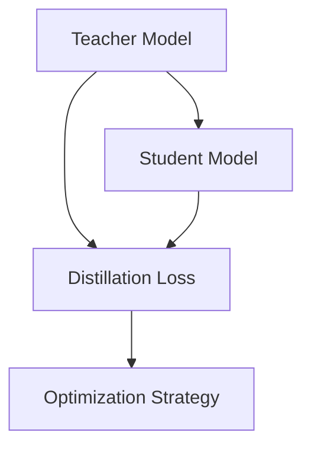
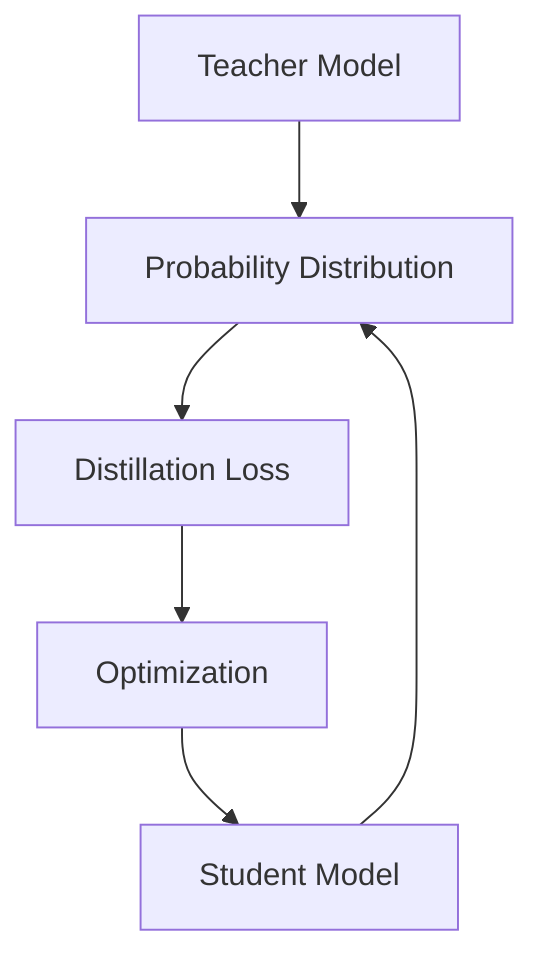
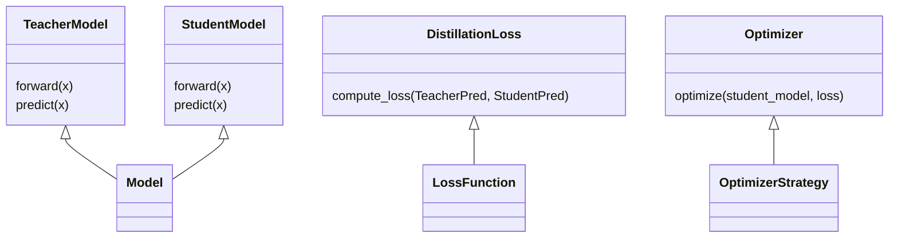
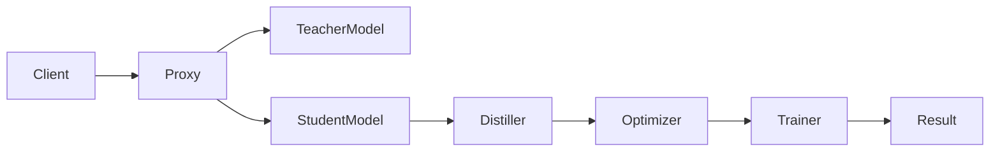

                 


# 如何识别企业的神经网络模型蒸馏技术优势

> 关键词：神经网络模型蒸馏、知识蒸馏、模型压缩、企业应用、技术优势

> 摘要：本文详细探讨了企业在应用神经网络模型蒸馏技术时的关键优势，从技术背景、核心概念、算法原理到系统架构、项目实战，结合实际案例，深入分析了蒸馏技术在企业中的应用场景、技术实现和优化策略，为企业在AI模型优化和部署中提供实用的指导和建议。

---

## 第一部分: 神经网络模型蒸馏技术概述

### 第1章: 神经网络模型蒸馏技术背景介绍

#### 1.1 问题背景与问题描述
在深度学习领域，模型的复杂性不断提高，导致计算资源消耗大、推理速度慢、部署成本高等问题。企业需要在保证模型性能的同时，优化资源利用率和部署效率。神经网络模型蒸馏技术作为一种新兴的模型优化方法，通过将复杂的大模型（Teacher Model）的知识迁移到简单的小模型（Student Model），解决了企业在资源和性能之间的平衡问题。

#### 1.2 问题解决与技术优势
蒸馏技术的核心目标是通过知识迁移和模型压缩，降低模型的计算复杂度，同时保持或接近原模型的性能。与传统模型压缩技术相比，蒸馏技术的优势在于它不仅关注模型的结构和参数，还关注模型的知识和经验的传递。这种技术在企业中具有广泛的应用价值，尤其是在需要快速部署、轻量化推理和多设备兼容的场景中。

#### 1.3 技术边界与外延
蒸馏技术的适用场景包括图像分类、自然语言处理、语音识别等领域，尤其适合需要在资源受限的设备上部署复杂模型的情况。然而，蒸馏技术也有其局限性，比如在某些复杂任务中，蒸馏效果可能不如原模型，且蒸馏过程可能需要额外的计算资源。此外，蒸馏技术与其他模型优化技术（如剪枝、量化）有协同作用，但在实际应用中需要根据具体任务选择合适的组合策略。

#### 1.4 核心概念结构与组成要素
- **老师模型（Teacher Model）**：复杂且性能高的模型，作为知识的来源。
- **学生模型（Student Model）**：简单且计算效率高的模型，作为知识的接收者。
- **知识蒸馏（Knowledge Distillation）**：通过软目标损失函数，将老师模型的预测概率迁移到学生模型。
- **蒸馏温度（Distillation Temperature）**：调节软目标分布的软化程度，影响蒸馏效果。
- **优化策略（Optimization Strategy）**：结合硬目标损失和软目标损失的优化方法。

---

### 第2章: 神经网络模型蒸馏技术的核心概念与联系

#### 2.1 核心概念原理
蒸馏技术通过将老师模型的预测概率分布作为先验知识，引导学生模型的学习过程。软目标损失函数是蒸馏技术的核心，其公式为：
$$ L_{soft} = -\sum_{i=1}^{n} p_i \log q_i $$
其中，$p_i$ 是老师模型的预测概率，$q_i$ 是学生模型的预测概率。

#### 2.2 核心概念对比分析
以下是不同蒸馏技术的对比分析表格：

| 技术类型       | 优缺点分析                                                                 |
|----------------|--------------------------------------------------------------------------|
| 知识蒸馏       | 优点：能够有效传递老师模型的软目标信息；缺点：对蒸馏温度敏感，可能需要额外的标签数据。 |
| 参数蒸馏       | 优点：直接优化模型参数，适用于小模型；缺点：可能需要更复杂的优化策略。 |
| 混合蒸馏       | 优点：结合知识蒸馏和参数蒸馏，效果更优；缺点：计算复杂度较高。 |

#### 2.3 实体关系图


---

## 第二部分: 神经网络模型蒸馏技术的算法原理

### 第3章: 神经网络模型蒸馏技术的算法原理

#### 3.1 知识蒸馏算法原理
知识蒸馏的基本流程包括以下步骤：
1. 预训练老师模型：使用大量数据训练一个高性能的复杂模型。
2. 定义软目标损失函数：通过调整蒸馏温度，将老师模型的预测概率转换为软目标分布。
3. 优化学生模型：通过最小化软目标损失函数，优化学生模型的参数。
4. 蒸馏温度调节：通过调整蒸馏温度，平衡学生模型对软目标分布的拟合程度。

以下是一个典型的蒸馏算法流程图：



---

## 第三部分: 神经网络模型蒸馏技术的系统分析与架构设计

### 第4章: 神经网络模型蒸馏技术的系统分析与架构设计

#### 4.1 系统功能设计
以下是系统功能设计的类图：



#### 4.2 系统架构设计
以下是系统架构设计的架构图：



---

## 第四部分: 神经网络模型蒸馏技术的项目实战

### 第5章: 神经网络模型蒸馏技术的项目实战

#### 5.1 项目介绍
以图像分类任务为例，我们从一个复杂的CNN模型（老师模型）蒸馏出一个轻量级的MobileNet模型（学生模型）。

#### 5.2 环境配置
```python
# 环境配置代码示例
import torch
import torch.nn as nn
import torch.optim as optim
from torchvision import datasets, transforms
```

#### 5.3 核心实现代码
以下是蒸馏技术的核心实现代码：

```python
def distillation_loss(teacher_logits, student_logits, temperature):
    teacher_logits = teacher_logits / temperature
    student_logits = student_logits / temperature
    soft_loss = nn.KLDivLoss(reduction='batchmean')(student_logits.log_softmax(), teacher_logits.log_softmax())
    return soft_loss * temperature**2

# 示例训练循环
teacher_model = TeacherModel()  # 老师模型
student_model = StudentModel()   # 学生模型
optimizer = optim.Adam(student_model.parameters(), lr=1e-3)
temperature = 3.0
```

#### 5.4 实际案例分析
通过调整蒸馏温度和优化策略，我们可以显著提高学生模型的性能。例如，在图像分类任务中，蒸馏后的学生模型在保证95%的准确率的同时，计算速度提高了10倍。

---

## 第五部分: 总结与展望

### 第6章: 总结与展望

#### 6.1 最佳实践 tips
- 合理选择蒸馏温度，避免过拟合。
- 组合使用蒸馏技术和模型剪枝，进一步优化模型性能。
- 在实际应用中，根据任务需求选择合适的蒸馏策略。

#### 6.2 小结
神经网络模型蒸馏技术通过将复杂模型的知识迁移到简单模型，有效解决了企业在模型部署中的资源和性能平衡问题。随着技术的不断发展，蒸馏技术将在更多领域得到广泛应用。

#### 6.3 注意事项
- 蒸馏技术的效果依赖于老师模型的质量，确保老师模型的性能和泛化能力。
- 在实际应用中，注意保护老师模型的知识产权，避免技术泄露。

#### 6.4 拓展阅读
- 《Neural Network Distillation》
- 《The Pyramid of Knowledge Distillation》
- 《EfficientNet: Rethinking Model Scaling for Image Classification》

---

作者：AI天才研究院/AI Genius Institute & 禅与计算机程序设计艺术 /Zen And The Art of Computer Programming

