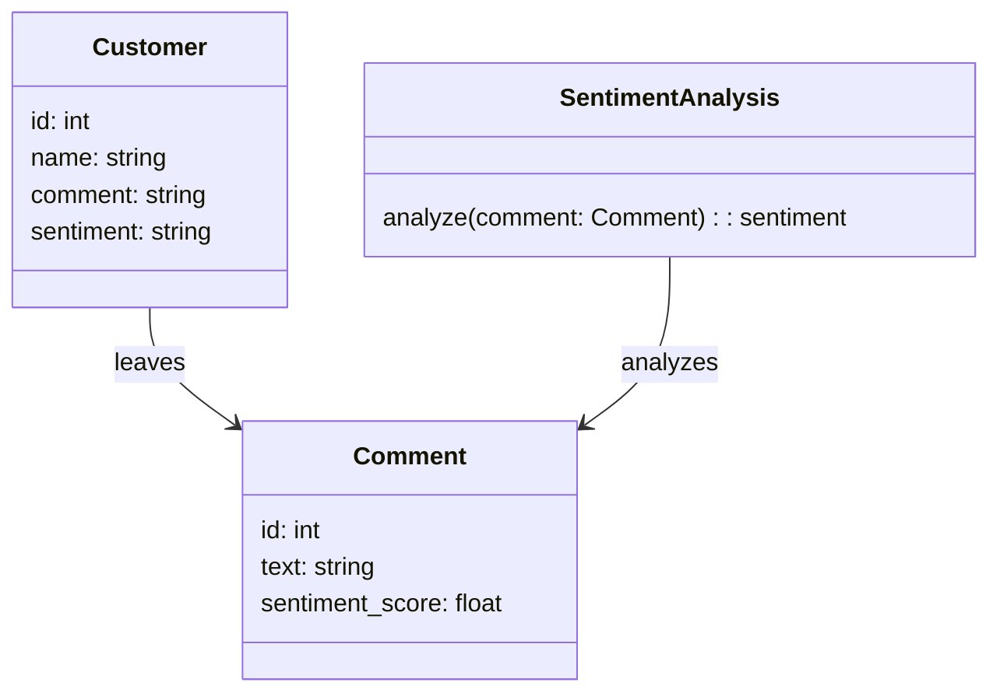
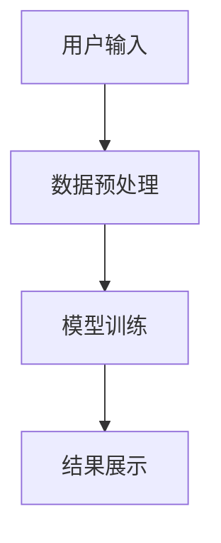
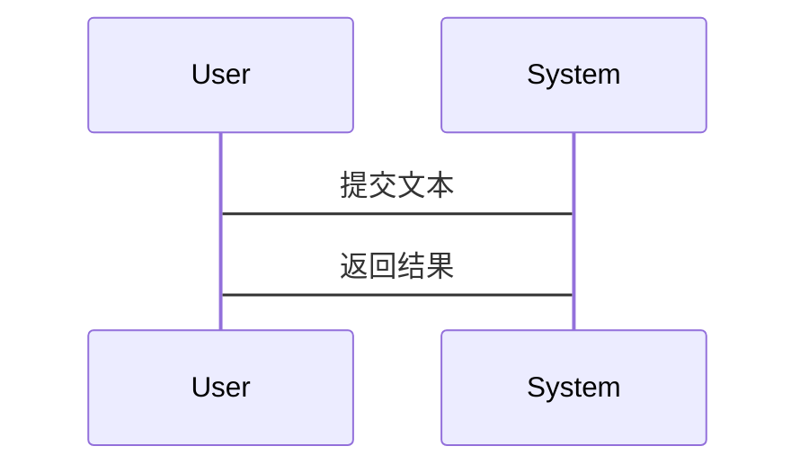

                 


# 如何识别企业的自然语言处理优势

> 关键词：自然语言处理，企业优势识别，NLP技术，文本分析，人工智能

> 摘要：自然语言处理（NLP）作为人工智能领域的核心技术，正在为企业带来巨大的变革。本文将从企业角度出发，系统地分析如何识别自然语言处理的优势，包括核心概念、算法原理、系统设计和项目实战等方面，为企业在NLP领域的应用提供清晰的思路和实用的方法。

---

## 第一部分: 自然语言处理背景与企业应用

### 第1章: 自然语言处理概述

#### 1.1 自然语言处理的基本概念

##### 1.1.1 自然语言处理的定义与核心概念

自然语言处理（Natural Language Processing，NLP）是人工智能（AI）领域的重要分支，致力于研究如何让计算机能够理解和处理人类的自然语言。NLP的核心任务包括文本分析、信息提取、语义理解、机器翻译、问答系统等。通过NLP技术，计算机可以对文本进行结构化处理，提取有价值的信息，从而支持企业决策和自动化流程。

##### 1.1.2 自然语言处理的背景与现状

随着深度学习技术的快速发展，NLP技术取得了显著进步。从传统的基于规则的NLP方法，到现代的基于深度学习的模型（如BERT、GPT等），NLP的应用场景不断扩大。企业可以利用NLP技术优化客户沟通、提高内容管理效率、增强数据分析能力，从而在市场竞争中占据优势。

##### 1.1.3 企业中自然语言处理的应用场景

在企业中，NLP技术的应用场景广泛，主要包括：

- **客户关系管理（CRM）**：通过分析客户邮件、聊天记录等文本数据，识别客户情感和意图，优化客户服务。
- **文本挖掘与信息提取**：从大量非结构化文本中提取关键信息，如客户反馈、市场趋势等。
- **自动问答系统**：为企业内部知识库或客户提供自动化问答支持。
- **文档分类与聚类**：对海量文档进行分类和聚类，提高信息管理效率。
- **机器翻译**：支持多语言沟通，拓展国际市场。
- **舆情分析**：实时监控社交媒体和新闻媒体，分析企业声誉和市场动向。

---

#### 1.2 企业自然语言处理的优势识别

##### 1.2.1 企业文本数据的特征与价值

企业在日常运营中会产生大量文本数据，包括客户咨询、产品评论、内部文档等。这些文本数据具有以下特征：

- **多样性**：数据来源广泛，形式多样（如邮件、社交媒体、文档等）。
- **非结构化**：数据缺乏统一的组织形式，难以直接用于分析。
- **潜在价值**：隐藏在文本中的信息对企业决策具有重要参考价值。

##### 1.2.2 自然语言处理在企业中的潜在价值

通过识别和利用自然语言处理的优势，企业可以实现以下价值：

- **提高效率**：自动化处理文本数据，减少人工干预。
- **增强洞察力**：从海量文本中提取有价值的信息，支持精准决策。
- **提升客户体验**：通过情感分析和意图识别，优化客户服务流程。
- **降低成本**：自动化处理减少人力投入，降低运营成本。

##### 1.2.3 识别自然语言处理优势的关键因素

识别企业自然语言处理优势的关键因素包括：

- **数据质量**：数据的完整性和准确性直接影响NLP模型的效果。
- **技术能力**：企业是否具备足够的技术能力来开发和部署NLP系统。
- **业务需求**：明确的业务目标是NLP应用成功的基础。
- **团队能力**：具备NLP相关知识和技术的团队是成功实施的关键。

---

#### 1.3 自然语言处理技术的演进与挑战

##### 1.3.1 自然语言处理技术的历史发展

NLP技术经历了以下几个阶段：

1. **基于规则的NLP（20世纪50年代-70年代）**：依赖人工制定的规则进行文本处理，适用于简单任务。
2. **统计学习方法（20世纪80年代-90年代）**：基于概率统计的方法，如TF-IDF、朴素贝叶斯等。
3. **深度学习驱动的NLP（21世纪初至今）**：利用神经网络模型（如RNN、BERT）实现更复杂的任务。

##### 1.3.2 当前主流的自然语言处理技术

当前，深度学习驱动的NLP技术占据了主导地位，主要技术包括：

- **词嵌入（Word Embedding）**：如Word2Vec、GloVe，将词转化为向量表示。
- **序列模型（Sequence Model）**：如RNN、LSTM，用于处理序列数据。
- **变换器模型（Transformer）**：如BERT、GPT，基于自注意力机制，性能更优。

##### 1.3.3 企业应用自然语言处理的主要挑战

企业在应用NLP技术时面临以下挑战：

- **数据稀疏性**：某些场景下，训练数据不足，影响模型性能。
- **计算资源需求**：深度学习模型需要大量计算资源，企业可能面临成本压力。
- **模型泛化能力**：模型在特定领域或数据集上的表现可能不佳。

---

#### 1.4 本章小结

本章从企业角度出发，介绍了自然语言处理的基本概念、技术发展、应用场景及其优势。通过分析企业文本数据的特征和NLP技术的潜力，为后续章节的深入分析奠定了基础。

---

## 第二部分: 自然语言处理的核心概念与技术

### 第2章: 自然语言处理的核心原理

#### 2.1 自然语言处理的关键技术

##### 2.1.1 词袋模型与词嵌入

**词袋模型（Bag of Words，BoW）**是一种简单的文本表示方法，将文本表示为词的集合，不考虑词序。其优点是简单易实现，缺点是忽略了词语之间的语义关系。

**词嵌入（Word Embedding）**通过将词语映射到低维向量空间，捕捉词语的语义信息。常用的词嵌入方法包括Word2Vec、GloVe和FastText。

##### 2.1.2 语法分析与语义理解

**语法分析**：通过句法树（Parse Tree）分析句子的结构，识别主语、谓语等成分。

**语义理解**：基于语法分析，理解文本的含义。语义理解的核心是建立词语之间的语义关系，常用技术包括依存句法分析和语义角色标注。

##### 2.1.3 深度学习在自然语言处理中的应用

深度学习通过神经网络模型（如RNN、LSTM、Transformer）处理自然语言数据，显著提升了NLP任务的性能。这些模型能够捕捉长距离依赖关系，适用于复杂的语义理解任务。

#### 2.2 自然语言处理的核心算法

##### 2.2.1 传统算法：TF-IDF与朴素贝叶斯

- **TF-IDF（Term Frequency-Inverse Document Frequency）**：用于计算词语在文档中的重要性，常用于文本分类和信息检索。
- **朴素贝叶斯（Naive Bayes）**：基于概率统计的分类算法，常用于垃圾邮件分类、情感分析等任务。

##### 2.2.2 现代算法：Word2Vec、GloVe与BERT

- **Word2Vec**：通过神经网络训练词向量，捕捉词语的语义信息。
- **GloVe**：基于全局词频统计的词向量模型，具有较高的计算效率。
- **BERT**：基于Transformer的双向编码器，能够捕捉上下文的语义信息。

##### 2.2.3 算法优缺点对比

| 算法名称 | 优点 | 缺点 |
|----------|------|------|
| TF-IDF   | 简单易实现，计算效率高 | 无法捕捉语义关系 |
| 朴素贝叶斯 | 计算简单，适合小规模数据 | 对特征独立性假设敏感 |
| Word2Vec | 捕捉词义相似性 | 对长距离依赖关系处理能力有限 |
| BERT     | 高精度，捕捉上下文信息 | 计算资源需求高 |

#### 2.3 自然语言处理的数学基础

##### 2.3.1 矩阵运算与向量空间模型

**向量空间模型**将文本表示为向量，利用矩阵运算进行相似度计算。例如，TF-IDF可以表示为一个文档-词语矩阵，通过矩阵乘法计算词语的权重。

##### 2.3.2 概率论与统计学习

**概率论**在NLP中的应用广泛，如朴素贝叶斯分类器基于概率乘法规则进行分类。统计学习方法通过最大化似然函数，优化模型参数。

##### 2.3.3 深度学习中的神经网络基础

**神经网络**通过多层感知机（MLP）提取非线性特征，**卷积神经网络（CNN）**和**循环神经网络（RNN）**分别用于处理序列数据和局部特征。

#### 2.4 本章小结

本章深入探讨了自然语言处理的核心技术，包括词嵌入、语法分析、深度学习算法等。通过对比不同算法的优缺点，为后续章节的系统设计和项目实现奠定了理论基础。

---

## 第三部分: 自然语言处理的算法原理

### 第3章: 自然语言处理的算法原理

#### 3.1 词嵌入算法

##### 3.1.1 Word2Vec算法

Word2Vec通过训练神经网络模型，将词语映射为低维向量。模型包括两种变体：**CBOW**（基于上下文预测词）和**Skip-Gram**（基于词预测上下文）。

**CBOW**模型：

- 输入：上下文词语
- 输出：目标词语
- 公式：$P(w_o | w_1, w_2, ..., w_n) = \text{softmax}(W_o^T h)$

其中，$h$是上下文向量，$W_o$是目标词语的词向量。

**Skip-Gram**模型：

- 输入：目标词语
- 输出：上下文词语
- 公式：$P(w_c | w_o) = \text{softmax}(W_c^T h)$

##### 3.1.2 GloVe算法

GloVe通过全局词频统计，利用矩阵分解方法计算词向量。其优化目标为：

$$ \min \sum_{i<j} (w_i^T w_j - \log p(i,j))^2 $$

其中，$p(i,j)$是词语$i$和$j$同时出现的概率。

#### 3.2 深度学习模型

##### 3.2.1 Transformer模型

Transformer基于自注意力机制（Self-Attention），通过计算词语之间的注意力权重，捕捉长距离依赖关系。注意力机制公式为：

$$ \text{Attention}(q, k, v) = \text{softmax}\left(\frac{qk^T}{\sqrt{d}}\right)v $$

其中，$q$是查询向量，$k$是键向量，$v$是值向量，$d$是向量维度。

##### 3.2.2 BERT模型

BERT通过预训练策略，利用掩码语言模型和下文预测任务，学习双向上下文表示。BERT的核心思想是通过预训练生成通用的文本表示，适用于多种下游任务。

---

## 第四部分: 自然语言处理的系统分析与架构设计

### 第4章: 系统分析与架构设计

#### 4.1 系统功能设计

##### 4.1.1 领域模型

**领域模型**是系统设计的核心，用于描述系统中的实体及其关系。例如，在客户情感分析系统中，实体包括客户、评论、情感标签等。

**领域模型类图**可以用Mermaid表示如下：



#### 4.2 系统架构设计

##### 4.2.1 架构图

**系统架构图**展示了系统的各个组件及其交互关系。例如，一个简单的NLP系统可以包括数据预处理模块、模型训练模块和结果展示模块。

**系统架构图**可以用Mermaid表示如下：



##### 4.2.2 接口设计

**接口设计**需要定义系统各个模块之间的接口。例如，数据预处理模块需要将文本数据转化为模型可接受的格式。

**接口示例**：

```python
def preprocess(text: str) -> list:
    # 文本预处理代码
    return processed_data
```

##### 4.2.3 交互设计

**交互设计**描述了用户与系统之间的交互流程。例如，用户输入文本，系统返回分析结果。

**交互流程图**可以用Mermaid表示如下：



---

## 第五部分: 自然语言处理的项目实战

### 第5章: 项目实战

#### 5.1 环境安装

##### 5.1.1 安装Python与依赖库

安装Python 3.8及以上版本，并通过以下命令安装NLP相关库：

```bash
pip install numpy matplotlib scikit-learn transformers
```

#### 5.2 核心代码实现

##### 5.2.1 词嵌入实现

**Word2Vec代码示例**：

```python
from gensim.models import Word2Vec

sentences = [["cat", "dog", "apple"], ["banana", "cat", "fruit"]]
model = Word2Vec(sentences, vector_size=10, window=2, min_count=1, workers=2)
print(model.wv['cat'])
```

##### 5.2.2 情感分析实现

**BERT情感分析代码示例**：

```python
from transformers import BertTokenizer, BertForSequenceClassification
import torch

model_name = 'bert-base-uncased'
tokenizer = BertTokenizer.from_pretrained(model_name)
model = BertForSequenceClassification.from_pretrained(model_name)

text = "I love this product!"
inputs = tokenizer(text, return_tensors='pt')
outputs = model(**inputs)
print(outputs.logits)
```

##### 5.2.3 实体识别实现

**spaCy实体识别代码示例**：

```python
import spacy

nlp = spacy.load("en_core_web_sm")
doc = nlp("Apple is a tech company.")
for ent in doc.ents:
    print(ent.text, ent.label_)
```

#### 5.3 案例分析

##### 5.3.1 情感分析案例

使用BERT模型对客户评论进行情感分析：

- 输入文本："The customer service was terrible."
- 输出结果：Negative

##### 5.3.2 实体识别案例

使用spaCy识别文本中的实体：

- 输入文本："Apple Inc. was founded in 1971."
- 输出结果：Apple Inc. (ORGANIZATION), 1971 (DATE)

#### 5.4 代码解读与分析

##### 5.4.1 词嵌入代码解读

- **Word2Vec**通过训练语料库，生成词语的向量表示。
- **GloVe**基于全局统计，生成更广泛的词向量。
- **BERT**通过预训练，生成双向上下文表示。

##### 5.4.2 情感分析代码解读

- **BERT**模型通过自注意力机制，捕捉文本的情感倾向。
- **训练数据**：需要标注的情感数据，如正向、负向、中性。
- **模型输出**：通过Softmax函数，输出各个类别的概率。

##### 5.4.3 实体识别代码解读

- **spaCy**使用预训练的Ner模型，识别文本中的命名实体。
- **文本预处理**：包括分词、句法分析等步骤。
- **结果展示**：输出识别的实体及其类型。

#### 5.5 项目小结

本章通过具体案例展示了自然语言处理技术在企业中的实际应用。通过环境安装、代码实现和案例分析，读者可以掌握如何利用NLP技术解决实际问题。

---

## 第六部分: 自然语言处理的最佳实践与总结

### 第6章: 最佳实践与总结

#### 6.1 最佳实践

##### 6.1.1 数据预处理的重要性

- 数据清洗：去除噪声数据，如停用词、标点符号。
- 文本分词：将文本分割为词语或短语。
- 特征提取：提取文本的关键特征，如TF-IDF。

##### 6.1.2 模型选择与优化

- 选择适合任务的模型：如BERT适用于复杂任务，TF-IDF适用于简单分类。
- 调参优化：通过网格搜索等方法，优化模型参数。
- 模型评估：使用准确率、召回率、F1分数等指标评估模型性能。

##### 6.1.3 系统设计与部署

- 模块化设计：将系统划分为数据预处理、模型训练、结果展示等模块。
- 高可用性：确保系统能够稳定运行，支持高并发访问。
- 可扩展性：设计易于扩展的架构，方便后续功能添加。

#### 6.2 小结

通过本文的系统分析与项目实战，读者可以全面了解自然语言处理的核心概念、算法原理和系统设计。企业可以通过识别和利用自然语言处理的优势，提升竞争力和效率。

#### 6.3 注意事项

- **数据隐私**：处理企业数据时，需遵守相关隐私法规，保护数据安全。
- **模型可解释性**：确保模型的决策过程可解释，避免“黑箱”问题。
- **持续优化**：定期更新模型和数据，提升系统性能。

#### 6.4 拓展阅读

- **《自然语言处理实战：基于Python的机器学习与深度学习》**：书籍推荐，适合深入学习NLP技术。
- **Transformers官方文档**：了解BERT等模型的详细使用方法。
- **spaCy中文文档**：学习中文NLP的工具和方法。

---

## 作者：AI天才研究院 & 禅与计算机程序设计艺术

---

通过本文的系统分析与项目实战，读者可以全面了解自然语言处理的核心概念、算法原理和系统设计。企业可以通过识别和利用自然语言处理的优势，提升竞争力和效率。

