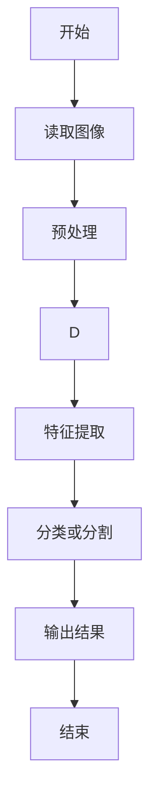
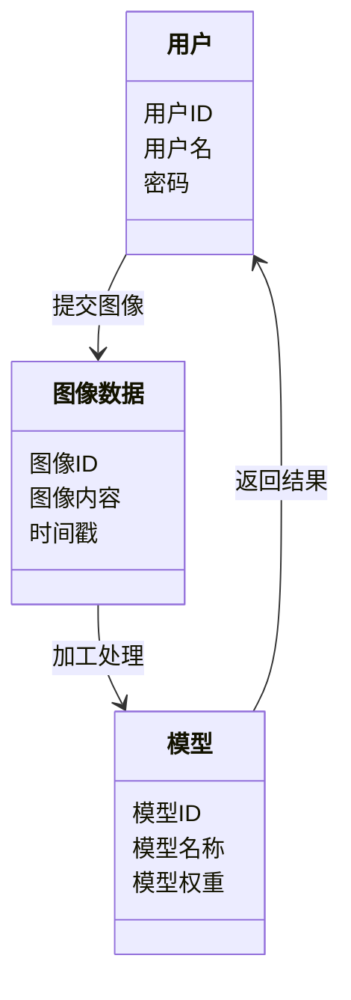
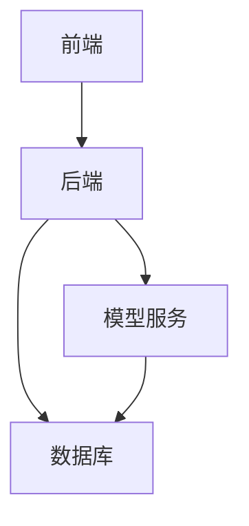
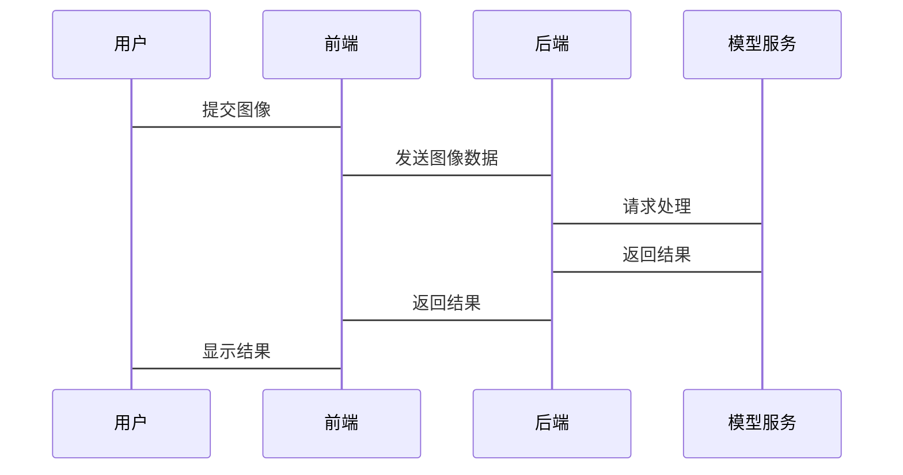

                 


# 如何识别企业的计算机视觉技术优势

## 关键词：计算机视觉，企业技术，算法原理，系统架构，项目实战

## 摘要：  
本文旨在帮助读者识别和评估企业在计算机视觉技术方面的优势。通过系统地分析计算机视觉的核心原理、算法实现、系统架构以及实际项目案例，本文为读者提供了一套全面的方法论，以帮助企业更好地理解和应用计算机视觉技术。

---

## 第1章：背景介绍

### 1.1 问题背景  
- 1.1.1 企业数字化转型的挑战  
  - 企业数据量激增，尤其是图像和视频数据。  
  - 数据的非结构化特性使得传统方法难以处理。  
- 1.1.2 计算机视觉技术的兴起  
  - 基于深度学习的图像识别技术的突破。  
  - 企业对自动化视觉处理的需求增加。  
- 1.1.3 企业应用中的痛点  
  - 数据标注成本高。  
  - 算法泛化能力不足。  
  - 技术与业务需求的脱节。  

### 1.2 问题描述  
- 1.2.1 计算机视觉技术的核心问题  
  - 图像识别、目标检测、图像分割等任务的实现。  
- 1.2.2 企业视觉数据的处理需求  
  - 数据的获取、存储、处理和分析。  
- 1.2.3 技术与业务的结合点  
  - 如何将计算机视觉技术应用于具体业务场景。  

### 1.3 问题解决  
- 1.3.1 计算机视觉技术的解决方案  
  - 基于深度学习的端到端模型。  
  - 数据驱动的自动化处理方法。  
- 1.3.2 企业应用中的关键问题  
  - 数据质量控制。  
  - 模型的可解释性。  
  - 系统的可扩展性。  
- 1.3.3 技术实现的路径  
  - 数据采集与预处理。  
  - 模型训练与部署。  

### 1.4 边界与外延  
- 1.4.1 计算机视觉技术的边界  
  - 与自然语言处理的区分。  
  - 与语音识别的区分。  
- 1.4.2 与其他技术的关系  
  - 与机器学习的联系。  
  - 与大数据技术的联系。  
- 1.4.3 应用场景的外延  
  - 从工业检测到医疗影像的广泛应用。  

### 1.5 概念结构与核心要素  
- 1.5.1 核心概念组成  
  - 数据、模型、算法、任务。  
- 1.5.2 关键要素分析  
  - 数据的结构化与非结构化。  
  - 算法的精度与效率。  
  - 模型的泛化能力与可解释性。  
- 1.5.3 系统结构图  
  - 用mermaid绘制系统结构图，展示数据流、模型训练和部署的关系。

---

## 第2章：核心概念与联系

### 2.1 核心概念原理  
- 2.1.1 图像处理基础  
  - 像素操作、图像变换、边缘检测等。  
- 2.1.2 视觉感知机制  
  - 人类视觉系统的启发。  
  - 图像特征提取的过程。  
- 2.1.3 深度学习模型  
  - CNN、Transformer等模型的介绍。  

### 2.2 概念属性对比  
- 2.2.1 各种计算机视觉技术的属性对比  
  - 表格形式展示不同技术的优劣势。  
- 2.2.2 不同模型的性能分析  
  - 比较CNN、Transformer等模型的适用场景。  
- 2.2.3 技术优劣势对比  
  - 基于规则的模型与深度学习模型的对比。  

### 2.3 ER实体关系图  
```mermaid
erDiagram
    actor 顾客 {
        string 用户ID
        string 用户名
        string 密码
    }
    actor 图像数据 {
        string 图像ID
        blob 图像内容
        timestamp 时间戳
    }
    actor 模型 {
        string 模型ID
        string 模型名称
        blob 模型权重
    }
    顾客 --> 图像数据 : 提交图像
    图像数据 --> 模型 : 加工处理
    模型 --> 顾客 : 返回结果
```

---

## 第3章：算法原理讲解

### 3.1 算法概述  
- 3.1.1 常用算法介绍  
  - 图像分类、目标检测、图像分割等算法的简要介绍。  
- 3.1.2 算法选择的原则  
  - 任务需求、数据规模、计算资源。  
- 3.1.3 算法性能评估  
  - 准确率、召回率、F1分数等指标的计算方法。  

### 3.2 算法流程图  


### 3.3 算法实现  
- 3.3.1 Python代码实现  
  ```python
  import tensorflow as tf
  from tensorflow.keras import layers

  # 构建CNN模型
  model = tf.keras.Sequential([
      layers.Conv2D(32, (3,3), activation='relu', input_shape=(224, 224, 3)),
      layers.MaxPooling2D((2,2)),
      layers.Conv2D(64, (3,3), activation='relu'),
      layers.MaxPooling2D((2,2)),
      layers.Flatten(),
      layers.Dense(64, activation='relu'),
      layers.Dense(10, activation='softmax')
  ])

  model.compile(optimizer='adam', loss='sparse_categorical_crossentropy', metrics=['accuracy'])
  model.fit(x_train, y_train, epochs=10, batch_size=32)
  ```

- 3.3.2 数学模型与公式  
  $$\text{CNN损失函数} = -\sum_{i=1}^{n} y_i \log(p_i) + (1 - y_i) \log(1 - p_i)$$  
  其中，$y_i$ 是真实标签，$p_i$ 是预测概率。  

---

## 第4章：系统分析与架构设计

### 4.1 系统功能设计  
- 4.1.1 领域模型  


### 4.2 系统架构设计  
- 4.2.1 系统架构图  


### 4.3 系统接口设计  
- 4.3.1 接口定义  
  - API接口：`POST /api/upload-image`  
  - 返回格式：JSON格式的结构化数据。  

### 4.4 系统交互设计  
- 4.4.1 交互流程图  


---

## 第5章：项目实战

### 5.1 环境安装  
- 安装Python、TensorFlow、Keras等工具。  
  ```bash
  pip install numpy tensorflow keras
  ```

### 5.2 系统核心实现  
- 5.2.1 代码实现  
  ```python
  import tensorflow as tf
  from tensorflow.keras import layers

  # 数据加载与预处理
  train_dataset = tf.keras.preprocessing.image_dataset_from_directory(
      'data/train',
      image_size=(224, 224),
      batch_size=32
  )

  # 模型定义
  model = tf.keras.Sequential([
      layers.Conv2D(32, (3,3), activation='relu', input_shape=(224, 224, 3)),
      layers.MaxPooling2D((2,2)),
      layers.Conv2D(64, (3,3), activation='relu'),
      layers.MaxPooling2D((2,2)),
      layers.Flatten(),
      layers.Dense(64, activation='relu'),
      layers.Dense(10, activation='softmax')
  ])

  # 模型训练
  model.compile(optimizer='adam', loss='sparse_categorical_crossentropy', metrics=['accuracy'])
  model.fit(train_dataset, epochs=10)
  ```

- 5.2.2 代码解读  
  - 数据加载：使用`image_dataset_from_directory`加载图像数据。  
  - 模型定义：构建一个简单的CNN模型。  
  - 训练过程：定义损失函数和优化器，进行模型训练。  

### 5.3 案例分析  
- 5.3.1 实际案例分析  
  - 工业缺陷检测：使用计算机视觉技术检测产品表面的瑕疵。  
- 5.3.2 详细讲解剖析  
  - 数据标注、模型训练、结果评估的全过程。  

### 5.4 项目小结  
- 项目总结：计算机视觉技术的优势与局限性。  
- 经验分享：如何优化模型性能、降低数据标注成本。  

---

## 第6章：最佳实践与小结

### 6.1 最佳实践 tips  
- 数据预处理的重要性。  
- 模型调参的技巧。  
- 系统部署的注意事项。  

### 6.2 小结  
- 计算机视觉技术的核心优势。  
- 企业应用中的关键成功因素。  

### 6.3 注意事项  
- 数据隐私与安全问题。  
- 模型的泛化能力与鲁棒性。  
- 系统的可扩展性与可维护性。  

### 6.4 拓展阅读  
- 推荐相关书籍和论文。  
- 提供进一步学习的资源。  

---

## 作者：AI天才研究院/AI Genius Institute & 禅与计算机程序设计艺术 /Zen And The Art of Computer Programming

