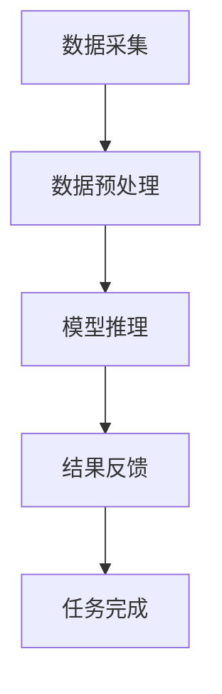
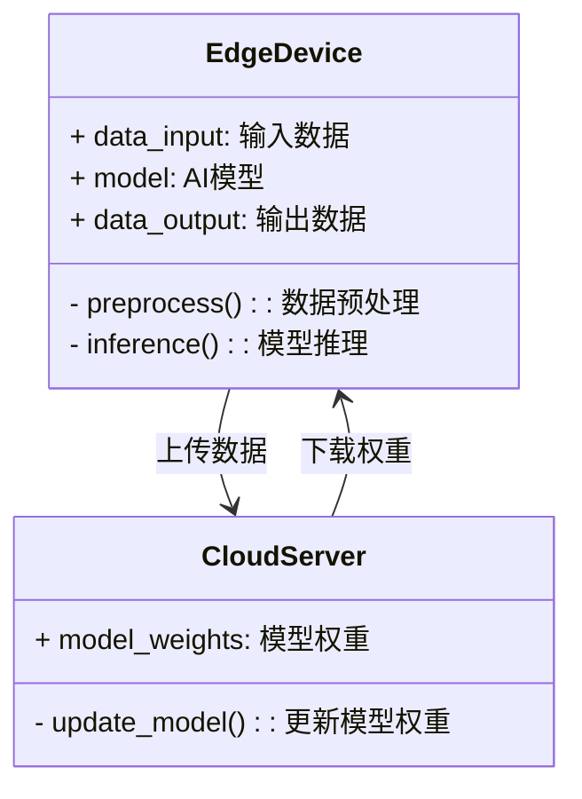
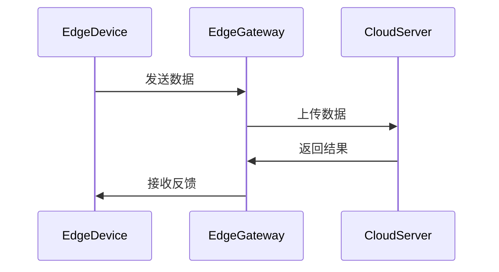

                 


# 如何识别企业的边缘AI芯片优势

> 关键词：边缘AI芯片，AI计算，企业优势，芯片架构，算法优化

> 摘要：边缘AI芯片作为边缘计算的重要组成部分，通过高效的计算能力和低延迟的特点，为企业提供了显著的优势。本文将从边缘AI芯片的定义、核心原理、算法优化、系统架构以及实际案例等方面，详细分析如何识别和利用边缘AI芯片的优势，帮助企业在数字化转型中获得更大的竞争力。

---

# 第1章: 边缘AI芯片的定义与背景

## 1.1 边缘AI芯片的定义

边缘AI芯片是一种专门设计用于在边缘计算环境中进行人工智能相关计算的硬件。边缘计算是指在靠近数据源的地方进行数据处理，而不是将所有数据传输到云端进行集中处理。边缘AI芯片通过在边缘设备上直接执行AI算法，能够实时处理数据，减少延迟，并降低网络带宽的消耗。

### 1.1.1 边缘计算的基本概念

边缘计算是一种分布式计算范式，它将数据处理和存储从中心化的云端转移到靠近数据源的边缘设备。边缘设备可以是传感器、摄像头、智能终端等。边缘计算的优势在于能够快速响应本地事件，减少网络延迟，并降低对中心服务器的依赖。

### 1.1.2 边缘AI芯片的定义与特点

边缘AI芯片是边缘计算与人工智能技术的结合。它是一种专门设计用于在边缘设备上执行AI算法的硬件。边缘AI芯片的特点包括低功耗、高效计算、实时响应以及本地数据处理能力。这些特点使其在物联网、自动驾驶、智能安防等领域具有广泛的应用。

### 1.1.3 边缘AI芯片的应用场景

边缘AI芯片的应用场景包括但不限于：

1. **智能安防**：在摄像头中实时检测和识别异常行为。
2. **智能制造**：在工厂设备中实时监控生产过程并进行预测性维护。
3. **自动驾驶**：在汽车中实时处理传感器数据并做出驾驶决策。
4. **智能零售**：在货架上实时监测商品库存并识别顾客行为。

---

## 1.2 边缘AI芯片的发展现状

### 1.2.1 边缘计算技术的发展历程

边缘计算的概念起源于分布式计算和雾计算（Fog Computing）的概念。随着物联网技术的快速发展，边缘计算逐渐成为一种重要的计算模式。近年来，随着5G网络和AI技术的普及，边缘计算得到了更广泛的应用。

### 1.2.2 AI芯片技术的演进

AI芯片的发展经历了从通用计算到专用计算的演进。早期的AI算法主要依赖于通用CPU进行计算，但随着算法复杂度的增加，CPU的性能逐渐成为瓶颈。于是，GPU、TPU（张量处理单元）和专用AI芯片（如NPU）开始被广泛使用。这些专用芯片通过优化硬件架构和指令集，显著提升了AI计算的效率。

### 1.2.3 边缘AI芯片的市场现状

边缘AI芯片市场近年来增长迅速，主要得益于边缘计算的普及和AI技术的成熟。市场上的边缘AI芯片种类繁多，包括 NVIDIA 的 Jetson 系列、Google 的 Tensor Processing Unit（TPU）、寒武纪的 MLU 系列等。这些芯片在性能、功耗和成本方面各有优势，适用于不同的应用场景。

---

## 1.3 边缘AI芯片的优势与挑战

### 1.3.1 边缘AI芯片的优势

1. **低延迟**：边缘计算能够在本地快速响应，减少网络传输的延迟。
2. **高效计算**：边缘AI芯片通过优化硬件架构和算法，提升了计算效率。
3. **节省带宽**：边缘设备在本地处理数据，减少了需要传输到云端的数据量，从而节省了网络带宽。
4. **隐私保护**：边缘计算能够在本地处理敏感数据，避免了数据在传输过程中可能被截获的风险。

### 1.3.2 边缘AI芯片的挑战

1. **硬件成本**：高端边缘AI芯片的价格较高，对于预算有限的企业来说可能是一个挑战。
2. **技术复杂性**：边缘AI芯片的开发和部署需要专业的技术团队，企业的技术能力可能是一个限制因素。
3. **维护与更新**：边缘设备的维护和更新相对复杂，尤其是在分散的部署环境下。

### 1.3.3 未来边缘AI芯片的发展趋势

随着技术的不断进步，边缘AI芯片将朝着更高效率、更低功耗和更智能化的方向发展。未来的边缘AI芯片可能会集成更多的AI加速器，支持更复杂的算法模型，并具备更好的可扩展性。此外，边缘AI芯片与5G、物联网等技术的结合也将进一步推动其应用的普及。

---

# 第2章: 边缘AI芯片的核心概念与技术原理

## 2.1 边缘AI芯片的计算架构

### 2.1.1 边缘AI芯片的硬件架构

边缘AI芯片的硬件架构通常包括以下组成部分：

1. **计算单元**：负责执行AI算法的核心计算部分，如矩阵乘法、卷积操作等。
2. **存储单元**：用于存储AI模型的权重和中间结果。
3. **数据接口**：用于与传感器或其他外部设备进行数据交互。
4. **控制单元**：负责协调各个模块的工作流程。

### 2.1.2 边缘AI芯片的计算模型

边缘AI芯片的计算模型主要基于深度学习，包括卷积神经网络（CNN）、循环神经网络（RNN）等。这些模型在边缘设备上进行推理，能够快速得到结果。

### 2.1.3 边缘AI芯片的数据处理流程

边缘AI芯片的数据处理流程包括以下几个步骤：

1. **数据采集**：通过传感器或外部设备获取数据。
2. **数据预处理**：对数据进行清洗、归一化等处理，以便后续计算。
3. **模型推理**：将预处理后的数据输入AI模型，得到推理结果。
4. **结果反馈**：将推理结果反馈给应用层，或通过网络发送给其他设备。

---

## 2.2 边缘AI芯片的算法优化

### 2.2.1 边缘AI芯片的算法特点

边缘AI芯片的算法优化主要体现在以下几个方面：

1. **轻量化模型**：通过模型剪枝、量化等技术，减少模型的大小和计算量。
2. **并行计算**：利用多核并行计算技术，提升计算效率。
3. **低功耗优化**：通过算法优化，减少计算过程中的功耗消耗。

### 2.2.2 边缘AI芯片的优化技术

边缘AI芯片的优化技术包括：

1. **模型剪枝**：删除模型中冗余的神经元和权重，减少计算量。
2. **模型量化**：将模型中的浮点数权重转换为整数，降低计算资源的消耗。
3. **任务调度优化**：通过合理分配任务，减少设备之间的通信延迟。

### 2.2.3 边缘AI芯片的性能评估

边缘AI芯片的性能评估主要从以下几个方面进行：

1. **计算速度**：单位时间内能够处理的数据量。
2. **功耗**：芯片在运行时的能耗。
3. **延迟**：从数据输入到结果输出的时间间隔。
4. **准确率**：模型在推理过程中的正确率。

---

## 2.3 边缘AI芯片的核心技术对比

### 2.3.1 芯片性能对比

以下是几种常见边缘AI芯片的性能对比：

| 芯片型号  | 处理器架构 | 主要应用场景       | 计算性能（TOPS） | 功耗（W） |
|-----------|------------|--------------------|------------------|-----------|
| NVIDIA Jetson Xavier | CUDA            | 自动驾驶、机器人 | 30.5       | 15         |
| Google TPU            | TensorFlow       | 云端推理加速     | 150        | 250        |
| 寒武纪 MLU100         | 自研架构         | 智能安防、智能制造 | 128       | 250        |

### 2.3.2 芯片功耗对比

以下是几种芯片的功耗对比：

| 芯片型号  | 最大功耗（W） | 平均功耗（W） |
|-----------|---------------|---------------|
| NVIDIA Jetson Xavier | 15              | 5                |
| Google TPU            | 250             | 100              |
| 寒武纪 MLU100         | 250             | 120              |

### 2.3.3 芯片应用场景对比

以下是几种芯片的应用场景对比：

| 芯片型号  | 自动驾驶 | 智能安防 | 智能制造 |
|-----------|----------|----------|----------|
| NVIDIA Jetson Xavier | √          | √          | √          |
| Google TPU            | ×          | ×          | √          |
| 寒武纪 MLU100         | √          | √          | √          |

---

# 第3章: 边缘AI芯片的算法与数学模型

## 3.1 边缘AI芯片的算法流程

### 3.1.1 算法流程图

以下是边缘AI芯片的算法流程图：



### 3.1.2 算法实现代码

以下是一个简单的边缘AI芯片算法实现代码：

```python
import numpy as np

def preprocess_data(data):
    # 数据预处理
    normalized_data = data / 255.0
    return normalized_data

def model_inference(model, preprocessed_data):
    # 模型推理
    prediction = model.predict(preprocessed_data)
    return prediction

def main():
    # 数据采集
    data = np.random.rand(100, 784)
    # 数据预处理
    processed_data = preprocess_data(data)
    # 模型推理
    result = model_inference(model, processed_data)
    # 结果反馈
    print("推理结果:", result)

if __name__ == "__main__":
    main()
```

### 3.1.3 算法的数学模型

边缘AI芯片的算法通常基于深度学习模型，例如卷积神经网络（CNN）。CNN的数学模型如下：

$$
f(x) = \sum_{i=1}^{n} w_i x_i + b
$$

其中，$w_i$ 是权重，$x_i$ 是输入数据，$b$ 是偏置。

---

## 3.2 边缘AI芯片的数学模型

### 3.2.1 矩阵乘法优化

在边缘AI芯片中，矩阵乘法是AI算法的核心操作。通过优化矩阵乘法的算法，可以显著提升计算效率。例如，使用并行计算和块矩阵技术，可以减少计算时间。

### 3.2.2 稀疏矩阵优化

在AI模型中，稀疏矩阵可以通过去除冗余元素来减少计算量。例如，模型剪枝可以通过删除不重要的权重来降低矩阵的密度。

### 3.2.3 量化优化

量化是将模型中的浮点数权重转换为整数，从而减少存储空间和计算资源的消耗。例如，将32位浮点数转换为8位整数，可以显著降低存储需求。

---

# 第4章: 边缘AI芯片的系统架构与设计

## 4.1 问题场景介绍

在企业中，边缘AI芯片通常用于智能设备和物联网终端。例如，工厂中的传感器设备需要实时监测生产过程并进行预测性维护。

## 4.2 系统功能设计

### 4.2.1 领域模型

以下是边缘AI芯片的领域模型：



### 4.2.2 系统架构设计

以下是边缘AI芯片的系统架构设计：

```mermaid
graph TD
    EdgeDevice --> CloudServer: 数据同步
    EdgeDevice --> EdgeGateway: 数据上报
    EdgeGateway --> CloudServer: 数据传输
```

### 4.2.3 接口设计

边缘AI芯片的接口设计包括：

1. **数据接口**：用于与传感器或其他设备进行数据交互。
2. **模型接口**：用于加载和更新AI模型。
3. **控制接口**：用于配置设备的运行参数。

### 4.2.4 交互流程

以下是边缘AI芯片的交互流程：



---

# 第5章: 项目实战

## 5.1 环境安装

以下是边缘AI芯片项目所需的环境安装步骤：

1. **安装Python**：确保安装了Python 3.6或更高版本。
2. **安装深度学习框架**：安装TensorFlow或PyTorch。
3. **安装边缘AI芯片驱动**：根据芯片型号安装相应的驱动程序。

## 5.2 核心代码实现

### 5.2.1 数据预处理代码

```python
import numpy as np

def preprocess_data(data):
    # 数据归一化处理
    normalized_data = data / 255.0
    return normalized_data
```

### 5.2.2 模型推理代码

```python
import tensorflow as tf

def model_inference(model, preprocessed_data):
    # 模型推理
    prediction = model.predict(preprocessed_data)
    return prediction
```

### 5.2.3 算法实现代码

```python
def main():
    # 数据采集
    data = np.random.rand(100, 784)
    # 数据预处理
    processed_data = preprocess_data(data)
    # 模型推理
    result = model_inference(model, processed_data)
    # 结果反馈
    print("推理结果:", result)

if __name__ == "__main__":
    main()
```

## 5.3 实际案例分析

### 5.3.1 案例介绍

以下是一个边缘AI芯片在智能安防中的实际案例：

**案例背景**：某工厂需要实时监测设备的运行状态，预防设备故障。

**解决方案**：在工厂设备上部署边缘AI芯片，实时采集设备振动数据，通过AI模型进行故障预测。

### 5.3.2 案例分析

1. **数据采集**：设备传感器采集振动数据。
2. **数据预处理**：对数据进行归一化处理。
3. **模型推理**：将预处理后的数据输入AI模型，预测设备状态。
4. **结果反馈**：将预测结果发送给中央控制系统。

---

## 5.4 项目小结

通过以上步骤，我们可以看到边缘AI芯片在实际应用中的优势。通过低延迟、高效计算和实时响应，边缘AI芯片能够显著提升企业的生产效率和安全性。

---

# 第6章: 最佳实践与总结

## 6.1 最佳实践

1. **选择合适的芯片**：根据企业的具体需求选择适合的边缘AI芯片。
2. **优化算法模型**：通过模型剪枝、量化等技术优化算法性能。
3. **关注功耗与成本**：在保证性能的前提下，选择功耗低、成本合理的芯片。

## 6.2 小结

边缘AI芯片的优势在于低延迟、高效计算和实时响应。通过合理选择芯片和优化算法，企业可以显著提升其竞争力。

## 6.3 注意事项

1. **技术复杂性**：边缘AI芯片的开发和部署需要专业的技术团队。
2. **维护与更新**：边缘设备的维护和更新相对复杂，需要定期检查和更新。

## 6.4 拓展阅读

1. 《深度学习入门：基于Python的理论与实现》
2. 《边缘计算：原理与实践》
3. 《AI芯片与边缘计算的结合》

---

# 作者：AI天才研究院 & 禅与计算机程序设计艺术

---

通过以上步骤，我们详细分析了如何识别企业的边缘AI芯片优势，并通过实际案例和代码实现，帮助读者更好地理解和应用这些技术。希望本文能够为企业在数字化转型中提供有价值的参考和指导。

