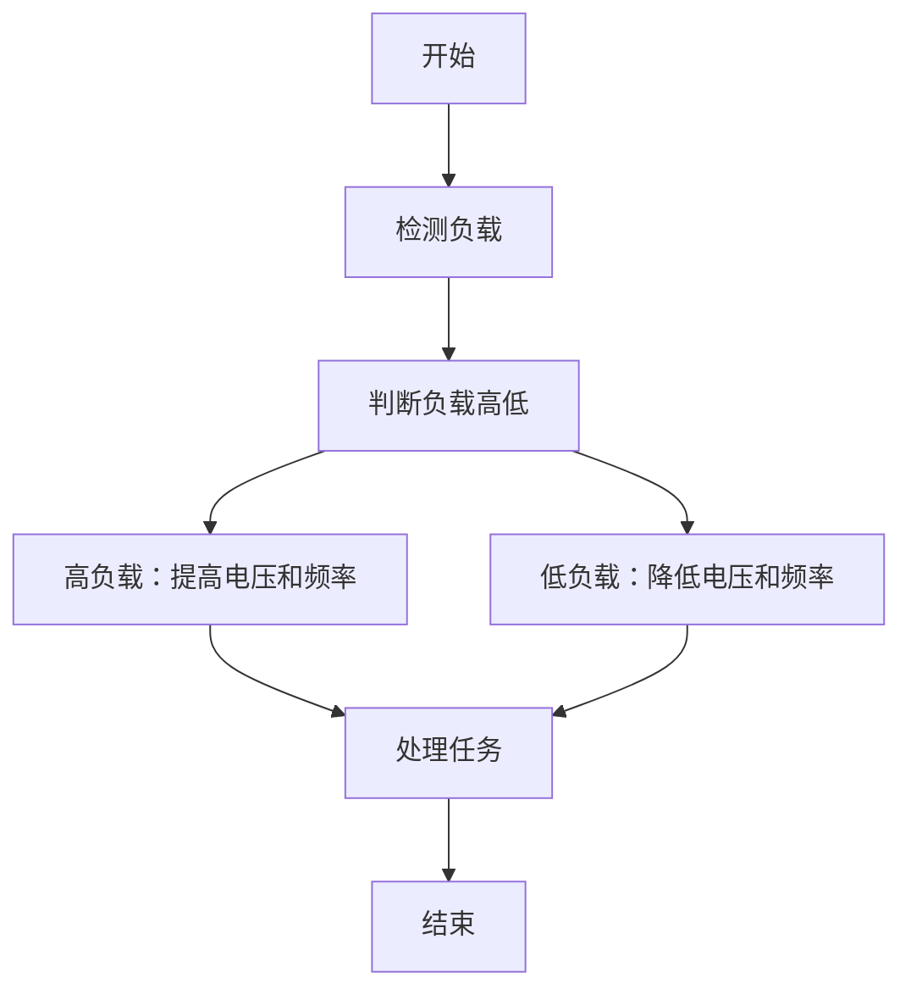
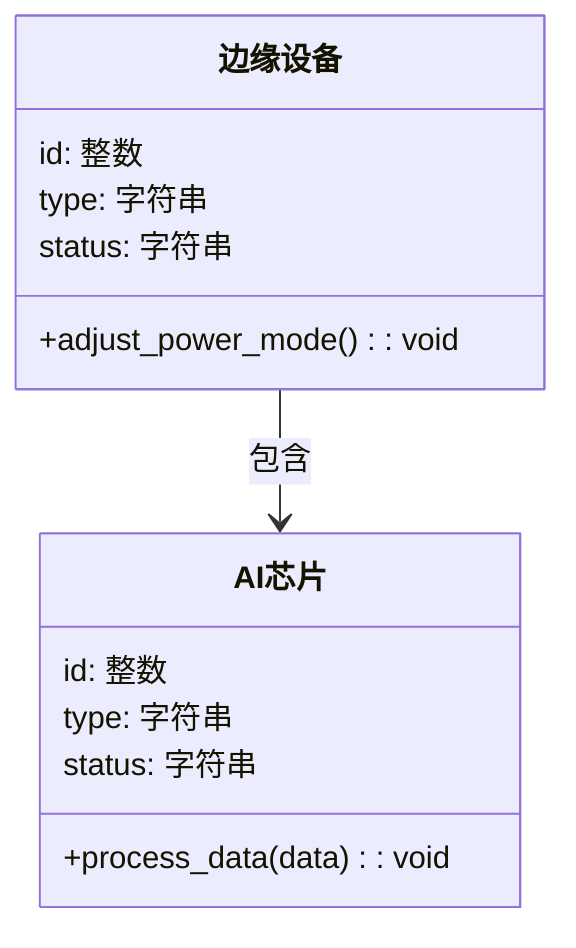

                 


# 如何识别企业的边缘AI芯片低功耗设计优势

> 关键词：边缘AI芯片、低功耗设计、动态电压频率调节、系统架构设计、能耗优化

> 摘要：边缘AI芯片的低功耗设计是企业提升计算效率、降低运营成本的关键技术。本文从边缘计算的背景出发，详细探讨了低功耗设计的核心概念、算法原理、系统架构设计以及项目实战，帮助读者全面理解并识别边缘AI芯片的低功耗设计优势。

---

## 第1章: 边缘计算与AI芯片概述

### 1.1 边缘计算的定义与特点

#### 1.1.1 边缘计算的定义
边缘计算是一种分布式计算范式，将数据处理和存储从云端转移到靠近数据源的边缘设备。这种方式减少了延迟，提高了实时响应能力。

#### 1.1.2 边缘计算的核心特点
- **分布式架构**：数据在边缘端处理，减少对云端的依赖。
- **低延迟**：边缘计算能够快速响应本地事件，适用于实时性要求高的场景。
- **带宽优化**：通过在边缘处理数据，减少需要传输到云端的数据量，节省带宽。

#### 1.1.3 边缘计算与云计算的区别
- **计算位置**：边缘计算在数据源附近进行处理，而云计算在远端数据中心处理。
- **延迟**：边缘计算延迟低，云计算延迟较高。
- **带宽使用**：边缘计算带宽使用少，云计算带宽需求高。

### 1.2 AI芯片的定义与分类

#### 1.2.1 AI芯片的定义
AI芯片是一种专门用于加速人工智能相关任务（如深度学习、神经网络推理）的硬件。这些芯片通过优化指令集和架构，显著提高了AI任务的处理效率。

#### 1.2.2 AI芯片的主要分类
- **GPU**：通用图形处理器，广泛用于深度学习训练和推理。
- **TPU**：张量处理单元，专为深度学习推理设计。
- **NPU**：神经网络处理单元，适用于嵌入式设备中的AI任务。
- **FPGA**：现场可编程门阵列，适合灵活部署的AI加速任务。

#### 1.2.3 边缘AI芯片的特点
- **低功耗**：边缘设备通常依赖电池或有限的能源供应，因此需要低功耗设计。
- **高性能**：在有限的资源下，仍需高效处理AI任务。
- **实时性**：边缘设备需要快速响应，确保实时数据处理。

### 1.3 低功耗设计的重要性

#### 1.3.1 低功耗设计的定义
低功耗设计是指在硬件和软件设计中采用各种技术手段，降低设备的能源消耗，延长电池寿命或减少运营成本。

#### 1.3.2 低功耗设计在边缘AI芯片中的作用
- **延长设备寿命**：低功耗设计延长了边缘设备的运行时间，减少了更换或维护的频率。
- **降低运营成本**：通过减少能源消耗，降低企业的运营成本。
- **提高设备可用性**：低功耗设计使设备能够在资源受限的环境中稳定运行。

---

## 第2章: 边缘AI芯片低功耗设计的核心概念

### 2.1 低功耗设计的原理

#### 2.1.1 动态电压频率调节
动态电压频率调节（DVFS）是一种通过调整处理器的工作电压和频率来优化功耗的技术。在低负载情况下，降低电压和频率可以显著减少功耗，而在高负载情况下，则提高电压和频率以保证性能。

#### 2.1.2 睡眠模式与唤醒机制
边缘设备在 idle 状态时进入睡眠模式，通过关闭部分或全部电路来降低功耗。当有新的数据或任务到达时，设备通过唤醒机制快速恢复到正常工作状态。

#### 2.1.3 能耗优化算法
能耗优化算法通过动态调整设备的运行状态，使其在保证性能的同时，最大限度地降低功耗。

### 2.2 核心概念与联系

#### 2.2.1 核心概念原理
低功耗设计的核心在于平衡性能和功耗，通过动态调整设备的工作状态，实现能耗的最小化。

#### 2.2.2 核心概念属性特征对比表格
| 属性         | 低功耗设计 | 高功耗设计 |
|--------------|------------|------------|
| 功耗         | 低         | 高         |
| 性能         | 中等       | 高         |
| 响应时间     | 较长       | 较短       |
| 适用场景     | 边缘设备   | 云端计算   |

#### 2.2.3 ER实体关系图架构的 Mermaid 流程图
```mermaid
erDiagram
    actor 用户角色 {
        attribute 用户ID
        attribute 用户名
        attribute 密码
    }
    actor 边缘设备 {
        attribute 设备ID
        attribute 设备类型
        attribute 状态
    }
    边缘设备 --> 用户角色: 通过设备ID关联
```

---

## 第3章: 低功耗设计的算法原理

### 3.1 动态电压频率调节算法

#### 3.1.1 算法原理的 Mermaid 流程图


#### 3.1.2 算法实现的 Python 源代码
```python
def dvfs_algorithm(target_load):
    import math
    # 基准频率和电压
    base_freq = 1000  # MHz
    base_voltage = 1.2  # V
    # 根据负载调整频率和电压
    load_ratio = target_load / 100
    adjusted_freq = base_freq * (1 + load_ratio * 0.5)
    adjusted_voltage = base_voltage * (1 + load_ratio * 0.3)
    # 返回调整后的频率和电压
    return adjusted_freq, adjusted_voltage
```

#### 3.1.3 算法的数学模型与公式
功耗与频率和电压的关系可以表示为：
$$ P = C \times V^2 \times f $$
其中，\( C \) 是电路的电容，\( V \) 是电压，\( f \) 是频率。

通过动态调整 \( V \) 和 \( f \)，可以实现功耗的最小化，同时满足性能需求。

#### 3.1.4 举例说明算法的实际应用
假设设备负载为 50%，dvfs_algorithm 函数会将频率和电压调整为基准值的 1.05 倍，从而降低功耗。

---

## 第4章: 低功耗设计的系统分析与架构设计

### 4.1 项目背景与目标

#### 4.1.1 项目背景介绍
随着边缘计算的普及，企业需要在有限的资源下高效运行AI任务，低功耗设计成为边缘AI芯片的核心需求。

#### 4.1.2 项目目标与范围
目标是设计一种低功耗的边缘AI芯片架构，能够在保证性能的前提下，最大限度地降低功耗。

#### 4.1.3 项目的关键成功因素
- **低功耗设计**：优化电压和频率调整算法。
- **高效计算**：选择适合边缘计算的硬件架构。
- **实时性**：确保快速响应和数据处理。

### 4.2 系统功能设计

#### 4.2.1 领域模型的 Mermaid 类图


#### 4.2.2 系统功能模块划分
- **数据采集模块**：负责采集边缘设备的数据。
- **数据处理模块**：对数据进行AI处理和分析。
- **功耗管理模块**：动态调整设备的功耗状态。

#### 4.2.3 功能模块之间的交互关系
数据采集模块将数据传输给数据处理模块，数据处理模块根据负载情况通知功耗管理模块调整功耗状态。

### 4.3 系统架构设计

#### 4.3.1 系统架构的 Mermaid 架构图


#### 4.3.2 系统架构的优缺点分析
- **优点**：降低延迟，减少带宽使用，提高实时性。
- **缺点**：需要复杂的功耗管理机制，增加系统设计的复杂性。

#### 4.3.3 系统接口设计
边缘设备与云端服务器通过API进行数据同步，功耗管理模块通过内部接口与数据处理模块交互。

---

## 第5章: 项目实战

### 5.1 环境安装

#### 5.1.1 安装Python和相关库
```bash
pip install numpy matplotlib
```

#### 5.1.2 安装硬件开发环境
安装适用于AI芯片开发的SDK和工具链。

### 5.2 系统核心实现源代码

#### 5.2.1 动态电压频率调节的Python代码
```python
def adjust_power_mode(target_load):
    import math
    base_freq = 1000  # MHz
    base_voltage = 1.2  # V
    load_ratio = target_load / 100
    adjusted_freq = base_freq * (1 + load_ratio * 0.5)
    adjusted_voltage = base_voltage * (1 + load_ratio * 0.3)
    return adjusted_freq, adjusted_voltage
```

#### 5.2.2 系统功能实现的Python代码
```python
class EdgeDevice:
    def __init__(self, device_id, device_type):
        self.id = device_id
        self.type = device_type
        self.status = "idle"

    def adjust_power_mode(self, target_load):
        adjusted_freq, adjusted_voltage = dvfs_algorithm(target_load)
        print(f"调整频率：{adjusted_freq} MHz，电压：{adjusted_voltage} V")
```

### 5.3 代码应用解读与分析
通过上述代码，边缘设备可以根据当前负载动态调整电压和频率，从而实现低功耗设计。

### 5.4 实际案例分析和详细讲解剖析
假设一个边缘设备的负载率为 70%，dvfs_algorithm 会将频率调整为 1050 MHz，电压调整为 1.278 V，从而降低功耗。

### 5.5 项目小结
通过动态电压频率调节算法，边缘设备可以在保证性能的同时，显著降低功耗，延长设备的运行时间。

---

## 第6章: 最佳实践 tips、小结、注意事项、拓展阅读

### 6.1 tips
- 定期监控设备的功耗状态，及时调整配置。
- 在设计阶段充分考虑设备的功耗需求，避免后期优化困难。

### 6.2 小结
边缘AI芯片的低功耗设计是企业提升竞争力的重要技术。通过动态调整设备的工作状态，可以在保证性能的前提下，最大限度地降低功耗。

### 6.3 注意事项
- 确保功耗管理算法的稳定性，避免因频繁调整导致设备不稳定。
- 在实际应用中，综合考虑设备的性能需求和功耗限制。

### 6.4 拓展阅读
- 《边缘计算：原理与实践》
- 《低功耗设计：方法与技巧》
- 《AI芯片开发指南》

---

## 作者：AI天才研究院 & 禅与计算机程序设计艺术

---

以上是文章的完整目录和部分内容，您可以根据需要进一步补充每个章节的具体内容。

