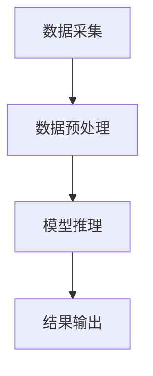

                 


# 如何识别企业的边缘AI芯片低延迟设计优势

> 关键词：边缘AI芯片、低延迟设计、企业优势、系统架构、算法优化

> 摘要：本文详细探讨了如何识别企业边缘AI芯片的低延迟设计优势，从背景介绍、核心概念、算法原理、系统架构到项目实战，全面分析了低延迟设计对企业竞争优势的重要性。文章通过详细的理论分析和实际案例，揭示了边缘AI芯片低延迟设计的关键技术与实现方法，为企业在边缘计算领域的技术决策提供深度参考。

---

## 第1章: 边缘AI芯片与低延迟设计背景

### 1.1 边缘AI芯片的定义与特点
边缘AI芯片是指在边缘计算环境中运行的人工智能芯片，其特点是低延迟、高能效和实时性。这些芯片通常用于物联网设备、自动驾驶、智能安防等领域，能够在靠近数据源的地方快速处理数据，减少对云端的依赖。

#### 1.1.1 什么是边缘AI芯片
边缘AI芯片是一种专门设计用于边缘计算环境的硬件，能够执行AI推理任务，如图像识别、语音识别等。与云端AI芯片相比，边缘AI芯片更注重实时性和低延迟。

#### 1.1.2 边缘AI芯片的核心特点
边缘AI芯片具有以下特点：
- **低延迟**：能够在本地快速处理数据，减少网络传输的延迟。
- **高能效**：设计功耗低，适合在资源受限的环境中运行。
- **实时性**：能够快速响应，适用于需要实时决策的应用场景。

#### 1.1.3 边缘AI芯片与传统AI芯片的区别
| 特性 | 边缘AI芯片 | 传统AI芯片 |
|------|------------|------------|
| 处理场景 | 边缘计算环境 | 云端计算环境 |
| 延迟要求 | 低延迟 | 高延迟可接受 |
| 功耗 | 低功耗 | 高功耗 |
| 数据传输 | 数据量小，本地处理 | 数据量大，需传输到云端 |

### 1.2 低延迟设计的重要性
低延迟设计在边缘AI芯片中至关重要，尤其是在实时性要求高的应用场景中。

#### 1.2.1 延迟的定义与影响
延迟是指从输入数据到输出结果之间的时间间隔。在边缘计算中，低延迟意味着能够更快地响应用户请求，提升用户体验。

#### 1.2.2 边缘计算中的低延迟需求
边缘计算需要实时处理数据，例如自动驾驶中的环境感知和决策，任何延迟都可能导致安全事故。

#### 1.2.3 低延迟设计对企业竞争优势的意义
低延迟设计能够提升企业的竞争力，尤其是在需要快速响应的业务场景中。例如，在智能制造中，低延迟的边缘AI芯片能够快速检测和修复生产问题，提高生产效率。

### 1.3 本章小结
本章介绍了边缘AI芯片的定义、特点以及低延迟设计的重要性，为后续章节的分析奠定了基础。

---

## 第2章: 边缘AI芯片低延迟设计的核心概念

### 2.1 边缘AI芯片的架构分析
边缘AI芯片的架构设计直接影响其性能和延迟。

#### 2.1.1 边缘AI芯片的硬件架构
边缘AI芯片的硬件架构通常包括以下部分：
- **CPU**：负责通用计算任务。
- **GPU/FPGA**：负责并行计算任务，加速AI推理。
- **NPU（神经网络处理器）**：专为AI推理设计的加速器。

#### 2.1.2 边缘AI芯片的软件架构
边缘AI芯片的软件架构通常包括以下部分：
- **驱动层**：负责硬件资源的管理和分配。
- **框架层**：如TensorFlow Lite、ONNX，用于AI模型的部署和执行。
- **应用层**：具体的应用逻辑，如图像识别、语音识别等。

#### 2.1.3 边缘AI芯片的协同设计
边缘AI芯片的硬件和软件需要协同设计，以实现最佳性能和低延迟。

### 2.2 低延迟设计的关键技术
低延迟设计需要结合硬件和软件的优化。

#### 2.2.1 硬件加速技术
硬件加速技术通过专用的加速器（如NPU）来加速AI推理任务，减少计算时间。

#### 2.2.2 软件优化技术
软件优化技术通过优化算法和数据结构，减少计算步骤，降低延迟。

#### 2.2.3 网络优化技术
网络优化技术通过优化数据传输协议和网络架构，减少数据传输时间。

### 2.3 边缘AI芯片低延迟设计的数学模型
低延迟设计需要数学模型的支持，以量化性能和优化方向。

#### 2.3.1 延迟计算公式
$$\text{延迟} = \frac{\text{任务量}}{\text{处理能力}}$$

#### 2.3.2 并行计算模型
并行计算模型通过同时处理多个任务，减少整体延迟。

#### 2.3.3 负载均衡算法
负载均衡算法通过合理分配任务，避免单点过载，降低延迟。

### 2.4 本章小结
本章分析了边缘AI芯片的架构和低延迟设计的关键技术，揭示了硬件加速、软件优化和网络优化的重要性。

---

## 第3章: 低延迟设计的算法实现

### 3.1 算法原理概述
低延迟设计需要高效的算法实现。

#### 3.1.1 算法的基本思想
算法的基本思想是通过优化计算步骤和数据结构，减少计算时间。

#### 3.1.2 算法的输入输出
算法的输入是原始数据，输出是处理后的结果。

#### 3.1.3 算法的复杂度分析
算法的复杂度分析包括时间复杂度和空间复杂度，用于评估算法的性能。

### 3.2 算法实现细节
具体的算法实现细节包括优化技巧和代码实现。

#### 3.2.1 算法的步骤分解
以图像识别为例，算法的步骤包括数据预处理、特征提取、模型推理等。

#### 3.2.2 算法的优化技巧
优化技巧包括减少计算量、优化数据访问顺序等。

#### 3.2.3 算法的实现代码
以下是一个简单的图像识别算法实现：

```python
import tensorflow as tf
from tensorflow.keras import layers

# 数据预处理
def preprocess_image(image):
    # 调整图像大小
    image = tf.image.resize(image, (224, 224))
    # 标准化
    image = tf.keras.applications.mobilenet_v2.preprocess_input(image)
    return image

# 特征提取
def extract_features(image):
    model = tf.keras.applications.MobileNetV2(weights='imagenet')
    features = model.predict(preprocess_image(image))
    return features

# 模型推理
def predict_class(features):
    model = tf.keras.Sequential([
        layers.Dense(256, activation='relu'),
        layers.Dense(10, activation='softmax')
    ])
    prediction = model.predict(features)
    return prediction
```

### 3.3 算法的数学模型
数学模型用于量化算法的性能。

#### 3.3.1 数学模型的建立
建立数学模型时，需要考虑任务量、处理能力和延迟的关系。

#### 3.3.2 数学模型的求解
通过数学模型的求解，可以找到优化方向。

#### 3.3.3 数学模型的应用
数学模型可以用于评估不同算法的性能。

### 3.4 本章小结
本章详细讲解了低延迟设计的算法实现，包括算法原理、优化技巧和代码实现。

---

## 第4章: 系统架构设计

### 4.1 系统架构概述
系统架构设计是实现低延迟设计的关键。

#### 4.1.1 系统架构的目标
系统架构的目标是实现高效的数据处理和低延迟的响应。

#### 4.1.2 系统架构的组成部分
系统架构通常包括数据采集层、数据处理层和应用层。

#### 4.1.3 系统架构的设计原则
设计原则包括模块化、可扩展性和高可用性。

### 4.2 系统功能设计
系统功能设计需要考虑具体的业务需求。

#### 4.2.1 系统的功能模块划分
功能模块包括数据采集、数据处理、模型推理和结果输出。

#### 4.2.2 系统的功能流程图
以下是系统功能流程图的Mermaid图：



#### 4.2.3 系统的功能实现
功能实现需要结合硬件和软件的优化。

### 4.3 系统架构的实现
系统架构的实现需要具体的代码和配置。

#### 4.3.1 系统架构的实现步骤
实现步骤包括硬件选型、软件开发和系统集成。

#### 4.3.2 系统架构的实现代码
以下是一个简单的系统架构实现代码：

```python
class EdgeAICHIP:
    def __init__(self):
        self.cpu = CPU()
        self.gpu = GPU()
        self.npu = NPU()

    def process_task(self, task):
        if task.type == '计算密集型':
            self.gpu.process(task)
        elif task.type == 'AI推理':
            self.npu.process(task)
```

#### 4.3.3 系统架构的实现测试
测试包括功能测试和性能测试。

### 4.4 本章小结
本章详细讲解了系统架构设计，包括组成部分、功能流程和实现步骤。

---

## 第5章: 项目实战

### 5.1 项目背景与需求分析
项目背景是边缘AI芯片的低延迟设计，需求是实现高效的图像识别功能。

#### 5.1.1 项目背景
项目背景是自动驾驶中的环境感知。

#### 5.1.2 项目需求
项目需求是实现低延迟的图像识别功能。

### 5.2 环境安装
环境安装包括硬件和软件的配置。

#### 5.2.1 硬件配置
硬件配置包括高性能的边缘AI芯片和传感器设备。

#### 5.2.2 软件配置
软件配置包括操作系统、驱动和AI框架。

### 5.3 核心代码实现
核心代码实现包括数据预处理、模型推理和结果输出。

#### 5.3.1 数据预处理
数据预处理代码如下：

```python
def preprocess_image(image):
    image = tf.image.resize(image, (224, 224))
    image = tf.keras.applications.mobilenet_v2.preprocess_input(image)
    return image
```

#### 5.3.2 模型推理
模型推理代码如下：

```python
def extract_features(image):
    model = tf.keras.applications.MobileNetV2(weights='imagenet')
    features = model.predict(preprocess_image(image))
    return features
```

### 5.4 案例分析与详细解读
以自动驾驶中的图像识别为例，详细分析了低延迟设计的优势。

#### 5.4.1 案例分析
案例分析包括数据采集、预处理和模型推理的优化。

#### 5.4.2 详细解读
详细解读了每个步骤的优化技巧和实现细节。

### 5.5 项目小结
项目小结总结了低延迟设计的优势和实现方法。

---

## 第6章: 最佳实践与注意事项

### 6.1 最佳实践 tips
- **硬件选型**：选择适合的边缘AI芯片。
- **软件优化**：优化算法和数据结构。
- **网络优化**：优化数据传输协议。

### 6.2 小结
总结了全文的主要内容和关键点。

### 6.3 注意事项
- **延迟优化**：要注意硬件和软件的协同优化。
- **数据安全**：要注意数据隐私和安全问题。
- **系统维护**：要注意系统的可扩展性和可维护性。

### 6.4 拓展阅读
推荐了一些相关的书籍和论文，供读者进一步学习。

---

## 作者信息

作者：AI天才研究院/AI Genius Institute & 禅与计算机程序设计艺术 /Zen And The Art of Computer Programming

---

# 附录: 边缘AI芯片低延迟设计的数学公式总结

以下是一些常用的数学公式：

1. 延迟计算公式：
$$\text{延迟} = \frac{\text{任务量}}{\text{处理能力}}$$

2. 并行计算模型：
$$\text{并行加速} = \frac{\text{单线程时间}}{\text{多线程时间}}$$

3. 负载均衡算法：
$$\text{负载均衡} = \frac{\text{总任务量}}{\text{处理核心数}}$$

---

以上是《如何识别企业的边缘AI芯片低延迟设计优势》的完整目录大纲和文章内容，涵盖了从背景介绍到项目实战的各个方面，结合理论分析和实际案例，为企业识别边缘AI芯片低延迟设计的优势提供了全面的指导。

