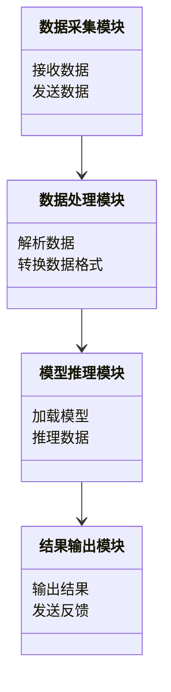
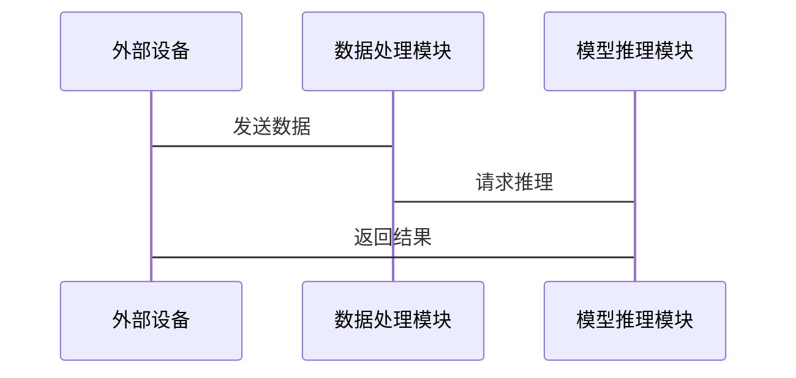

                 


# 如何识别企业的边缘AI芯片设计优势

---

## 关键词：边缘计算、AI芯片、硬件设计、算法优化、企业优势

---

## 摘要：  
边缘AI芯片设计是当前人工智能和边缘计算领域的重要研究方向。随着企业对高效、低延迟和高能效计算需求的增加，边缘AI芯片的设计优势逐渐成为企业竞争力的关键因素。本文将从边缘AI芯片的定义、核心优势、设计原理、算法优化、系统架构以及项目实战等多个方面进行详细分析，帮助读者识别企业在边缘AI芯片设计中的核心优势。

---

## 第1章: 边缘AI芯片设计的背景与概念

### 1.1 边缘AI芯片的定义与特点

#### 1.1.1 边缘计算的定义与发展
边缘计算是一种分布式计算范式，旨在将计算能力从中心化云服务器转移到靠近数据源的边缘设备。边缘计算的核心优势在于低延迟和高实时性，能够满足智能制造、智慧城市、自动驾驶等场景的需求。

#### 1.1.2 边缘AI芯片的核心特点
边缘AI芯片是边缘计算与人工智能技术的结合，具有以下核心特点：
- **低延迟**：边缘设备能够在本地快速处理数据，减少对云端的依赖。
- **高能效**：边缘AI芯片通常采用低功耗设计，适合部署在资源受限的环境中。
- **分布式计算**：边缘AI芯片能够实现数据的分布式处理和分析，提升系统的鲁棒性和可靠性。
- **隐私保护**：边缘AI芯片可以在本地完成数据处理，减少数据传输到云端的频率，从而保护数据隐私。

#### 1.1.3 边缘AI芯片与传统芯片的对比
| 对比维度 | 边缘AI芯片 | 传统芯片 |
|----------|------------|----------|
| 处理场景 | 边缘设备、实时任务 | 中心服务器、批量处理 |
| 计算能力 | 专注于AI任务优化 | 通用计算能力 |
| 能耗 | 低功耗设计 | 高功耗设计 |
| 数据处理 | 本地处理 | 云端集中处理 |

### 1.2 边缘AI芯片的优势

#### 1.2.1 低延迟与实时性
边缘AI芯片能够在本地快速处理数据，避免了云端传输的延迟，适用于需要实时响应的场景，如自动驾驶、工业自动化等。

#### 1.2.2 高能效与低成本
边缘AI芯片通常采用低功耗设计，能够在有限的资源条件下高效运行，同时降低企业的运营成本。

#### 1.2.3 数据隐私与安全性
边缘AI芯片能够在本地完成数据处理和分析，减少了数据传输到云端的频率，从而降低了数据泄露的风险。

### 1.3 边缘AI芯片的应用场景

#### 1.3.1 智能制造中的边缘AI
在智能制造中，边缘AI芯片可以用于实时监控生产线状态、预测设备故障、优化生产流程等。

#### 1.3.2 智慧城市中的边缘AI
在智慧城市中，边缘AI芯片可以用于智能交通管理、环境监测、公共安全等场景，提升城市管理的效率和智能化水平。

#### 1.3.3 智慧医疗中的边缘AI
在智慧医疗中，边缘AI芯片可以用于实时监测患者健康状况、辅助诊断、远程医疗等，提升医疗服务的质量和效率。

### 1.4 本章小结
本章从边缘AI芯片的定义、特点、优势以及应用场景四个方面进行了详细分析，帮助读者理解边缘AI芯片的核心概念和其在企业中的重要性。

---

## 第2章: 边缘AI芯片设计的核心概念与原理

### 2.1 边缘AI芯片的设计原理

#### 2.1.1 硬件架构设计
边缘AI芯片的硬件架构设计需要考虑以下几个方面：
- **计算单元**：设计高效的计算单元，用于加速神经网络的推理过程。
- **存储单元**：优化存储结构，减少数据访问的延迟和功耗。
- **接口设计**：设计灵活的接口，支持多种数据输入输出格式。

#### 2.1.2 软件算法优化
边缘AI芯片的软件算法优化需要考虑以下几个方面：
- **模型压缩**：通过剪枝、量化等技术，降低模型的计算复杂度。
- **并行计算**：利用多核并行计算技术，提升计算效率。
- **任务调度**：优化任务调度算法，确保资源的高效利用。

#### 2.1.3 芯片集成与测试
边缘AI芯片的集成与测试需要考虑以下几个方面：
- **芯片集成**：将硬件和软件模块集成到一个统一的系统中。
- **功能测试**：测试芯片的功能是否符合设计要求。
- **性能测试**：测试芯片的计算性能、功耗、延迟等指标是否达到预期。

### 2.2 边缘AI芯片的关键技术

#### 2.2.1 神经网络加速器
神经网络加速器是一种专门为神经网络推理设计的硬件模块，能够显著提升边缘AI芯片的计算效率。

#### 2.2.2 能效优化技术
能效优化技术包括低功耗设计、动态电压频率调整等，能够有效降低边缘AI芯片的功耗。

#### 2.2.3 硬件加速指令集
硬件加速指令集是一种专门用于加速神经网络推理的指令集，能够显著提升边缘AI芯片的计算速度。

### 2.3 边缘AI芯片的设计流程

#### 2.3.1 需求分析与规划
在设计边缘AI芯片之前，需要明确需求，制定设计目标和计划。

#### 2.3.2 架构设计与实现
根据需求分析结果，设计芯片的架构，并实现硬件和软件模块。

#### 2.3.3 测试与优化
对设计的芯片进行功能测试、性能测试，并根据测试结果进行优化。

### 2.4 本章小结
本章从边缘AI芯片的设计原理、关键技术、设计流程三个方面进行了详细分析，帮助读者理解边缘AI芯片的核心技术及其设计过程。

---

## 第3章: 边缘AI芯片的算法优化与实现

### 3.1 边缘AI芯片的算法优化策略

#### 3.1.1 神经网络模型压缩
神经网络模型压缩是通过剪枝、量化等技术，降低模型的计算复杂度和存储需求。

#### 3.1.2 模型量化与剪枝
模型量化是将模型的权重和激活值量化为低精度（如int8）的数值，从而减少存储空间和计算量。模型剪枝是通过去除模型中冗余的参数，进一步降低模型的复杂度。

#### 3.1.3 知识蒸馏与迁移学习
知识蒸馏是通过将大型模型的知识迁移到小型模型中，提升小型模型的性能。迁移学习是通过利用已有的知识，快速适应新的任务。

### 3.2 边缘AI芯片的算法实现流程

#### 3.2.1 数据预处理与特征提取
数据预处理包括数据清洗、归一化等步骤，特征提取是通过提取数据中的关键特征，为后续的模型训练提供输入。

#### 3.2.2 神经网络训练与部署
神经网络训练是通过反向传播算法优化模型参数，部署是将训练好的模型移植到边缘AI芯片上运行。

#### 3.2.3 模型优化与性能评估
模型优化是通过调整模型结构和参数，进一步提升模型的性能。性能评估是通过测试模型的准确率、延迟、功耗等指标，评估模型的性能。

### 3.3 边缘AI芯片的算法实现案例

#### 3.3.1 图像识别算法实现
图像识别算法实现包括数据预处理、模型训练、模型部署和性能评估四个步骤。

#### 3.3.2 语音识别算法实现
语音识别算法实现包括语音数据预处理、模型训练、模型部署和性能评估四个步骤。

#### 3.3.3 自然语言处理算法实现
自然语言处理算法实现包括文本数据预处理、模型训练、模型部署和性能评估四个步骤。

### 3.4 本章小结
本章从边缘AI芯片的算法优化策略、实现流程、实现案例三个方面进行了详细分析，帮助读者理解边缘AI芯片的算法优化过程及其实际应用。

---

## 第4章: 边缘AI芯片的系统架构与设计

### 4.1 边缘AI芯片的系统架构设计

#### 4.1.1 系统功能模块划分
系统功能模块划分为数据采集模块、数据处理模块、模型推理模块和结果输出模块。

#### 4.1.2 系统架构设计
系统架构设计包括硬件架构设计和软件架构设计，硬件架构设计需要考虑芯片的计算单元、存储单元和接口设计，软件架构设计需要考虑算法实现、任务调度和系统管理。

#### 4.1.3 系统功能模型
使用Mermaid类图表示系统功能模型：



#### 4.1.4 系统架构图
使用Mermaid架构图表示系统架构设计：


### 4.2 边缘AI芯片的系统接口设计

#### 4.2.1 系统接口设计
系统接口设计需要考虑芯片与外部设备的通信接口，如SPI、I2C、UART等。

#### 4.2.2 系统交互设计
系统交互设计需要考虑芯片与外部设备的交互流程，如数据输入、数据处理、结果输出等。

#### 4.2.3 系统交互图
使用Mermaid序列图表示系统交互流程：



### 4.3 本章小结
本章从边缘AI芯片的系统架构设计、接口设计、交互设计三个方面进行了详细分析，帮助读者理解边缘AI芯片的系统设计过程。

---

## 第5章: 边缘AI芯片设计的项目实战

### 5.1 环境安装与配置

#### 5.1.1 开发环境搭建
需要搭建支持边缘AI芯片开发的硬件环境和软件环境，包括开发板、编程工具、调试工具等。

#### 5.1.2 依赖库安装
需要安装支持神经网络推理的依赖库，如TensorFlow、Keras、Caffe等。

#### 5.1.3 工具链配置
需要配置编译工具链，包括编译器、调试器、性能分析工具等。

### 5.2 系统核心实现源代码

#### 5.2.1 神经网络模型实现
以下是一个简单的图像识别模型实现代码：

```python
import tensorflow as tf
from tensorflow.keras import layers

model = tf.keras.Sequential([
    layers.Conv2D(32, (3,3), activation='relu', input_shape=(224, 224, 3)),
    layers.MaxPooling2D((2,2)),
    layers.Conv2D(64, (3,3), activation='relu'),
    layers.MaxPooling2D((2,2)),
    layers.Flatten(),
    layers.Dense(128, activation='relu'),
    layers.Dense(10, activation='softmax')
])
```

#### 5.2.2 模型优化实现
以下是一个模型量化实现的代码示例：

```python
import tflite

def representative_dataset():
    # 生成代表性的输入数据
    for _ in range(100):
        yield [tf.random.uniform(shape=(1, 224, 224, 3), minval=0, maxval=255, dtype=tf.float32)]

# 导入训练好的模型
model = tf.keras.load_model('model.h5')

# 量化模型
converter = tf.lite.TFLiteConverter.from_keras_model(model)
converter.optimizations = [tf.lite.OptimizationFlag.METADATA]
tflite_model = converter.convert()

# 保存量化后的模型
with open('quantized_model.tflite', 'wb') as f:
    f.write(tflite_model)
```

### 5.3 实际案例分析与详细解读

#### 5.3.1 图像识别案例分析
在图像识别案例中，边缘AI芯片可以实时处理摄像头捕获的图像数据，快速识别图像中的物体或场景，并返回识别结果。

#### 5.3.2 语音识别案例分析
在语音识别案例中，边缘AI芯片可以实时处理麦克风捕获的语音数据，快速识别语音内容，并返回识别结果。

### 5.4 项目小结
本章通过实际项目案例，详细讲解了边缘AI芯片设计的环境搭建、核心实现、优化策略和实际应用，帮助读者掌握边缘AI芯片设计的实战技能。

---

## 第6章: 边缘AI芯片设计的最佳实践与小结

### 6.1 最佳实践

#### 6.1.1 硬件设计注意事项
硬件设计需要考虑芯片的计算能力、存储容量、功耗等因素，确保芯片能够满足实际应用的需求。

#### 6.1.2 软件设计注意事项
软件设计需要考虑算法的优化策略、任务调度算法、系统管理模块等，确保系统的高效运行。

#### 6.1.3 项目管理注意事项
项目管理需要考虑项目的时间安排、资源分配、风险控制等，确保项目的顺利进行。

### 6.2 小结
本章总结了边缘AI芯片设计的最佳实践，包括硬件设计、软件设计和项目管理等方面，帮助读者在实际项目中避免常见错误，提高设计效率。

### 6.3 注意事项
在边缘AI芯片设计过程中，需要注意以下几点：
- 硬件设计需要考虑芯片的功耗、计算能力和存储容量。
- 软件设计需要考虑算法的优化策略和任务调度算法。
- 项目管理需要考虑项目的时间安排和资源分配。

### 6.4 拓展阅读
建议读者进一步阅读以下书籍和论文：
- 《深度学习》—— Ian Goodfellow
- 《边缘计算：原理与应用》—— 李洪志
- 《神经网络与深度学习》—— 周志华

---

## 作者：AI天才研究院/AI Genius Institute & 禅与计算机程序设计艺术 /Zen And The Art of Computer Programming

---

**本文通过系统地分析边缘AI芯片的设计背景、核心概念、算法优化、系统架构以及项目实战，帮助读者全面理解边缘AI芯片的设计优势，并为企业识别边缘AI芯片的设计优势提供了实用的指导和建议。**

