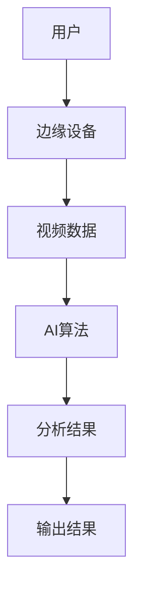
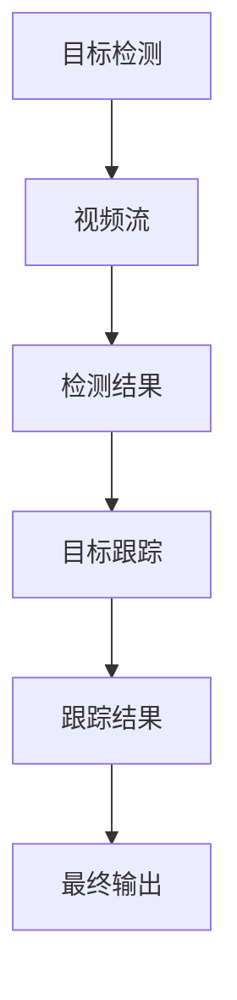
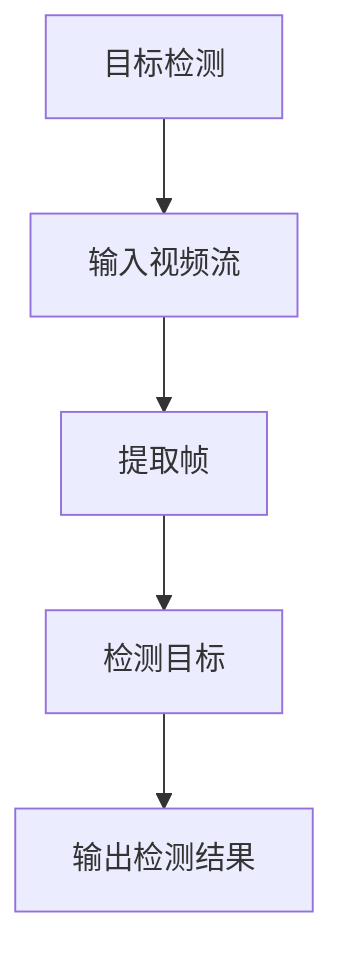
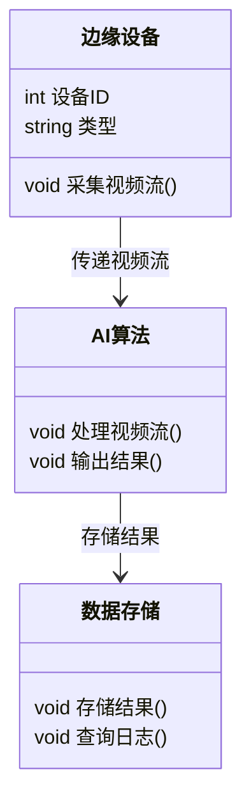
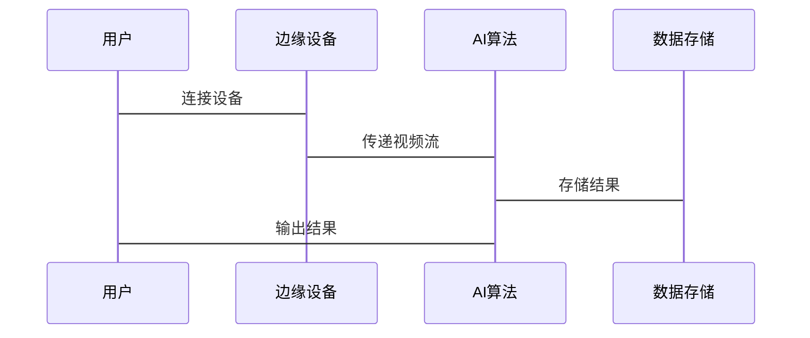

                 


# 如何识别企业的边缘AI视频分析优势

> 关键词：边缘AI，视频分析，企业优势，算法原理，系统架构

> 摘要：本文详细探讨了如何识别企业在边缘AI视频分析领域的优势。通过分析边缘AI的核心概念、算法原理、系统架构和项目实战，本文为读者提供了从理论到实践的全面指导。文章内容涵盖背景介绍、核心概念对比、算法实现、系统设计和实际案例分析，帮助企业在竞争中找到独特优势。

---

# 第一部分: 边缘AI视频分析的背景与概念

## 第1章: 边缘AI视频分析的背景介绍

### 1.1 问题背景与问题描述

#### 1.1.1 传统视频分析的局限性
传统的视频分析依赖于将数据传输到云端进行处理，这种方式存在以下问题：
- **延迟高**：数据传输和处理需要时间，影响实时性。
- **带宽需求大**：尤其是大规模视频数据，传输成本高。
- **数据隐私风险**：数据在传输过程中可能被截获，存在安全隐患。

#### 1.1.2 边缘计算的兴起与优势
边缘计算是一种分布式计算范式，将数据处理能力从云端转移到数据源附近。边缘计算的优势包括：
- **低延迟**：数据在本地处理，减少网络传输时间。
- **带宽优化**：仅传输必要的数据，降低网络负担。
- **隐私保护**：数据在本地处理，减少传输中的隐私风险。

#### 1.1.3 边缘AI视频分析的定义与目标
边缘AI视频分析是将人工智能技术应用于边缘设备上的视频数据处理，目标是实现实时、高效、智能的视频分析。其核心目标包括：
- 实时监控与事件响应。
- 提高视频分析的准确性和效率。
- 降低对云端依赖，优化资源利用。

### 1.2 问题解决与边界外延

#### 1.2.1 边缘AI视频分析的核心问题解决
边缘AI视频分析通过以下方式解决问题：
- **实时性**：本地处理视频数据，快速响应事件。
- **资源效率**：优化计算资源，降低能耗。
- **隐私保护**：减少数据外传，保护用户隐私。

#### 1.2.2 边缘AI视频分析的边界与范围
边缘AI视频分析的边界包括：
- **数据范围**：仅处理本地视频数据，不涉及其他类型数据。
- **功能范围**：专注于视频分析任务，如目标检测、跟踪等。
- **应用场景**：适用于需要实时响应的场景，如工业监控、智能安防等。

#### 1.2.3 边缘AI视频分析与其他技术的关系
边缘AI视频分析与以下技术密切相关：
- **边缘计算**：提供计算资源和数据处理能力。
- **人工智能**：提供算法和模型支持。
- **物联网（IoT）**：提供数据采集和设备连接能力。

### 1.3 核心概念与结构组成

#### 1.3.1 边缘AI视频分析的核心要素
边缘AI视频分析的核心要素包括：
- **边缘设备**：如摄像头、嵌入式设备。
- **AI算法**：如目标检测、跟踪算法。
- **数据流**：视频数据的采集、处理和存储。

#### 1.3.2 系统架构与功能模块
边缘AI视频分析系统的功能模块包括：
- **数据采集**：视频数据的采集和预处理。
- **算法处理**：目标检测、跟踪等算法的执行。
- **结果输出**：将分析结果反馈给用户或系统。

#### 1.3.3 核心概念的结构化分析
边缘AI视频分析的结构化分析如下：
- 数据源：摄像头、传感器等。
- 数据处理：边缘设备上的AI算法。
- 结果输出：实时反馈或存储。

---

## 第2章: 边缘AI视频分析的核心概念与联系

### 2.1 核心概念原理

#### 2.1.1 边缘计算的基本原理
边缘计算的基本原理是将计算能力从云端移动到数据源附近，减少数据传输和处理的延迟。其核心在于本地化的数据处理和存储。

#### 2.1.2 AI视频分析的算法原理
AI视频分析通过机器学习算法对视频数据进行处理，包括目标检测、跟踪、分类等任务。这些算法依赖于大量标注数据进行训练，以实现对视频内容的智能识别。

#### 2.1.3 边缘AI视频分析的融合机制
边缘AI视频分析的融合机制包括：
- **数据融合**：将多源数据（如视频、传感器数据）进行融合。
- **算法融合**：结合多种AI算法，提高分析精度。
- **结果融合**：将多个模块的结果进行整合，输出最终结果。

### 2.2 核心概念对比分析

#### 2.2.1 边缘AI与传统视频分析的对比
| 对比维度 | 边缘AI视频分析 | 传统视频分析 |
|----------|----------------|----------------|
| 数据处理位置 | 本地边缘设备 | 云端或集中式 |
| 延迟 | 低延迟 | 高延迟 |
| 带宽需求 | 低 | 高 |
| 数据隐私 | 高 | 低 |

#### 2.2.2 不同边缘AI技术的优劣势对比
| 技术 | 优势 | 劣势 |
|------|-------|-------|
| 边缘检测 | 实时性强 | 算法复杂度高 |
| 边缘跟踪 | 精度高 | 对计算资源要求高 |
| 边缘分类 | 分类准确 | 对数据依赖性强 |

#### 2.2.3 核心概念的属性特征对比表格
| 属性 | 边缘AI视频分析 | 传统视频分析 |
|------|----------------|----------------|
| 计算位置 | 边缘设备 | 云端 |
| 数据传输 | 低带宽 | 高带宽 |
| 响应时间 | 实时 | 非实时 |

### 2.3 实体关系图与流程图

#### 2.3.1 边缘AI视频分析的ER实体关系图
```mermaid
erDiagram
    actor 用户角色 {
        id 用户ID
        类型 用户类型
    }
    边缘设备 {
        id 设备ID
        类型 设备类型
    }
    数据流 {
        id 数据流ID
        类型 视频数据
    }
    用户角色 --> 边缘设备 : 连接设备
    边缘设备 --> 数据流 : 传输数据
```

#### 2.3.2 系统数据流的Mermaid流程图


#### 2.3.3 核心算法的Mermaid流程图


---

## 第3章: 边缘AI视频分析的算法原理

### 3.1 算法原理讲解

#### 3.1.1 目标检测算法
目标检测算法用于识别视频中的目标物体，并确定其位置。常用的算法包括：
- YOLO（You Only Look Once）
- Faster R-CNN

#### 3.1.2 视频目标跟踪算法
目标跟踪算法用于跟踪视频中目标物体的运动轨迹。常用的算法包括：
- KCF（Kernelized Correlation Filters）
- DeepSORT

#### 3.1.3 视频分类与识别算法
视频分类算法用于对视频内容进行分类，如分类为“行人”、“车辆”等。常用的算法包括：
- 3D CNN
- I3D（Inflated 3D ConvNets）

### 3.2 算法流程图与代码实现

#### 3.2.1 目标检测算法的Mermaid流程图


#### 3.2.2 视频跟踪算法的Python代码实现
```python
import numpy as np
fromSORT import SORT  # 假设SORT库已实现

# 初始化跟踪器
tracker = SORT()

# 处理视频流
while cap.isOpened():
    ret, frame = cap.read()
    if not ret:
        break
    # 提取检测结果
    detections = get_detections(frame)
    # 更新跟踪器
    tracker.update(detections)
    # 获取跟踪结果
    tracked_objects = tracker.get_objects()
    # 绘制跟踪结果
    for obj in tracked_objects:
        draw_bounding_box(frame, obj)
    # 显示视频流
    cv2.imshow('Tracking', frame)
    if cv2.waitKey(1) == ord('q'):
        break
```

#### 3.2.3 视频分类算法的代码实现
```python
import tensorflow as tf
from tensorflow.keras import layers

# 定义视频分类模型
model = tf.keras.Sequential()
model.add(layers.Conv3D(32, (3,3,3), activation='relu', input_shape=(16,16,3)))
model.add(layers.MaxPooling3D((2,2,2)))
model.add(layers.Flatten())
model.add(layers.Dense(64, activation='relu'))
model.add(layers.Dense(10, activation='softmax'))
```

### 3.3 数学模型与公式

#### 3.3.1 目标检测的损失函数公式
目标检测的损失函数通常包括分类损失和定位损失：
$$ \text{损失函数} = \lambda_1 \text{分类损失} + \lambda_2 \text{定位损失} $$

#### 3.3.2 视频跟踪的相似度计算公式
常用的相似度计算公式包括欧氏距离和余弦相似度：
$$ \text{欧氏距离} = \sqrt{\sum (x_i - y_i)^2} $$
$$ \text{余弦相似度} = \frac{\sum x_i y_i}{\sqrt{\sum x_i^2} \sqrt{\sum y_i^2}} $$

#### 3.3.3 视频分类的概率
视频分类的概率输出通常是一个概率分布：
$$ P(y|x) = \text{softmax}(Wx + b) $$

---

## 第4章: 边缘AI视频分析的系统分析与架构设计

### 4.1 系统分析

#### 4.1.1 项目介绍
边缘AI视频分析系统用于实时监控视频流，识别和跟踪目标物体。该系统适用于工业监控、智能安防等领域。

#### 4.1.2 系统功能设计
系统功能设计包括：
- 数据采集：视频数据的采集和预处理。
- 数据处理：目标检测、跟踪、分类。
- 数据存储：结果存储和日志记录。
- 结果输出：实时反馈和报告生成。

### 4.2 系统架构设计

#### 4.2.1 系统架构的Mermaid类图


#### 4.2.2 系统交互的Mermaid序列图


### 4.3 系统接口设计

#### 4.3.1 系统接口的定义
系统接口包括：
- 视频流输入接口：接收视频数据流。
- 算法调用接口：调用目标检测、跟踪算法。
- 结果输出接口：输出分析结果。

#### 4.3.2 接口实现细节
视频流输入接口的实现细节包括：
- 数据格式：H.264编码的视频流。
- 接收频率：每秒30帧。

---

## 第5章: 边缘AI视频分析的项目实战

### 5.1 项目介绍

#### 5.1.1 项目背景
本项目旨在通过边缘AI技术实现工业设备的实时监控和故障检测。

#### 5.1.2 项目目标
- 实现实时视频分析。
- 提高设备故障检测的准确性。
- 优化资源利用率。

### 5.2 核心代码实现

#### 5.2.1 环境安装
```bash
pip install tensorflow numpy opencv-python
```

#### 5.2.2 核心代码实现
```python
import cv2
import numpy as np
from tensorflow.keras.models import load_model

# 加载预训练模型
model = load_model('video_classifier.h5')

# 初始化摄像头
cap = cv2.VideoCapture(0)

while cap.isOpened():
    ret, frame = cap.read()
    if not ret:
        break
    # 预处理视频帧
    frame = preprocess(frame)
    # 预测分类结果
    prediction = model.predict(np.array([frame]))
    # 输出结果
    print(classes[prediction.argmax()])
    cv2.imshow('Video Classifier', frame)
    if cv2.waitKey(1) == ord('q'):
        break

cap.release()
cv2.destroyAllWindows()
```

### 5.3 案例分析与详细解读

#### 5.3.1 案例分析
案例：某制造企业使用边缘AI视频分析系统进行设备监控。

- **输入数据**：摄像头采集的设备运行视频。
- **算法处理**：目标检测和分类，识别设备故障。
- **输出结果**：实时反馈设备状态，通知维护人员。

#### 5.3.2 详细解读
- **数据采集**：摄像头采集设备运行视频。
- **算法处理**：目标检测算法识别设备故障，分类算法确定故障类型。
- **结果输出**：通过界面向维护人员显示故障位置和类型。

---

## 第6章: 边缘AI视频分析的最佳实践

### 6.1 关键点总结

#### 6.1.1 硬件选择
- 选择适合的边缘设备，确保计算能力充足。
- 优化硬件资源利用率。

#### 6.1.2 算法优化
- 简化算法复杂度，降低计算需求。
- 提高算法的实时性和准确性。

#### 6.1.3 数据管理
- 优化数据存储和传输，降低带宽占用。
- 确保数据安全和隐私保护。

### 6.2 小结

#### 6.2.1 项目总结
边缘AI视频分析系统的优势在于实时性、资源效率和数据隐私保护。通过合理选择硬件和优化算法，可以在实际场景中实现高效的视频分析。

#### 6.2.2 注意事项
- 硬件选择：确保硬件性能与算法需求匹配。
- 数据安全：加强数据加密和访问控制。
- 系统维护：定期更新算法和优化系统性能。

### 6.3 拓展阅读

#### 6.3.1 推荐书籍
- 《深度学习》—— Ian Goodfellow
- 《边缘计算：原理与实践》—— 李志军

#### 6.3.2 推荐博客与技术文档
- [边缘计算技术博客](https://example.com)
- [AI视频分析技术文档](https://example.com)

---

## 第七部分: 结论与展望

### 7.1 项目总结
边缘AI视频分析系统通过在边缘设备上实现AI算法，显著提高了视频分析的实时性和资源效率。本文详细探讨了边缘AI的核心概念、算法实现和系统设计，并通过实际案例展示了其应用优势。

### 7.2 未来展望
未来，边缘AI视频分析将在更多领域得到应用，如智能交通、医疗监控等。随着技术的进步，边缘AI视频分析的性能和功能将进一步优化，为企业带来更大的竞争优势。

---

# 作者信息

作者：AI天才研究院/AI Genius Institute  
联系方式：[email protected]  
博客地址：[AI天才研究院博客](https://example.com)  

---

**全文完。**

