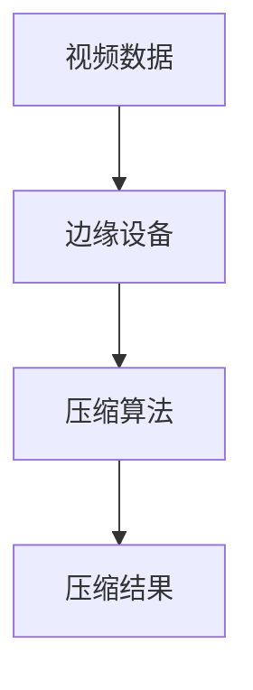
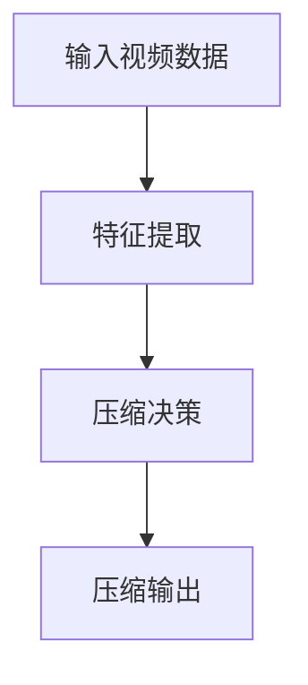
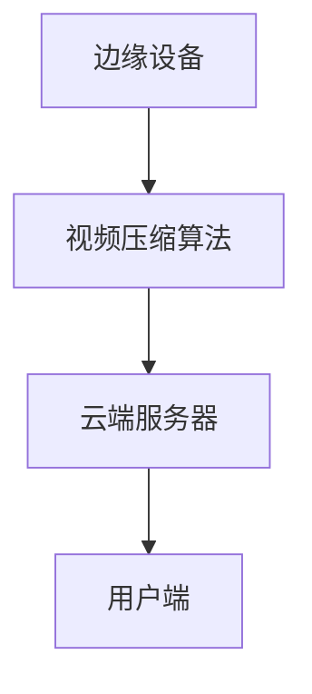
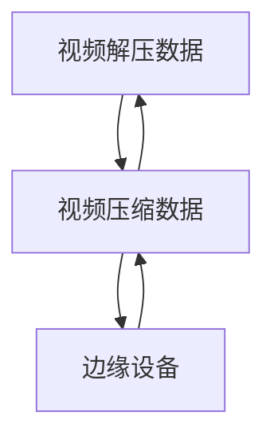

                 


# 如何识别企业的边缘AI视频压缩技术优势

## 关键词：边缘AI，视频压缩，深度学习，边缘计算，企业技术优势

## 摘要：本文将详细探讨如何识别企业的边缘AI视频压缩技术优势，涵盖技术背景、核心概念、算法原理、系统架构、项目实战以及总结。通过分析边缘AI视频压缩的优势，为企业在视频压缩技术上的应用提供有价值的见解。

---

### 第1章: 边缘AI视频压缩技术的背景与重要性

#### 1.1 边缘AI与视频压缩的背景介绍
- 1.1.1 边缘计算的概念与特点
  - 边缘计算的定义：在数据生成的地方进行实时处理，减少延迟和带宽消耗。
  - 边缘计算的特点：分布式、实时性、本地化处理、高效性。
- 1.1.2 视频压缩技术的定义与作用
  - 视频压缩的定义：通过算法减少视频数据的体积，同时保持视频质量。
  - 视频压缩的作用：节省存储空间、降低传输成本、提高传输效率。
- 1.1.3 边缘AI视频压缩技术的背景与重要性
  - 随着视频数据的快速增长，传统的中心化视频压缩技术面临带宽和延迟的挑战。
  - 边缘AI视频压缩技术的优势：实时性、低延迟、高效率、节省带宽。

#### 1.2 企业视频压缩技术的现状与挑战
- 1.2.1 传统视频压缩技术的局限性
  - 传统视频压缩技术的中心化处理：延迟高、带宽消耗大。
  - 传统压缩算法的效率问题：压缩率有限，难以满足实时性需求。
- 1.2.2 边缘计算在视频压缩中的优势
  - 边缘计算的实时性：减少延迟，提高响应速度。
  - 边缘计算的带宽优化：减少数据传输量，降低带宽成本。
- 1.2.3 企业视频压缩技术的痛点与需求
  - 企业视频数据的快速增长：对实时性和带宽的需求增加。
  - 传统视频压缩技术的局限性：无法满足企业对高效、实时的压缩需求。
  - 边缘AI视频压缩技术的需求：解决传统技术的痛点，提升企业竞争力。

#### 1.3 边缘AI视频压缩技术的核心优势
- 1.3.1 边缘AI视频压缩的技术特点
  - 深度学习算法的应用：利用神经网络进行视频压缩，提高压缩率和质量。
  - 边缘计算的本地化处理：实时压缩，减少延迟和带宽消耗。
  - AI驱动的自适应压缩：根据视频内容动态调整压缩策略，优化压缩效果。
- 1.3.2 边缘AI视频压缩的优势与应用场景
  - 优势：实时性、高效性、低延迟、节省带宽。
  - 应用场景：实时视频监控、视频会议、远程医疗、自动驾驶等领域。
- 1.3.3 边缘AI视频压缩对企业竞争力的提升作用
  - 提高视频处理效率，降低运营成本。
  - 增强用户体验，提升企业品牌形象。
  - 推动企业数字化转型，提升核心竞争力。

#### 1.4 本章小结
- 本章详细介绍了边缘AI视频压缩技术的背景、重要性以及核心优势，为后续章节的分析奠定了基础。

---

### 第2章: 边缘AI视频压缩技术的核心概念与联系

#### 2.1 边缘AI视频压缩的核心原理
- 2.1.1 边缘AI视频压缩的基本原理
  - 利用深度学习算法对视频数据进行压缩，减少数据体积。
  - 通过边缘计算实现本地化压缩，降低延迟和带宽消耗。
- 2.1.2 深度学习在视频压缩中的应用
  - 神经网络模型：卷积神经网络（CNN）、自注意力机制（Transformer）。
  - 深度学习的优势：非线性特征提取、自适应压缩策略。
- 2.1.3 边缘AI视频压缩的算法特点
  - 基于深度学习的压缩算法：更高效、更智能。
  - 边缘计算的本地化处理：实时性、低延迟。

#### 2.2 视频压缩技术的关键属性对比
- 2.2.1 不同视频压缩算法的性能对比
  - 传统压缩算法：MPEG、H.264、H.265。
  - 基于深度学习的压缩算法：更快的压缩速度、更高的压缩率。
- 2.2.2 边缘AI视频压缩与其他压缩技术的对比
  - 中心化压缩与边缘压缩：延迟、带宽消耗的对比。
  - 传统压缩与深度学习压缩：压缩率、实时性的对比。
- 2.2.3 边缘AI视频压缩的压缩率与质量对比
  - 压缩率：边缘AI视频压缩的压缩率更高，同时保持视频质量。
  - 视频质量：边缘AI视频压缩能够更好地平衡压缩率与视频质量。

#### 2.3 边缘AI视频压缩的ER实体关系图


#### 2.4 本章小结
- 本章详细讲解了边缘AI视频压缩的核心原理，对比了不同压缩技术的优缺点，并通过ER实体关系图展示了技术的核心要素。

---

### 第3章: 边缘AI视频压缩技术的算法原理

#### 3.1 边缘AI视频压缩算法的概述
- 3.1.1 基于深度学习的视频压缩算法
  - 神经网络模型：卷积神经网络（CNN）用于空间特征提取，自注意力机制用于时间特征提取。
  - 深度学习压缩算法的优势：非线性特征提取、自适应压缩策略。
- 3.1.2 边缘计算环境下的算法优化
  - 算法的轻量化设计：减少计算复杂度，适应边缘设备的硬件限制。
  - 算法的实时性优化：减少处理时间，提升压缩效率。

#### 3.2 基于深度学习的视频压缩算法实现
- 3.2.1 算法流程图

- 3.2.2 Python实现代码示例
```python
import torch
import torch.nn as nn

class VideoCompressor(nn.Module):
    def __init__(self):
        super(VideoCompressor, self).__init__()
        self cnn = nn.Sequential(
            nn.Conv2d(3, 64, kernel_size=3, stride=2, padding=1),
            nn.ReLU(),
            nn.Conv2d(64, 128, kernel_size=3, stride=2, padding=1),
            nn.ReLU()
        )
        self.attention = nn.Sequential(
            nn.Conv2d(128, 64, kernel_size=3, padding=1),
            nn.ReLU(),
            nn.Conv2d(64, 64, kernel_size=3, padding=1),
            nn.Sigmoid()
        )
    
    def forward(self, x):
        features = self.cnn(x)
        attention = self.attention(features)
        compressed = features * attention
        return compressed

# 初始化模型
model = VideoCompressor()
# 定义损失函数和优化器
criterion = nn.MSELoss()
optimizer = torch.optim.Adam(model.parameters(), lr=0.001)

# 训练循环
for epoch in range(100):
    for batch in dataloader:
        inputs, labels = batch
        outputs = model(inputs)
        loss = criterion(outputs, labels)
        optimizer.zero_grad()
        loss.backward()
        optimizer.step()
```

- 3.2.3 算法的数学模型与公式
  - 特征提取：通过卷积操作提取视频的空间和时间特征。
  - 压缩决策：基于自注意力机制，动态调整压缩策略。
  - 压缩输出：通过乘法操作，将特征与注意力权重相乘，得到最终的压缩结果。

#### 3.3 算法的优化与改进
- 3.3.1 算法优化策略
  - 网络结构优化：减少网络层数，降低计算复杂度。
  - 参数优化：调整学习率、批量大小等超参数，提升算法性能。
- 3.3.2 算法的改进方向
  - 提高压缩率：引入更高效的压缩算法，如基于变换域的压缩。
  - 提升视频质量：优化自注意力机制，增强对视频内容的理解。

#### 3.4 本章小结
- 本章详细讲解了基于深度学习的视频压缩算法，通过代码示例和数学公式展示了算法的实现过程，并提出了优化与改进的方向。

---

### 第4章: 边缘AI视频压缩技术的系统架构与实现

#### 4.1 边缘AI视频压缩系统的概述
- 4.1.1 系统架构设计
  - 边缘设备：负责视频数据的采集和压缩。
  - 云端服务器：负责视频数据的存储和管理。
  - 用户端：负责视频数据的解压和播放。
- 4.1.2 系统功能设计
  - 视频采集：通过摄像头或其他传感器获取视频数据。
  - 视频压缩：在边缘设备上实时压缩视频数据。
  - 视频传输：将压缩后的视频数据传输到云端或用户端。
  - 视频解压：在用户端解压视频数据，进行播放或进一步处理。

#### 4.2 系统架构图


#### 4.3 系统接口设计
- 4.3.1 边缘设备与云端服务器的接口
  - 输入接口：视频数据输入。
  - 输出接口：压缩后的视频数据输出。
- 4.3.2 云端服务器与用户端的接口
  - 输入接口：压缩后的视频数据。
  - 输出接口：解压后的视频数据。

#### 4.4 系统交互图


#### 4.5 本章小结
- 本章详细讲解了边缘AI视频压缩系统的架构设计、接口设计和系统交互流程，为后续章节的项目实战奠定了基础。

---

### 第5章: 边缘AI视频压缩技术的项目实战

#### 5.1 项目环境与工具安装
- 5.1.1 开发环境搭建
  - 操作系统：Linux/Windows/macOS。
  - 开发工具：PyCharm/VS Code。
  - 依赖库安装：安装PyTorch、OpenCV、numpy等库。
- 5.1.2 项目代码安装
  - 安装必要的Python包：pip install torch numpy cv2.

#### 5.2 项目核心代码实现
- 5.2.1 视频压缩算法实现
  - 代码实现：基于深度学习的视频压缩算法。
  - 代码解读：详细解释代码的功能和实现逻辑。
- 5.2.2 系统架构实现
  - 代码实现：边缘设备与云端服务器的交互。
  - 代码解读：详细解释系统架构的设计和实现。

#### 5.3 项目案例分析与实际应用
- 5.3.1 实际案例分析
  - 应用场景：实时视频监控、视频会议等。
  - 数据集选择：使用公开视频数据集进行训练和测试。
- 5.3.2 实际应用中的问题与解决方案
  - 问题：边缘设备的计算资源有限，如何优化算法？
  - 解决方案：轻量化设计、硬件加速等。

#### 5.4 项目小结
- 本章通过实际项目案例，展示了边缘AI视频压缩技术的实现过程，包括环境搭建、代码实现和实际应用。

---

### 第6章: 边缘AI视频压缩技术的最佳实践与总结

#### 6.1 边缘AI视频压缩技术的最佳实践
- 6.1.1 算法优化技巧
  - 网络结构优化：减少计算复杂度，提升压缩效率。
  - 参数调整：合理调整学习率、批量大小等超参数。
- 6.1.2 系统设计优化
  - 硬件优化：利用边缘设备的硬件加速功能。
  - 软件优化：优化代码性能，提升处理速度。

#### 6.2 边缘AI视频压缩技术的总结与展望
- 6.2.1 本章总结
  - 边缘AI视频压缩技术的优势：实时性、低延迟、高效性。
  - 技术的局限性：计算资源限制、算法优化空间等。
- 6.2.2 未来展望
  - 更高效的压缩算法：如基于变换域的压缩、更先进的深度学习模型。
  - 更广泛的应用场景：边缘AI视频压缩技术在更多领域的应用。

#### 6.3 注意事项与未来挑战
- 6.3.1 注意事项
  - 算法优化：在边缘设备上实现高效的视频压缩算法。
  - 系统设计：合理设计系统架构，确保系统的稳定性和高效性。
- 6.3.2 未来挑战
  - 算法效率：如何在边缘设备上实现更高效的压缩算法？
  - 硬件限制：如何在资源受限的环境中优化算法性能？

#### 6.4 本章小结
- 本章总结了边缘AI视频压缩技术的最佳实践，并展望了未来的发展方向，为读者提供了宝贵的参考。

---

### 作者：AI天才研究院/AI Genius Institute & 禅与计算机程序设计艺术 /Zen And The Art of Computer Programming

---

# 如何识别企业的边缘AI视频压缩技术优势

