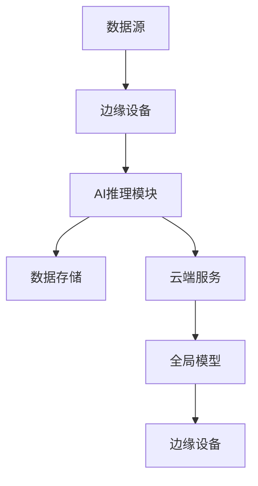

                 


# 如何识别企业的边缘AI计算优势

## 关键词：边缘计算, AI, 企业优势, 系统架构, 项目实战

## 摘要：  
边缘AI计算是一种将人工智能技术应用于数据生成源头的创新技术，通过在边缘设备上直接进行数据处理和决策，减少了数据传输的延迟和带宽消耗，提升了企业的实时响应能力和数据安全性。本文将从边缘AI计算的核心概念、算法原理、系统架构设计、项目实战等方面，详细分析如何识别和利用企业的边缘AI计算优势。

---

# 第1章: 边缘AI计算的背景与概念

## 1.1 边缘AI计算的定义与背景

### 1.1.1 边缘计算的定义
边缘计算是一种分布式计算范式，将数据处理和计算能力从云端转移到数据生成的源头，如物联网设备、边缘服务器等。通过这种方式，边缘计算能够实现低延迟、高实时性的数据处理。

### 1.1.2 边缘AI计算的核心概念
边缘AI计算是边缘计算与人工智能技术的结合，通过在边缘设备上部署AI算法，实现数据的实时分析、决策和反馈。这种模式能够显著提升企业的数据处理效率和响应速度。

### 1.1.3 边缘AI计算与云计算的对比
边缘AI计算与传统的云计算模式有显著区别：
- **计算位置**：边缘计算将数据处理转移到靠近数据源的位置，而云计算依赖于中心化的数据中心。
- **延迟**：边缘计算能够实现低延迟，而云计算由于数据传输距离较长，延迟较高。
- **带宽利用率**：边缘计算通过在本地处理数据，减少了对带宽的需求，而云计算则需要大量的数据传输。

## 1.2 边缘AI计算的背景与现状

### 1.2.1 传统AI计算的局限性
传统的AI计算依赖于中心化的云计算模式，存在以下问题：
- 数据传输延迟高，影响实时性。
- 高昂的带宽成本，尤其在数据量大的场景下。
- 数据隐私和安全风险，中心化模式容易成为攻击目标。

### 1.2.2 边缘AI计算的兴起
随着物联网技术的快速发展，边缘设备的数量急剧增加，对实时性和数据处理能力提出了更高的要求。边缘AI计算应运而生，成为解决这些问题的理想方案。

### 1.2.3 当前边缘AI计算的应用现状
目前，边缘AI计算已经在多个领域得到了广泛应用，如智能制造、智慧城市、智能交通等。这些场景对实时性和数据处理能力有较高要求，边缘AI计算的优势得以充分发挥。

## 1.3 边缘AI计算对企业的影响

### 1.3.1 边缘AI计算对企业效率的提升
通过在边缘设备上部署AI算法，企业能够实现数据的实时分析和决策，显著提升业务效率。

### 1.3.2 边缘AI计算对企业成本的优化
边缘AI计算通过减少数据传输量和带宽消耗，降低了企业的运营成本。

### 1.3.3 边缘AI计算对企业竞争力的增强
边缘AI计算能够实现更快速的响应和更精准的决策，增强了企业的市场竞争力。

---

# 第2章: 边缘AI计算的核心概念与原理

## 2.1 边缘AI计算的特征

### 2.1.1 分布式计算
边缘AI计算通过分布式架构，将计算任务分散到多个边缘设备上，实现了资源的高效利用。

### 2.1.2 低延迟
边缘AI计算将数据处理转移到靠近数据源的位置，显著降低了数据传输的延迟。

### 2.1.3 高实时性
边缘AI计算能够实现数据的实时处理和反馈，适用于需要快速响应的场景。

## 2.2 边缘AI计算的优势

### 2.2.1 网络延迟优化
通过在边缘设备上进行数据处理，边缘AI计算显著减少了数据传输的延迟，提升了实时性。

### 2.2.2 数据隐私保护
边缘AI计算将数据处理转移到边缘设备上，减少了数据在传输过程中被截获和泄露的风险，提升了数据隐私和安全性。

### 2.2.3 资源利用率提升
边缘AI计算通过分布式架构，充分利用了边缘设备的计算资源，避免了资源浪费。

## 2.3 边缘AI计算的挑战

### 2.3.1 网络不稳定问题
边缘设备通常部署在复杂的网络环境中，网络不稳定可能导致数据传输中断或延迟，影响边缘AI计算的性能。

### 2.3.2 设备计算能力限制
边缘设备的计算能力有限，难以支持复杂的AI算法，限制了边缘AI计算的应用范围。

### 2.3.3 数据同步与管理问题
边缘设备上的数据需要与云端或其他边缘设备进行同步和管理，增加了数据一致性和同步性的难度。

---

## 2.4 边缘AI计算的核心原理

### 2.4.1 分布式计算算法
分布式计算算法是边缘AI计算的核心，通过将计算任务分配到多个边缘设备上，实现资源的高效利用。

#### 2.4.1.1 分布式计算流程
1. 数据生成：边缘设备采集数据。
2. 数据处理：边缘设备对数据进行预处理和特征提取。
3. 数据传输：将处理后的数据传输到云端或其他边缘设备。
4. 数据分析：云端或集中式设备对数据进行分析和建模。
5. 模型部署：将训练好的模型部署到边缘设备上。
6. 实时推理：边缘设备基于模型进行实时推理和决策。

### 2.4.2 边缘推理优化
边缘推理优化是通过优化AI模型和算法，提升边缘设备的推理效率和准确性。

#### 2.4.2.1 模型压缩与优化
- **模型压缩**：通过剪枝、量化等技术，减小模型的体积，降低计算复杂度。
- **模型优化**：通过对模型结构进行调整，提升推理效率和准确性。

#### 2.4.2.2 硬件加速
- **GPU加速**：利用边缘设备上的GPU进行并行计算，提升推理速度。
- **专用硬件**：使用如TPU（张量处理单元）等专用硬件加速AI推理。

### 2.4.3 联邦学习
联邦学习是一种分布式机器学习技术，通过在边缘设备上联合训练模型，保护数据隐私，提升模型泛化能力。

#### 2.4.3.1 联邦学习流程
1. 数据准备：各边缘设备准备本地数据。
2. 模型初始化：各边缘设备下载初始模型。
3. 模型训练：各边缘设备在本地数据上训练模型，生成更新参数。
4. 参数聚合：将各边缘设备的更新参数上传到云端或协调节点，进行参数聚合。
5. 模型更新：生成新的全局模型，分发给各边缘设备。

---

## 2.5 边缘AI计算的数学模型与公式

### 2.5.1 分布式计算模型
分布式计算模型可以表示为：
$$
f(x) = f_1(x) \oplus f_2(x) \oplus \cdots \oplus f_n(x)
$$
其中，$f_i(x)$ 表示第 $i$ 个边缘设备上的计算任务，$\oplus$ 表示任务的组合操作。

### 2.5.2 联邦学习模型
联邦学习的模型更新过程可以表示为：
$$
\theta_{new} = \theta_{old} + \sum_{i=1}^{n} \lambda_i (\theta_i - \theta_{old})
$$
其中，$\theta_{new}$ 表示更新后的模型参数，$\theta_{old}$ 表示旧的模型参数，$\lambda_i$ 表示第 $i$ 个边缘设备的权重。

---

## 2.6 边缘AI计算的系统架构设计

### 2.6.1 分层架构
边缘AI计算的分层架构包括以下层次：
1. **感知层**：数据采集和初步处理。
2. **计算层**：数据处理和AI推理。
3. **网络层**：数据传输和通信。
4. **应用层**：业务逻辑和用户交互。

### 2.6.2 模块化设计
边缘AI计算的系统架构可以通过模块化设计实现：
- 数据采集模块：负责数据的采集和预处理。
- AI推理模块：负责数据的分析和决策。
- 通信模块：负责与云端或其他边缘设备的数据传输。
- 管理模块：负责系统的配置和监控。

---

## 2.7 边缘AI计算的系统架构图



---

## 2.8 边缘AI计算的系统交互设计

```mermaid
sequenceDiagram
    participant 边缘设备
    participant 云端服务
    participant 用户
    edge = per stage
    边缘设备 -> 用户: 数据采集
    用户 -> 边缘设备: 请求处理
    边缘设备 -> 云端服务: 获取模型
    云端服务 -> 边缘设备: 返回结果
    边缘设备 -> 用户: 显示结果
```

---

# 第3章: 边缘AI计算的系统架构与设计

## 3.1 边缘AI计算的系统架构

### 3.1.1 分层架构设计
边缘AI计算的系统架构可以分为以下层次：
1. **数据层**：数据的采集、存储和管理。
2. **计算层**：数据的处理和AI推理。
3. **网络层**：数据的传输和通信。
4. **应用层**：业务逻辑和用户交互。

### 3.1.2 模块化设计
系统可以通过模块化设计实现各部分的功能独立性和可扩展性。

---

## 3.2 边缘AI计算的系统架构图


---

## 3.3 边缘AI计算的系统功能设计

### 3.3.1 数据采集与处理
- 数据采集：通过传感器或其他数据源采集数据。
- 数据预处理：对数据进行清洗、归一化等处理，确保数据质量。

### 3.3.2 AI推理与分析
- 数据分析：对数据进行特征提取、模式识别等分析。
- AI推理：基于训练好的模型进行实时推理和决策。

### 3.3.3 数据存储与管理
- 数据存储：将处理后的数据存储在本地或云端。
- 数据管理：对数据进行备份、恢复和归档管理。

### 3.3.4 系统监控与维护
- 系统监控：实时监控系统运行状态，发现异常及时告警。
- 系统维护：定期维护系统，确保设备和模型的正常运行。

---

## 3.4 边缘AI计算的系统架构设计

### 3.4.1 分布式架构设计
- 分布式计算：将计算任务分配到多个边缘设备上，实现资源的高效利用。
- 分布式存储：将数据分散存储在多个设备上，提升数据冗余性和可靠性。

### 3.4.2 高可用性设计
- 容错设计：通过冗余设计，确保单点故障不影响系统整体运行。
- 自动恢复：系统能够自动检测和恢复设备或服务故障。

---

## 3.5 边缘AI计算的系统接口设计

### 3.5.1 API接口设计
- 数据接口：定义数据的输入输出格式和接口调用方式。
- 模型接口：定义模型的训练、部署和推理接口。

### 3.5.2 通信协议设计
- 传输协议：选择适合的通信协议，如HTTP、MQTT等。
- 数据格式：定义数据的序列化格式，如JSON、Protobuf等。

---

## 3.6 边缘AI计算的系统交互设计

### 3.6.1 用户交互设计
- 用户界面：设计直观的用户界面，方便用户操作。
- 交互流程：定义用户与系统之间的交互流程，提升用户体验。

### 3.6.2 系统间交互设计
- 边缘设备与云端交互：定义边缘设备与云端服务之间的交互流程。
- 边缘设备之间交互：定义边缘设备之间的数据同步和任务协同。

---

## 3.7 边缘AI计算的系统交互图

```mermaid
sequenceDiagram
    participant 边缘设备
    participant 云端服务
    participant 用户
    edge = per stage
    边缘设备 -> 用户: 数据采集
    用户 -> 边缘设备: 请求处理
    边缘设备 -> 云端服务: 获取模型
    云端服务 -> 边缘设备: 返回结果
    边缘设备 -> 用户: 显示结果
```

---

## 4. 项目实战

### 4.1 项目背景与目标
- **项目背景**：智能制造中的设备预测性维护。
- **项目目标**：通过边缘AI计算，实现设备状态的实时监控和预测性维护。

### 4.2 项目环境与工具
- **硬件环境**：边缘设备（如树莓派）、传感器。
- **软件环境**：Linux操作系统、Python编程语言。
- **工具**：TensorFlow框架、Kubernetes容器编排。

### 4.3 项目核心代码实现

#### 4.3.1 数据采集与预处理
```python
import numpy as np
import pandas as pd

# 数据采集
data = pd.DataFrame({
    'timestamp': pd.date_range(start='2023-01-01', periods=100),
    'sensor_value': np.random.rand(100) * 100
})

# 数据预处理
data['is_anomaly'] = 0
data.loc[data['sensor_value'] > 95, 'is_anomaly'] = 1
```

#### 4.3.2 AI模型训练与部署
```python
import tensorflow as tf
from tensorflow.keras import layers

# 模型训练
model = tf.keras.Sequential([
    layers.Dense(64, activation='relu'),
    layers.Dense(1, activation='sigmoid')
])

model.compile(optimizer='adam', loss='binary_crossentropy', metrics=['accuracy'])
model.fit(X_train, y_train, epochs=10, batch_size=32)

# 模型部署
model.save('edge_model.h5')
```

#### 4.3.3 边缘设备上的实时推理
```python
import tensorflow as tf
import numpy as np

# 加载模型
model = tf.keras.models.load_model('edge_model.h5')

# 实时推理
def predict_anomaly(sensor_value):
    input = np.array([sensor_value]).reshape(1, 1)
    prediction = model.predict(input)
    return prediction[0][0]

# 示例调用
print(predict_anomaly(90))  # 输出：0.1
print(predict_anomaly(95))  # 输出：0.8
```

---

## 4.4 项目案例分析与小结

### 4.4.1 项目案例分析
通过在智能制造中的应用，边缘AI计算实现了设备状态的实时监控和预测性维护，显著降低了设备故障率，提升了生产效率。

### 4.4.2 项目小结
边缘AI计算在项目中的应用，验证了其在实时性和数据处理能力上的优势，为企业识别和利用边缘AI计算优势提供了宝贵的经验。

---

## 5. 总结与展望

### 5.1 总结
边缘AI计算通过将AI技术应用于边缘设备，显著提升了企业的数据处理效率和实时响应能力。其优势在于低延迟、高实时性和数据隐私保护，为企业在智能制造、智慧城市等领域提供了新的发展机遇。

### 5.2 展望
随着5G、物联网等技术的快速发展，边缘AI计算的应用前景将更加广阔。未来，边缘AI计算将在更多领域得到广泛应用，为企业创造更大的价值。

---

## 作者信息

作者：AI天才研究院/AI Genius Institute & 禅与计算机程序设计艺术/Zen And The Art of Computer Programming

---

以上是《如何识别企业的边缘AI计算优势》的技术博客文章的完整大纲和部分内容。希望对您有所帮助！

