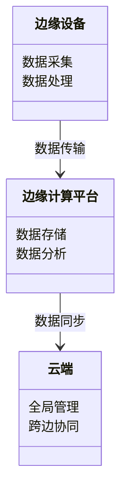
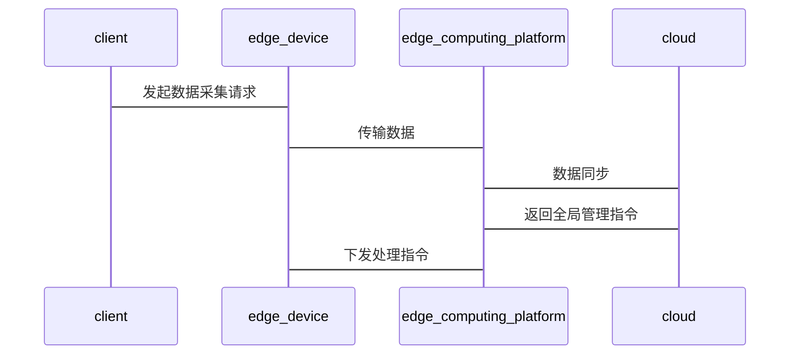

                 


---

# 如何识别企业的边缘计算5G优化优势

> **关键词**：边缘计算、5G优化、企业优势、技术博客、系统架构

> **摘要**：边缘计算和5G技术的结合为企业带来了巨大的优化优势。本文从边缘计算与5G优化的核心概念入手，分析其算法原理、系统架构，并通过实际案例展示如何识别和利用这些优势。文章详细探讨了边缘计算与5G优化的协同关系，为企业在数字化转型中提供理论支持和实践指导。

---

# 第1章: 边缘计算与5G优化背景介绍

## 1.1 边缘计算的基本概念

### 1.1.1 边缘计算的定义

边缘计算是一种分布式计算范式，将数据处理和存储功能从云端转移到靠近数据源的边缘设备。通过这种方式，边缘计算能够减少数据传输延迟，提高实时性。

$$\text{边缘计算} = \text{分布式计算} + \text{边缘设备数据处理}$$

### 1.1.2 边缘计算的核心特征

- **低延迟**：数据处理在边缘设备完成，减少数据传输到云端的时间。
- **高带宽**：边缘设备能够处理大量数据，减少对云端的依赖。
- **本地化**：数据在生成地进行处理，避免长距离传输。

### 1.1.3 边缘计算与云计算的对比

| **对比维度** | **边缘计算** | **云计算** |
|--------------|--------------|------------|
| 数据处理位置 | 边缘设备     | 云端       |
| 延迟          | 低           | 较高       |
| 带宽利用率    | 高           | 较低       |

## 1.2 5G技术的基本原理

### 1.2.1 5G网络的构成

5G网络由核心网、基站、用户设备和各种接口组成，支持高速数据传输和低延迟通信。

$$\text{5G网络} = \text{核心网} + \text{基站} + \text{用户设备}$$

### 1.2.2 5G的关键技术

- **网络切片**：将5G网络划分为多个虚拟网络，满足不同业务需求。
- **大规模MIMO**：通过多输入多输出技术，提高网络容量和覆盖范围。
- **网络功能虚拟化（NFV）**：将网络功能虚拟化，提高灵活性和可扩展性。

### 1.2.3 5G与企业业务的结合

5G技术能够支持企业的智能制造、物联网、虚拟现实等应用场景，为企业提供高速、低延迟的网络支持。

## 1.3 企业边缘计算5G优化的背景与趋势

### 1.3.1 数字化转型的驱动

企业数字化转型需要高效的数据处理能力，边缘计算和5G优化能够满足这一需求。

### 1.3.2 5G与边缘计算的融合发展

5G的高速和低延迟特性为边缘计算提供了理想的技术支持，两者结合能够实现更高效的业务优化。

### 1.3.3 企业边缘计算5G优化的现状与挑战

尽管边缘计算和5G优化在企业中得到了广泛应用，但仍面临技术复杂性和成本高等挑战。

---

# 第2章: 边缘计算与5G优化的核心概念与联系

## 2.1 边缘计算的架构分析

### 2.1.1 边缘计算的分层架构

边缘计算的架构通常分为设备层、边缘层和云端层。

$$\text{边缘计算架构} = \text{设备层} + \text{边缘层} + \text{云端层}$$

### 2.1.2 边缘计算的核心组件

- **边缘设备**：数据采集和初步处理的设备。
- **边缘计算平台**：提供数据处理、存储和分析的平台。
- **云端**：提供全局数据管理和分析支持。

### 2.1.3 边缘计算的资源分配机制

边缘计算需要根据业务需求动态分配计算资源，确保高效运行。

## 2.2 5G网络的优化机制

### 2.2.1 5G网络切片技术

网络切片将5G网络划分为多个虚拟网络，满足不同业务需求。

$$\text{网络切片} = \text{虚拟网络} + \text{业务隔离}$$

### 2.2.2 5G的低时延与高带宽特性

5G的低时延和高带宽特性使其成为边缘计算的理想选择。

### 2.2.3 5G的网络功能虚拟化（NFV）

NFV通过虚拟化技术提高5G网络的灵活性和可扩展性。

## 2.3 边缘计算与5G优化的协同关系

### 2.3.1 边缘计算与5G网络的协同架构

边缘计算与5G网络的协同架构包括数据采集、传输、处理和反馈四个环节。

### 2.3.2 边缘计算如何优化5G网络性能

边缘计算通过减少数据传输量和提高数据处理效率，优化5G网络性能。

### 2.3.3 5G如何支持边缘计算的高效运行

5G的高速和低延迟特性为边缘计算提供了理想的技术支持。

## 2.4 核心概念对比与联系

### 2.4.1 边缘计算与5G优化的对比分析

| **对比维度** | **边缘计算** | **5G优化** |
|--------------|--------------|------------|
| 核心目标     | 数据处理     | 网络优化   |
| 关键技术     | 分布式计算   | 切片、低时延 |

### 2.4.2 边缘计算与5G优化的协同效应

边缘计算与5G优化的协同效应体现在数据处理效率和网络性能的提升。

### 2.4.3 边缘计算与5G优化的未来发展趋势

未来，边缘计算与5G优化将更加深度融合，推动企业数字化转型。

---

# 第3章: 边缘计算与5G优化的算法原理

## 3.1 边缘计算的算法原理

### 3.1.1 边缘计算中的数据处理算法

边缘计算中的数据处理算法包括数据清洗、特征提取和模型训练。

$$\text{数据处理算法} = \text{数据清洗} + \text{特征提取} + \text{模型训练}$$

### 3.1.2 边缘计算中的任务调度算法

任务调度算法需要根据资源情况动态分配任务。

$$\text{任务调度算法} = \text{资源分配} + \text{任务队列管理}$$

### 3.1.3 边缘计算中的资源分配算法

资源分配算法需要考虑计算能力、网络带宽和延迟等因素。

## 3.2 边缘计算算法的优化策略

### 3.2.1 算法优化的目标

算法优化的目标是提高处理效率和准确性。

### 3.2.2 基于5G的算法优化方法

基于5G的算法优化方法包括减少数据传输量和提高数据处理速度。

### 3.2.3 算法优化的性能评估

性能评估包括处理时间、准确率和资源利用率等指标。

## 3.3 5G网络优化的算法实现

### 3.3.1 5G网络切片的算法实现

网络切片的算法实现包括虚拟网络划分和资源分配。

### 3.3.2 5G网络的低时延优化算法

低时延优化算法通过减少数据传输路径和优化网络调度实现。

### 3.3.3 5G网络的高带宽优化算法

高带宽优化算法通过提高数据传输速率和优化数据压缩算法实现。

## 3.4 边缘计算与5G优化算法的协同设计

### 3.4.1 边缘计算与5G优化算法的协同架构

协同架构包括数据采集、传输、处理和反馈四个环节。

### 3.4.2 边缘计算与5G优化算法的协同实现

协同实现需要考虑数据同步、资源分配和算法协同等问题。

### 3.4.3 边缘计算与5G优化算法的协同效果评估

协同效果评估包括处理效率、准确率和资源利用率等指标。

---

# 第4章: 边缘计算与5G优化的系统分析与架构设计

## 4.1 问题场景介绍

### 4.1.1 企业边缘计算5G优化的核心问题

核心问题是如何在边缘设备上高效处理数据，同时优化5G网络性能。

### 4.1.2 企业边缘计算5G优化的典型场景

典型场景包括智能制造、智慧城市和远程医疗等。

### 4.1.3 企业边缘计算5G优化的挑战与机遇

挑战包括技术复杂性和成本高，机遇包括高效数据处理和优化网络性能。

## 4.2 系统功能设计

### 4.2.1 领域模型mermaid类图



### 4.2.2 系统架构设计mermaid架构图


### 4.2.3 系统接口设计

- **数据采集接口**：边缘设备采集数据并传输到边缘计算平台。
- **数据处理接口**：边缘计算平台对数据进行处理和分析。
- **数据同步接口**：边缘计算平台与云端进行数据同步和全局管理。

### 4.2.4 系统交互mermaid序列图



---

# 第5章: 边缘计算与5G优化的项目实战

## 5.1 环境安装

### 5.1.1 系统环境要求

- 操作系统：Linux或Windows
- 网络环境：支持5G网络的环境
- 边缘计算平台：如Kubernetes、FogFlow等

### 5.1.2 依赖安装

安装必要的软件包和工具，如Python、Docker、Kubernetes等。

## 5.2 系统核心实现源代码

### 5.2.1 边缘计算平台代码实现

```python
# 边缘计算平台代码示例
class EdgeComputingPlatform:
    def __init__(self):
        self.devices = []
        self.data = []

    def add_device(self, device):
        self.devices.append(device)

    def process_data(self, data):
        # 数据处理逻辑
        pass

    def synchronize_with_cloud(self):
        # 数据同步逻辑
        pass
```

### 5.2.2 5G网络优化代码实现

```python
# 5G网络优化代码示例
class FiveGOptimizer:
    def __init__(self):
        self.network_slices = []
        self.devices = []

    def allocate_slice(self, device):
        # 网络切片分配逻辑
        pass

    def optimize_latency(self):
        # 优化时延逻辑
        pass
```

## 5.3 代码应用解读与分析

### 5.3.1 边缘计算平台代码解读

边缘计算平台代码实现了设备管理、数据处理和数据同步功能，能够支持边缘计算的高效运行。

### 5.3.2 5G网络优化代码解读

5G网络优化代码实现了网络切片分配和时延优化功能，能够支持5G网络的高效运行。

## 5.4 实际案例分析

### 5.4.1 智能制造案例

在智能制造场景中，边缘计算平台负责采集和处理设备数据，5G网络负责数据的高速传输和优化。

### 5.4.2 智慧城市案例

在智慧城市场景中，边缘计算平台负责处理城市传感器数据，5G网络负责数据的高速传输和优化。

## 5.5 项目小结

通过实际案例分析，展示了边缘计算与5G优化在企业中的应用价值和优势。

---

# 第6章: 边缘计算与5G优化的最佳实践与小结

## 6.1 关键点总结

- 边缘计算与5G优化的协同关系是实现企业高效数据处理和网络优化的关键。
- 系统架构设计和算法优化是实现边缘计算与5G优化的重要保障。

## 6.2 最佳实践 tips

- 在实施边缘计算与5G优化时，需要综合考虑数据处理效率、网络性能和系统可扩展性。
- 系统设计需要结合企业的实际需求，选择合适的边缘计算平台和5G优化方案。

## 6.3 注意事项

- 边缘计算与5G优化的实施需要专业的技术支持。
- 数据安全和隐私保护是需要重点关注的问题。

## 6.4 拓展阅读

- 推荐阅读《边缘计算：架构与应用》和《5G网络优化技术》等书籍。

---

# 作者

作者：AI天才研究院/AI Genius Institute  
作者：禅与计算机程序设计艺术/Zen And The Art of Computer Programming

