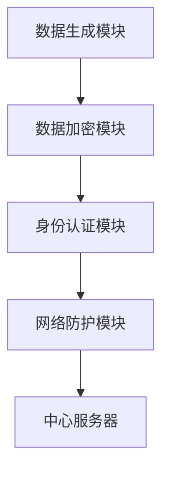

                 


# 如何识别企业的边缘计算安全优势

> **关键词**：边缘计算，企业安全，安全优势，算法原理，系统架构，项目实战  
>
> **摘要**：本文从边缘计算的基本概念出发，详细分析了企业在采用边缘计算时可能面临的安全问题，并探讨了如何识别和利用边缘计算的安全优势。通过具体的算法实现和系统设计案例，深入剖析了边缘计算的安全机制和实际应用场景，为企业在边缘计算领域的安全优势识别提供了理论支持和实践指导。

---

## 第1章: 背景介绍

### 1.1 边缘计算的基本概念

#### 1.1.1 边缘计算的定义与特点
边缘计算是一种分布式计算范式，将数据处理和存储从传统的中心化云端转移至靠近数据源的边缘设备。其特点包括：

- **分布式架构**：数据在生成地点附近进行处理，减少数据传输延迟。
- **实时性**：边缘计算能够快速响应本地事件，适用于实时性要求高的场景。
- **带宽优化**：通过在边缘处理数据，减少对中心服务器的依赖，降低网络带宽消耗。
- **隐私保护**：边缘计算可以对数据进行局部处理，减少敏感数据的传输和存储。

#### 1.1.2 边缘计算在企业中的应用背景
随着物联网、5G和人工智能技术的发展，企业逐渐将计算资源从中心服务器迁移到靠近数据源的边缘设备。这种趋势推动了边缘计算的广泛应用，尤其是在智能制造、智慧城市和自动驾驶等领域。

#### 1.1.3 边缘计算与云计算的区别与联系
- **区别**：
  - 计算位置：边缘计算在靠近数据源的地方进行，而云计算集中在中心服务器。
  - 延迟：边缘计算通常延迟更低，云计算延迟较高。
  - 数据量：边缘计算处理的数据量较小，云计算处理的数据量较大。
- **联系**：
  - 边缘计算可以作为云计算的补充，将部分数据处理任务分担到边缘设备。
  - 云计算可以作为边缘计算的后端支持，提供数据存储和分析服务。

### 1.2 边缘计算的安全问题

#### 1.2.1 边缘计算的安全挑战
边缘计算的安全问题主要集中在以下几个方面：
- **数据隐私**：边缘设备处理的数据可能包含敏感信息，容易被恶意攻击。
- **设备安全**：边缘设备可能面临物理或逻辑攻击，导致数据泄露或服务中断。
- **网络攻击**：边缘设备与中心服务器之间的通信可能成为网络攻击的目标。
- **资源限制**：边缘设备通常资源有限，难以部署复杂的安全防护措施。

#### 1.2.2 边缘计算中的潜在威胁
- **恶意软件攻击**：攻击者可能通过恶意软件控制边缘设备，窃取数据或破坏服务。
- **数据篡改**：攻击者可能篡改边缘设备中的数据，导致错误的决策。
- **拒绝服务攻击（DoS）**：攻击者可能通过大量请求耗尽边缘设备的资源，导致服务中断。

#### 1.2.3 安全问题对企业的影响
- **数据泄露**：可能导致企业核心数据被泄露，影响企业声誉和经济利益。
- **服务中断**：边缘设备的安全问题可能导致业务中断，影响用户体验。
- **合规性风险**：数据隐私法规（如GDPR）要求企业保护数据安全，边缘计算的安全问题可能违反相关法规，导致法律风险。

### 1.3 企业边缘计算安全优势的重要性

#### 1.3.1 识别安全优势的核心意义
识别边缘计算的安全优势可以帮助企业：
- **降低安全风险**：通过识别和利用安全优势，企业可以有效应对边缘计算中的潜在威胁。
- **提升业务连续性**：通过增强边缘设备的安全性，企业可以确保业务的稳定运行。
- **合规性**：通过满足数据隐私法规要求，企业可以避免法律风险。

#### 1.3.2 安全优势对业务的影响
- **竞争优势**：通过利用边缘计算的安全优势，企业可以在市场竞争中占据优势。
- **成本优化**：通过减少数据传输和存储成本，企业可以降低运营成本。
- **创新**：通过利用边缘计算的安全优势，企业可以开发新的业务模式和创新解决方案。

#### 1.3.3 如何衡量安全优势的价值
衡量安全优势的价值可以从以下几个方面入手：
- **安全性**：通过安全评估和测试，衡量边缘设备的安全防护能力。
- **性能**：通过性能测试，衡量边缘设备在安全防护下的处理能力。
- **成本**：通过成本分析，衡量安全防护措施的经济性。

---

## 第2章: 边缘计算安全的核心机制

### 2.1 边缘计算的安全机制

#### 2.1.1 数据加密与完整性保障
数据加密是边缘计算中重要的安全机制之一。通过加密技术，可以保护数据在传输和存储过程中的机密性和完整性。常用的加密算法包括：

- **对称加密**：如AES算法，适用于数据量大、加密速度快的场景。
- **非对称加密**：如RSA算法，适用于数据签名和身份认证的场景。

#### 2.1.2 身份认证与访问控制
身份认证是边缘计算中的另一个重要安全机制。通过身份认证，可以确保只有授权的用户或设备才能访问边缘设备。常用的认证方式包括：

- **本地认证**：在边缘设备上进行身份认证，适用于小型网络。
- **集中认证**：通过中心服务器进行身份认证，适用于大型网络。

访问控制则是通过权限管理，限制用户或设备对边缘设备的访问权限。常用的访问控制策略包括：

- **基于角色的访问控制（RBAC）**：根据用户角色分配权限。
- **基于属性的访问控制（ABAC）**：根据用户属性和上下文分配权限。

#### 2.1.3 边缘节点的安全防护
边缘节点的安全防护是边缘计算中的另一个重要环节。通过部署安全软件和硬件，可以有效保护边缘设备免受网络攻击和物理攻击。常用的防护措施包括：

- **防火墙**：用于过滤恶意流量。
- **入侵检测系统（IDS）**：用于检测网络攻击行为。
- **加密通信**：通过加密技术保护边缘设备与中心服务器之间的通信。

### 2.2 安全优势的关键特征

#### 2.2.1 数据隐私保护
通过数据加密和访问控制，边缘计算可以有效保护数据隐私。例如，在智能制造场景中，边缘设备可以对生产数据进行加密处理，确保数据在传输过程中不被窃取。

#### 2.2.2 网络通信安全
通过加密通信和身份认证，边缘计算可以确保网络通信的安全性。例如，在智慧城市场景中，边缘设备可以通过HTTPS协议与中心服务器进行通信，防止数据被篡改或窃取。

#### 2.2.3 边缘计算的容错能力
边缘计算的分布式架构可以提高系统的容错能力。通过在多个边缘设备上部署相同的服务，可以在某个设备出现故障时，由其他设备继续提供服务。

---

## 第3章: 边缘计算安全的核心原理

### 3.1 边缘计算的安全模型

#### 3.1.1 边缘计算的安全架构
边缘计算的安全架构通常包括以下几个部分：
- **数据源**：生成数据的设备。
- **边缘设备**：对数据进行处理和存储的设备。
- **中心服务器**：对边缘设备进行管理和协调的服务器。
- **网络**：连接边缘设备和中心服务器的网络。

#### 3.1.2 安全模型的数学表达
在数学上，边缘计算的安全模型可以表示为一个三元组（S, A, P），其中：
- S是安全状态集合。
- A是攻击者行为集合。
- P是防护策略集合。

#### 3.1.3 安全模型的实现方式
安全模型的实现方式包括：
- **基于规则的实现**：通过预定义的安全规则进行防护。
- **基于学习的实现**：通过机器学习算法动态调整防护策略。

### 3.2 边缘计算安全机制的对比分析

#### 3.2.1 不同安全机制的优缺点
以下是几种常见安全机制的对比：

| 安全机制       | 优点                             | 缺点                               |
|----------------|----------------------------------|------------------------------------|
| 数据加密       | 保护数据隐私                     | 加密计算消耗资源                   |
| 身份认证       | 确保合法访问                     | 易受密码攻击                       |
| 防火墙         | 过滤恶意流量                     | 配置复杂                           |

#### 3.2.2 安全机制的对比表格
以下是几种常见安全机制的对比表格：

| 安全机制       | 数据加密 | 身份认证 | 防火墙   |
|----------------|----------|----------|----------|
| 数据隐私保护   | ✔        |          |          |
| 网络防护能力   |          |          | ✔        |
| 配置复杂度     |          |          | 高        |

#### 3.2.3 实体关系图（ER图）分析
以下是边缘计算安全机制的实体关系图：

```mermaid
erd
    节点
    网络
    中心服务器
    数据
    加密算法
    身份认证
    防火墙
    网络攻击
```

---

## 第4章: 边缘计算安全算法的实现

### 4.1 基于区块链的边缘计算安全算法

#### 4.1.1 算法原理介绍
基于区块链的边缘计算安全算法通过将数据加密和身份认证结合，实现数据的安全传输和存储。以下是算法的步骤：

1. **数据加密**：边缘设备对生成的数据进行加密。
2. **身份认证**：边缘设备通过区块链进行身份认证。
3. **数据传输**：加密数据通过安全通道传输到中心服务器。
4. **数据存储**：中心服务器对加密数据进行存储。
5. **数据解密**：需要时，中心服务器对数据进行解密。

#### 4.1.2 算法实现步骤
以下是算法实现的Python代码：

```python
import hashlib

def encrypt_data(data):
    # 数据加密
    return hashlib.sha256(data.encode()).hexdigest()

def decrypt_data(hashed_data):
    # 数据解密
    return hashed_data

# 示例数据
data = "hello world"
encrypted_data = encrypt_data(data)
print("加密后的数据:", encrypted_data)

# 解密数据
decrypted_data = decrypt_data(encrypted_data)
print("解密后的数据:", decrypted_data)
```

#### 4.1.3 算法的数学模型与公式
算法的数学模型可以表示为：

$$
\text{加密} = f(\text{数据})
$$

$$
\text{解密} = f^{-1}(\text{加密数据})
$$

---

## 第5章: 边缘计算安全系统的分析与设计

### 5.1 问题场景介绍

#### 5.1.1 边缘计算安全问题的典型场景
以下是边缘计算安全问题的典型场景：

- **智能制造**：边缘设备处理生产数据，容易受到网络攻击。
- **智慧城市**：边缘设备处理交通数据，可能面临物理攻击。
- **自动驾驶**：边缘设备处理车辆数据，需要高安全性。

#### 5.1.2 问题场景的描述与分析
以智能制造为例，边缘设备需要处理生产数据，防止数据被篡改或窃取。

#### 5.1.3 问题场景的解决方案
通过数据加密和身份认证，确保生产数据的安全性。

### 5.2 系统功能设计

#### 5.2.1 系统功能模块划分
系统功能模块包括：
- **数据加密模块**：对数据进行加密处理。
- **身份认证模块**：对用户或设备进行身份认证。
- **网络防护模块**：通过防火墙等技术保护网络通信。

#### 5.2.2 功能模块的交互流程
以下是功能模块的交互流程：

1. 数据生成模块生成数据。
2. 数据加密模块对数据进行加密。
3. 身份认证模块对用户进行认证。
4. 网络防护模块保护数据传输。

### 5.3 系统架构设计

#### 5.3.1 系统架构的总体设计
以下是系统架构的总体设计：



#### 5.3.2 系统架构的详细设计
以下是系统架构的详细设计：


#### 5.3.3 系统架构的实现方式
系统架构的实现方式包括：
- **数据加密**：通过AES算法对数据进行加密。
- **身份认证**：通过RSA算法对用户进行身份认证。
- **网络防护**：通过防火墙过滤恶意流量。

---

## 第6章: 边缘计算安全优势识别的实战

### 6.1 项目环境安装与配置

#### 6.1.1 边缘计算框架的安装
以下是边缘计算框架的安装步骤：

1. 安装Python环境。
2. 安装边缘计算框架（如Kubernetes）。

#### 6.1.2 安全工具的安装
以下是安全工具的安装步骤：

1. 安装防火墙工具（如iptables）。
2. 安装入侵检测系统（如Suricata）。

### 6.2 核心代码实现

#### 6.2.1 核心算法实现代码
以下是核心算法的Python代码：

```python
import hashlib

def encrypt_data(data):
    return hashlib.sha256(data.encode()).hexdigest()

def decrypt_data(hashed_data):
    return hashed_data

# 示例数据
data = "hello world"
encrypted_data = encrypt_data(data)
print("加密后的数据:", encrypted_data)

# 解密数据
decrypted_data = decrypt_data(encrypted_data)
print("解密后的数据:", decrypted_data)
```

#### 6.2.2 代码的功能解读与分析
- **encrypt_data函数**：对输入数据进行哈希加密。
- **decrypt_data函数**：对加密数据进行解密。

### 6.3 项目实战案例分析

#### 6.3.1 实际案例分析
以智能制造为例，边缘设备需要对生产数据进行加密处理。

#### 6.3.2 详细讲解与剖析
通过代码实现数据加密和解密，确保生产数据的安全性。

---

## 第7章: 最佳实践与总结

### 7.1 最佳实践 tips

#### 7.1.1 安全策略
- 定期更新密码和安全策略。
- 部署多层防护措施。

#### 7.1.2 技术选型
- 选择合适的加密算法和身份认证方案。

#### 7.1.3 合规性
- 确保数据处理符合相关法规要求。

### 7.2 小结
通过本文的分析与实践，我们可以看到边缘计算的安全优势识别对企业的重要性。通过合理的安全机制和算法实现，可以有效提升边缘计算的安全性，为企业创造更大的价值。

### 7.3 注意事项
- 定期进行安全测试和漏洞扫描。
- 加强员工的安全意识培训。

### 7.4 拓展阅读
- **参考文献**：
  - 《边缘计算：架构与安全》
  - 《区块链与边缘计算的结合应用》
- **推荐阅读**：
  - 探讨边缘计算在5G时代的应用前景。
  - 研究边缘计算在人工智能中的应用。

---

**作者：AI天才研究院/AI Genius Institute & 禅与计算机程序设计艺术 /Zen And The Art of Computer Programming**

