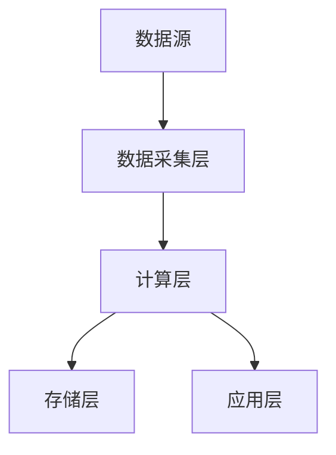

                 


# 如何识别企业的边缘计算实时数据分析优势

> 关键词：边缘计算、实时数据分析、企业应用、系统架构、算法原理、项目实战

> 摘要：边缘计算作为一种分布式计算范式，正在迅速改变企业实时数据分析的方式。本文将深入探讨边缘计算的核心概念、实时数据分析的算法原理、系统架构设计以及实际项目中的应用，帮助读者识别和理解企业在边缘计算实时数据分析中的优势。

---

## 第一部分：边缘计算与实时数据分析的背景介绍

### 第1章：边缘计算与实时数据分析的概述

#### 1.1 边缘计算的定义与特点
边缘计算是一种分布式计算范式，将数据处理和计算能力从云端转移到数据产生的边缘节点。其特点包括：

- **分布式架构**：数据在边缘节点直接处理，减少对云端的依赖。
- **低延迟**：边缘计算能够快速响应，适用于实时性要求高的场景。
- **高效性**：通过本地处理，降低数据传输的带宽消耗。
- **安全性**：数据在边缘处理，减少数据在传输过程中被截获的风险。

#### 1.2 实时数据分析的重要性
实时数据分析是指对数据流进行即时处理和分析，以快速做出决策。其重要性体现在：

- **快速响应**：实时数据分析能够立即处理数据，提供即时反馈。
- **数据完整性**：通过边缘计算，确保数据在生成时就被处理，避免数据丢失或损坏。
- **应用场景广泛**：适用于工业物联网、智慧城市、实时监控等领域。

#### 1.3 企业边缘计算的背景与趋势
随着企业数字化转型的推进，边缘计算在企业中的应用越来越广泛。以下是边缘计算在企业中的发展趋势：

- **数据量增长**：企业产生的数据量急剧增加，边缘计算能够有效处理这些数据。
- **实时性需求**：企业需要实时监控和决策，边缘计算能够满足这一需求。
- **安全性要求**：边缘计算通过本地处理数据，提高了数据安全性。

---

## 第二部分：边缘计算与实时数据分析的核心概念与联系

### 第2章：边缘计算与实时数据分析的核心原理

#### 2.1 边缘计算的核心原理
边缘计算的核心原理在于将计算能力推向数据源，减少数据传输的距离和时间。其主要步骤包括：

- **数据采集**：通过传感器或设备收集数据。
- **数据处理**：在边缘节点对数据进行预处理，去除噪声或冗余信息。
- **数据分析**：使用算法对数据进行实时分析，提取有用信息。
- **反馈与行动**：根据分析结果采取相应的行动或反馈给系统。

#### 2.2 实时数据分析的原理
实时数据分析的原理是基于流数据处理，其主要步骤包括：

- **数据流采集**：持续从边缘节点获取数据流。
- **数据流处理**：使用流处理引擎对数据进行实时处理。
- **实时计算**：对数据流进行实时计算，生成结果。
- **结果反馈**：将结果反馈给系统或用户，指导下一步操作。

#### 2.3 边缘计算与实时数据分析的结合
边缘计算与实时数据分析的结合使得数据处理更加高效和实时。其优势体现在：

- **低延迟**：边缘计算减少了数据传输的距离，提高了处理速度。
- **高效性**：通过本地处理数据，降低了云端的负载压力。
- **实时反馈**：实时数据分析能够快速做出决策，提升企业反应速度。

---

## 第三部分：边缘计算实时数据分析的算法原理

### 第3章：边缘计算实时数据分析的算法原理

#### 3.1 边缘计算中的实时数据分析算法
边缘计算中的实时数据分析算法主要包括：

- **流数据处理算法**：用于处理持续不断的数据流，如滑动窗口算法。
- **分布式计算算法**：用于在分布式系统中进行数据处理，如MapReduce。
- **实时预测算法**：用于基于实时数据进行预测，如时间序列分析。

#### 3.2 算法实现步骤
以下是边缘计算中实时数据分析算法的实现步骤：

1. **数据采集**：通过传感器或设备采集实时数据。
2. **数据预处理**：对数据进行清洗和转换，确保数据质量。
3. **数据流处理**：使用流处理引擎对数据流进行实时处理。
4. **数据分析**：对数据进行分析，生成有用的信息。
5. **结果反馈**：将分析结果反馈给系统或用户，指导下一步操作。

#### 3.3 算法实现的数学模型
以下是边缘计算中实时数据分析算法的数学模型：

$$
\text{实时数据分析} = \text{数据流处理} + \text{实时计算} + \text{结果反馈}
$$

---

## 第四部分：边缘计算实时数据分析的系统架构设计

### 第4章：边缘计算实时数据分析的系统架构设计

#### 4.1 系统架构设计概述
边缘计算实时数据分析的系统架构设计主要包括以下几个部分：

- **数据采集层**：负责数据的采集和预处理。
- **计算层**：负责数据的实时处理和分析。
- **存储层**：负责数据的存储和管理。
- **应用层**：负责数据的应用和展示。

#### 4.2 系统架构图
以下是边缘计算实时数据分析系统的架构图：



#### 4.3 系统功能设计
以下是系统功能设计的详细说明：

- **数据采集层**：负责从传感器或设备中采集数据，并进行初步处理。
- **计算层**：负责对数据进行实时处理和分析，生成有用的信息。
- **存储层**：负责存储数据和分析结果，以便后续查询和分析。
- **应用层**：负责展示分析结果，并根据结果做出相应的决策。

---

## 第五部分：边缘计算实时数据分析的项目实战

### 第5章：边缘计算实时数据分析的项目实战

#### 5.1 项目背景介绍
本项目旨在通过边缘计算技术实现对工业设备的实时监控和数据分析。通过部署边缘计算节点，实时采集设备运行数据，并对数据进行分析，及时发现设备故障。

#### 5.2 系统设计
以下是系统的详细设计：

- **数据采集层**：通过传感器采集设备运行数据。
- **计算层**：使用边缘计算节点对数据进行实时处理和分析。
- **存储层**：将数据和分析结果存储在本地数据库中。
- **应用层**：通过可视化界面展示设备运行状态和分析结果。

#### 5.3 核心代码实现
以下是核心代码实现：

```python
import time

def collect_data():
    # 模拟数据采集
    return {"temperature": 30, "pressure": 100}

def process_data(data):
    # 数据处理逻辑
    return data

def analyze_data(data):
    # 数据分析逻辑
    return {"status": "normal"}

def main():
    while True:
        data = collect_data()
        processed_data = process_data(data)
        result = analyze_data(processed_data)
        print(result)
        time.sleep(1)

if __name__ == "__main__":
    main()
```

#### 5.4 项目小结
通过本项目，我们可以看到边缘计算在实时数据分析中的巨大优势。通过边缘计算，我们可以实时采集和处理数据，快速做出决策，提升企业的运营效率。

---

## 第六部分：边缘计算实时数据分析的最佳实践

### 第6章：边缘计算实时数据分析的最佳实践

#### 6.1 关键点总结
在边缘计算实时数据分析中，以下几点需要特别注意：

- **数据质量**：确保数据的准确性和完整性。
- **系统可扩展性**：设计灵活的系统架构，便于扩展。
- **安全性**：确保数据的安全性，防止数据泄露。

#### 6.2 注意事项
在实际应用中，需要注意以下几点：

- **数据同步**：确保边缘节点和云端数据同步。
- **异常处理**：设计完善的异常处理机制，防止系统崩溃。
- **性能优化**：通过优化算法和系统架构，提升处理效率。

#### 6.3 拓展阅读
以下是一些拓展阅读资料，供读者参考：

- [边缘计算入门指南](https://example.com/edge-computing-guide)
- [实时数据分析技术](https://example.com/real-time-data-analysis)

---

## 第七部分：小结

### 7.1 总结
通过本文的介绍，我们了解了边缘计算实时数据分析的核心概念、算法原理、系统架构设计以及项目实战。边缘计算在实时数据分析中的应用为企业带来了诸多优势，如低延迟、高效性、实时反馈等。

### 7.2 未来展望
随着技术的不断发展，边缘计算在实时数据分析中的应用将更加广泛。未来，我们可以期待更多的创新和突破，为企业带来更多价值。

---

## 作者信息

作者：AI天才研究院/AI Genius Institute & 禅与计算机程序设计艺术 /Zen And The Art of Computer Programming

---

通过以上内容，我们希望读者能够全面理解边缘计算实时数据分析的优势，并能够在实际应用中灵活运用这些知识，提升企业的数据分析能力。

