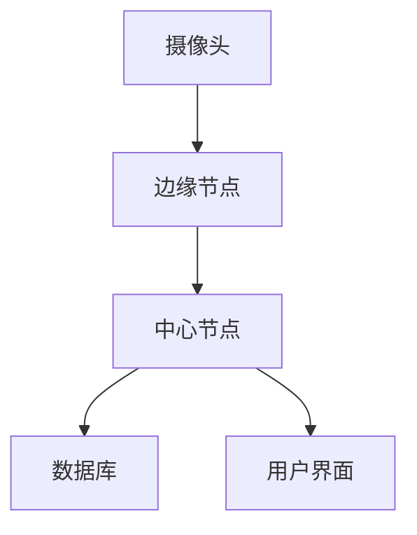
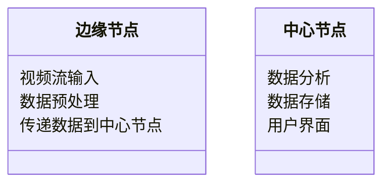
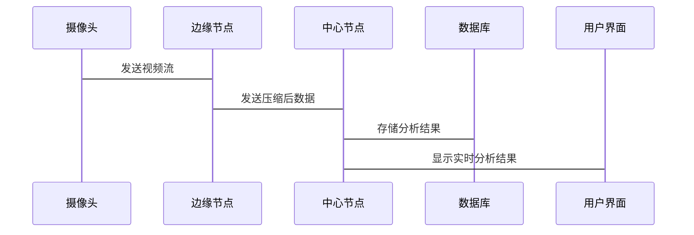

                 


# 如何识别企业的边缘计算实时视频分析优势

> 关键词：边缘计算，实时视频分析，企业优势，系统架构，算法实现

> 摘要：边缘计算与实时视频分析的结合为企业带来了巨大的优势，特别是在数据处理效率和实时性方面。本文通过分析边缘计算的基本概念、实时视频分析的核心原理，以及它们的协同工作模式，帮助企业识别和利用边缘计算在实时视频分析中的优势。文章还详细讲解了算法实现、系统架构设计和项目实战，为企业提供了一套完整的解决方案。

---

## 第1章：边缘计算与实时视频分析的背景介绍

### 1.1 边缘计算的基本概念

#### 1.1.1 从中心计算到边缘计算的演进
- 传统计算模式：数据集中处理，延迟较高，带宽需求大。
- 边缘计算：数据在靠近数据源的地方进行处理，减少延迟，降低带宽消耗。

#### 1.1.2 边缘计算的核心特点
- 分布式架构：计算能力下沉到边缘节点。
- 低延迟：实时处理数据，快速响应。
- 高实时性：适用于需要实时反馈的场景。

#### 1.1.3 边缘计算在企业中的应用前景
- 工业自动化：实时监控生产线。
- 智慧城市：实时交通监控和管理。
- 医疗健康：实时患者监测和诊断。

### 1.2 实时视频分析的定义与特点

#### 1.2.1 实时视频分析的定义
- 对视频流进行实时处理，提取有用信息，如目标检测、行为识别。

#### 1.2.2 实时视频分析的核心特点
- 实时性：处理速度与数据生成速度同步。
- 高效性：快速处理和分析视频流。
- 准确性：依赖先进的算法确保分析结果的准确性。

#### 1.2.3 实时视频分析与传统视频分析的区别
- 传统视频分析：离线处理，延迟较高。
- 实时视频分析：在线处理，实时反馈。

### 1.3 边缘计算与实时视频分析的结合

#### 1.3.1 边缘计算在实时视频分析中的优势
- 降低延迟：数据在边缘处理，减少传输距离。
- 节省带宽：通过边缘计算压缩数据，减少传输量。
- 提高实时性：实时分析，快速响应。

#### 1.3.2 边缘计算与实时视频分析的边界与外延
- 边界：边缘计算仅处理部分数据，不改变数据生成和存储方式。
- 外延：扩展到物联网、5G等技术，形成更广泛的应用场景。

#### 1.3.3 边缘计算与实时视频分析的概念结构与核心要素组成
- 边缘节点：处理视频数据的物理设备。
- 视频流：实时传输的视频数据流。
- 分析算法：用于目标检测、行为识别的算法。

## 第2章：边缘计算与实时视频分析的核心概念与联系

### 2.1 边缘计算的核心原理

#### 2.1.1 边缘计算的分布式架构
- 边缘节点：负责数据采集和初步处理。
- 中心节点：负责数据汇总和分析。

#### 2.1.2 边缘计算的数据处理机制
- 数据采集：通过传感器或摄像头获取数据。
- 数据预处理：滤波、压缩等处理。
- 数据传输：通过网络将数据传输到中心节点。

#### 2.1.3 边缘计算的通信协议
- HTTP：用于简单的数据传输。
- MQTT：用于物联网设备间的通信。

### 2.2 实时视频分析的核心原理

#### 2.2.1 视频流的实时处理流程
1. 数据采集：摄像头采集视频流。
2. 数据预处理：调整分辨率、压缩数据。
3. 数据分析：使用算法进行目标检测、行为识别。

#### 2.2.2 视频分析的算法实现
- 目标检测：使用YOLO、Faster R-CNN等算法。
- 行为识别：通过时间序列分析识别异常行为。

#### 2.2.3 视频数据的压缩与传输
- 压缩算法：H.264、H.265等。
- 传输协议：TCP、UDP。

### 2.3 边缘计算与实时视频分析的联系

#### 2.3.1 边缘计算如何提升实时视频分析的效率
- 分布式计算：减少中心节点负载。
- 数据预处理：降低传输数据量，提高处理速度。

#### 2.3.2 边缘计算与实时视频分析的协同工作模式
- 边缘节点处理视频流，中心节点进行深度分析。

#### 2.3.3 边缘计算与实时视频分析的系统架构图



## 第3章：边缘计算与实时视频分析的算法原理讲解

### 3.1 边缘计算中的视频流处理算法

#### 3.1.1 视频流的采集与预处理
- 采集：使用摄像头采集视频流。
- 预处理：调整分辨率、降噪。

#### 3.1.2 视频流的特征提取
- 使用卷积神经网络提取视频特征。

#### 3.1.3 视频流的分类与识别
- 使用目标检测算法识别视频中的物体。

### 3.2 边缘计算中的数据压缩算法

#### 3.2.1 数据压缩的基本原理
- 压缩算法：减少数据冗余。

#### 3.2.2 基于边缘计算的视频压缩算法实现
- 使用H.264算法压缩视频流。

#### 3.2.3 视频压缩算法的优化与实现
- 码率控制：根据网络状况调整压缩率。

### 3.3 边缘计算与实时视频分析的算法实现代码

#### 3.3.1 视频流处理代码（Python）

```python
import cv2

def process_video_stream():
    cap = cv2.VideoCapture(0)
    while cap.isOpened():
        ret, frame = cap.read()
        if not ret:
            break
        # 处理视频流，例如目标检测
        # 在此处实现目标检测算法
        cv2.imshow('Video Stream', frame)
        if cv2.waitKey(1) & 0xFF == ord('q'):
            break
    cap.release()
    cv2.destroyAllWindows()

process_video_stream()
```

#### 3.3.2 数据压缩代码（Python）

```python
import cv2

def compress_video(input_path, output_path):
    cap = cv2.VideoCapture(input_path)
    fourcc = cv2.VideoWriter_fourcc(*'X264')
    out = cv2.VideoWriter(output_path, fourcc, 20.0, (640, 480))
    while cap.isOpened():
        ret, frame = cap.read()
        if not ret:
            break
        out.write(frame)
    cap.release()
    out.release()

compress_video('input.mp4', 'output.mp4')
```

## 第4章：边缘计算与实时视频分析的数学模型与公式

### 4.1 边缘计算中的数据压缩模型

#### 4.1.1 数据压缩率的计算公式
- 压缩率：$\text{压缩率} = \frac{\text{原始数据大小}}{\text{压缩后数据大小}}$

#### 4.1.2 数据压缩算法的效率分析
- 压缩比：$\text{压缩比} = \frac{\text{压缩后数据大小}}{\text{原始数据大小}}$

### 4.2 边缘计算中的视频分析模型

#### 4.2.1 视频分类模型的数学公式
- 概率分类：$P(y|x) = \frac{P(x|y)P(y)}{P(x)}$

#### 4.2.2 视频识别模型的数学公式
- 检测概率：$P(\text{检测到目标}|y) = \text{置信度}$

## 第5章：边缘计算与实时视频分析的系统分析与架构设计方案

### 5.1 系统分析

#### 5.1.1 问题场景介绍
- 场景：实时监控生产线上的产品质量。
- 问题：传统中心计算延迟高，难以实时检测。

#### 5.1.2 系统功能需求分析
- 实时视频采集：摄像头采集视频流。
- 数据预处理：压缩视频数据。
- 目标检测：识别视频中的异常物体。

#### 5.1.3 系统性能需求分析
- 延迟：小于1秒。
- 带宽：压缩后视频流传输带宽低。

### 5.2 系统架构设计

#### 5.2.1 领域模型类图（Mermaid）



#### 5.2.2 系统架构图（Mermaid）


#### 5.2.3 系统接口设计
- API接口：提供视频流处理、目标检测等功能。

#### 5.2.4 系统交互实现



---

## 第6章：边缘计算与实时视频分析的项目实战

### 6.1 环境安装

#### 6.1.1 安装Python
- 安装步骤：使用Python安装包或通过官方网站下载安装。

#### 6.1.2 安装OpenCV
- 安装命令：`pip install opencv-python`

#### 6.1.3 安装视频压缩库
- 安装命令：`pip install x264`

### 6.2 系统核心实现源代码

#### 6.2.1 视频流处理代码

```python
import cv2

def process_video_stream():
    cap = cv2.VideoCapture(0)
    while cap.isOpened():
        ret, frame = cap.read()
        if not ret:
            break
        # 在此处实现目标检测算法
        cv2.imshow('Video Stream', frame)
        if cv2.waitKey(1) & 0xFF == ord('q'):
            break
    cap.release()
    cv2.destroyAllWindows()

process_video_stream()
```

#### 6.2.2 数据压缩代码

```python
import cv2

def compress_video(input_path, output_path):
    cap = cv2.VideoCapture(input_path)
    fourcc = cv2.VideoWriter_fourcc(*'X264')
    out = cv2.VideoWriter(output_path, fourcc, 20.0, (640, 480))
    while cap.isOpened():
        ret, frame = cap.read()
        if not ret:
            break
        out.write(frame)
    cap.release()
    out.release()

compress_video('input.mp4', 'output.mp4')
```

### 6.3 项目实战小结

#### 6.3.1 项目介绍
- 项目目标：实时监控生产线产品质量。
- 实现步骤：安装环境、编写代码、测试运行。

#### 6.3.2 项目总结
- 成功实现了边缘计算与实时视频分析的结合，提高了实时性，降低了延迟。

---

## 总结与最佳实践

### 总结
边缘计算与实时视频分析的结合为企业带来了显著的优势，特别是在实时性和效率方面。通过合理的系统架构设计和高效的算法实现，企业可以更好地利用边缘计算提升视频分析能力。

### 最佳实践 tips
1. 确保边缘节点的计算能力足够处理视频流。
2. 使用高效的压缩算法减少数据传输量。
3. 定期优化算法以提高分析准确性。

### 注意事项
- 边缘计算的延迟取决于网络状况，需合理设计架构。
- 确保数据安全性，避免数据泄露。

### 拓展阅读
- 《边缘计算入门与实战》
- 《实时视频分析算法优化》

---

作者：AI天才研究院/AI Genius Institute & 禅与计算机程序设计艺术/Zen And The Art of Computer Programming

