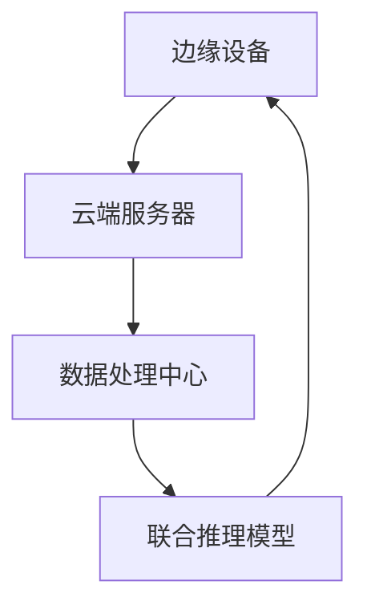
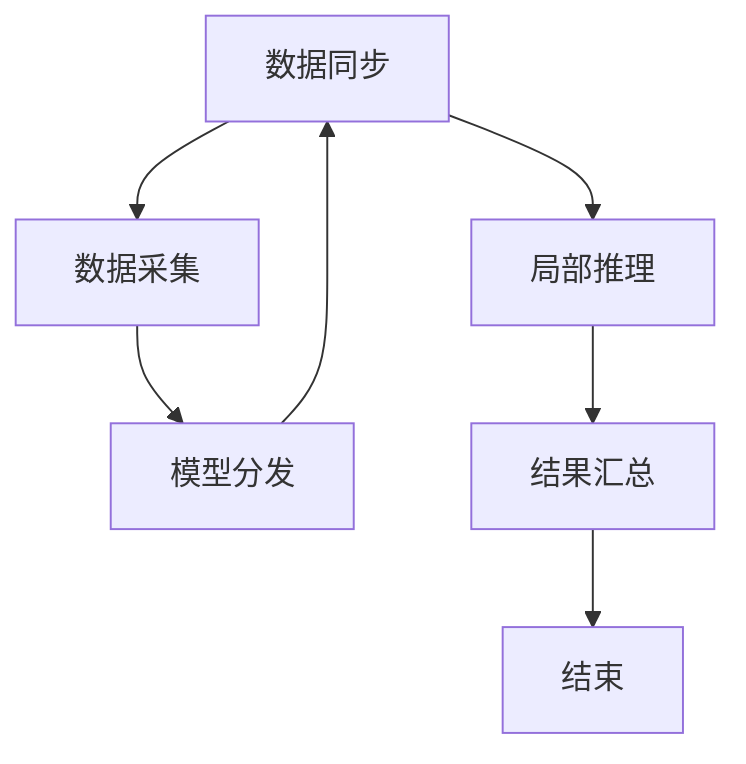
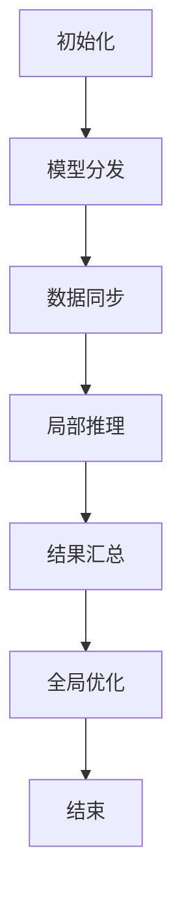
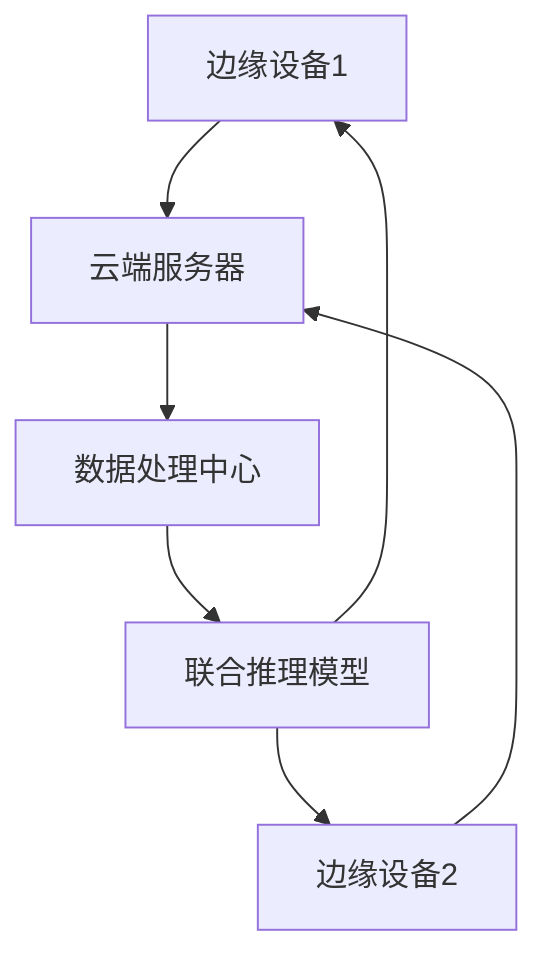

                 


# 如何识别企业的边缘计算联合推理优势

> 关键词：边缘计算，联合推理，企业优势，分布式计算，AI推理

> 摘要：边缘计算联合推理是一种结合边缘计算和联合推理的技术，通过分布式计算和数据协同，为企业提供高效、智能的解决方案。本文将从边缘计算的基本概念、联合推理的核心原理、系统架构设计、项目实战以及最佳实践等方面，详细分析如何识别和利用企业的边缘计算联合推理优势。

---

## 第一部分：边缘计算联合推理的背景与概念

### 第1章：边缘计算与联合推理概述

#### 1.1 边缘计算的基本概念

边缘计算是指将计算能力从云端扩展到网络的边缘，即靠近数据源的地方进行数据处理和计算的技术。与传统的云计算模式不同，边缘计算强调分布式计算和本地化处理，能够减少数据传输的延迟，提高实时性和响应速度。

- **边缘计算的特点**：
  - 分布式架构：计算资源分布在靠近数据源的边缘设备上。
  - 低延迟：数据在边缘处理，减少数据传输到云端的时间。
  - 高实时性：适用于需要快速响应的场景，如工业自动化、智能交通等。
  - 灵活性：可以根据实际需求动态调整计算资源。

- **边缘计算的优势**：
  - 提高数据处理效率：减少数据传输的距离和时间。
  - 降低带宽消耗：通过在边缘处理数据，减少需要传输到云端的数据量。
  - 增强隐私保护：在边缘处理敏感数据，减少数据泄露的风险。

#### 1.2 联合推理的概念与特点

联合推理是指多个边缘设备协同工作，共同完成一个推理任务的技术。它结合了分布式计算和人工智能推理的优势，能够在多设备之间共享计算资源，实现更高效的推理过程。

- **联合推理的核心要素**：
  - 分布式模型：推理模型分布在多个边缘设备上，每个设备负责部分推理任务。
  - 数据协同：边缘设备之间的数据需要同步和共享，以保证推理的准确性和一致性。
  - 协作机制：设备之间需要通过某种协议或算法实现协同推理。

- **联合推理与边缘计算的结合**：
  - 通过边缘计算的分布式架构，实现联合推理的多设备协同。
  - 利用边缘设备的计算能力，提升联合推理的效率和性能。

#### 1.3 边缘计算联合推理的背景与意义

随着企业数字化转型的推进，边缘计算和人工智能技术的应用越来越广泛。边缘计算联合推理能够为企业提供以下优势：

- **提升计算效率**：通过分布式计算和协同推理，充分利用边缘设备的计算资源，提高整体计算效率。
- **降低运营成本**：减少对云端资源的依赖，降低数据传输和存储的成本。
- **增强业务灵活性**：边缘计算联合推理可以根据业务需求动态调整计算资源，适应不同的业务场景。

### 第2章：边缘计算联合推理的核心概念与联系

#### 2.1 边缘计算联合推理的核心原理

边缘计算联合推理的核心原理在于分布式计算和协同推理。以下是其实现的关键步骤：

- **模型分发**：将推理模型分发到多个边缘设备上，每个设备负责一部分推理任务。
- **数据同步**：边缘设备之间需要同步数据和模型参数，确保推理的一致性和准确性。
- **局部推理**：每个边缘设备在本地进行推理计算，生成中间结果。
- **结果汇总**：将各设备的推理结果汇总到云端或中央服务器，进行最终的推理结果输出。

#### 2.2 边缘计算联合推理的实体关系图

以下是边缘计算联合推理的实体关系图，展示了各实体之间的关系：



图中，边缘设备通过云端服务器与数据处理中心连接，数据处理中心负责管理和分发联合推理模型，边缘设备则根据模型进行推理计算。

#### 2.3 边缘计算联合推理的流程图

以下是边缘计算联合推理的流程图，展示了整个推理过程的步骤：



流程图中，从数据采集开始，经过模型分发、数据同步、局部推理、结果汇总，最终完成推理任务。

### 第3章：边缘计算联合推理的算法原理

#### 3.1 联合推理算法概述

边缘计算联合推理的核心算法是分布式计算和协同推理算法。以下是常见的算法类型：

- **分治算法**：将推理任务分解为多个子任务，分别在不同的边缘设备上进行计算，最后汇总结果。
- **分布式梯度下降**：在多个设备上并行训练模型，通过梯度同步实现模型更新。
- **联邦学习**：通过在边缘设备上进行局部模型训练，然后将模型参数汇总到云端，进行全局模型优化。

#### 3.2 联合推理算法的数学模型

以下是联合推理算法的数学模型示例：

- **分布式计算模型**：
  $$ y = f(x_1, x_2, ..., x_n) $$
  其中，$x_i$ 表示第 $i$ 个边缘设备的数据，$y$ 表示推理结果。

- **模型分发与同步的数学表达**：
  $$ \theta_i = \theta_{i-1} + \Delta\theta $$
  其中，$\theta_i$ 表示第 $i$ 次模型参数，$\Delta\theta$ 表示参数更新量。

- **联合推理的收敛性分析**：
  $$ \lim_{n \to \infty} \theta_n = \theta^* $$
  其中，$\theta^*$ 表示全局最优模型参数。

#### 3.3 联合推理算法的实现流程

以下是联合推理算法的实现流程：



流程图中，从模型分发开始，经过数据同步、局部推理、结果汇总，最后进行全局优化，完成推理任务。

## 第二部分：边缘计算联合推理的系统架构设计

### 第4章：边缘计算联合推理的系统架构设计

#### 4.1 系统功能设计

边缘计算联合推理系统主要包括以下几个功能模块：

- **数据采集模块**：负责从边缘设备采集数据。
- **模型分发模块**：将推理模型分发到各个边缘设备。
- **数据同步模块**：实现边缘设备之间的数据同步和共享。
- **局部推理模块**：在边缘设备上进行局部推理计算。
- **结果汇总模块**：将各设备的推理结果汇总，生成最终的推理结果。

#### 4.2 系统架构设计

以下是边缘计算联合推理系统的架构图：


图中，边缘设备通过云端服务器与数据处理中心连接，数据处理中心负责管理和分发联合推理模型，边缘设备根据模型进行推理计算。

#### 4.3 系统接口设计

以下是边缘计算联合推理系统的接口设计：

- **模型分发接口**：将推理模型分发到各个边缘设备。
- **数据同步接口**：实现边缘设备之间的数据同步和共享。
- **推理计算接口**：在边缘设备上进行局部推理计算。
- **结果汇总接口**：将各设备的推理结果汇总到云端，生成最终的推理结果。

#### 4.4 系统交互设计

以下是边缘计算联合推理系统的交互设计：



图中，边缘设备1和边缘设备2通过云端服务器与数据处理中心连接，数据处理中心负责管理和分发联合推理模型，边缘设备根据模型进行推理计算。

## 第三部分：边缘计算联合推理的项目实战

### 第5章：边缘计算联合推理的项目实战

#### 5.1 环境安装

以下是边缘计算联合推理项目的环境安装步骤：

1. 安装Python和相关库：
   - 使用Python 3.8及以上版本。
   - 安装`mermaid`和`matplotlib`等可视化库。

2. 安装边缘计算框架：
   - 使用`Kubernetes`或`Docker`进行容器化部署。
   - 安装`TensorFlow`或`PyTorch`等深度学习框架。

3. 配置云端服务器：
   - 使用`AWS`、`Azure`或`Google Cloud`等云服务提供商。
   - 配置边缘设备与云端服务器的通信。

#### 5.2 系统核心实现

以下是边缘计算联合推理系统的核心实现代码：

```python
import numpy as np
from mermaid import Diagram

# 初始化模型参数
theta = np.random.randn(10)

# 模型分发
def distribute_model(devices):
    for device in devices:
        device.theta = theta.copy()

# 数据同步
def synchronize_devices(devices):
    global theta
    new_theta = np.mean([device.theta for device in devices], axis=0)
    theta = new_theta

# 局部推理
def local_inference(device):
    return model_inference(device.theta, device.data)

# 结果汇总
def aggregate_results(results):
    return np.mean(results)

# 全局优化
def global_optimization(results):
    global theta
    theta = optimize_model(theta, results)

# 示例代码
devices = [Device1, Device2, Device3]
distribute_model(devices)
synchronize_devices(devices)
results = [local_inference(device) for device in devices]
aggregated_result = aggregate_results(results)
global_optimization(results)
```

#### 5.3 案例分析与详细解读

以下是一个边缘计算联合推理的实际案例分析：

**案例背景**：某企业希望利用边缘计算联合推理技术，优化其生产线的实时监测和故障预测能力。

**实施步骤**：
1. **数据采集**：在生产线上的多个边缘设备（如传感器、摄像头）采集实时数据。
2. **模型分发**：将故障预测模型分发到各个边缘设备。
3. **数据同步**：边缘设备之间同步数据和模型参数，确保推理的一致性。
4. **局部推理**：每个边缘设备根据本地数据和模型进行故障预测。
5. **结果汇总**：将各设备的推理结果汇总到云端，生成最终的故障预测报告。
6. **全局优化**：根据推理结果优化模型参数，提升预测准确性。

**实施效果**：
- 实时监测能力提升，故障预测的准确性提高。
- 生产线的运行效率提升，减少停机时间。
- 企业运营成本降低，资源利用效率提高。

## 第四部分：边缘计算联合推理的最佳实践与小结

### 第6章：最佳实践与小结

#### 6.1 最佳实践

- **选择合适的边缘计算框架**：根据企业的实际需求选择合适的边缘计算框架，如`Kubernetes`、`Docker`等。
- **确保数据同步的可靠性**：通过高可用性的数据同步机制，确保边缘设备之间的数据一致性。
- **优化模型分发与推理性能**：通过模型压缩、并行计算等技术，提升模型分发和推理的效率。
- **加强安全与隐私保护**：在边缘设备上进行数据处理时，确保数据的安全性和隐私性。

#### 6.2 小结

边缘计算联合推理是一种结合边缘计算和人工智能技术的创新应用，能够为企业提供高效、智能的解决方案。通过分布式计算和协同推理，企业可以充分利用边缘设备的计算资源，提升数据处理的效率和准确性。

#### 6.3 注意事项

- **数据同步的延迟问题**：在边缘设备之间同步数据时，需要注意延迟问题，确保实时性。
- **模型分发的带宽问题**：在模型分发过程中，需要考虑带宽限制，避免影响推理性能。
- **设备间的通信问题**：在设备之间进行通信时，需要确保通信的可靠性和安全性。

#### 6.4 拓展阅读

- 《分布式计算与边缘计算》
- 《联合推理与协同计算》
- 《边缘计算在企业中的应用》

---

## 作者

**作者：AI天才研究院 / AI Genius Institute & 禅与计算机程序设计艺术 / Zen And The Art of Computer Programming**

