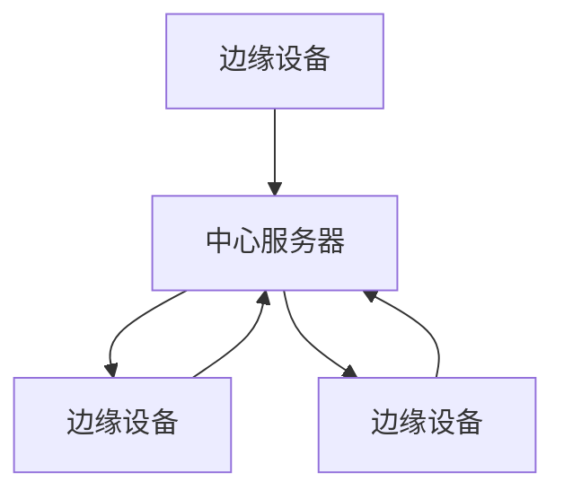
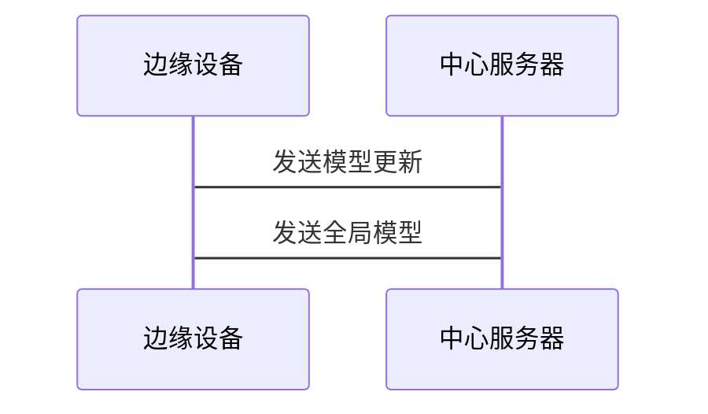

                 


# 如何识别企业的边缘计算联邦学习优势

> 关键词：边缘计算，联邦学习，企业优势，算法原理，系统架构

> 摘要：本文将详细探讨如何识别企业在边缘计算联邦学习中的优势，涵盖背景介绍、核心概念、算法原理、系统架构设计和项目实战等内容。通过本文的分析，读者将能够全面理解边缘计算联邦学习的优势，并掌握如何在企业中有效应用这一技术。

---

## 第一部分: 边缘计算与联邦学习背景介绍

### 第1章: 边缘计算与联邦学习背景介绍

#### 1.1 边缘计算的基本概念

##### 1.1.1 边缘计算的定义
边缘计算是一种分布式计算范式，将数据处理和存储功能从云端转移到靠近数据源的边缘设备。通过这种方式，边缘计算能够实现更快速的数据处理和决策，减少延迟并提高效率。

##### 1.1.2 边缘计算的背景与发展趋势
随着物联网和5G技术的快速发展，边缘计算逐渐成为企业数字化转型的重要技术。边缘计算能够支持实时数据处理，适用于智能制造、智慧城市等领域。

##### 1.1.3 边缘计算在企业中的应用价值
边缘计算能够提升企业的数据处理效率，降低带宽成本，并增强数据安全性。此外，边缘计算能够支持实时决策，提高企业的竞争力。

#### 1.2 联邦学习的核心概念

##### 1.2.1 联邦学习的定义
联邦学习是一种分布式机器学习技术，允许多个参与方在不共享原始数据的情况下，共同训练模型。通过联邦学习，数据保持在本地，仅交换加密的模型更新信息。

##### 1.2.2 边缘计算与联邦学习的结合
边缘计算与联邦学习的结合能够实现数据的本地处理和模型的协同训练，保护数据隐私的同时，提高模型的泛化能力。

#### 1.3 边缘计算与联邦学习的结合

##### 1.3.1 边缘计算联邦学习的优势与挑战
边缘计算联邦学习的优势包括数据隐私保护、计算资源的充分利用和模型的实时更新。然而，其挑战包括通信开销大、模型收敛难和设备异构性问题。

##### 1.3.2 企业应用中的典型案例分析
在智能制造中，边缘计算联邦学习可以用于设备状态预测和质量检测。在医疗领域，可用于患者数据共享和疾病预测。

---

## 第二部分: 边缘计算联邦学习的核心概念与联系

### 第2章: 边缘计算联邦学习的核心原理

#### 2.1 边缘计算联邦学习的原理

##### 2.1.1 数据分布式的特性
边缘计算联邦学习中，数据分布于多个边缘设备，每个设备仅拥有局部数据，通过联邦学习技术进行模型协同训练。

##### 2.1.2 联邦学习的通信机制
边缘计算联邦学习中的通信机制包括数据加密传输、模型更新同步和隐私保护机制。

##### 2.1.3 边缘计算中的联邦学习流程
边缘设备收集数据，进行局部模型训练，将模型更新上传到中心服务器，服务器将所有更新聚合，生成全局模型，分发给各边缘设备。

#### 2.2 边缘计算与联邦学习的关联性分析

##### 2.2.1 边缘计算的数据特性
边缘计算中的数据具有实时性、异构性和分布性的特点，这些特性为联邦学习提供了数据基础。

##### 2.2.2 联邦学习的模型训练机制
联邦学习通过分布式模型训练，充分利用各边缘设备的数据，提升模型的泛化能力。

##### 2.2.3 两者结合的协同效应
边缘计算为联邦学习提供数据源和计算资源，联邦学习则通过协同训练提升模型性能，两者结合能够实现高效、安全的数据处理。

#### 2.3 边缘计算联邦学习的核心要素

##### 2.3.1 数据隐私保护
通过数据加密、联邦聚合和隐私保护机制，确保数据在传输和训练过程中的安全性。

##### 2.3.2 模型更新机制
采用联邦平均（FedAvg）等算法，定期同步模型更新，确保各边缘设备的模型一致性。

##### 2.3.3 跨邊緣設備的通信协议
制定统一的通信协议，确保各边缘设备之间的数据传输和模型更新能够顺利进行。

---

## 第三部分: 边缘计算联邦学习的算法原理

### 第3章: 边缘计算联邦学习的算法原理

#### 3.1 联邦学习算法概述

##### 3.1.1 联邦平均（FedAvg）算法
FedAvg算法通过将各边缘设备的模型参数进行平均，生成全局模型。该算法适用于数据分布均匀的场景。

##### 3.1.2 联邦梯度下降（FedGD）算法
FedGD算法通过计算各边缘设备的梯度，进行全局模型更新。该算法适用于数据分布不均匀的场景。

##### 3.1.3 联邦学习的优化策略
通过引入动量项、学习率调整和正则化方法，优化联邦学习算法的收敛速度和模型性能。

#### 3.2 边缘计算中的联邦学习算法实现

##### 3.2.1 边缘设备的模型更新流程
边缘设备在本地数据上进行模型训练，生成梯度或模型参数，并将更新信息上传到中心服务器。

##### 3.2.2 联邦服务器的模型聚合方法
中心服务器接收各边缘设备的模型更新，进行聚合，生成全局模型，并将全局模型分发给各边缘设备。

##### 3.2.3 跨邊緣設備的同步机制
通过同步机制，确保各边缘设备的模型更新能够及时同步，避免数据不一致导致的模型误差。

#### 3.3 算法原理的数学模型与公式

##### 3.3.1 联邦平均算法的数学表达
$$ \theta_{t+1} = \frac{1}{n}\sum_{i=1}^{n}\theta_{i}^{(t)} $$

##### 3.3.2 联邦梯度下降算法的数学表达
$$ \theta_{t+1} = \theta_{t} - \eta\sum_{i=1}^{n}\nabla f_i(\theta_t) $$

#### 3.4 本章小结
本文详细介绍了边缘计算联邦学习的核心算法，包括FedAvg和FedGD算法的数学模型和实现流程。

---

## 第四部分: 边缘计算联邦学习的系统分析与架构设计

### 第4章: 边缘计算联邦学习的系统架构

#### 4.1 系统应用场景介绍

##### 4.1.1 智能制造中的边缘计算联邦学习
在智能制造中，边缘计算联邦学习可以用于设备状态预测和质量检测，通过协同学习提升模型的准确性。

##### 4.1.2 智慧医疗中的边缘计算联邦学习
在智慧医疗中，边缘计算联邦学习可以用于患者数据共享和疾病预测，保护患者隐私的同时提升诊断效率。

#### 4.2 系统功能设计

##### 4.2.1 数据采集与处理
边缘设备采集数据，进行预处理和特征提取，确保数据质量。

##### 4.2.2 模型训练与更新
边缘设备进行局部模型训练，生成模型更新信息，并上传到中心服务器。

##### 4.2.3 模型聚合与分发
中心服务器接收各边缘设备的模型更新，进行聚合，生成全局模型，并分发给各边缘设备。

#### 4.3 系统架构设计

##### 4.3.1 系统架构图


##### 4.3.2 系统接口设计


#### 4.4 本章小结
本文详细介绍了边缘计算联邦学习的系统架构设计，包括应用场景、功能设计和系统架构图。

---

## 第五部分: 边缘计算联邦学习的项目实战

### 第5章: 边缘计算联邦学习的项目实战

#### 5.1 环境安装

##### 5.1.1 安装Python和必要的库
安装Python 3.8及以上版本，安装必要的库，如numpy、pandas、tensorflow等。

##### 5.1.2 安装联邦学习框架
安装Federated学习框架，如TensorFlow Federated（TFF）或FATE。

#### 5.2 核心代码实现

##### 5.2.1 边缘设备的数据准备
```python
import numpy as np

# 生成边缘设备的数据
X = np.random.randn(100, 2)
y = np.random.randint(2, size=100)
```

##### 5.2.2 边缘设备的模型训练
```python
from tensorflow.keras import layers

# 定义模型
model = layers.Dense(1, activation='sigmoid')(layers.Input(shape=(2,)))
model = Model(inputs=model.input, outputs=model.output)
model.compile(optimizer='adam', loss='binary_crossentropy', metrics=['accuracy'])
model.fit(X, y, epochs=10, batch_size=32)
```

##### 5.2.3 模型更新与聚合
```python
# 模型聚合
def average_model(models):
    return sum([model.get_weights() for model in models]) / len(models)
```

#### 5.3 案例分析

##### 5.3.1 智能制造中的应用
在智能制造中，边缘计算联邦学习可以用于设备状态预测，通过协同学习提升模型的准确性。

##### 5.3.2 智慧医疗中的应用
在智慧医疗中，边缘计算联邦学习可以用于患者数据共享和疾病预测，保护患者隐私的同时提升诊断效率。

#### 5.4 本章小结
本文通过项目实战，详细介绍了边缘计算联邦学习的环境安装、核心代码实现和案例分析。

---

## 第六部分: 边缘计算联邦学习的最佳实践

### 第6章: 边缘计算联邦学习的最佳实践

#### 6.1 优化建议

##### 6.1.1 数据预处理
对数据进行标准化、归一化等预处理，确保各边缘设备的数据一致性。

##### 6.1.2 模型选择
根据具体应用场景选择合适的模型架构和优化策略，提升模型的性能。

##### 6.1.3 通信优化
通过减少数据传输量、优化通信协议等方式，降低通信开销。

#### 6.2 注意事项

##### 6.2.1 数据隐私保护
严格控制数据访问权限，确保数据在传输和训练过程中的安全性。

##### 6.2.2 模型收敛问题
通过调整学习率、增加训练轮数等方式，解决模型收敛困难的问题。

##### 6.2.3 设备异构性问题
通过设备分类和模型适配，解决设备异构性带来的兼容性问题。

#### 6.3 拓展阅读

##### 6.3.1 联邦学习的最新研究
阅读最新的联邦学习研究论文，了解行业动态和技术进展。

##### 6.3.2 边缘计算的未来趋势
关注边缘计算的最新发展，了解其在各领域的应用前景。

#### 6.4 本章小结
本文总结了边缘计算联邦学习的最佳实践，包括优化建议、注意事项和拓展阅读等内容。

---

## 结语

边缘计算联邦学习作为一种新兴的技术，为企业提供了高效、安全的数据处理方式。通过本文的详细讲解，读者能够全面理解边缘计算联邦学习的优势，并掌握如何在企业中有效应用这一技术。

---

## 作者

作者：AI天才研究院/AI Genius Institute  
联系方式：[联系邮箱](mailto:contact@aising genius.com)  
个人简介：专注于人工智能、边缘计算和联邦学习领域的研究与实践，致力于为企业提供技术解决方案。

---

# THE END

