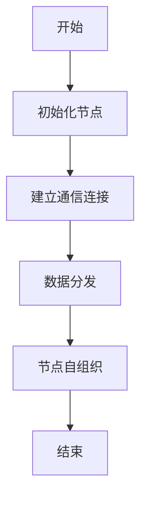

                 


# 如何识别企业的边缘计算自组网优势

## 目录大纲

### 第一部分：边缘计算自组网的背景与概念

#### 第1章：边缘计算自组网的背景与问题背景

##### 1.1 边缘计算自组网的背景介绍
- 1.1.1 传统企业网络架构的局限性
- 1.1.2 边缘计算的兴起及其优势
- 1.1.3 自组网技术在边缘计算中的作用

##### 1.2 问题背景与问题描述
- 1.2.1 企业网络中的数据传输延迟问题
- 1.2.2 中心化架构的资源浪费与安全性风险
- 1.2.3 边缘计算自组网的必要性与目标

##### 1.3 问题解决与边界外延
- 1.3.1 边缘计算自组网如何解决问题
- 1.3.2 边缘计算自组网的边界与适用场景
- 1.3.3 与传统网络架构的对比分析

##### 1.4 概念结构与核心要素
- 1.4.1 边缘计算自组网的核心要素分析
- 1.4.2 各要素之间的关系与相互作用
- 1.4.3 与其他技术的协同效应

#### 第2章：边缘计算自组网的核心概念与联系

##### 2.1 核心概念原理
- 2.1.1 分布式计算与自治网络的原理
- 2.1.2 边缘节点的自组织机制
- 2.1.3 数据的本地处理与决策优化

##### 2.2 核心概念属性对比表格
- 表格标题：边缘计算自组网与传统网络架构对比
- 对比维度：数据处理位置、资源利用效率、延迟、安全性、扩展性

##### 2.3 ER实体关系图
```mermaid
er
  actor 节点
  actor 边缘计算自组网
  actor 中心服务器
  relation 参与
  relation 包含
  relation 依赖
```

#### 第3章：算法原理讲解

##### 3.1 分布式算法原理
- 3.1.1 分布式算法概述
- 3.1.2 自组织算法的实现流程
- 3.1.3 边缘计算中的典型算法选择

##### 3.2 自组织算法的实现流程


##### 3.3 算法的数学模型与公式
- 3.3.1 算法的数学模型

### 第二部分：系统分析与架构设计

#### 第4章：系统分析与架构设计

##### 4.1 系统分析
- 4.1.1 问题场景介绍
- 4.1.2 项目介绍
- 4.1.3 系统功能设计（领域模型mermaid类图）

##### 4.2 系统架构设计
- 4.2.1 系统架构设计（mermaid架构图）

##### 4.3 系统接口设计与交互流程
- 4.3.1 系统接口设计
- 4.3.2 系统交互流程（mermaid序列图）

### 第三部分：项目实战

#### 第5章：项目实战

##### 5.1 环境安装
- 5.1.1 安装步骤与依赖项说明

##### 5.2 核心代码实现
- 5.2.1 核心代码实现（Python代码示例）

##### 5.3 代码应用解读与分析
- 5.3.1 代码的功能解读与实际应用分析

##### 5.4 案例分析与详细讲解剖析
- 5.4.1 实际案例分析
- 5.4.2 详细讲解与剖析

##### 5.5 项目小结
- 5.5.1 项目总结与经验分享

### 第四部分：总结与展望

#### 第6章：总结与展望

##### 6.1 最佳实践 tips
- 6.1.1 行业最佳实践建议
- 6.1.2 技术应用中的注意事项

##### 6.2 小结
- 6.2.1 本章内容总结
- 6.2.2 关键点回顾

##### 6.3 注意事项
- 6.3.1 技术应用中的潜在问题
- 6.3.2 用户在实际操作中需要注意的事项

##### 6.4 拓展阅读
- 6.4.1 相关领域推荐的深入学习资料
- 6.4.2 进一步研究的方向与建议

### 附录：数学公式与代码参考

#### 附录A：数学公式参考
- A.1 相关算法的数学公式
- A.2 其他相关数学模型

#### 附录B：代码参考
- B.1 核心代码片段
- B.2 其他相关代码示例

---

### 作者：AI天才研究院 & 禅与计算机程序设计艺术

