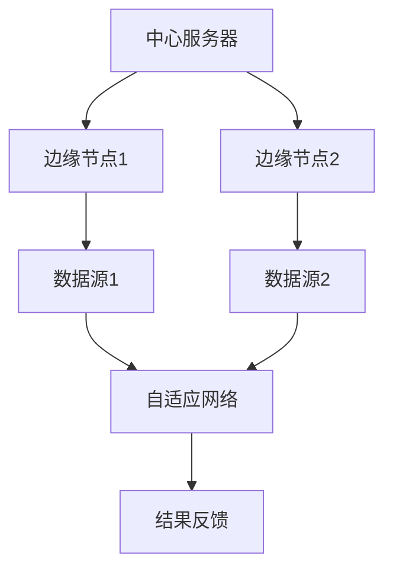
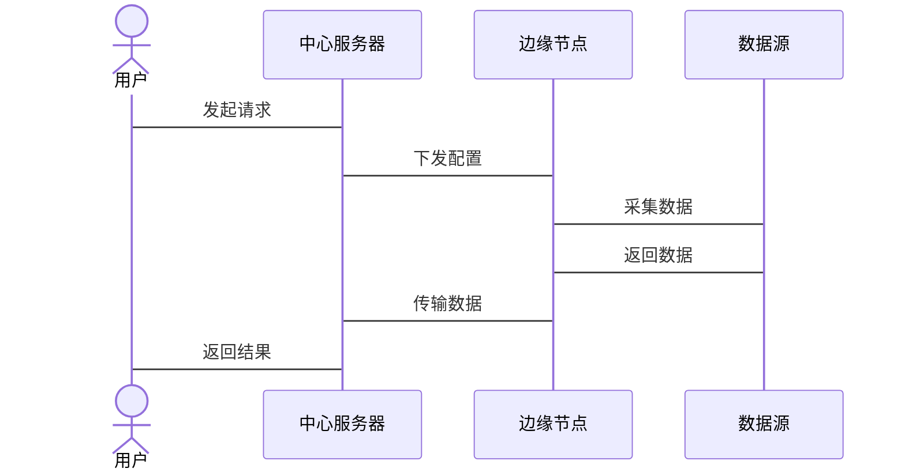

                 


# 如何识别企业的边缘计算自适应网络优势

## 关键词：边缘计算，自适应网络，企业网络优化，算法原理，系统架构

## 摘要：  
边缘计算自适应网络是一种结合了边缘计算和自适应网络技术的企业网络优化方案。本文将从边缘计算的基本概念、自适应网络的核心原理、算法实现、系统架构设计以及实际案例分析等方面，深入探讨如何识别和应用边缘计算自适应网络的优势，帮助企业实现更高效、更灵活的网络管理。

---

## 第1章: 边缘计算的基本概念与优势

### 1.1 边缘计算的定义  
边缘计算是一种分布式计算模式，将数据处理和存储功能从中心服务器转移到靠近数据源的边缘设备。通过这种方式，可以减少数据传输延迟，提高实时性。

### 1.2 边缘计算的核心特征  
- **分布式架构**：数据在边缘节点进行处理，减少对中心服务器的依赖。  
- **低延迟**：边缘计算能够快速响应本地事件，适用于实时性要求高的场景。  
- **高可用性**：边缘设备可以在断开中心服务器时独立运行，确保系统可靠性。  

### 1.3 边缘计算在企业中的应用场景  
- **物联网（IoT）**：通过边缘设备实时处理传感器数据，实现智能监控和预测性维护。  
- **实时数据分析**：在金融、医疗等领域，边缘计算能够快速处理关键数据，提升业务响应速度。  
- **边缘AI**：在边缘设备上部署AI模型，实现本地推理和决策。  

### 1.4 边缘计算自适应网络的优势  
- **降低带宽消耗**：通过边缘计算将数据处理本地化，减少对中心服务器的数据传输量。  
- **提升网络安全性**：边缘设备可以对敏感数据进行本地处理，减少数据在传输过程中被截获的风险。  
- **增强灵活性**：自适应网络可以根据业务需求动态调整网络资源分配，确保网络性能最优。  

---

## 第2章: 自适应网络的核心原理与实现

### 2.1 自适应网络的定义  
自适应网络是指能够根据网络环境的变化自动调整网络结构、路由策略和资源分配的动态网络系统。

### 2.2 自适应网络的关键技术  
- **动态路由算法**：根据网络拓扑变化实时调整数据传输路径。  
- **流量控制机制**：通过反馈机制调节网络流量，避免拥塞。  
- **负载均衡技术**：动态分配网络资源，确保各个节点负载均衡。  

### 2.3 边缘计算与自适应网络的结合  
- **边缘节点的动态配置**：通过自适应网络技术，边缘设备可以根据业务需求动态调整其网络参数。  
- **网络资源的智能分配**：自适应网络可以根据边缘设备的负载情况，动态分配网络带宽和计算资源。  
- **数据流的智能路由**：自适应网络可以根据实时网络状态，选择最优路径传输数据，降低延迟。  

### 2.4 自适应网络的算法实现  
#### 2.4.1 动态路由算法  
动态路由算法的核心思想是根据网络拓扑变化实时计算最优路径。以下是一个简单的动态路由算法实现示例：

```python
def dynamic_routing(nodes, edges, source, destination):
    # nodes: 网络节点列表
    # edges: 网络边列表，格式为 (from, to, weight)
    # source: 起始节点
    # destination: 目的节点
    # 使用Dijkstra算法计算最短路径
    import heapq

    graph = {node: [] for node in nodes}
    for from_node, to_node, weight in edges:
        graph[from_node].append((to_node, weight))

    # 初始化距离数组
    dist = {node: float('infinity') for node in nodes}
    dist[source] = 0

    # 使用优先队列进行松弛操作
    heap = []
    heapq.heappush(heap, (0, source))

    while heap:
        current_dist, u = heapq.heappop(heap)
        if current_dist > dist[u]:
            continue
        for v, weight in graph[u]:
            if dist[v] > dist[u] + weight:
                dist[v] = dist[u] + weight
                heapq.heappush(heap, (dist[v], v))

    # 返回最短路径
    return dist[destination]
```

#### 2.4.2 网络资源分配算法  
网络资源分配算法的核心思想是根据业务需求动态分配网络资源。以下是一个简单的网络资源分配算法实现示例：

```python
def resource_allocation(nodes, resources, source, destination):
    # nodes: 网络节点列表
    # resources: 资源数量
    # source: 起始节点
    # destination: 目的节点
    # 使用最大流算法计算网络资源分配
    from networkx import flow_maxflow

    # 创建网络流图
    G = flow_maxflow.DiGraph()
    for node in nodes:
        G.add_node(node)
    for from_node, to_node, capacity in resources:
        G.add_edge(from_node, to_node, capacity=capacity)

    # 计算最大流
    max_flow = flow_maxflow.max_flow(G, source, destination)
    return max_flow
```

---

## 第3章: 边缘计算自适应网络的系统架构设计

### 3.1 系统功能设计  
- **数据采集**：边缘设备采集数据并进行初步处理。  
- **数据传输**：通过自适应网络将数据传输到中心服务器或下一个边缘节点。  
- **数据存储**：在边缘节点或中心服务器上存储数据，供后续分析使用。  
- **数据分析**：对数据进行深度分析，生成业务决策支持信息。  

### 3.2 系统架构设计  
以下是一个典型的边缘计算自适应网络系统的架构图：



### 3.3 系统接口设计  
- **边缘设备接口**：与数据源和自适应网络进行交互。  
- **中心服务器接口**：接收边缘设备传输的数据并进行分析。  
- **用户接口**：提供业务决策支持信息的展示和交互。  

### 3.4 系统交互设计  
以下是一个典型的系统交互流程图：



---

## 第4章: 项目实战与案例分析

### 4.1 项目背景  
某企业希望利用边缘计算自适应网络技术优化其物联网监控系统，提升实时数据处理能力。

### 4.2 环境安装  
- **硬件环境**：部署边缘节点和中心服务器。  
- **软件环境**：安装边缘计算框架（如Kubernetes）和自适应网络算法库（如Netlib）。  

### 4.3 核心代码实现  
以下是一个边缘计算自适应网络的核心代码实现示例：

```python
def main():
    import requests
    import json

    # 初始化边缘节点
    edge_node = EdgeNode()
    # 初始化自适应网络
    adaptive_network = AdaptiveNetwork()

    # 数据采集
    data = edge_node采集数据()
    # 数据预处理
    processed_data = edge_node预处理(data)
    # 数据传输
    adaptive_network传输(processed_data)
    # 数据分析
    result = adaptive_network分析(processed_data)
    # 结果反馈
    edge_node反馈(result)

if __name__ == "__main__":
    main()
```

### 4.4 案例分析  
通过实际案例分析，验证边缘计算自适应网络的优势，例如在物联网监控系统中，边缘计算自适应网络能够实时处理传感器数据，快速响应异常事件，降低网络延迟。

---

## 第5章: 最佳实践与注意事项

### 5.1 最佳实践  
- **分阶段实施**：先从部分业务场景入手，逐步推广到全企业。  
- **选择合适的工具和技术**：根据企业需求选择合适的边缘计算框架和自适应网络算法。  
- **持续优化**：定期监控网络性能，动态调整网络参数。  

### 5.2 注意事项  
- **数据安全**：确保边缘设备和自适应网络的安全性，防止数据泄露。  
- **系统兼容性**：确保边缘计算自适应网络与现有企业系统的兼容性。  
- **维护成本**：边缘设备的维护成本较高，需要企业做好相应的技术储备。  

### 5.3 未来趋势  
随着5G和AI技术的发展，边缘计算自适应网络将在更多领域得到应用，例如智能制造、智慧城市等。

---

## 作者：AI天才研究院/AI Genius Institute & 禅与计算机程序设计艺术 /Zen And The Art of Computer Programming

---

**扩展阅读**  
- [边缘计算入门指南](#)  
- [自适应网络技术详解](#)  
- [企业网络优化的最佳实践](#)  

---

以上是《如何识别企业的边缘计算自适应网络优势》的完整目录大纲和文章内容，希望对您有所帮助！

