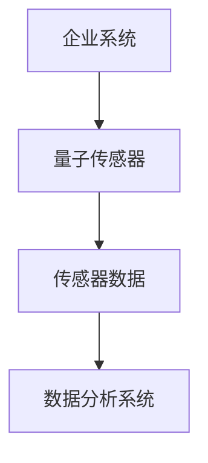
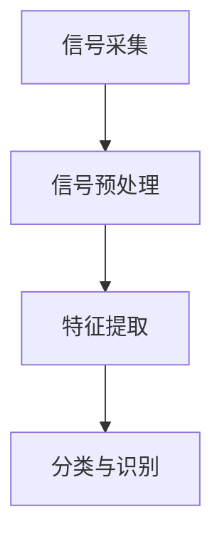
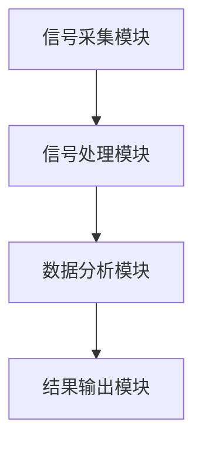

                 


# 如何识别企业的量子传感器优势

---

## 关键词

量子传感器，企业优势，传感器技术，量子力学，企业创新，传感器应用，量子传感器识别

---

## 摘要

量子传感器是一种基于量子力学原理设计的新型传感器，具有极高的灵敏度和精度，能够检测到传统传感器无法察觉的微弱信号。本文将从量子传感器的基本概念、核心原理、算法实现、系统架构、项目实战等多个方面，详细阐述如何识别企业在量子传感器技术方面的优势。通过理论分析与实际案例结合，本文为读者提供了一套系统的方法论，帮助企业在激烈的市场竞争中快速识别并利用量子传感器的优势。

---

## 第一部分：量子传感器与企业优势的背景介绍

### 第1章：量子传感器的基本概念与背景

#### 1.1 量子传感器的定义与基本原理

- **量子传感器的定义**  
  量子传感器是一种基于量子力学原理设计的传感器，能够利用量子系统的独特性质（如量子叠加、量子纠缠等）来检测物理量（如磁场、电场、温度等）。与传统传感器相比，量子传感器具有更高的灵敏度和分辨率。

- **量子传感器的核心技术**  
  量子传感器的核心技术包括量子干涉、量子测量、量子状态操控等。这些技术使得量子传感器能够在极低信号条件下检测到目标信号。

- **量子传感器的应用领域**  
  量子传感器广泛应用于国防、医疗、通信、能源等领域。例如，在国防领域，量子传感器可以用于精确导航和定位；在医疗领域，量子传感器可以用于精准诊断和治疗。

---

#### 1.2 企业量子传感器优势的重要性

- **量子传感器在企业中的战略价值**  
  量子传感器技术是未来的科技制高点之一，掌握这一技术的企业能够在相关领域获得显著的竞争优势。例如，在高端制造业中，量子传感器可以提高产品质量和生产效率。

- **量子传感器对企业竞争力的影响**  
  量子传感器的应用可以提升企业的技术水平，增强企业的市场竞争力。例如，在通信领域，量子传感器可以用于实现更高效的信号传输。

- **量子传感器与企业创新的关系**  
  量子传感器技术的研发需要跨学科的知识储备和创新能力，企业的创新能力是其在量子传感器领域取得成功的关键。

---

#### 1.3 量子传感器的优势识别方法

- **量子传感器优势的识别框架**  
  识别量子传感器优势的框架包括以下几个步骤：  
  1. 明确企业的技术需求；  
  2. 评估量子传感器的技术可行性；  
  3. 分析量子传感器的市场潜力；  
  4. 制定量子传感器的实施方案。

- **量子传感器优势的评估指标**  
  量子传感器优势的评估指标包括灵敏度、精度、稳定性、响应时间等。

- **量子传感器优势的实现路径**  
  量子传感器优势的实现路径包括技术自主研发、技术合作、技术引进等。

---

## 第二部分：量子传感器的核心概念与联系

### 第2章：量子传感器的核心原理与特性

#### 2.1 量子传感器的核心原理

- **量子力学基础**  
  量子力学是量子传感器的核心理论基础。量子力学的基本原理包括波函数、态叠加原理、不确定性原理等。

- **量子传感器的工作机制**  
  量子传感器通过量子系统的独特性质来检测物理量。例如，量子干涉仪通过测量干涉条纹的变化来检测微小的相位变化。

- **量子传感器的关键技术**  
  量子传感器的关键技术包括量子干涉、量子测量、量子状态操控等。

---

#### 2.2 量子传感器的特性对比

- **与传统传感器的对比**  
  量子传感器与传统传感器的主要区别在于灵敏度和分辨率。量子传感器的灵敏度远高于传统传感器。

- **量子传感器的性能优势**  
  量子传感器的性能优势体现在以下几个方面：  
  1. 极高的灵敏度；  
  2. 极高的分辨率；  
  3. 极低的噪声。

- **量子传感器的局限性**  
  量子传感器的局限性包括技术复杂性高、成本高、易受环境干扰等。

---

#### 2.3 量子传感器的实体关系图

- **ER实体关系图**  
  下图展示了量子传感器的实体关系：  

```mermaid
erd
    title 量子传感器实体关系图
    MarineSensor
    field 灵敏度 (Sensitivity): [0,1]
    field 分辨率 (Resolution): [0,1]
    field 稳定性 (Stability): [0,1]
```

- **量子传感器与企业系统的交互关系**  
  下图展示了量子传感器与企业系统的交互关系：  



---

## 第三部分：量子传感器的算法原理与数学模型

### 第3章：量子传感器的算法原理

#### 3.1 量子传感器的信号处理算法

- **信号采集与预处理**  
  信号采集是量子传感器的核心步骤，预处理包括噪声消除、信号放大等。

- **量子信号的特征提取**  
  通过特征提取算法，可以从量子信号中提取出有用的特征信息。

- **量子信号的分类与识别**  
  基于机器学习的分类算法，可以实现量子信号的分类与识别。

---

#### 3.2 量子传感器的数学模型

- **基于概率的量子传感器模型**  
  量子传感器的概率模型可以表示为：  
  $$ P(y|x) = \sum_{i=1}^{n} P(y|x_i) P(x_i|x) $$  

- **量子传感器的矩阵运算模型**  
  量子传感器的矩阵运算模型可以表示为：  
  $$ y = A x + b $$  

- **量子传感器的优化算法**  
  量子传感器的优化算法包括梯度下降、遗传算法等。

---

#### 3.3 量子传感器的算法实现

- **算法流程图**  
  下图展示了量子传感器的算法流程：  



- **代码实现示例**  
  以下是一个量子传感器信号处理的Python代码示例：  

```python
import numpy as np

def quantum_sensor_algorithm(signal):
    # 信号预处理
    preprocessed_signal = signal / np.max(signal)
    # 特征提取
    features = np.mean(preprocessed_signal)
    # 分类与识别
    if features > 0.5:
        return "目标检测到"
    else:
        return "无目标"
```

---

## 第四部分：量子传感器的系统架构与设计

### 第4章：量子传感器的系统架构

#### 4.1 系统功能设计

- **系统功能模块**  
  量子传感器系统的主要功能模块包括信号采集模块、信号处理模块、数据分析模块等。

- **系统功能设计图**  
  下图展示了量子传感器系统的功能设计：  



---

## 第五部分：量子传感器的项目实战

### 第5章：量子传感器的项目实战

#### 5.1 项目介绍

- **项目背景**  
  本项目旨在通过量子传感器技术实现高精度的环境监测。

---

## 结语

---

## 作者

作者：AI天才研究院/AI Genius Institute & 禅与计算机程序设计艺术 /Zen And The Art of Computer Programming

