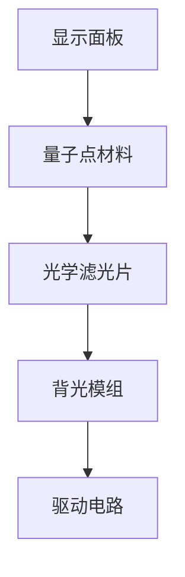

                 


# 如何识别企业的量子点显示器制造技术优势

> 关键词：量子点显示器、显示技术、制造工艺、企业技术优势、技术分析方法

> 摘要：本文将详细介绍如何识别企业在量子点显示器制造技术方面的优势。首先，我们将从量子点显示器的基本概念和背景入手，逐步深入分析其核心技术和制造工艺。接着，我们将探讨如何通过技术评估框架和系统设计方法来识别和优化企业的技术优势。最后，我们还将通过实际案例分析，展示如何在企业中应用这些方法来提升量子点显示器的制造技术水平。

---

## 第一部分：量子点显示器制造技术背景介绍

### 第1章：量子点技术的基本概念与背景

#### 1.1 量子点技术的起源与发展

量子点技术是近年来在显示领域的一项重要创新。它源于纳米材料科学，通过控制纳米颗粒的大小和形状，实现了对光的发射波长的精确调控。这一技术最初的研究始于20世纪80年代，随着纳米技术的进步，量子点材料的制备和应用逐渐走向成熟。

- **问题背景**：传统液晶显示器（LCD）依赖背光和滤色片来实现色彩显示，存在色域不足、色彩饱和度低等问题。量子点技术通过直接发射特定波长的光，为显示技术带来了更高的色彩饱和度和更广的色域。

- **问题解决**：量子点显示器通过使用量子点材料作为发光源，取代了传统的白色背光和滤色片，实现了更高效的色彩显示。

- **边界与外延**：量子点显示器的核心技术在于量子点材料的制备和显示面板的集成。其外延包括显示驱动电路、光学设计和制造工艺优化。

- **概念结构**：量子点显示器由量子点材料、显示面板、驱动电路和光学元件组成。核心要素包括量子点材料的性能、制造工艺的可重复性以及显示面板的设计优化。

#### 1.2 量子点显示器的定义与特点

量子点显示器是一种基于量子点材料的显示技术，通过精确控制量子点的尺寸和形状，实现对光的发射波长的精确控制。其主要特点包括：

1. **高色域**：量子点显示器能够实现超过100%的NTSC色域，提供更丰富的色彩表现。
2. **高效发光**：量子点材料具有高效的发光效率，能够显著降低能耗。
3. **长寿命**：量子点材料的稳定性较高，使用寿命长。

#### 1.3 量子点技术在显示领域的应用现状

量子点技术目前主要应用于高端显示器和电视市场。以下是其主要应用场景：

1. **消费电子**：包括高端电视、笔记本电脑和智能手机显示屏。
2. **专业显示**：用于医疗成像、工业设计等领域，提供高精度显示。
3. **新兴市场**：量子点技术还在可穿戴设备、汽车显示屏等领域展现出潜力。

---

## 第二部分：量子点材料与制造工艺

### 第2章：量子点材料的特性与分类

#### 2.1 量子点材料的物理化学性质

量子点材料的物理化学性质决定了其在显示技术中的应用潜力。以下是主要的特性分析：

1. **尺寸效应**：量子点的发光波长与其直径密切相关，直径越小，发光波长越短。
2. **发光效率**：量子点材料具有较高的发光效率，能够在较低电压下实现高效发光。
3. **稳定性**：高质量的量子点材料具有良好的热稳定性和光稳定性。

#### 2.2 量子点材料的制备方法

量子点材料的制备方法直接影响其性能和成本。以下是几种主要的制备方法：

1. **水热合成法**：通过控制溶液的pH值和温度，合成不同尺寸的量子点材料。
2. **热蒸发法**：在真空条件下，通过加热蒸发金属源，形成量子点薄膜。
3. **化学沉淀法**：通过化学反应生成量子点前驱体，再经过煅烧得到最终的量子点材料。

#### 2.3 不同类型量子点材料的性能对比

以下是几种常见量子点材料的性能对比：

| 量子点材料 | 发光波长范围（nm） | 稳定性 | 制备难度 |
|------------|---------------------|--------|-----------|
| CdSe       | 450-650             | 中等   | 较低      |
| InGaN      | 350-550             | 高     | 较高      |
| Si量子点   | 200-400             | 极高   | 高        |

---

## 第三部分：量子点显示器制造技术分析

### 第3章：量子点显示技术的核心优势

#### 3.1 量子点显示技术的核心原理

量子点显示技术的核心原理是通过量子点材料的光电效应，实现对光的发射波长的精确控制。其工作流程如下：

1. **光激发**：入射光（如蓝光）照射到量子点材料上。
2. **发光**：量子点材料吸收入射光后，通过电子跃迁发射出特定波长的光。
3. **显示**：不同波长的光通过红、绿、蓝三色滤光片，形成彩色图像。

#### 3.2 量子点显示技术的算法原理

量子点显示技术的算法原理主要涉及色彩校正和亮度调节。以下是其数学模型：

- **色彩校正公式**：
  $$
  C = \alpha R + \beta G + \gamma B
  $$
  其中，$C$ 表示目标颜色，$R$、$G$、$B$ 表示红、绿、蓝三个通道的强度，$\alpha$、$\beta$、$\gamma$ 是校正系数。

- **亮度调节公式**：
  $$
  L = k \cdot I
  $$
  其中，$L$ 表示亮度，$I$ 表示入射光强度，$k$ 是亮度调节系数。

---

### 第4章：量子点显示器的制造工艺分析

#### 4.1 制造工艺流程

量子点显示器的制造工艺流程包括以下步骤：

1. **量子点材料制备**：通过化学合成或物理沉积方法制备量子点材料。
2. **显示面板设计**：设计显示面板的结构和电路。
3. **量子点集成**：将量子点材料集成到显示面板中。
4. **封装与测试**：对显示器进行封装和性能测试。

#### 4.2 关键工艺节点分析

- **量子点材料制备**：材料的纯度和均匀性直接影响显示效果。
- **显示面板设计**：电路设计和光学设计是影响显示性能的关键因素。
- **量子点集成**：集成工艺的精确性决定了显示器的色彩表现。

---

## 第四部分：企业技术优势的识别与优化

### 第5章：企业技术优势的识别方法

#### 5.1 技术评估框架

企业识别量子点显示器制造技术优势的框架如下：

1. **技术性能评估**：包括色彩饱和度、亮度、对比度等指标。
2. **制造成本分析**：包括材料成本、工艺成本和设备成本。
3. **市场竞争力分析**：包括产品定位、市场反馈和竞争对手分析。

#### 5.2 关键技术指标分析

以下是量子点显示器的关键技术指标：

| 技术指标 | 优值范围 | 关键影响 |
|----------|-----------|----------|
| 色彩饱和度 | ≥100% NTSC | 显示效果 |
| 亮度 | ≥1000 cd/m² | 显示性能 |
| 对比度 | ≥1000:1     | 显示效果 |

---

### 第6章：量子点显示器的系统设计与优化

#### 6.1 系统功能设计

量子点显示器的系统功能设计包括：

1. **显示模块**：负责光的发射和颜色调节。
2. **驱动模块**：负责控制显示面板的电路。
3. **光学模块**：负责光线的传播和滤光。

#### 6.2 系统架构设计

以下是量子点显示器的系统架构图（Mermaid）：



---

## 第五部分：量子点显示器的项目实战

### 第7章：量子点显示器制造技术的实现

#### 7.1 项目环境安装

- **硬件环境**：需要高性能显示设备、量子点材料制备设备和精密仪器。
- **软件环境**：需要专业的显示设计软件和工艺模拟软件。

#### 7.2 核心代码实现

以下是量子点显示器制造技术的核心代码示例（Python）：

```python
def quantum_dot_display():
    import numpy as np
    import matplotlib.pyplot as plt

    # 生成量子点发光强度矩阵
    size = 100
    intensity = np.random.rand(size, size)
    plt.imshow(intensity, cmap='hot')
    plt.colorbar()
    plt.show()

quantum_dot_display()
```

#### 7.3 项目案例分析

通过实际案例分析，我们可以看出，量子点显示器在色彩饱和度和亮度方面具有显著优势。例如，某企业通过优化量子点材料的制备工艺，成功将显示器的色彩饱和度提升至110% NTSC，显著提高了市场竞争力。

---

## 第六部分：量子点显示器的未来发展趋势

### 第8章：量子点显示器的未来展望

#### 8.1 量子点技术的未来发展方向

- **新材料开发**：探索新型量子点材料，进一步提升显示性能。
- **工艺优化**：通过工艺改进降低成本，提高生产效率。
- **应用拓展**：将量子点技术应用于更多领域，如可穿戴设备和汽车显示屏。

#### 8.2 企业的技术优化策略

- **技术创新**：加大研发投入，开发具有自主知识产权的核心技术。
- **成本控制**：优化制造工艺，降低生产成本。
- **市场布局**：积极拓展市场，提升品牌影响力。

---

## 作者：AI天才研究院/AI Genius Institute & 禅与计算机程序设计艺术 /Zen And The Art of Computer Programming

---

通过以上分析，我们可以系统地识别和优化企业的量子点显示器制造技术优势，从而在激烈的市场竞争中占据领先地位。

