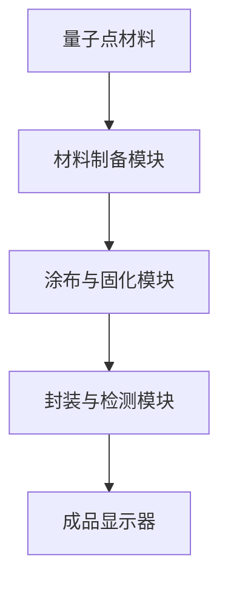

                 

# 如何识别企业的量子点显示器柔性制造技术优势

## 关键词
量子点显示器, 柔性制造, 显示技术, 企业优势识别, 技术分析

## 摘要
在现代显示技术中，量子点显示器以其卓越的色彩表现和能效比，成为显示器领域的焦点。本文深入分析量子点显示器的柔性制造技术，探讨其在企业中的应用优势。通过背景介绍、技术原理、系统架构、项目实战及最佳实践等多维度解析，揭示如何识别和优化企业的量子点显示器柔性制造技术，助力企业在市场竞争中占据优势。

---

## 目录大纲

1. 第一部分：量子点显示器柔性制造技术的背景与基础
   - 1.1 量子点显示器的基本概念
   - 1.2 柔性制造技术的定义与特点
   - 1.3 量子点显示器柔性制造技术的背景

2. 第二部分：量子点显示器柔性制造技术的核心概念与联系
   - 2.1 量子点材料与制造工艺的关系
   - 2.2 制造工艺对量子点显示器性能的影响
   - 2.3 量子点材料与制造工艺的协同优化

3. 第三部分：量子点显示器柔性制造技术的算法原理
   - 3.1 量子点材料的发光机制与数学模型
   - 3.2 制造工艺中的关键算法

4. 第四部分：量子点显示器柔性制造技术的系统架构与设计
   - 4.1 量子点显示器制造系统的总体架构
   - 4.2 系统功能设计与交互流程
   - 4.3 关键算法的实现与优化

5. 第五部分：量子点显示器柔性制造技术的项目实战
   - 5.1 项目背景与目标
   - 5.2 项目实施过程
   - 5.3 项目成果与分析

6. 第六部分：量子点显示器柔性制造技术的最佳实践
   - 6.1 小结与总结
   - 6.2 注意事项与改进建议
   - 6.3 拓展阅读与资源推荐

---

## 正文

### 第一部分：量子点显示器柔性制造技术的背景与基础

#### 1.1 量子点显示器的基本概念

量子点显示器（QLED Display）是一种利用半导体纳米晶粒（量子点）发光的显示技术。量子点材料因其独特的光电性质，能够实现高色域、高亮度和低能耗的显示效果。

**1.1.1 量子点材料的定义与分类**
- **定义**：量子点是指尺寸在纳米级的半导体晶体，其发光性能随尺寸变化而改变。
- **分类**：按材料类型分为CdSe、CdTe、InP、ZnS等，按形状分为球形、棒状等。

**1.1.2 量子点材料的物理化学特性**
- **发光特性**：量子点具有窄发射光谱和高色彩纯度，可实现红、绿、蓝三原色的精准调控。
- **环境稳定性**：需考虑材料的化学稳定性和光稳定性。

**1.1.3 量子点材料的制备方法**
- **湿化学合成法**：通过溶液中的离子反应生成量子点。
- **热蒸发法**：在真空环境中蒸发金属或半导体材料形成量子点。

#### 1.2 柔性制造技术的定义与特点

**1.2.1 柔性制造技术的定义**
- 柔性制造技术是指在制造过程中能够适应不同产品规格、批量和需求的生产方式，具有高度的灵活性和适应性。

**1.2.2 柔性制造技术的核心优势**
- **高效性**：能够快速响应市场变化，缩短生产周期。
- **灵活性**：适用于小批量、多品种的生产需求。
- **智能化**：通过自动化和信息化技术实现生产过程的智能控制。

**1.2.3 柔性制造技术的应用领域**
- **电子制造**：如柔性电路板、显示面板的制造。
- **医疗设备**：如可穿戴设备的生产。
- **汽车工业**：如汽车电子元件的柔性生产。

#### 1.3 量子点显示器柔性制造技术的背景

**1.3.1 显示器市场的现状与趋势**
- 显示器市场正朝着高分辨率、高色域、轻薄化方向发展。
- 柔性显示技术因其可弯曲、可折叠的特点，成为市场焦点。

**1.3.2 柔性显示技术的发展历程**
- 从刚性显示屏到柔性OLED，再到量子点柔性显示的演变。

**1.3.3 量子点技术在显示器中的应用前景**
- 提供更高的色彩饱和度和对比度。
- 更低的功耗和更高的显示效率。

---

### 第二部分：量子点显示器柔性制造技术的核心概念与联系

#### 2.1 量子点材料与制造工艺的关系

**2.1.1 量子点材料的制备与性能**
- **制备方法**：湿化学合成法和热蒸发法。
- **性能指标**：发光效率、色纯度、稳定性。

**2.1.2 制造工艺对量子点显示器性能的影响**
- **基板处理**：柔性基板的表面处理直接影响量子点的附着性能。
- **涂布工艺**：量子点的均匀涂布影响显示均匀性。
- **封装技术**：有效的封装防止外界环境干扰，提升产品寿命。

**2.1.3 量子点材料与制造工艺的协同优化**
- **材料选择**：选择适合柔性制造的量子点材料。
- **工艺优化**：通过工艺参数调整提升材料性能。
- **协同设计**：材料与工艺的协同优化以实现最佳显示效果。

---

### 第三部分：量子点显示器柔性制造技术的算法原理

#### 3.1 量子点材料的发光机制与数学模型

**3.1.1 量子点材料的发光机制**
- 量子点的发光基于电子的激发和发射过程。
- 发光颜色由量子点的尺寸决定。

**3.1.2 量子点材料发光的数学模型**
- **朗伯比耳定律**：描述光的吸收与发射特性。
  $$ I = I_0 e^{-\alpha x} $$
- **量子效应模型**：考虑纳米材料的量子限制效应。
  $$ I = I_0 \cdot \left(1 - \frac{L}{L_0}\right) $$

#### 3.2 制造工艺中的关键算法

**3.2.1 柔性基板的表面处理算法**
- **表面特征提取**：使用图像处理技术分析基板表面的粗糙度和缺陷。
- **表面处理优化**：通过算法模拟不同处理工艺对量子点附着力的影响。

**3.2.2 量子点涂布工艺的优化算法**
- **工艺参数优化**：通过实验设计和数学建模确定最佳喷涂参数。
- **反馈控制算法**：实时监测涂布均匀性并调整工艺参数。

---

### 第四部分：量子点显示器柔性制造技术的系统架构与设计

#### 4.1 量子点显示器制造系统的总体架构

**4.1.1 系统组成与功能模块**
- **材料制备模块**：负责量子点的合成与纯化。
- **涂布与固化模块**：实现量子点在柔性基板上的均匀涂布和固化。
- **封装与检测模块**：完成显示器的封装并进行质量检测。

**4.1.2 系统交互流程**
- **材料制备**：量子点材料的合成与表征。
- **涂布工艺**：柔性基板的表面处理、量子点涂布、固化。
- **封装与检测**：显示器的封装、光学性能测试、可靠性测试。

**4.1.3 系统架构图**

---

### 第五部分：量子点显示器柔性制造技术的项目实战

#### 5.1 项目背景与目标

**5.1.1 项目背景**
- 某企业计划引入量子点柔性显示技术，提升产品竞争力。

**5.1.2 项目目标**
- 实现量子点柔性显示器的中试生产。
- 优化制造工艺，提高产品良率和显示性能。

#### 5.2 项目实施过程

**5.2.1 环境安装**
- 建立洁净车间，配备必要的设备和检测仪器。

**5.2.2 核心代码实现**
- 开发量子点涂布工艺的自动控制算法。
- 实现表面处理和涂布工艺的优化。

**5.2.3 系统测试**
- 对显示器的光学性能、机械性能进行测试。
- 优化工艺参数，提高产品一致性。

**5.2.4 案例分析**
- 通过数据分析，找出影响产品良率的关键因素。
- 提出改进建议，优化制造流程。

---

### 第六部分：量子点显示器柔性制造技术的最佳实践

#### 6.1 小结与总结

- 量子点显示器柔性制造技术具有广阔的应用前景。
- 通过协同优化材料与工艺，可以显著提升产品性能。

#### 6.2 注意事项与改进建议

- 注意量子点材料的环境影响，优化废弃物处理。
- 建议引入智能制造技术，进一步提升生产效率。
- 定期进行技术培训，保持技术团队的专业性。

#### 6.3 拓展阅读与资源推荐

- 推荐书籍：《纳米材料与器件》、《显示技术新进展》。
- 推荐资源：行业技术报告、学术论文、技术培训视频。

---

## 作者

作者：AI天才研究院/AI Genius Institute & 禅与计算机程序设计艺术 /Zen And The Art of Computer Programming

---

以上是《如何识别企业的量子点显示器柔性制造技术优势》的详细目录和部分正文内容。文章通过系统化的分析和实际案例，深入探讨了量子点显示器柔性制造技术的核心优势及其在企业中的应用。

