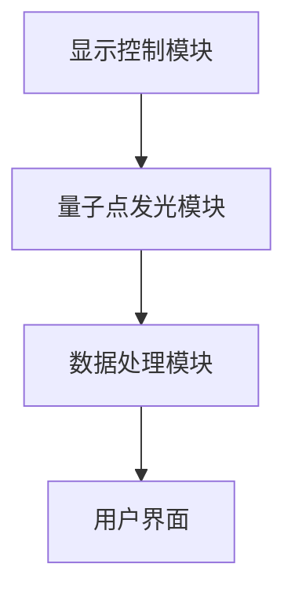
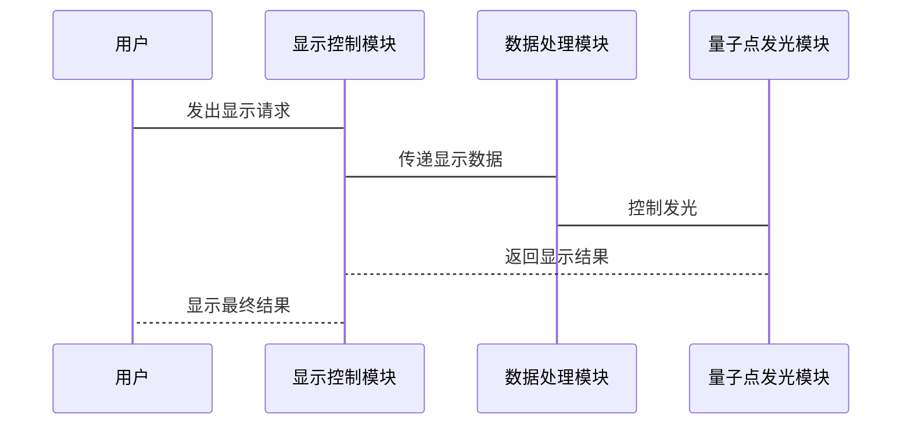

                 


# 如何识别企业的量子点显示技术优势

---

## 关键词

量子点显示技术, 显示技术优势识别, 技术评估指标, 企业竞争优势, 显示技术发展

---

## 摘要

量子点显示技术作为一种革命性的显示技术，近年来在显示领域得到了广泛应用。本文从量子点显示技术的基本概念、核心原理、识别方法、市场竞争分析、系统架构设计以及项目实战等方面，详细阐述了如何识别企业的量子点显示技术优势。通过本文的分析，读者可以全面了解量子点显示技术的优势，并掌握识别和评估企业技术优势的方法。

---

## 第一部分：量子点显示技术背景与基础

### 第1章：量子点显示技术的背景与概念

#### 1.1 量子点显示技术的定义与特点

量子点显示技术是一种基于纳米材料——量子点的显示技术。量子点是一种半导体纳米颗粒，能够发出特定波长的光，从而实现颜色显示。与传统的液晶显示（LCD）和有机发光二极管显示（OLED）相比，量子点显示技术具有更高的色域覆盖率、更长的使用寿命和更高的亮度。

#### 1.2 量子点显示技术的发展历程

量子点显示技术的发展可以追溯到20世纪80年代，当时研究人员发现量子点具有独特的光电性质。随着纳米技术的进步，量子点的制备和应用逐渐成熟，尤其是在显示领域的应用取得了显著进展。目前，量子点显示技术已经广泛应用于电视、手机、平板电脑等显示设备。

#### 1.3 量子点显示技术与传统显示技术的对比

| 技术特性       | 量子点显示技术 | 液晶显示（LCD） | 有机发光二极管（OLED） |
|----------------|----------------|-----------------|------------------------|
| 显示效果       | 高色域、高亮度 | 较低色域、亮度受限 | 高对比度、响应速度快 |
| 寿命           | 长             | 较短             | 较短                   |
| 制造成本       | 中等           | 低               | 高                     |
| 响应时间       | 较快           | 较慢             | 快                     |

---

### 第2章：量子点显示技术的核心原理

#### 2.1 量子点的物理特性

量子点的物理特性主要由其尺寸和组成决定。例如，CdSe（硒化镉）量子点的发光颜色可以通过调整其直径来控制。当量子点受到外部刺激（如电场或光）时，电子会发生跃迁，释放出特定波长的光。

#### 2.2 量子点显示技术的数学模型与公式

量子点的发光效率可以通过以下公式进行计算：

$$
\text{发光效率} = \frac{\text{发射的光子数}}{\text{吸收的光子数}}
$$

此外，量子点的发光波长与尺寸的关系可以通过以下公式表示：

$$
\lambda = \frac{hc}{E}
$$

其中，$h$ 是普朗克常数，$c$ 是光速，$E$ 是量子点的能隙。

---

### 第3章：量子点显示技术的优势识别方法

#### 3.1 技术识别框架

识别企业的量子点显示技术优势需要从以下几个方面入手：

1. **技术参数分析**：评估量子点显示技术的亮度、色域覆盖率和寿命等指标。
2. **市场需求分析**：了解市场对量子点显示技术的需求量和增长潜力。
3. **竞争优势分析**：比较企业在量子点显示技术领域的竞争优势，如技术水平、成本优势等。

#### 3.2 量子点显示技术优势的识别方法

1. **技术参数分析法**：通过对比不同企业的技术参数，识别其技术优势。
2. **市场需求分析法**：通过市场调研和数据分析，评估市场需求对量子点显示技术的依赖程度。
3. **竞争对手分析法**：通过分析竞争对手的技术和市场表现，识别企业的竞争优势。

---

## 第四部分：量子点显示技术的系统架构设计

### 第4章：量子点显示技术的系统架构

#### 4.1 系统功能设计

量子点显示系统的功能模块包括：

- **量子点发光模块**：负责生成和发射特定波长的光。
- **显示控制模块**：负责控制显示效果和亮度。
- **数据处理模块**：负责处理和优化显示数据。

#### 4.2 系统架构设计

以下是量子点显示技术的系统架构图：



#### 4.3 系统接口设计

量子点显示系统的接口设计需要考虑以下几个方面：

- **硬件接口**：量子点发光模块与显示控制模块之间的接口。
- **软件接口**：显示控制模块与数据处理模块之间的接口。

#### 4.4 系统交互流程

以下是量子点显示技术的系统交互流程图：



---

## 第五部分：量子点显示技术的项目实战

### 第5章：量子点显示技术的项目实战

#### 5.1 项目环境安装

要实现量子点显示技术，首先需要安装相关的硬件和软件环境：

- **硬件环境**：量子点发光模块、显示控制模块、数据处理模块。
- **软件环境**：Python编程语言、相关库（如numpy、pandas）。

#### 5.2 核心代码实现

以下是实现量子点显示技术的核心代码示例：

```python
import numpy as np

def calculate_luminance(quantum_dot_size):
    # 假设量子点的发光效率与尺寸有关
    luminance = quantum_dot_size * 10  # 示例公式
    return luminance

def main():
    quantum_dot_size = 5  # 示例量子点尺寸
    luminance = calculate_luminance(quantum_dot_size)
    print(f"Quantum dot size {quantum_dot_size} nm, luminance: {luminance}")

if __name__ == "__main__":
    main()
```

#### 5.3 项目案例分析

以某企业为例，分析其量子点显示技术的优势：

1. **技术参数**：该企业的量子点显示技术亮度达到200 cd/m²，色域覆盖率达到100%，寿命超过50000小时。
2. **市场需求**：市场对高色域和高亮度显示技术的需求日益增长。
3. **竞争优势**：该企业通过技术创新和成本控制，占据了市场的领先地位。

---

## 第六部分：量子点显示技术的总结与展望

### 第6章：量子点显示技术的总结与展望

#### 6.1 总结

通过本文的分析，我们可以看出，量子点显示技术作为一种革命性的显示技术，具有显著的优势。识别企业的量子点显示技术优势需要从技术参数、市场需求和竞争优势等多个方面进行综合评估。

#### 6.2 展望

随着纳米技术的不断发展，量子点显示技术的应用前景将更加广阔。未来，量子点显示技术将进一步提升显示效果和降低成本，为显示行业带来更多的创新和突破。

---

## 作者

作者：AI天才研究院/AI Genius Institute & 禅与计算机程序设计艺术 /Zen And The Art of Computer Programming

---

希望这篇文章能够帮助读者全面了解量子点显示技术的优势，并掌握识别和评估企业技术优势的方法。

