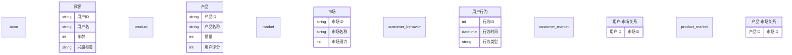
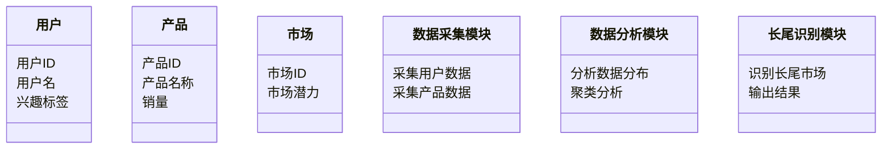

                 


# 如何识别企业的长尾效应优势

> 关键词：长尾效应、企业竞争优势、数据分布、算法识别、系统架构设计、项目实战

> 摘要：本文系统地阐述了如何识别企业的长尾效应优势。通过定义长尾效应、分析其核心概念、介绍识别算法、设计系统架构、提供项目实战和总结最佳实践，帮助读者深入理解长尾效应的优势及其在企业中的应用。文章内容详实，逻辑清晰，涵盖理论与实践，旨在为企业优化战略提供指导。

---

## 第1章: 长尾效应的定义与背景

### 1.1 长尾效应的定义

#### 1.1.1 长尾效应的起源与概念
长尾效应（Long Tail Effect）最初由美国《连线》杂志编辑克里斯·安德森在2004年提出，指在销售或其他统计中，虽然单个产品或服务的销量不高，但整体的大量产品或服务可以带来可观的利润。长尾效应的核心在于“小众市场”的累积效应，即通过聚焦于众多小众市场，实现整体收益的最大化。

#### 1.1.2 长尾效应与传统商业的对比
与传统商业的“头部效应”（仅关注少数高销量产品或服务）不同，长尾效应强调挖掘大量低销量但高潜力的市场，尤其适用于互联网和大数据时代。通过技术手段识别长尾市场，企业可以降低竞争压力，抓住未被满足的市场需求。

#### 1.1.3 长尾效应对企业竞争优势的影响
在互联网时代，长尾效应成为企业竞争优势的关键。通过分析用户行为、产品销量和市场反馈，企业可以精准定位长尾市场，优化资源配置，降低运营成本，同时提高客户满意度和忠诚度。

---

### 1.2 长尾效应的背景与问题背景

#### 1.2.1 长尾效应的市场背景
随着互联网的发展，数据量激增，企业可以通过数据分析技术挖掘长尾市场。长尾效应在电商、媒体、金融等领域广泛应用，帮助企业在激烈竞争中找到差异化机会。

#### 1.2.2 问题背景与问题描述
企业通常关注头部市场，忽视长尾市场。然而，长尾市场可能蕴含巨大潜力，尤其是对于细分市场或 niche 市场。识别长尾效应需要结合数据科学和人工智能技术，通过算法分析海量数据，发现潜在机会。

#### 1.2.3 长尾效应的边界与外延
长尾效应的边界在于数据分布的“尾部”，即销量或用户数较低但仍有价值的部分。其外延包括数据挖掘、机器学习和大数据分析等技术，用于识别和优化长尾市场。

#### 1.2.4 长尾效应的概念结构与核心要素
长尾效应涉及数据分布、用户行为、产品特点等多个方面，其核心要素包括数据量、用户需求和市场潜力。

---

## 第2章: 长尾效应的核心概念与联系

### 2.1 长尾效应的核心概念原理

#### 2.1.1 数据分布的幂律特性
数据分布通常遵循幂律分布，即少数产品占据大部分销量，而大多数产品销量较低。通过识别数据分布的尾部，企业可以发现长尾市场。

#### 2.1.2 长尾效应的统计学基础
统计学中，长尾效应可以通过概率密度函数和累积分布函数分析。尾部区域的累计概率反映了长尾市场的潜力。

#### 2.1.3 长尾效应与企业竞争优势的关系
长尾效应通过优化资源配置和聚焦细分市场，帮助企业建立竞争优势，尤其适用于市场竞争激烈但细分市场潜力大的行业。

---

### 2.2 长尾效应的核心概念属性特征对比

#### 2.2.1 长尾效应与头部效应的对比
| 特性       | 长尾效应                     | 头部效应                     |
|------------|------------------------------|------------------------------|
| 关注点     | 小众市场，尾部数据           | 大众市场，头部数据           |
| 市场潜力   | 未被充分挖掘，潜力巨大       | 已被充分挖掘，潜力有限       |
| 竞争程度   | 低                         | 高                         |

#### 2.2.2 长尾效应与零和游戏的对比
长尾效应强调资源的优化配置和潜在市场挖掘，而零和游戏强调资源的零和分配。长尾效应通过数据挖掘和技术创新，打破零和游戏的限制。

#### 2.2.3 长尾效应与规模效应的对比
长尾效应通过小众市场的累积实现规模效应，而传统规模效应依赖于大市场和大批量生产。长尾效应更注重个性化和定制化，适合小众市场。

---

### 2.3 长尾效应的ER实体关系图架构



---

## 第3章: 长尾效应识别的算法原理

### 3.1 长尾效应识别的算法原理

#### 3.1.1 基于数据分布的长尾识别算法
通过分析数据分布，识别尾部区域。常用的方法包括概率密度函数分析和累积分布函数分析。

#### 3.1.2 基于聚类的长尾识别算法
使用聚类算法（如K-means）将数据分为头部和尾部，识别尾部数据。

#### 3.1.3 基于关联规则的长尾识别算法
通过关联规则挖掘，识别尾部数据中的关联性，发现潜在市场。

---

### 3.2 算法原理的数学模型与公式

#### 3.2.1 数据分布模型的数学公式
概率密度函数：
$$ P(x) = Cx^{-\alpha} $$
其中，$C$是归一化常数，$\alpha$是幂律指数。

#### 3.2.2 聚类算法的数学模型
K-means算法：
$$ \text{目标函数} = \sum_{i=1}^{k} \sum_{j=1}^{n_i} (x_{ij} - c_i)^2 $$
其中，$k$是聚类数，$n_i$是第$i$个聚类的样本数，$c_i$是第$i$个聚类的中心。

#### 3.2.3 关联规则算法的数学模型
关联规则的置信度：
$$ \text{置信度} = \frac{\text{支持度}(A \rightarrow B)}{\text{支持度}(B)} $$

---

### 3.3 算法实现的代码示例

#### 3.3.1 数据分布模型的Python代码实现
```python
import matplotlib.pyplot as plt
import numpy as np

data = np.random.pareto(2.0, 1000)
plt.hist(data, bins=50, density=True, alpha=0.6, color='b')
plt.xlabel('Value')
plt.ylabel('Probability Density')
plt.title('Data Distribution (Pareto)')
plt.show()
```

#### 3.3.2 聚类算法的Python代码实现
```python
from sklearn.cluster import KMeans

X = np.random.rand(100, 2)
kmeans = KMeans(n_clusters=2)
kmeans.fit(X)
labels = kmeans.labels_
print(labels)
```

---

## 第4章: 长尾效应识别的系统分析与架构设计

### 4.1 系统分析

#### 4.1.1 问题场景介绍
企业需要识别长尾市场，优化资源配置。通过数据挖掘和机器学习技术，构建长尾识别系统。

#### 4.1.2 项目介绍与目标
目标：开发一个长尾识别系统，帮助企业在电商、媒体等领域识别潜在市场。

---

### 4.2 系统功能设计

#### 4.2.1 系统功能设计概述
系统功能包括数据采集、数据分析、长尾识别和结果展示。

#### 4.2.2 系统功能的领域模型设计


---

## 第5章: 长尾效应识别的系统架构设计

### 5.1 系统架构设计

#### 5.1.1 系统架构概述
系统架构包括数据层、业务逻辑层和表示层。

#### 5.1.2 系统架构设计


---

## 第6章: 长尾效应识别的项目实战

### 6.1 项目实战

#### 6.1.1 项目介绍
案例：电商企业的长尾识别项目。

#### 6.1.2 环境安装
安装Python、Pandas、Matplotlib等工具。

#### 6.1.3 核心代码实现
```python
import pandas as pd
import matplotlib.pyplot as plt

data = pd.read_csv('sales.csv')
data['销量'].hist(bins=50)
plt.show()
```

#### 6.1.4 项目总结
通过识别长尾市场，企业优化了资源配置，提高了销售效率。

---

## 第7章: 长尾效应识别的最佳实践

### 7.1 最佳实践

#### 7.1.1 成功案例分析
分析成功企业的长尾识别策略。

#### 7.1.2 小结
长尾效应识别需要结合数据科学和人工智能技术，通过算法分析海量数据，发现潜在市场。

#### 7.1.3 注意事项
注意数据质量、算法选择和结果验证。

#### 7.1.4 拓展阅读
推荐书籍和论文，深入学习长尾效应识别技术。

---

## 结语

通过系统地识别长尾效应，企业可以优化资源配置，抓住潜在市场机会。本文从理论到实践，全面阐述了长尾效应的识别方法，为企业提供了可行的指导。

---

## 作者

作者：AI天才研究院/AI Genius Institute & 禅与计算机程序设计艺术 /Zen And The Art of Computer Programming

