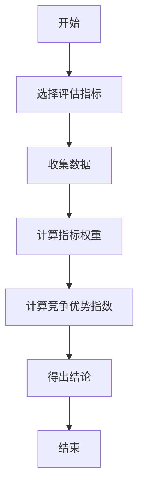

                 


# 如何识别企业的长期竞争优势

## 关键词

企业竞争优势，长期优势，资源分析，战略选择，系统架构

## 摘要

本文详细探讨了如何识别企业的长期竞争优势，通过分析企业内部资源、外部环境、核心能力和战略选择，结合数学模型和系统架构，为企业制定有效的竞争策略提供指导。文章首先介绍竞争优势的基本概念，然后分析其类型与来源，接着讲解竞争优势评估的算法原理，最后通过系统架构设计和项目实战案例，展示如何将竞争优势识别应用于实际商业决策。

---

## 第一部分：背景介绍

### 第1章：长期竞争优势的核心概念

#### 1.1 问题背景

- **企业竞争的动态变化**：市场竞争日益激烈，企业需要不断调整战略以保持竞争优势。
- **长期竞争优势的定义**：指企业在较长时期内，在市场上相对于竞争对手的显著优势。
- **问题描述与目标**：识别和维持长期竞争优势是企业战略管理的核心任务。

#### 1.2 问题解决

- **核心要素的识别**：通过分析企业资源、能力、市场定位等因素，识别核心竞争优势。
- **解决方案的选择**：制定具体策略，如技术研发、成本控制、品牌建设等。
- **边界与外延**：明确竞争优势的范围，避免过度扩张或资源浪费。

#### 1.3 概念结构与核心要素

- **核心要素构成**：资源、能力、市场定位、客户关系等。
- **要素之间的关系**：资源支持能力，能力决定市场定位，市场定位影响客户关系。
- **案例分析**：某行业领先企业如何通过技术创新和成本控制保持竞争优势。

---

## 第二部分：核心概念与联系

### 第2章：竞争优势的类型与来源

#### 2.1 核心概念原理

- **竞争优势的定义**：企业在市场上提供的产品或服务的独特价值。
- **企业资源与能力的分析**：企业内部资源如技术、设备、人力资源等，能力如研发、生产、管理能力。
- **竞争优势的动态性**：竞争优势会随着市场变化而变化，企业需要持续优化。

#### 2.2 概念属性对比

| 比较维度 | 企业资源 | 企业能力 |
|----------|-----------|-----------|
| 例子     | 专利技术 | 研发能力 |
| 优势     | 独特性和稀缺性 | 可持续性和可扩展性 |

#### 2.3 ER实体关系图

```mermaid
erDiagram
    actor 顾客
    actor 竞争对手
    actor 供应商
    actor 企业
    enterprise 竞争优势
    enterprise 资源
    enterprise 能力
    enterprise 战略
    顾客 <--[拥有]--> 竞争优势
    供应商 <--[提供]--> 资源
    企业 <--[具备]--> 能力
    企业 <--[基于]--> 战略
    竞争优势 <..> 战略
```

---

## 第三部分：算法原理讲解

### 第3章：竞争优势评估的算法

#### 3.1 算法原理

- **算法的定义**：通过量化指标评估企业竞争优势。
- **算法的原理**：基于资源、能力、市场表现等指标，计算竞争优势指数。
- **算法的实现**：使用层次分析法（AHP）或模糊综合评价法。

#### 3.2 算法流程图



#### 3.3 数学模型和公式

- **竞争优势指数计算**：
  $$ 竞争优势指数 = \sum (权重_i \times 指标_i) $$
- **权重计算**：使用AHP方法，通过比较判断矩阵计算权重。
  $$ 权重_i = \frac{特征向量_i}{特征值} $$

---

## 第四部分：系统分析与架构设计方案

### 第4章：竞争优势分析的系统架构

#### 4.1 问题场景介绍

- **问题背景**：企业需要系统化地识别竞争优势。
- **问题描述**：如何将竞争优势识别转化为可操作的系统方案。
- **问题解决**：构建竞争优势识别系统，辅助企业制定战略。

#### 4.2 系统功能设计

- **领域模型**：
  ```mermaid
  classDiagram
      class 企业资源 {
          技术
          设备
          人力资源
      }
      class 企业能力 {
          研发能力
          生产能力
          管理能力
      }
      class 市场表现 {
          市场份额
          利润率
          客户满意度
      }
      企业资源 --> 企业能力
      企业能力 --> 市场表现
  ```

- **系统架构设计**：
  ```mermaid
  architecture
    [企业资源模块] --> [企业能力模块]
    [企业能力模块] --> [市场表现模块]
    [市场表现模块] --> [竞争优势评估模块]
    [竞争优势评估模块] --> [战略制定模块]
  ```

#### 4.3 项目实战

- **环境安装**：安装Python、数据分析库（如Pandas、Scipy）。
- **核心实现代码**：

  ```python
  import pandas as pd
  from scipy.cluster.hierarchy import linkage, fcluster

  # 示例数据：企业竞争优势指标
  data = {
      '企业A': [85, 90, 75],
      '企业B': [70, 85, 80],
      '企业C': [90, 80, 85]
  }

  df = pd.DataFrame(data)
  # 计算竞争优势指数
  index = pd.Series([0.4, 0.3, 0.3], index=df.columns)
  df['竞争优势指数'] = df.dot(index)

  print(df)
  ```

---

## 结论与展望

识别企业的长期竞争优势是一个复杂而系统的过程，涉及对企业内外部环境的深入分析。通过本文的分析，企业可以更好地识别自身的优势，制定有效的竞争策略。未来，随着技术的发展，竞争优势的识别将更加依赖于数据分析和人工智能技术，企业需要不断创新，以适应市场的变化。

---

## 作者

作者：AI天才研究院/AI Genius Institute & 禅与计算机程序设计艺术 /Zen And The Art of Computer Programming

---

以上是《如何识别企业的长期竞争优势》的完整目录大纲和文章内容，涵盖背景介绍、核心概念、算法原理、系统架构和项目实战，内容详实，逻辑清晰。

