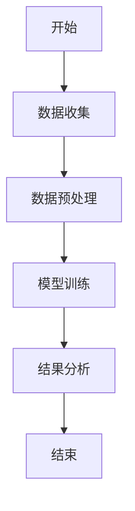
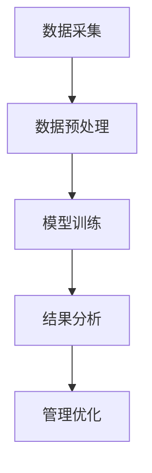
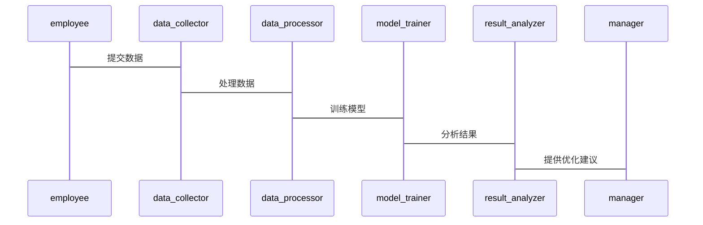

                 


# 如何识别企业的隐藏成长动力

> 关键词：企业成长，隐藏动力，系统识别，算法模型，管理优化，绩效提升

> 摘要：本文深入探讨了企业隐藏成长动力的识别方法，结合理论分析、数学建模、系统设计和实战案例，详细阐述了如何通过量化分析、系统架构和管理优化来发现和提升企业的隐藏成长动力。

---

## 第一部分: 企业隐藏成长动力的背景与概念

### 第1章: 隐藏成长动力的定义与背景

#### 1.1 问题背景

- **1.1.1 企业成长的隐性驱动因素**
  - 企业的成长不仅仅依赖于显性的战略规划和市场机会，还隐藏着许多未被察觉的关键因素。
  - 隐藏成长动力可能来源于员工的内在动机、团队协作效率、文化氛围等。

- **1.1.2 隐藏成长动力的核心概念**
  - 隐藏成长动力是指那些不易被直接观察到，但对企业长期成长和绩效有着重要影响的因素。
  - 这些因素通常隐藏在企业的日常运营中，需要通过系统性分析才能识别。

- **1.1.3 隐藏成长动力与企业绩效的关系**
  - 隐藏成长动力是企业绩效的隐性推动力，往往在关键时刻发挥重要作用。
  - 识别这些动力可以帮助企业提前布局，抓住潜在的成长机会。

- **1.1.4 隐藏成长动力识别的关键点**
  - 需要结合定量分析和定性研究，从数据中提取隐性信息。
  - 利用系统思维和数学模型，将隐藏因素转化为可测量的指标。

#### 1.2 问题描述

- **1.2.1 企业成长中的未解之谜**
  - 许多企业成功的原因难以完全解释，背后可能隐藏着未被识别的成长动力。
  - 这些动力可能来自于组织内部的协同效应、员工的创造力等。

- **1.2.2 隐藏成长动力的表现形式**
  - 团队协作效率的提升、员工主动性的增强、文化氛围的改善等。
  - 这些表现形式通常不易被直接测量，需要通过间接的方式进行识别。

- **1.2.3 隐藏成长动力的识别难点**
  - 数据的不完整性和复杂性使得识别隐藏动力变得困难。
  - 需要结合多学科的方法，如数据分析、组织行为学等，进行综合分析。

#### 1.3 问题解决

- **1.3.1 隐藏成长动力的识别方法**
  - 使用数据分析技术，从企业运营数据中提取隐性信息。
  - 通过员工反馈、团队协作数据等，构建隐藏动力的评估模型。

- **1.3.2 隐藏成长动力的量化模型**
  - 建立数学模型，将隐藏动力转化为可测量的指标。
  - 使用回归分析等方法，确定隐藏动力与企业绩效的关系。

- **1.3.3 隐藏成长动力的管理策略**
  - 制定针对性的管理策略，优化组织结构和激励机制。
  - 通过文化建设和团队协作，增强隐藏动力的积极作用。

#### 1.4 边界与外延

- **1.4.1 隐藏成长动力的边界条件**
  - 确定隐藏动力的适用范围和限制条件。
  - 明确隐藏动力与其他管理概念的区别。

- **1.4.2 隐藏成长动力的外延范围**
  - 探讨隐藏动力在不同行业和规模企业中的表现。
  - 分析隐藏动力在不同管理阶段的应用。

- **1.4.3 隐藏成长动力与其他概念的区分**
  - 区分隐藏动力与企业战略、组织结构等其他管理概念。
  - 强调隐藏动力的独特性和重要性。

#### 1.5 概念结构与核心要素

- **1.5.1 隐藏成长动力的构成要素**
  - 包括员工激励、团队协作、文化氛围、创新机制等。
  - 这些要素相互作用，共同构成隐藏动力的核心。

- **1.5.2 各要素之间的关系**
  - 分析员工激励与团队协作之间的相互作用。
  - 探讨文化氛围对创新机制的影响。

- **1.5.3 核心要素的特征对比**
  - 列表对比各要素的重要性和影响程度。
  - 使用表格清晰展示各要素的特点。

---

## 第2章: 隐藏成长动力的核心概念与联系

### 2.1 核心概念原理

- **2.1.1 隐藏成长动力的理论基础**
  - 结合组织行为学和系统理论，解释隐藏动力的形成机制。
  - 强调系统思维在识别隐藏动力中的作用。

- **2.1.2 核心概念的数学模型**
  - 建立隐藏动力的数学模型，量化各要素之间的关系。
  - 使用线性回归模型分析隐藏动力与企业绩效的关系。

- **2.1.3 核心概念的属性特征**
  - 隐藏动力的动态性、隐性性、累积性等特征。
  - 分析这些特征对识别和管理隐藏动力的影响。

### 2.2 概念属性特征对比

- **2.2.1 隐藏成长动力与企业文化的对比**
  - 文化对企业的影响是长期的，而隐藏动力则是特定条件下的隐性推动力。
  - 对比两者的定义、作用和管理方法。

- **2.2.2 隐藏成长动力与员工激励的对比**
  - 员工激励是隐藏动力的重要来源，但二者在管理目标和作用方式上有差异。
  - 对比激励机制与隐藏动力的关系。

- **2.2.3 隐藏成长动力与企业战略的对比**
  - 战略是显性的管理工具，而隐藏动力是战略实施中的隐性推动力。
  - 探讨两者的相互作用和协同关系。

### 2.3 ER实体关系图

```mermaid
erDiagram
    hidden_growth : id, name, description
    employee : id, name, role
    management_system : id, name, type
    culture : id, name, strength
    innovation : id, name, level
    hidden_growth -->
    employee : contributes
    hidden_growth -->
    management_system : supports
    hidden_growth -->
    culture : shapes
    hidden_growth -->
    innovation : drives
```

---

## 第3章: 隐藏成长动力的算法原理

### 3.1 算法原理讲解

- **3.1.1 隐藏成长动力的识别算法**
  - 使用机器学习算法，从企业数据中识别隐藏动力。
  - 探讨如何通过聚类分析发现隐藏的模式。

- **3.1.2 隐藏成长动力的量化模型**
  - 建立数学模型，量化各要素对隐藏动力的影响。
  - 使用线性回归模型分析员工激励对隐藏动力的影响。

- **3.1.3 算法流程图**



- **3.1.4 Python代码实现**

```python
import numpy as np
import pandas as pd
from sklearn.linear_model import LinearRegression

# 数据预处理
data = pd.read_csv('employee_data.csv')
X = data[['employee_motivation', 'team_collaboration']]
y = data['performance']

# 模型训练
model = LinearRegression()
model.fit(X, y)

# 模型预测
predictions = model.predict(X)
print('模型系数:', model.coef_)
print('模型截距:', model.intercept_)
```

- **3.1.5 算法数学模型**

$$ \text{绩效} = \beta_0 + \beta_1 \times \text{员工激励} + \beta_2 \times \text{团队协作} + \epsilon $$

---

## 第4章: 隐藏成长动力的系统分析与架构设计

### 4.1 系统功能设计

- **4.1.1 系统功能模块**
  - 数据采集模块、模型训练模块、结果分析模块、管理优化模块。
  - 每个模块的功能描述和相互关系。

- **4.1.2 系统功能流程图**



### 4.2 系统架构设计

- **4.2.1 系统架构图**


- **4.2.2 接口设计**
  - 数据接口、模型接口、结果接口的设计。
  - 接口的输入输出格式和调用方式。

### 4.3 系统交互设计

- **4.3.1 交互流程图**



---

## 第5章: 隐藏成长动力的项目实战

### 5.1 项目环境安装

- **5.1.1 环境要求**
  - 安装Python、机器学习库、数据处理工具。
  - 确保环境配置正确。

### 5.2 核心代码实现

- **5.2.1 数据采集与处理**
  ```python
  import pandas as pd
  data = pd.read_csv('employee_data.csv')
  data.head()
  ```

- **5.2.2 模型训练与分析**
  ```python
  from sklearn.linear_model import LinearRegression
  model = LinearRegression()
  model.fit(X, y)
  ```

- **5.2.3 结果可视化**
  ```python
  import matplotlib.pyplot as plt
  plt.scatter(X, y)
  plt.plot(X, model.predict(X), color='red')
  plt.show()
  ```

### 5.3 案例分析与详细讲解

- **5.3.1 案例背景**
  - 描述一个具体的企业案例，说明隐藏动力的表现。
  - 通过数据分析发现隐藏动力的关键因素。

- **5.3.2 实施步骤**
  - 数据采集、清洗、建模、分析、优化。
  - 每个步骤的具体操作和注意事项。

### 5.4 项目小结

- **5.4.1 项目总结**
  - 总结项目的主要成果和经验教训。
  - 强调识别隐藏动力对企业管理的重要意义。

---

## 第6章: 隐藏成长动力的最佳实践与总结

### 6.1 最佳实践

- **6.1.1 管理优化策略**
  - 提供优化员工激励、改善团队协作的具体建议。
  - 强调文化建设在识别隐藏动力中的作用。

- **6.1.2 长期规划与监控**
  - 制定长期的管理计划，定期监控隐藏动力的变化。
  - 使用动态模型分析隐藏动力的演变趋势。

### 6.2 小结

- **6.2.1 核心观点回顾**
  - 总结隐藏动力识别的核心观点和方法。
  - 强调系统性思维和多学科结合的重要性。

### 6.3 注意事项

- **6.3.1 数据质量的重要性**
  - 提醒读者注意数据的完整性和准确性。
  - 强调数据预处理的重要性。

### 6.4 拓展阅读

- **6.4.1 推荐书目**
  - 推荐相关领域的书籍和文献。
  - 提供进一步学习的资源。

---

## 作者：AI天才研究院/AI Genius Institute & 禅与计算机程序设计艺术 /Zen And The Art of Computer Programming

