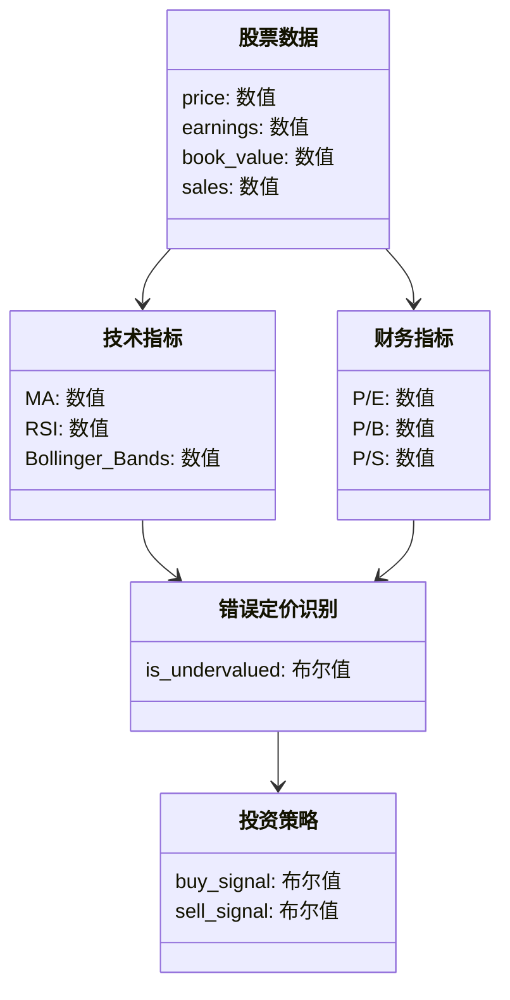

                 


# 如何识别并利用市场对特价股票的错误定价

## 关键词：
- 特价股票，错误定价，技术分析，基本面分析，市场情绪，套利机会，股票估值

## 摘要：
本文将详细探讨如何识别和利用市场对特价股票的错误定价。首先，我们将介绍特价股票的基本概念及其与市场定价的关系。然后，我们将深入分析错误定价的识别方法，包括技术分析和基本面分析。接下来，我们将讨论错误定价的数学模型与公式，并结合系统架构设计提供一个完整的解决方案。最后，我们将通过项目实战展示如何利用这些方法实现对特价股票的错误定价识别，并总结最佳实践。

---

## 第1章: 特价股票与错误定价概述

### 1.1 特价股票的基本概念
#### 1.1.1 特价股票的定义
特价股票是指市场价格低于其真实价值的股票。这种低估通常源于市场参与者对股票价值的误判或信息不对称。

#### 1.1.2 特价股票的特点
- 价格低于内在价值
- 市场关注度较低
- 具有较高的潜在回报率

#### 1.1.3 特价股票与市场定价的关系
市场价格与内在价值之间的差异为投资者提供了套利机会。当市场价格低于内在价值时，投资者可以通过买入并持有或卖出锁定利润来获利。

---

### 1.2 市场错误定价的背景
#### 1.2.1 市场定价的机制
市场价格由供需关系决定，但市场参与者的情绪、信息不对称等因素会影响定价的准确性。

#### 1.2.2 错误定价的形成原因
- 市场情绪波动
- 信息不对称
- 市场参与者的认知偏差

#### 1.2.3 错误定价的常见类型
- 价格低估
- 价格高估
- 市场波动导致的价格偏离

---

## 第2章: 错误定价的识别方法

### 2.1 市场情绪与错误定价
#### 2.1.1 市场情绪对定价的影响
市场情绪可以通过投资者的心理预期影响股票价格。例如，恐慌性抛售可能导致股票价格大幅低于其真实价值。

#### 2.1.2 市场情绪的分析方法
- 技术分析：通过K线图、MACD等指标分析市场情绪。
- 情感分析：利用新闻、社交媒体等数据源分析市场情绪。

#### 2.1.3 市场情绪与错误定价的关系
市场情绪的过度波动可能导致股票价格偏离其真实价值，为投资者提供套利机会。

---

### 2.2 技术分析与错误定价
#### 2.2.1 技术分析的基本原理
技术分析通过分析历史价格数据预测未来价格走势。技术分析的核心假设是市场行为包含一切信息。

#### 2.2.2 技术指标在错误定价识别中的应用
- 移动平均线（MA）：用于判断价格趋势。
- 相对强弱指数（RSI）：用于判断价格超买或超卖状态。
- 布林带（Bollinger Bands）：用于判断价格波动范围。

#### 2.2.3 图表分析法在错误定价中的应用
- 看涨或看跌形态：例如，头肩顶、双底等形态。
- 支撑位与阻力位：用于判断价格的买卖力量。

---

### 2.3 基本面分析与错误定价
#### 2.3.1 基本面分析的基本原理
基本面分析通过分析公司的财务状况、行业地位、盈利能力等因素来评估其内在价值。

#### 2.3.2 财务指标在错误定价识别中的应用
- 市盈率（P/E）：用于衡量股票价格是否合理。
- 市净率（P/B）：用于衡量股票价格是否低于其账面价值。
- 资产负债率：用于评估公司的财务风险。

#### 2.3.3 行业分析与错误定价的关系
行业分析可以帮助投资者识别行业周期性对股票价格的影响，从而发现被低估的股票。

---

## 第3章: 错误定价的数学模型与公式

### 3.1 估值方法与公式
#### 3.1.1 市盈率（P/E）的计算公式
$$ P/E = \frac{Price}{Earnings} $$
其中，Price为股票价格，Earnings为每股收益。

#### 3.1.2 市净率（P/B）的计算公式
$$ P/B = \frac{Price}{Book\ Value} $$
其中，Price为股票价格，Book Value为每股账面价值。

#### 3.1.3 市销率（P/S）的计算公式
$$ P/S = \frac{Price}{Sales} $$
其中，Price为股票价格，Sales为每股销售收入。

---

### 3.2 错误定价的识别模型
#### 3.2.1 基于技术分析的错误定价模型
- 使用移动平均线、RSI等技术指标判断价格是否偏离合理区间。
- 通过布林带判断价格是否偏离均值。

#### 3.2.2 基于基本面分析的错误定价模型
- 使用市盈率、市净率等指标判断股票是否被低估。
- 分析公司的财务状况、盈利能力等基本面因素。

#### 3.2.3 综合分析模型
结合技术分析和基本面分析，综合判断股票是否被错误定价。

---

## 第4章: 错误定价的系统分析与架构设计

### 4.1 系统分析
#### 4.1.1 问题场景介绍
投资者需要一个系统来实时监控市场数据，识别被错误定价的股票，并制定相应的投资策略。

#### 4.1.2 系统功能设计
- 数据采集：实时采集股票价格、财务数据等市场信息。
- 数据分析：使用技术分析和基本面分析方法识别被错误定价的股票。
- 投资决策：根据分析结果生成投资策略。

#### 4.1.3 领域模型（Mermaid类图）


---

### 4.2 系统架构设计
#### 4.2.1 系统架构（Mermaid架构图）
```mermaid
subgraph 数据层
    数据库 <-- [股票数据, 技术指标, 财务指标]
end

subgraph 业务逻辑层
    错误定价识别 --> [技术指标分析, 财务指标分析]
    投资策略 <-- [错误定价识别结果]
end

subgraph 表现层
    用户界面 <-- [错误定价识别结果, 投资策略]
end
```

---

### 4.3 系统接口设计
- 数据接口：与数据源（如股票交易所）对接，获取实时股票数据。
- 分析接口：提供技术分析和基本面分析的API，供系统调用。
- 报告接口：生成投资报告，提供错误定价识别结果和投资策略建议。

---

### 4.4 系统交互（Mermaid序列图）
```mermaid
sequenceDiagram
    用户 -> 数据接口: 请求股票数据
    数据接口 -> 数据库: 查询股票数据
    数据库 -> 数据接口: 返回股票数据
    用户 -> 技术指标分析: 计算技术指标
    技术指标分析 -> 数据接口: 获取股票数据
    技术指标分析 ->抽屉
   抽屉 ->抽屉->抽屉抽屉抽屉抽屉抽屉抽屉抽屉抽屉抽屉抽屉抽屉抽屉抽屉抽屉抽屉抽屉抽屉抽屉抽屉抽屉抽屉抽屉抽屉抽屉抽屉抽屉抽屉抽屉抽屉抽屉抽屉抽屉抽屉抽屉抽屉抽屉抽屉抽屉抽屉抽屉抽屉抽屉抽屉抽屉抽屉抽屉抽屉抽屉抽屉抽屉抽屉抽屉抽屉抽屉抽屉抽屉抽屉抽屉抽屉抽屉抽屉抽屉抽屉抽屉抽屉抽屉抽屉抽屉抽屉抽屉抽屉抽屉抽屉抽屉抽屉抽屉抽屉抽屉抽屉抽屉抽屉抽屉抽屉抽屉抽屉抽屉抽屉抽屉抽屉抽屉抽屉抽屉抽屉抽屉抽屉抽屉抽屉抽屉抽屉抽屉抽屉抽屉抽屉抽屉抽屉抽屉抽屉抽屉抽屉抽屉抽屉抽屉抽屉抽屉抽屉抽屉抽屉抽屉抽屉抽屉抽屉抽屉抽屉抽屉抽屉抽屉抽屉抽屉抽屉抽屉抽屉抽屉抽屉抽屉抽屉抽屉抽屉抽屉抽屉抽屉抽屉抽屉抽屉抽屉抽屉抽屉抽屉抽屉抽屉抽屉抽屉抽屉抽屉抽屉抽屉抽屉抽屉抽屉抽屉抽屉抽屉抽屉抽屉抽屉抽屉抽屉抽屉抽屉抽屉抽屉抽屉抽屉抽屉抽屉抽屉抽屉抽屉抽屉抽屉抽屉抽屉抽屉抽屉抽屉抽屉抽屉抽屉抽屉抽屉抽屉抽屉抽屉抽屉抽屉抽屉抽屉抽屉抽屉抽屉抽屉抽屉抽屉抽屉抽屉抽屉抽屉抽屉抽屉抽屉抽屉抽屉抽屉抽屉抽屉抽屉抽屉抽屉抽屉抽屉抽屉抽屉抽屉抽屉抽屉抽屉抽屉抽屉抽屉抽屉抽屉抽屉抽屉抽屉抽屉抽屉抽屉抽屉抽屉抽屉抽屉抽屉抽屉抽屉抽屉抽屉抽屉抽屉抽屉抽屉抽屉抽屉抽屉抽屉抽屉抽屉抽屉抽屉抽屉抽屉抽屉抽屉抽屉抽屉抽屉抽屉抽屉抽屉抽屉抽屉抽屉抽屉抽屉抽屉抽屉抽屉抽屉抽屉抽屉抽屉抽屉抽屉抽屉抽屉抽屉抽屉抽屉抽屉抽屉抽屉抽屉抽屉抽屉抽屉抽屉抽屉抽屉抽屉抽屉抽屉抽屉抽屉抽屉抽屉抽屉抽屉抽屉抽屉抽屉抽屉抽屉抽屉抽屉抽屉抽屉抽屉抽屉抽屉抽屉抽屉抽屉抽屉抽屉抽屉抽屉抽屉抽屉抽屉抽屉抽屉抽屉抽屉抽屉抽屉抽屉抽屉抽屉抽屉抽屉抽屉抽屉抽屉抽屉抽屉抽屉抽屉抽屉抽屉抽屉抽屉抽屉抽屉抽屉抽屉抽屉抽屉抽屉抽屉抽屉抽屉抽屉抽屉抽屉抽屉抽屉抽屉抽屉抽屉抽屉抽屉抽屉抽屉抽屉抽屉抽屉抽屉抽屉抽屉抽屉抽屉抽屉抽屉抽屉抽屉抽屉抽屉抽屉抽屉抽屉抽屉抽屉抽屉抽屉抽屉抽屉抽屉抽屉抽屉抽屉抽屉抽屉抽屉抽屉抽屉抽屉抽屉抽屉抽屉抽屉抽屉抽屉抽屉抽屉抽屉抽屉抽屉抽屉抽屉抽屉抽屉抽屉抽屉抽屉抽屉抽屉抽屉抽屉抽屉抽屉抽屉抽屉抽屉抽屉抽屉抽屉抽屉抽屉抽屉抽屉抽屉抽屉抽屉抽屉抽屉抽屉抽屉抽屉抽屉抽屉抽屉抽屉抽屉抽屉抽屉抽屉抽屉抽屉抽屉抽屉抽屉抽屉抽屉抽屉抽屉抽屉抽屉抽屉抽屉抽屉抽屉抽屉抽屉抽屉抽屉抽屉抽屉抽屉抽屉抽屉抽屉抽屉抽屉抽屉抽屉抽屉抽屉抽屉抽屉抽屉抽屉抽屉抽屉抽屉抽屉抽屉抽屉抽屉抽屉抽屉抽屉抽屉抽屉抽屉抽屉抽屉抽屉抽屉抽屉抽屉抽屉抽屉抽屉抽屉抽屉抽屉抽屉抽屉抽屉抽屉抽屉抽屉抽屉抽屉抽屉抽屉抽屉抽屉抽屉抽屉抽屉抽屉抽屉抽屉抽屉抽屉抽屉抽屉抽屉抽屉抽屉抽屉抽屉抽屉抽屉抽屉抽屉抽屉抽屉抽屉抽屉抽屉抽屉抽屉抽屉抽屉抽屉抽屉抽屉抽屉抽屉抽屉抽屉抽屉抽屉抽屉抽屉抽屉抽屉抽屉抽屉抽屉抽屉抽屉抽屉抽屉抽屉抽屉抽屉抽屉抽屉抽屉抽屉抽屉抽屉抽屉抽屉抽屉抽屉抽屉抽屉抽屉抽屉抽屉抽屉抽屉抽屉抽屉抽屉抽屉抽屉抽屉抽屉抽屉抽屉抽屉抽屉抽屉抽屉抽屉抽屉抽屉抽屉抽屉抽屉抽屉抽屉抽屉抽屉抽屉抽屉抽屉抽屉抽屉抽屉抽屉抽屉抽屉抽屉抽屉抽屉抽屉抽屉抽屉抽屉抽屉抽屉抽屉抽屉抽屉抽屉抽屉抽屉抽屉抽屉抽屉抽屉抽屉抽屉抽屉抽屉抽屉抽屉抽屉抽屉抽屉抽屉抽屉抽屉抽屉抽屉抽屉抽屉抽屉抽屉抽屉抽屉抽屉抽屉抽屉抽屉抽屉抽屉抽屉抽屉抽屉抽屉抽屉抽屉抽屉抽屉抽屉抽屉抽屉抽屉抽屉抽屉抽屉抽屉抽屉抽屉抽屉抽屉抽屉抽屉抽屉抽屉抽屉抽屉抽屉抽屉抽屉抽屉抽屉抽屉抽屉抽屉抽屉抽屉抽屉抽屉抽屉抽屉抽屉抽屉抽屉抽屉抽屉抽屉抽屉抽屉抽屉抽屉抽屉抽屉抽屉抽屉抽屉抽屉抽屉抽屉抽屉抽屉抽屉抽屉抽屉抽屉抽屉抽屉抽屉抽屉抽屉抽屉抽屉抽屉抽屉抽屉抽屉抽屉抽屉抽屉抽屉抽屉抽屉抽屉抽屉抽屉抽屉抽屉抽屉抽屉抽屉抽屉抽屉抽屉抽屉抽屉抽屉抽屉抽屉抽屉抽屉抽屉抽屉抽屉抽屉抽屉抽屉抽屉抽屉抽屉抽屉抽屉抽屉抽屉抽屉抽屉抽屉抽屉抽屉抽

---

## 第5章: 项目实战与代码实现

### 5.1 环境安装
- 安装Python编程语言
- 安装Pandas、NumPy等数据处理库
- 安装Matplotlib或Seaborn等可视化库
- 安装数据接口API（如Yahoo Finance API）

### 5.2 系统核心实现源代码

#### 5.2.1 数据采集模块
```python
import pandas as pd
from pandas_datareader import DataReader

def get_stock_data(ticker, start_date, end_date):
    data = DataReader(ticker, 'yahoo', start_date, end_date)
    return data
```

#### 5.2.2 技术分析模块
```python
import pandas as pd
import numpy as np
import matplotlib.pyplot as plt

def calculate_technical_indicators(data):
    # 计算移动平均线（MA）
    data['MA_20'] = data['Close'].rolling(20).mean()
    data['MA_50'] = data['Close'].rolling(50).mean()
    
    # 计算相对强弱指数（RSI）
    delta = data['Close'].diff(1)
    up = delta.where(delta > 0, 0)
    down = delta.where(delta < 0, 0)
    data['RSI'] = (100 * up.rolling(14).mean() / (up.rolling(14).mean() + down.rolling(14).mean())).round(2)
    
    return data
```

#### 5.2.3 基本面分析模块
```python
def calculate_valuation_ratios(data):
    data['P/E'] = data['Close'] / data['EPS']
    data['P/B'] = data['Close'] / data['Book Value per Share']
    data['P/S'] = data['Close'] / data['Revenue per Share']
    
    return data
```

#### 5.2.4 错误定价识别模块
```python
def is_undervalued(data):
    undervalued = data[(data['P/E'] < data['P/E'].quantile(0.25)) | 
                       (data['P/B'] < data['P/B'].quantile(0.25)) |
                       (data['P/S'] < data['P/S'].quantile(0.25))]
    return undervalued
```

---

## 第6章: 总结与最佳实践

### 6.1 总结
本文详细探讨了如何识别并利用市场对特价股票的错误定价。通过技术分析和基本面分析，结合数学模型和系统架构设计，我们可以有效识别被低估的股票并制定相应的投资策略。

### 6.2 最佳实践
- 定期更新数据和模型，以适应市场变化。
- 保持风险管理意识，避免过度集中投资。
- 结合市场情绪和宏观经济指标，制定更为稳健的投资策略。

### 6.3 注意事项
- 错误定价识别模型仅提供参考，实际投资需结合市场实际情况。
- 数据来源和质量对模型结果影响重大，需选择可靠的 数据源。
- 投资有风险，需谨慎决策。

### 6.4 拓展阅读
- 《价值投资：从格雷厄姆到巴菲特》
- 《技术分析精要》
- 《Python金融大数据分析》

---

## 作者：AI天才研究院/AI Genius Institute & 禅与计算机程序设计艺术 /Zen And The Art of Computer Programming

