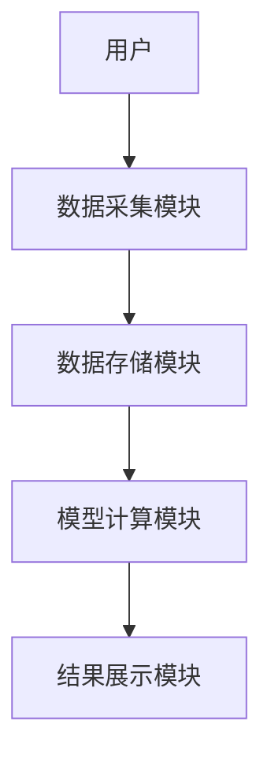

                 

# 如何运用DCF模型进行企业估值

> 关键词：企业估值，DCF模型，自由现金流，贴现率，加权平均资本成本，永续增长模型

> 摘要：本文将详细介绍如何运用DCF（Discounted Cash Flow）模型进行企业估值。从基础概念到高级应用，从理论分析到实际操作，本文将逐步引导读者掌握DCF模型的核心原理和应用方法。通过丰富的实例和详细的代码示例，本文旨在帮助读者更好地理解和应用DCF模型进行企业估值。

---

# 第1章: DCF模型概述

## 1.1 DCF模型的基本概念

### 1.1.1 什么是DCF模型

DCF（Discounted Cash Flow）模型是一种用于企业估值的金融模型，通过将企业未来产生的自由现金流折现到现值，来评估企业的内在价值。DCF模型的核心思想是：企业的价值取决于它未来能够为投资者创造的现金流。

### 1.1.2 DCF模型的核心思想

DCF模型基于以下两个假设：
1. 货币的时间价值：未来的现金流在现在的价值比未来价值更高。
2. 风险溢价：高风险的现金流需要更高的贴现率。

### 1.1.3 DCF模型在企业估值中的作用

DCF模型是企业估值中最常用的工具之一，广泛应用于并购、投资决策、股票定价等领域。

---

## 1.2 DCF模型的历史演变

### 1.2.1 DCF模型的起源

DCF模型起源于20世纪30年代的经济学理论，但真正发展起来是在20世纪60年代。现代DCF模型的核心思想来源于Modigliani-Miller定理。

### 1.2.2 DCF模型的发展历程

随着金融理论的发展，DCF模型不断完善。从最初的简单永续增长模型，到后来的两阶段模型和三阶段模型，DCF模型逐渐变得更为灵活和实用。

### 1.2.3 DCF模型的现状与趋势

目前，DCF模型已经成为企业估值的核心工具之一。随着技术的进步，DCF模型的计算和分析也更加智能化和自动化。

---

## 1.3 DCF模型的应用场景

### 1.3.1 企业价值评估的基本问题

企业价值评估的核心问题是：如何确定企业未来能够产生的现金流，并将其折现到现值。

### 1.3.2 DCF模型的适用条件

- 企业未来现金流可以合理预测。
- 企业的经营风险和市场风险可以量化。
- 贴现率可以合理估计。

### 1.3.3 DCF模型的局限性

- 现金流预测的不确定性较高。
- 贴现率的选择具有主观性。
- 模型假设过于简化。

---

## 1.4 本章小结

本章介绍了DCF模型的基本概念、核心思想、历史演变和应用场景。通过这些内容，读者可以对DCF模型有一个全面的了解。

---

# 第2章: DCF模型的理论基础

## 2.1 现金流的定义与分类

### 2.1.1 自由现金流的定义

自由现金流（Free Cash Flow，FCF）是指企业在扣除所有支出和债务之后，可以自由分配给股东和债权人的现金流。

### 2.1.2 经营活动现金流、投资活动现金流和筹资活动现金流的区别

- **经营活动现金流**：企业日常经营活动中产生的现金流。
- **投资活动现金流**：企业投资于长期资产或剥离长期资产产生的现金流。
- **筹资活动现金流**：企业通过发行债券、股票或偿还债务等筹资活动产生的现金流。

### 2.1.3 自由现金流的计算公式

$$ FCF = \text{EBIT} \times (1 - T) + Depreciation - Capital Expenditure $$

其中，EBIT是息税前利润，T是税率，Depreciation是折旧，Capital Expenditure是资本支出。

---

## 2.2 贴现率的计算

### 2.2.1 加权平均资本成本（WACC）的定义

WACC是企业在不同资本来源（股权和债务）上的加权平均成本。

### 2.2.2 WACC的计算公式

$$ WACC = \frac{E}{E+D} \times R_e + \frac{D}{E+D} \times R_d \times (1 - T) $$

其中，E是股权价值，D是债务价值，\( R_e \)是股权资本成本，\( R_d \)是债务资本成本，T是税率。

### 2.2.3 贴现率的确定方法

- 使用行业平均资本成本。
- 使用企业自身的资本成本。
- 使用无风险利率加风险溢价。

---

## 2.3 永续增长模型

### 2.3.1 永续增长模型的假设

假设企业在永续期内以恒定的增长率增长。

### 2.3.2 永续增长模型的公式

$$ PV = \frac{CF_1}{(r - g)} $$

其中，\( CF_1 \)是第一期的自由现金流，r是贴现率，g是增长率。

---

## 2.4 本章小结

本章详细讲解了现金流的定义与分类、贴现率的计算以及永续增长模型的原理和公式。

---

# 第3章: DCF模型的构建与应用

## 3.1 DCF模型的基本步骤

### 3.1.1 确定企业价值目标

明确企业估值的目标，例如企业整体价值、股权价值或可比公司估值。

### 3.1.2 数据收集与整理

收集企业的财务数据、行业数据和市场数据。

### 3.1.3 假设的设定与验证

设定合理的假设，例如现金流增长率、永续增长率和贴现率。

---

## 3.2 DCF模型的输入参数

### 3.2.1 自由现金流的预测

根据企业的历史数据和未来发展规划，预测未来的自由现金流。

### 3.2.2 贴现率的确定

根据企业的资本结构和市场环境，确定合适的贴现率。

### 3.2.3 永续增长率的设定

根据企业的市场地位和行业竞争情况，设定合理的永续增长率。

---

## 3.3 DCF模型的计算过程

### 3.3.1 现金流的折现计算

使用贴现率将未来现金流折现到现值。

### 3.3.2 现金流的终值计算

根据永续增长模型，计算未来现金流的终值。

### 3.3.3 总价值的计算

将折现值和终值相加，得到企业价值。

---

## 3.4 本章小结

本章详细讲解了DCF模型的构建步骤、输入参数和计算过程，帮助读者掌握DCF模型的实际应用方法。

---

# 第4章: DCF模型的高级应用

## 4.1 相对估值法

### 4.1.1 相对估值法的定义

相对估值法是通过比较可比公司的估值倍数（如市盈率、市净率）来确定企业价值。

### 4.1.2 相对估值法的优缺点

优点：简单易用，适用于市场数据丰富的行业。缺点：依赖可比公司数据，主观性较高。

---

## 4.2 非上市公司估值

### 4.2.1 非上市公司估值的挑战

非上市公司缺乏公开的市场数据，估值难度较大。

### 4.2.2 非上市公司估值的方法

可以使用DCF模型或相对估值法，结合企业的具体情况进行调整。

---

## 4.3 敏感性分析

### 4.3.1 敏感性分析的定义

敏感性分析是通过改变输入参数，观察企业价值的变化情况。

### 4.3.2 敏感性分析的应用

帮助投资者理解企业价值的关键驱动因素。

---

## 4.4 本章小结

本章介绍了DCF模型的高级应用，包括相对估值法、非上市公司估值和敏感性分析。

---

# 第5章: DCF模型的系统架构设计

## 5.1 企业估值系统的功能设计

### 5.1.1 数据采集模块

负责收集企业的财务数据、行业数据和市场数据。

### 5.1.2 模型计算模块

负责计算自由现金流、贴现率和终值。

### 5.1.3 结果展示模块

负责展示企业估值结果和相关分析报告。

---

## 5.2 企业估值系统的架构设计

---

## 5.3 企业估值系统的接口设计

### 5.3.1 数据接口

- 输入接口：财务数据、行业数据和市场数据。
- 输出接口：企业估值结果和分析报告。

### 5.3.2 用户接口

- 输入：用户输入参数和数据。
- 输出：可视化报告和估值结果。

---

## 5.4 本章小结

本章详细讲解了企业估值系统的功能设计、架构设计和接口设计。

---

# 第6章: DCF模型的项目实战

## 6.1 项目背景

### 6.1.1 项目目标

使用DCF模型对一家科技公司进行估值。

### 6.1.2 数据来源

使用公开的财务数据和行业数据。

---

## 6.2 项目实施

### 6.2.1 数据收集

收集公司的财务报表、行业报告和市场数据。

### 6.2.2 模型构建

使用Excel或Python搭建DCF模型，输入参数并进行计算。

### 6.2.3 计算结果

根据模型计算出公司的企业价值和股权价值。

---

## 6.3 项目总结

### 6.3.1 项目成果

得到公司的估值结果。

### 6.3.2 项目经验

DCF模型的应用需要大量的数据支持和合理的假设设定。

---

## 6.4 本章小结

本章通过一个实际案例，展示了如何使用DCF模型进行企业估值。

---

# 第7章: DCF模型的最佳实践

## 7.1 DCF模型的常见问题

### 7.1.1 现金流预测的不确定性

解决方案：使用概率加权和情景分析。

### 7.1.2 贴现率的选择

解决方案：使用市场利率和企业风险溢价。

---

## 7.2 DCF模型的注意事项

### 7.2.1 数据的准确性

确保数据来源可靠。

### 7.2.2 假设的合理性

假设应符合企业的实际情况。

---

## 7.3 DCF模型的未来发展趋势

### 7.3.1 智能化

随着AI和大数据技术的发展，DCF模型将更加智能化和自动化。

### 7.3.2 多元化

DCF模型将与其他估值方法结合，提供更加全面的估值结果。

---

## 7.4 本章小结

本章总结了DCF模型的常见问题、注意事项和未来发展趋势。

---

# 作者

作者：AI天才研究院/AI Genius Institute & 禅与计算机程序设计艺术 /Zen And The Art of Computer Programming

