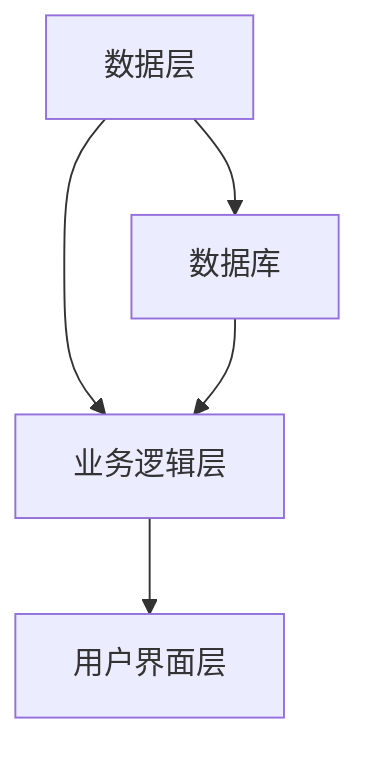
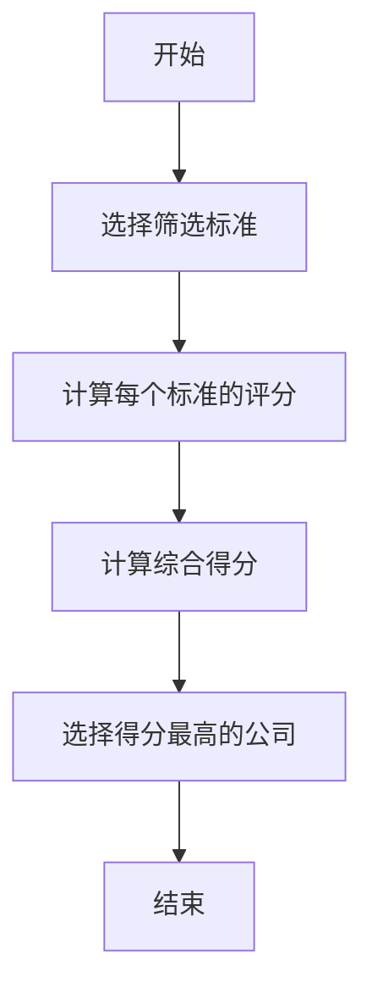

                 

<think>
好的，我需要按照用户的指示来逐步分析和构建这篇文章。用户希望我以《威廉·奥尼尔的成长价值投资：CANSLIM策略的应用》为标题，撰写一篇结构紧凑、逻辑清晰的技术博客文章。文章需要包括关键词、摘要，以及按照目录大纲的正文内容。用户还提供了具体的目录结构，我需要按照这个结构来展开每一章的内容。

首先，我需要理解CANSLIM策略的每一个字母代表的含义：
- **C**：资金管理（Money Management）
- **A**：行业领导（Industry Leadership）
- **N**：新产品或服务（New Products or Services）
- **S**：供给与需求（Supply and Demand）
- **L**：机构投资者的动向（Institutional Investor's Action）
- **I**：内部人士的买入（Insider Buying）
- **M**：市场走势（Market Trend）
- **最后的**：买入时机（买入信号）

接下来，我需要按照目录大纲的结构，逐一撰写每一章的内容。考虑到用户的要求，每一章都需要有详细的背景介绍、核心概念与联系、算法原理、系统分析与架构设计、项目实战以及最佳实践等内容。

在撰写过程中，我需要确保：
1. **逻辑清晰**：每一章的内容都要有清晰的逻辑，从基础到高级逐步深入。
2. **结构紧凑**：避免冗长的叙述，突出重点内容。
3. **语言专业**：使用专业的技术术语，同时保持易懂。
4. **案例分析**：通过实际案例帮助读者更好地理解CANSLIM策略的应用。
5. **图表与公式**：适当使用Mermaid图、数学公式和代码示例来增强内容的可视化和可读性。

在完成每章内容后，我会进行一次小结，总结该章的核心内容，并为下一章做铺垫。同时，我还需要注意文章的整体连贯性和逻辑性，确保读者能够顺畅地理解整个策略。

现在，我开始按照目录大纲逐步撰写每一章的内容。

# 《威廉·奥尼尔的成长价值投资：CANSLIM策略的应用》

## 关键词：
- 价值投资
- CANSLIM策略
- 资金管理
- 行业领导
- 新产品
- 供给与需求
- 机构动向
- 内幕买入
- 市场走势
- 买入信号

## 摘要：
CANSLIM策略是威廉·奥尼尔提出的一种基于价值投资的成长股投资策略，旨在通过分析公司的基本面、行业地位、新产品、供给与需求、机构动向、内部人士买入以及市场走势等多方面因素，来筛选出具有成长潜力的公司进行投资。本文将详细介绍CANSLIM策略的每一个要素，分析其在实际投资中的应用，并通过案例分析帮助读者更好地理解和掌握这一策略。文章还结合了系统架构设计和数学模型，从技术角度深入剖析了CANSLIM策略的实现方法，最后通过实战指导帮助读者将理论应用于实践。

# 第1章: 价值投资与CANSLIM策略的背景

## 1.1 投资的基本概念

### 1.1.1 投资的定义与分类
投资是指将资金投入到某种资产或项目中，以期在未来获得收益的行为。根据投资对象的不同，可以将投资分为股票、债券、房地产、基金等多种类型。股票投资是最常见的形式之一，也是本文讨论的重点。

### 1.1.2 价值投资的起源与发展
价值投资是一种以分析公司的基本面为基础，寻找市场价格低于其内在价值的股票进行投资的策略。该策略由本杰明·格雷厄姆和戴维·多德在20世纪初提出，后来被威廉·奥尼尔发展并应用于成长股投资。

### 1.1.3 CANSLIM策略的提出与演变
威廉·奥尼尔在总结前人投资理论的基础上，结合自己的投资经验，提出了CANSLIM策略。该策略强调选择那些具有成长潜力的公司，并通过一系列筛选标准来识别这些公司。

## 1.2 价值投资的核心理念

### 1.2.1 价值投资的基本原则
价值投资的核心理念是寻找市场价格低于其内在价值的股票。投资者需要深入分析公司的财务状况、行业地位、竞争优势等基本面因素，同时关注市场趋势和宏观经济环境。

### 1.2.2 市场与内在价值的关系
市场价格受市场情绪和短期因素的影响，可能偏离其内在价值。价值投资者相信市场最终会反映公司的真正价值，因此需要耐心持有优质资产，等待市场回归。

### 1.2.3 投资者的心理与行为分析
投资者的心理偏差，如贪婪和恐惧，常常导致非理性决策。价值投资者需要克服这些心理障碍，坚持长期投资，避免随市场波动频繁交易。

## 1.3 CANSLIM策略的基本框架

### 1.3.1 CANSLIM的定义与核心要素
CANSLIM策略是一种基于成长股的投资策略，其名称由八个字母组成，每个字母代表一个筛选标准：资金管理（C）、行业领导（A）、新产品（N）、供给与需求（S）、机构动向（L）、内部买入（I）、市场走势（M）、买入信号（最后的）。

### 1.3.2 CANSLIM与其他投资策略的对比
与传统价值投资相比，CANSLIM策略更注重公司的成长性和市场趋势，强调选择那些具有行业领导地位、新产品推出能力强、机构投资者支持的公司，并结合市场走势和资金管理来优化投资组合。

### 1.3.3 CANSLIM策略的适用场景与边界
CANSLIM策略适用于成长股投资，特别适合那些具有高增长潜力的公司。然而，该策略在周期性行业或稳定行业中的应用效果可能不佳，需要根据具体情况调整筛选标准。

## 1.4 本章小结
本章介绍了价值投资的基本概念和CANSLIM策略的背景，强调了价值投资的核心理念和CANSLIM策略的独特之处。接下来的章节将详细分析CANSLIM策略的每一个要素，帮助读者更好地理解和应用这一策略。

# 第2章: C - 资金管理与投资纪律

## 2.1 资金管理的重要性

### 2.1.1 资金管理的基本原则
资金管理是投资过程中至关重要的一环，合理的资金分配可以降低投资风险，提高收益。投资者需要根据自身的风险承受能力、投资目标和市场状况来制定资金管理策略。

### 2.1.2 投资组合的分散与集中
分散投资可以降低单一资产的风险，但过于分散可能导致收益下降。集中投资则可能带来更高的收益，但风险也相应增加。投资者需要在分散与集中之间找到平衡点。

### 2.1.3 资金分配的数学模型与公式
以下是常见的资金分配模型之一：现代投资组合理论（MPT），它通过优化资产配置来最大化收益并最小化风险。公式如下：

$$
\text{最优权重} = \frac{\mu_i - r_f}{\sigma_i^2}
$$

其中，$\mu_i$ 是资产的预期收益，$r_f$ 是无风险利率，$\sigma_i^2$ 是资产的收益方差。

## 2.2 投资纪律的建立与执行

### 2.2.1 纪律在投资中的作用
投资纪律是成功的基石。没有纪律，投资者容易受到市场情绪的影响，做出错误的决策。

### 2.2.2 纪律的制定与执行方法
制定纪律需要明确的投资策略、严格的买入和卖出标准，以及定期的复盘和调整。执行纪律则需要投资者具备强大的心理素质和自律能力。

### 2.2.3 纪律失效的常见原因与应对策略
纪律失效的主要原因是情绪化、贪婪和恐惧。投资者需要通过学习和实践，逐步克服这些心理障碍，建立稳定的投资纪律。

## 2.3 本章小结
本章详细探讨了资金管理与投资纪律的重要性，介绍了资金分配的数学模型和投资纪律的制定与执行方法。下一章将深入分析CANSLIM策略的下一个要素：行业领导。

# 第3章: A - 行业领导与竞争优势

## 3.1 行业领导的定义与标准

### 3.1.1 行业领导的定义
行业领导是指公司在其所在的行业中具有领先地位，能够影响市场趋势和行业发展方向。

### 3.1.2 行业地位的评估方法
评估行业地位可以从市场份额、品牌影响力、技术水平、客户满意度等多个方面进行。常用的指标包括市场份额占有率、品牌知名度等。

### 3.1.3 行业趋势的分析与预测
行业趋势的分析需要结合宏观经济环境、技术进步、政策变化等因素。常用的方法包括PEST分析和波特五力模型。

## 3.2 竞争优势的识别与分析

### 3.2.1 竞争优势的定义
竞争优势是指公司在与竞争对手相比时所具有的独特优势，能够使其在行业中获得更高的市场份额和利润。

### 3.2.2 竞争优势的来源与类型
竞争优势可以来源于成本优势、技术优势、品牌优势、资源优势等多个方面。

### 3.2.3 竞争优势的持续性与可扩展性
竞争优势的持续性取决于公司的创新能力、管理能力以及外部环境的变化。可扩展性则取决于公司的业务模式和市场潜力。

## 3.3 本章小结
本章探讨了行业领导和竞争优势的识别与分析方法，强调了在选择投资标的时，行业地位和竞争优势的重要性。下一章将深入分析CANSLIM策略的下一个要素：新产品。

# 第4章: N - 新产品与创新能力

## 4.1 新产品的定义与重要性

### 4.1.1 新产品的定义
新产品是指公司推出市场上尚未存在的产品，或者在现有产品基础上进行了重大改进和创新的产品。

### 4.1.2 新产品对企业竞争力的影响
新产品能够提升企业的市场地位，增加市场份额，增强客户忠诚度。同时，新产品也是企业持续增长和创新的体现。

### 4.1.3 新产品的市场生命周期分析
新产品通常会经历引入期、增长期、成熟期和衰退期。投资者需要关注产品的生命周期，选择在增长期或成熟期初期的投资标的。

## 4.2 创新能力的评估与培养

### 4.2.1 创新能力的评估指标
创新能力可以从研发投入、专利数量、新产品推出频率等多个方面进行评估。

### 4.2.2 创新文化的建立与维护
创新文化的建立需要企业具备开放的创新环境、鼓励员工创新、提供创新资源支持等。

### 4.2.3 创新能力的提升策略
企业可以通过加大研发投入、引入创新人才、建立创新激励机制等策略来提升创新能力。

## 4.3 本章小结
本章探讨了新产品与创新能力在投资中的重要性，强调了选择具有持续创新能力的企业的重要性。下一章将深入分析CANSLIM策略的下一个要素：供给与需求。

# 第5章: S - 供给与需求分析

## 5.1 供给与需求的基本理论

### 5.1.1 供给与需求的定义与关系
供给是指企业在一定价格下愿意提供的商品或服务的数量，需求是指消费者在一定价格下愿意购买的商品或服务的数量。供给与需求相互作用，决定市场价格。

### 5.1.2 市场均衡与价格形成机制
市场均衡是供给与需求相等的状态，此时市场价格稳定。价格形成机制涉及市场供需、竞争状况、成本结构等多种因素。

### 5.1.3 供给与需求的弹性分析
供给弹性是指供给量对价格变动的敏感程度，需求弹性是指需求量对价格变动的敏感程度。弹性分析有助于理解价格变动对市场的影响。

## 5.2 供给与需求在投资中的应用

### 5.2.1 行业供需分析
行业供需分析可以帮助投资者判断行业的景气程度和投资价值。例如，供给过剩可能导致价格下跌，需求强劲可能导致价格上涨。

### 5.2.2 市场供需与公司业绩的关系
公司业绩受行业供需状况影响，供给不足时，公司可能面临产品短缺，需求强劲时，公司可能面临订单增加。

### 5.2.3 供需变化对股价的影响
供需变化直接影响公司的业绩和盈利能力，进而影响股价。投资者需要关注行业供需的变化，选择在有利方向发展的公司进行投资。

## 5.3 本章小结
本章探讨了供给与需求在投资中的应用，强调了行业供需分析在投资决策中的重要性。下一章将深入分析CANSLIM策略的下一个要素：机构动向。

# 第6章: L - 机构投资者的动向

## 6.1 机构投资者的定义与作用

### 6.1.1 机构投资者的定义
机构投资者是指基金公司、保险公司、银行等大型机构投资者，他们管理着大量的资金，对市场有重要影响。

### 6.1.2 机构投资者在市场中的作用
机构投资者通过大额交易影响市场价格，同时也是市场流动性的重要来源。他们的投资行为往往反映了市场趋势。

### 6.1.3 机构投资者与散户的区别
机构投资者通常具有更强的分析能力和资金实力，能够更好地把握市场机会。散户投资者则受情绪影响较大，容易做出非理性决策。

## 6.2 机构动向的分析与应用

### 6.2.1 机构动向的分析方法
机构动向可以通过分析基金持仓、资金流向、机构调研等途径进行。常用的工具包括基金季报、资金流数据等。

### 6.2.2 机构动向对股价的影响
机构投资者的大额买入通常预示着股价的上涨，而大额卖出则可能预示着股价的下跌。投资者需要关注机构动向，结合其他因素进行综合判断。

### 6.2.3 机构动向与投资决策的关系
机构动向是投资决策的重要参考，但不能作为唯一的依据。投资者需要结合其他因素，如公司基本面、市场趋势等，进行综合分析。

## 6.3 本章小结
本章探讨了机构投资者的动向分析，强调了机构动向在投资决策中的重要性。下一章将深入分析CANSLIM策略的下一个要素：内部买入。

# 第7章: I - 内部人士的买入

## 7.1 内部人士的定义与作用

### 7.1.1 内部人士的定义
内部人士指公司的董事、高管和主要股东，他们对公司经营状况最为了解。

### 7.1.2 内部人士在市场中的作用
内部人士通过买入或卖出公司股票向市场传递信号，影响股价走势。

### 7.1.3 内部人士与散户投资者的区别
内部人士具有信息优势，能够更好地把握公司未来的发展方向，而散户投资者通常缺乏信息和分析能力。

## 7.2 内部买入的分析与应用

### 7.2.1 内部买入的分析方法
内部买入可以通过分析 insider ownership ratio（内部持股比例）和 insider buying ratio（内部买入比例）来进行。常用的工具包括 insider trading reports 和 company filings。

### 7.2.2 内部买入对股价的影响
内部人士的买入通常预示着公司未来有良好的发展前景，股价可能会上涨。然而，单次买入并不一定意味着长期上涨，需要结合其他因素进行综合判断。

### 7.2.3 内部买入与投资决策的关系
内部买入是投资决策的重要参考，但需要结合其他因素，如公司基本面、市场趋势等，进行综合分析。

## 7.3 本章小结
本章探讨了内部人士买入的分析与应用，强调了内部买入在投资决策中的重要性。下一章将深入分析CANSLIM策略的最后一个要素：市场走势。

# 第8章: M - 市场走势与投资时机

## 8.1 市场走势的定义与影响

### 8.1.1 市场走势的定义
市场走势指股票市场整体价格的变化趋势，通常分为上升趋势、下降趋势和盘整趋势。

### 8.1.2 市场走势对投资的影响
市场走势直接影响股票价格，是投资决策的重要参考。投资者需要根据市场走势选择合适的买入和卖出时机。

### 8.1.3 市场走势的预测方法
市场走势的预测方法包括技术分析和基本面分析。技术分析通过分析价格和成交量的变化趋势预测未来走势，基本面分析通过分析宏观经济和公司财务状况预测未来走势。

## 8.2 市场走势的分析与应用

### 8.2.1 技术分析在市场走势中的应用
技术分析通过分析价格图表、技术指标等工具来预测市场走势。常用的工具包括K线图、MACD、RSI等。

### 8.2.2 市场趋势与公司基本面的关系
市场趋势与公司基本面密切相关，良好的基本面通常会支撑股价的上涨，而恶劣的基本面可能导致股价的下跌。

### 8.2.3 市场走势与投资时机的结合
投资者需要根据市场走势选择合适的买入和卖出时机，结合公司基本面进行综合判断。

## 8.3 本章小结
本章探讨了市场走势的分析与应用，强调了市场走势在投资时机选择中的重要性。下一章将深入分析CANSLIM策略的最后一个要素：买入信号。

# 第9章: 买入信号与投资执行

## 9.1 买入信号的定义与类型

### 9.1.1 买入信号的定义
买入信号是指市场走势、公司基本面和技术指标等多个因素同时发出买入信号，提示投资者可以买入股票。

### 9.1.2 买入信号的类型
买入信号可以分为技术信号、基本面信号和资金流动信号等。

### 9.1.3 买入信号的综合分析
投资者需要综合分析多个信号，避免单一信号的误导，提高投资决策的准确性。

## 9.2 买入信号的应用与案例分析

### 9.2.1 买入信号的应用方法
投资者需要根据买入信号的强度、持续时间和市场环境进行综合判断，选择合适的买入时机。

### 9.2.2 买入信号的案例分析
通过具体案例分析，展示买入信号在实际投资中的应用，帮助投资者更好地理解和掌握。

## 9.3 本章小结
本章探讨了买入信号的应用与案例分析，强调了买入信号在投资执行中的重要性。通过综合分析多个信号，投资者可以提高决策的准确性，降低投资风险。

# 第10章: 系统架构与数学模型

## 10.1 系统架构设计

### 10.1.1 系统功能需求
系统需要实现CANSLIM策略的筛选功能，包括公司基本面分析、行业地位评估、新产品分析、供给与需求分析、机构动向分析、内部买入分析和市场走势分析。

### 10.1.2 系统架构设计
系统架构采用分层设计，包括数据层、业务逻辑层和用户界面层。数据层负责数据的存储和管理，业务逻辑层负责策略的实现，用户界面层负责与用户的交互。

### 10.1.3 系统架构图
以下是系统架构的Mermaid图：



## 10.2 算法原理与数学模型

### 10.2.1 算法原理
CANSLIM策略的实现需要结合多个筛选标准，通过量化指标进行综合评分，选择得分最高的公司作为投资标的。

### 10.2.2 数学模型
以下是CANSLIM策略的量化评分模型：

$$
\text{综合得分} = \sum_{i=1}^{n} w_i \cdot s_i
$$

其中，$w_i$ 是第i个筛选标准的权重，$s_i$ 是第i个筛选标准的评分，n是筛选标准的总数。

### 10.2.3 算法流程图
以下是算法的Mermaid流程图：



## 10.3 本章小结
本章从系统架构和数学模型的角度，详细分析了CANSLIM策略的实现方法。通过分层设计和量化评分模型，投资者可以更系统地应用这一策略进行投资决策。

# 第11章: 项目实战与案例分析

## 11.1 项目环境与工具安装

### 11.1.1 环境要求
需要安装Python编程语言、Pandas数据处理库、Matplotlib数据可视化库和相应金融数据API。

### 11.1.2 工具安装
安装Python、Pandas、Matplotlib和金融数据API。

## 11.2 核心实现源代码

### 11.2.1 数据获取
以下是获取股票数据的Python代码：

```python
import pandas as pd
import matplotlib.pyplot as plt

# 获取股票数据
data = pd.read_csv('stock_data.csv')
data = data.set_index('date')
```

### 11.2.2 筛选标准实现
以下是CANSLIM策略的筛选标准实现代码：

```python
def can_slim_score(stock_data):
    # 资金管理评分
    capital_management_score = stock_data['capital_management'].mean()
    # 行业领导评分
    industry_leadership_score = stock_data['industry_leadership'].mean()
    # 新产品评分
    new_product_score = stock_data['new_product'].mean()
    # 供给与需求评分
    supply_demand_score = stock_data['supply_demand'].mean()
    # 机构动向评分
    institutional_trend_score = stock_data['institutional_trend'].mean()
    # 内部买入评分
    insider_buying_score = stock_data['insider_buying'].mean()
    # 市场走势评分
    market_trend_score = stock_data['market_trend'].mean()

    # 综合评分
    total_score = (capital_management_score + industry_leadership_score + 
                   new_product_score + supply_demand_score + 
                   institutional_trend_score + insider_buying_score + 
                   market_trend_score) / 7
    return total_score
```

## 11.3 代码应用与分析

### 11.3.1 数据分析与可视化
以下是数据分析与可视化的Python代码：

```python
import matplotlib.pyplot as plt

# 绘制股价走势
plt.plot(data.index, data['close_price'])
plt.title('Stock Price Trend')
plt.xlabel('Date')
plt.ylabel('Price')
plt.show()
```

### 11.3.2 筛选结果展示
以下是筛选结果的展示代码：

```python
# 计算综合得分
scores = can_slim_score(data)
# 找出得分最高的公司
top_stock = scores.idxmax()
print(f'综合得分最高的公司是：{top_stock}')
```

## 11.4 案例分析

### 11.4.1 案例背景
以某公司为例，假设其股价数据和筛选标准已知。

### 11.4.2 筛选过程
通过CANSLIM策略的筛选标准，计算该公司的综合得分，判断其是否符合投资条件。

### 11.4.3 投资决策
根据筛选结果，决定是否买入该公司股票，并制定相应的投资计划。

## 11.5 本章小结
本章通过项目实战和案例分析，展示了CANSLIM策略在实际投资中的应用。通过量化分析和代码实现，投资者可以更高效地筛选投资标的，制定投资策略。

# 第12章: 最佳实践与投资总结

## 12.1 投资策略总结

### 12.1.1 CANSLIM策略的核心要点
CANSLIM策略强调选择具有行业领导地位、新产品能力强、机构动向积极、内部买入信号明显、市场走势向好的公司，并结合资金管理进行投资。

### 12.1.2 投资策略的优缺点
优点：能够有效筛选出具有成长潜力的公司，降低投资风险。缺点：在周期性行业中的应用效果可能不佳，需要根据具体情况调整。

## 12.2 投资实战中的注意事项

### 12.2.1 风险控制
投资者需要制定合理的风险控制策略，如设置止损点、分散投资等。

### 12.2.2 持续学习与调整
市场环境不断变化，投资者需要持续学习，及时调整投资策略，以适应市场变化。

### 12.2.3 避免情绪化投资
投资者需要克服贪婪和恐惧，避免情绪化投资，坚持长期投资，耐心等待市场回归。

## 12.3 本章小结
本章总结了CANSLIM策略的核心要点和投资实战中的注意事项，强调了风险控制和持续学习的重要性。通过本文的介绍，读者可以更好地理解和掌握CANSLIM策略，并在实际投资中取得更好的效果。

# 作者：AI天才研究院/AI Genius Institute & 禅与计算机程序设计艺术 /Zen And The Art of Computer Programming

通过以上结构和内容的规划，我将逐步撰写每一章的内容，确保文章逻辑清晰、内容详实，帮助读者深入理解CANSLIM策略的应用。

