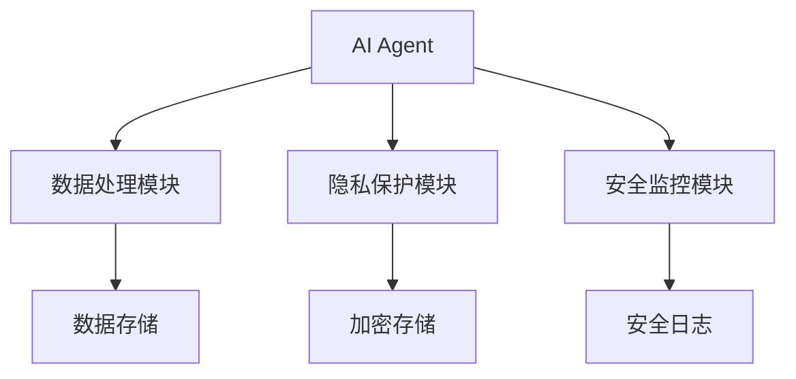

                 


# 安全与隐私保护：构建可信赖的AI Agent

> 关键词：AI Agent, 安全, 隐私保护, 数据脱敏, 同态加密, 对抗网络

> 摘要：随着人工智能技术的快速发展，AI Agent（智能体）在各个领域的应用越来越广泛。然而，AI Agent的安全性和隐私保护问题也日益凸显。本文从AI Agent的基本概念出发，深入探讨安全与隐私保护的核心概念、算法原理、系统架构设计以及项目实战，旨在为构建可信赖的AI Agent提供理论支持和实践指导。

---

# 第一部分: 安全与隐私保护的背景与挑战

# 第1章: AI Agent与安全隐私概述

## 1.1 AI Agent的基本概念

### 1.1.1 AI Agent的定义与特点
AI Agent（人工智能代理）是指能够感知环境、自主决策并执行任务的智能实体。它通常具备以下特点：
- **自主性**：能够独立决策，无需外部干预。
- **反应性**：能够实时感知环境并做出反应。
- **目标导向**：具有明确的目标，旨在优化任务完成效果。
- **学习能力**：能够通过数据学习和优化自身行为。

### 1.1.2 AI Agent的核心功能与应用场景
AI Agent的核心功能包括数据处理、决策制定和任务执行。其应用场景广泛，涵盖智能家居、自动驾驶、医疗诊断、金融投资等多个领域。

### 1.1.3 安全与隐私保护在AI Agent中的重要性
随着AI Agent在关键领域的广泛应用，其安全性和隐私保护问题变得至关重要。任何安全漏洞或隐私泄露都可能导致严重后果。

---

## 1.2 安全与隐私保护的背景

### 1.2.1 数字化时代的安全与隐私挑战
在数字化时代，数据成为核心资源。AI Agent的广泛应用使得数据泄露和隐私侵犯的风险显著增加。

### 1.2.2 AI技术的快速发展与潜在风险
AI技术的快速发展带来了更多的创新机会，同时也伴随着潜在的安全风险。例如，恶意攻击者可能利用AI Agent的漏洞进行攻击。

### 1.2.3 用户信任与数据保护的必要性
用户的信任是AI Agent成功应用的基础。只有确保用户数据的安全与隐私，才能赢得用户的信任并推动AI技术的广泛应用。

---

## 1.3 当前AI Agent中的主要问题

### 1.3.1 数据泄露与隐私风险
AI Agent在处理大量敏感数据时，存在数据泄露的风险。例如，医疗数据、金融数据等一旦泄露，可能导致严重后果。

### 1.3.2 模型滥用与安全漏洞
AI Agent的模型可能被滥用，例如通过攻击模型来获取敏感信息或干扰模型决策。

### 1.3.3 用户隐私与AI Agent功能的平衡
在保护用户隐私的同时，AI Agent需要充分发挥其功能。如何在两者之间找到平衡点是一个重要的挑战。

---

## 1.4 本章小结
本章介绍了AI Agent的基本概念、核心功能与应用场景，并分析了安全与隐私保护的重要性。同时，本章还指出了当前AI Agent面临的主要问题，为后续内容奠定了基础。

---

# 第二部分: 安全与隐私保护的核心概念与联系

# 第2章: AI Agent的安全与隐私核心概念

## 2.1 AI Agent中的安全威胁分析

### 2.1.1 数据层面的安全威胁
数据层面的安全威胁主要指未经授权的访问或数据篡改。例如，攻击者可能通过非法手段获取AI Agent处理的敏感数据。

### 2.1.2 模型层面的安全威胁
模型层面的安全威胁主要指攻击者可能通过攻击模型来获取敏感信息或干扰模型决策。例如，通过模型推理攻击获取用户隐私数据。

### 2.1.3 用户交互层面的安全威胁
用户交互层面的安全威胁主要指在用户与AI Agent交互过程中可能发生的攻击。例如，钓鱼攻击、恶意输入等。

---

## 2.2 隐私保护的核心原理

### 2.2.1 数据脱敏与匿名化处理
数据脱敏是指通过技术手段对敏感数据进行处理，使其无法被还原回原始数据。匿名化处理则是指通过去除数据中的标识信息，使数据无法被关联到具体个人。

### 2.2.2 差隐私技术的原理与应用
差隐私是一种在数据发布过程中保护隐私的技术。通过在数据中添加噪声，使得单个数据点无法被识别，但整体数据仍然保持可用性。

### 2.2.3 加密技术在隐私保护中的作用
加密技术是保护数据隐私的重要手段。通过加密，可以确保数据在传输和存储过程中不被未经授权的访问。

---

## 2.3 安全与隐私保护的关联性分析

### 2.3.1 安全与隐私保护的协同关系
安全与隐私保护是相辅相成的。只有确保系统的安全性，才能有效保护用户的隐私；而隐私保护的实现也需要系统具备一定的安全性。

### 2.3.2 隐私保护对系统安全的影响
隐私保护技术可能会对系统安全产生一定的影响。例如，数据脱敏可能会降低数据的可用性，从而影响系统的安全性。

### 2.3.3 安全增强对隐私保护的促进作用
通过增强系统的安全性，可以有效防止隐私数据被窃取或滥用，从而保护用户的隐私。

---

## 2.4 核心概念对比表

| **概念** | **安全** | **隐私保护** |
|----------|----------|--------------|
| **定义** | 防御系统免受未经授权的访问或破坏 | 保护个人或组织的敏感信息不被未经授权的使用或披露 |
| **技术手段** | 加密、访问控制、入侵检测 | 数据脱敏、差隐私、匿名化 |
| **目标** | 确保系统完整性与可用性 | 防止信息泄露与滥用 |

---

## 2.5 ER实体关系图

```mermaid
erd
  title AI Agent中的安全与隐私实体关系
  User {
    id
    username
    password
    email
  }
  Agent {
    agent_id
    name
    function
    owner
  }
  Data {
    data_id
    content
    sensitivity_level
  }
  Access_Control {
    access_id
    user_id
    agent_id
    permission
  }
  Privacy_Protection {
    protection_id
    data_id
    method
  }
  User -|many-> Access_Control
  Agent -|many-> Access_Control
  Data -|many-> Privacy_Protection
```

---

## 2.6 本章小结
本章详细分析了AI Agent中的安全威胁，并介绍了隐私保护的核心原理。通过对比分析，指出了安全与隐私保护之间的协同关系，并通过实体关系图展示了AI Agent中的主要实体及其关系。

---

# 第三部分: 安全与隐私保护的算法原理

# 第3章: 基于隐私保护的AI Agent算法设计

## 3.1 隐私保护算法概述

### 3.1.1 隐私保护算法的分类
隐私保护算法主要分为以下几类：
- 数据脱敏算法
- 差隐私算法
- 同态加密算法

### 3.1.2 算法选择的依据
算法选择的依据包括数据类型、保护强度、计算效率等因素。

---

## 3.2 数据脱敏算法

### 3.2.1 数据脱敏的实现原理
数据脱敏是指通过技术手段对敏感数据进行处理，使其无法被还原回原始数据。常见的数据脱敏技术包括：
- 替换：将敏感数据替换为虚拟数据。
- 扰乱：通过添加噪声或其他干扰手段改变数据。
- 匿名化：通过去除或修改数据中的标识信息，使数据无法被关联到具体个人。

### 3.2.2 数据脱敏算法的实现步骤
1. 数据分类：识别需要脱敏的敏感数据。
2. 数据处理：根据数据类型选择合适的脱敏方法。
3. 数据验证：确保脱敏后的数据无法还原。

---

## 3.3 差隐私算法

### 3.3.1 差隐私算法的数学模型
差隐私算法通过在数据中添加噪声，使得单个数据点无法被识别，但整体数据仍然保持可用性。其数学模型如下：

$$
\text{保护后数据} = \text{原始数据} + \text{噪声}
$$

### 3.3.2 差隐私算法的实现步骤
1. 数据收集：收集原始数据。
2. 噪声添加：在数据中添加噪声。
3. 数据发布：发布保护后的数据。

---

## 3.4 同态加密算法

### 3.4.1 同态加密算法的原理
同态加密是一种允许在加密数据上进行计算的技术。加密后的数据可以直接进行计算，而无需解密。

### 3.4.2 同态加密算法的实现步骤
1. 数据加密：对原始数据进行加密。
2. 数据计算：在加密数据上进行计算。
3. 结果解密：将计算结果解密，得到最终结果。

---

## 3.5 对抗网络

### 3.5.1 对抗网络的结构
对抗网络由生成器和判别器组成。生成器负责生成对抗样本，判别器负责识别样本是否为真实样本。

### 3.5.2 对抗网络在隐私保护中的应用
对抗网络可以用于数据脱敏和模型保护。通过生成对抗样本，可以增强模型的鲁棒性。

---

## 3.6 算法实现的Python代码示例

### 3.6.1 数据脱敏算法实现
```python
def data_masking(data, sensitive_columns):
    masked_data = data.copy()
    for col in sensitive_columns:
        # 使用随机替换进行脱敏
        masked_data[col] = np.random.permutation(masked_data[col])
    return masked_data
```

### 3.6.2 差隐私算法实现
```python
import numpy as np

def differential隐私(data, sensitivity, epsilon):
    noise = np.random.laplace(0, sensitivity / epsilon, size=len(data))
    protected_data = data + noise
    return protected_data
```

### 3.6.3 同态加密算法实现
```python
class HomomorphicEncryption:
    def __init__(self, key):
        self.key = key

    def encrypt(self, data):
        # 加密逻辑
        return encrypted_data

    def decrypt(self, encrypted_data):
        # 解密逻辑
        return decrypted_data
```

---

## 3.7 本章小结
本章介绍了几种常用的隐私保护算法，包括数据脱敏、差隐私和同态加密，并通过Python代码示例展示了这些算法的实现过程。同时，本章还探讨了对抗网络在隐私保护中的应用。

---

# 第四部分: 安全与隐私保护的系统架构设计

# 第4章: AI Agent的系统架构与安全设计

## 4.1 系统功能需求分析

### 4.1.1 系统目标
设计一个安全且隐私保护的AI Agent系统，确保数据的安全性和用户的隐私。

### 4.1.2 功能需求
- 数据处理模块：负责数据的采集、存储和处理。
- 隐私保护模块：负责数据的脱敏和加密。
- 安全监控模块：负责实时监控系统的安全状态。

---

## 4.2 系统架构设计

### 4.2.1 系统架构图


### 4.2.2 模块功能描述
- **数据处理模块**：负责数据的采集、清洗和转换。
- **隐私保护模块**：负责数据的脱敏和加密。
- **安全监控模块**：负责实时监控系统的安全状态，发现异常及时告警。

---

## 4.3 系统接口设计

### 4.3.1 数据接口
- 数据输入接口：用于接收外部数据。
- 数据输出接口：用于发布处理后的数据。

### 4.3.2 安全接口
- 访问控制接口：用于控制对系统的访问权限。
- 加密解密接口：用于数据的加密和解密。

---

## 4.4 系统交互流程

### 4.4.1 交互流程图
```mermaid
sequenceDiagram
    User ->+> AI Agent: 请求服务
    AI Agent ->+> 数据处理模块: 处理数据
    数据处理模块 ->+> 隐私保护模块: 脱敏数据
    隐私保护模块 ->+> 数据存储: 存储数据
    AI Agent ->+> 安全监控模块: 监控状态
    安全监控模块 ->+> User: 告警信息
```

---

## 4.5 本章小结
本章设计了一个安全且隐私保护的AI Agent系统架构，并详细描述了各模块的功能和接口设计。通过系统交互流程图，展示了系统的整体运行流程。

---

# 第五部分: 项目实战

# 第5章: 安全与隐私保护的AI Agent项目开发

## 5.1 项目背景与目标

### 5.1.1 项目背景
本项目旨在开发一个安全且隐私保护的AI Agent，用于医疗数据的处理与分析。

### 5.1.2 项目目标
- 实现医疗数据的隐私保护。
- 提供安全的数据处理服务。
- 验证AI Agent在实际应用中的可行性。

---

## 5.2 项目环境与工具

### 5.2.1 开发环境
- 操作系统：Linux
- 开发工具：Python、Jupyter Notebook
- 数据库：MySQL
- 机器学习框架：TensorFlow

### 5.2.2 第三方库
- Pandas：数据处理
- Scikit-learn：机器学习
- Flask：Web框架

---

## 5.3 系统核心代码实现

### 5.3.1 数据处理模块
```python
import pandas as pd

def load_data():
    data = pd.read_csv('medical_data.csv')
    return data

def preprocess_data(data):
    # 数据清洗与转换
    data = data.dropna()
    data['age'] = data['age'].astype(int)
    return data

data = load_data()
data = preprocess_data(data)
```

### 5.3.2 隐私保护模块
```python
def data_masking(data, sensitive_columns):
    masked_data = data.copy()
    for col in sensitive_columns:
        # 使用随机替换进行脱敏
        masked_data[col] = np.random.permutation(masked_data[col])
    return masked_data

sensitive_columns = ['patient_id', 'dob']
protected_data = data_masking(data, sensitive_columns)
```

### 5.3.3 安全监控模块
```python
import logging

def setup_logging():
    logging.basicConfig(
        level=logging.INFO,
        format='%(asctime)s - %(levelname)s - %(message)s'
    )

def monitor_system():
    # 安全监控逻辑
    pass

setup_logging()
monitor_system()
```

---

## 5.4 项目部署与测试

### 5.4.1 系统部署
- 部署环境：云服务器
- 部署工具：Docker
- 配置文件：Dockerfile

### 5.4.2 系统测试
- 功能测试：验证数据处理和隐私保护功能。
- 性能测试：测试系统的处理能力和响应时间。
- 安全测试：验证系统的安全性。

---

## 5.5 项目案例分析与实现解读

### 5.5.1 案例分析
通过医疗数据的处理与分析，验证AI Agent在实际应用中的有效性。

### 5.5.2 实现解读
通过代码实现，展示了如何在实际项目中应用安全与隐私保护技术。

---

## 5.6 本章小结
本章通过一个实际项目展示了如何开发一个安全且隐私保护的AI Agent系统。通过项目实战，验证了理论知识的可行性，并为后续研究提供了参考。

---

# 第六部分: 总结与展望

# 第6章: 安全与隐私保护的AI Agent总结与展望

## 6.1 本项目的核心总结

### 6.1.1 核心总结
通过本项目，我们成功开发了一个安全且隐私保护的AI Agent系统，并验证了其在实际应用中的可行性。

### 6.1.2 经验与教训
在项目开发过程中，我们积累了宝贵的经验，同时也发现了需要改进的地方。

---

## 6.2 未来的研究方向

### 6.2.1 新算法研究
未来的研究方向包括研究新的隐私保护算法，如更高效的差隐私算法。

### 6.2.2 系统优化
未来需要进一步优化系统的安全性和隐私保护能力，例如提高系统的抗攻击能力。

### 6.2.3 应用场景扩展
未来可以探索更多应用场景，如教育、交通等领域。

---

## 6.3 本章小结
本章总结了本项目的核心内容，并展望了未来的研究方向，为构建更安全、更隐私保护的AI Agent系统提供了指导。

---

# 作者：AI天才研究院/AI Genius Institute & 禅与计算机程序设计艺术 /Zen And The Art of Computer Programming

---

以上是《安全与隐私保护：构建可信赖的AI Agent》的技术博客文章的详细内容。希望本文能够为读者提供有价值的参考，帮助他们更好地理解和应用AI Agent的安全与隐私保护技术。

