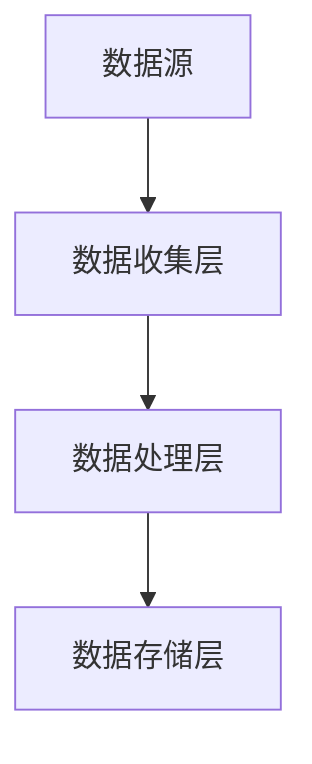
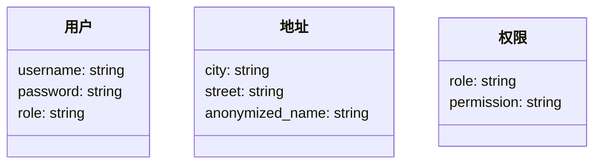

                 


# 安全性与数据隐私

## 关键词：数据安全、隐私保护、加密技术、匿名化、GDPR、系统架构、数据完整性

## 摘要：  
在数字化时代，数据安全与隐私保护成为企业和社会面临的核心挑战。本文系统地探讨了数据隐私保护的核心技术、安全性评估方法、法律合规要求以及系统架构设计。通过分析数据加密、匿名化、访问控制等技术，结合实际案例和系统设计，为读者提供了全面的安全性与数据隐私保护的解决方案。文章还总结了最佳实践和未来趋势，帮助读者更好地应对数据隐私保护的挑战。

---

# 第一章: 安全性与数据隐私概述

## 1.1 数据安全与隐私的基本概念

### 1.1.1 数据安全的核心概念  
数据安全是指通过技术手段保护数据的机密性、完整性、可用性和不可抵赖性。机密性确保只有授权人员可以访问数据；完整性确保数据在存储和传输过程中不被篡改；可用性确保数据在需要时可被访问；不可抵赖性确保数据来源的可信性。

**数据安全的核心要素：**  
- **机密性（Confidentiality）：** 数据仅限于授权人员访问。  
- **完整性（Integrity）：** 数据在存储和传输过程中保持准确和完整。  
- **可用性（Availability）：** 数据在需要时可被访问。  
- **不可抵赖性（Non-repudiation）：** 数据来源的可信性可被验证。  

### 1.1.2 数据隐私的定义与特点  
数据隐私是指个人或组织对自身数据的控制权，确保数据在收集、存储和使用过程中不被未经授权的第三方访问或滥用。  

**数据隐私的特点：**  
- **匿名化：** 数据经过处理后无法追溯到个人。  
- **最小化原则：** 数据收集和使用应遵循最小化原则，仅收集必要的数据。  
- **透明性：** 数据的使用方式需向用户公开透明。  

### 1.1.3 数据安全与隐私的边界与外延  
数据安全的边界在于确保数据在合法使用范围内的安全，而隐私保护的外延则涉及数据的匿名化、加密和访问控制等技术手段。  

## 1.2 安全性与数据隐私的重要性

### 1.2.1 数据泄露的潜在风险  
数据泄露可能导致以下后果：  
1. **个人隐私泄露：** 用户的个人信息被滥用，导致身份盗窃或欺诈。  
2. **企业声誉损失：** 数据泄露事件可能导致企业信任度下降。  
3. **法律风险：** 数据泄露可能违反相关法律法规，导致罚款和法律责任。  

### 1.2.2 隐私保护的法律与道德要求  
数据隐私保护不仅是技术问题，更是法律和道德问题。例如，欧盟的《通用数据保护条例》（GDPR）要求企业必须保护用户数据，并在数据泄露事件中及时通知用户。  

### 1.2.3 数字化时代数据安全的挑战  
随着云计算、物联网和人工智能等技术的普及，数据的收集和使用场景日益复杂，数据安全和隐私保护的挑战也越来越大。  

## 1.3 数据安全与隐私的技术发展

### 1.3.1 数据安全技术的历史演变  
数据安全技术从简单的密码学发展到今天的区块链和人工智能辅助的安全防护，经历了多个阶段的演变。  

### 1.3.2 隐私保护技术的最新进展  
近年来，隐私保护技术取得了显著进展，例如差分隐私、同态加密和零知识证明等技术的应用。  

### 1.3.3 数据安全与隐私的未来趋势  
未来，数据安全和隐私保护将更加智能化和自动化，区块链和人工智能等技术将发挥重要作用。  

## 1.4 数据安全与隐私的法律框架

### 1.4.1 全球主要数据隐私法律  
目前，全球主要的隐私法律包括：  
1. **欧盟GDPR：** 《通用数据保护条例》（General Data Protection Regulation）。  
2. **美国加州CCPA：** 《加州消费者隐私法案》（California Consumer Privacy Act）。  
3. **中国个人信息保护法：** 《中华人民共和国个人信息保护法》。  

### 1.4.2 GDPR等法规的核心要求  
GDPR要求企业明确数据处理的目的和合法性，确保数据的最小化收集和使用，并在数据泄露事件中及时通知用户。  

### 1.4.3 数据安全与隐私的合规性挑战  
企业需要通过技术手段和管理措施，确保数据处理活动符合相关法律法规的要求。  

## 1.5 本章小结  
本章介绍了数据安全和隐私保护的基本概念、重要性以及技术发展和法律框架，为后续章节的深入探讨奠定了基础。

---

# 第二章: 数据隐私保护的核心技术

## 2.1 数据加密技术

### 2.1.1 加密算法的分类与特点  
加密算法主要分为对称加密和非对称加密两大类。  

**对称加密：** 加密和解密使用相同的密钥，例如AES（高级加密标准）。  
**非对称加密：** 加密和解密使用不同的密钥，例如RSA算法。  

### 2.1.2 对称加密与非对称加密的原理  
对称加密通过将明文转换为密文来实现数据机密性保护，而非对称加密通过公钥和私钥的配用来实现数据签名和加密。  

### 2.1.3 加密技术在数据隐私中的应用  
加密技术广泛应用于数据存储和传输过程中的机密性保护，例如在云存储中加密用户数据。  

---

## 2.2 数据匿名化与脱敏技术

### 2.2.1 数据匿名化的定义与方法  
数据匿名化是指通过技术手段将数据中的敏感信息去除或变形，使其无法识别到具体个人。  

**匿名化方法：**  
1. **数据删除：** 删除敏感字段。  
2. **数据替换：** 用虚拟值替换敏感数据。  
3. **数据扰乱：** 对数据进行随机化处理。  

### 2.2.2 数据脱敏技术的实现原理  
数据脱敏通过技术手段将敏感数据转化为非敏感数据，例如将真实姓名替换为代号。  

### 2.2.3 匿名化与脱敏技术的对比分析  
匿名化强调数据的不可识别性，而脱敏技术强调数据的可用性。两者的目标都是保护数据隐私，但应用场景有所不同。  

---

## 2.3 数据访问控制技术

### 2.3.1 基于角色的访问控制（RBAC）  
RBAC通过定义用户角色和权限，确保用户只能访问与其角色相关的数据。  

**RBAC模型：**  
- **用户（User）：** 实体用户。  
- **角色（Role）：** 用户所属的角色。  
- **权限（Permission）：** 角色允许的操作。  

### 2.3.2 最小权限原则  
最小权限原则要求用户或程序仅拥有完成任务所需的最小权限。  

### 2.3.3 数据访问控制的实现方案  
通过配置管理权限和审计访问日志，确保数据访问的合法性。  

---

## 2.4 数据完整性与不可篡改性

### 2.4.1 数据完整性保护技术  
数据完整性保护技术通过校验和或哈希算法确保数据在存储和传输过程中的完整性。  

**常用哈希算法：**  
1. MD5：常用哈希算法，但已被广泛破解。  
2. SHA-256：更安全的哈希算法。  

### 2.4.2 区块链在数据完整性中的应用  
区块链通过去中心化和不可篡改的特性，确保数据的完整性。  

### 2.4.3 不可篡改性的实现方式  
通过区块链技术或时间戳技术，确保数据的不可篡改性。  

---

## 2.5 本章小结  
本章详细介绍了数据隐私保护的核心技术，包括加密技术、匿名化、访问控制和完整性保护，为后续章节的系统设计和实际应用提供了技术支持。

---

# 第三章: 数据安全性评估与风险分析

## 3.1 数据安全风险的识别与评估

### 3.1.1 数据安全风险的分类  
数据安全风险主要分为内部威胁和外部威胁两类。  

**内部威胁：** 由企业内部员工或合作伙伴造成的数据泄露。  
**外部威胁：** 由黑客攻击、恶意软件等外部因素造成的数据泄露。  

### 3.1.2 数据安全风险评估的步骤  
1. **风险识别：** 识别可能的数据安全风险。  
2. **风险分析：** 分析风险的影响和发生的可能性。  
3. **风险评估：** 评估风险的优先级。  

### 3.1.3 数据安全风险评估的工具  
常用的数据安全风险评估工具包括OWASP Top 10和ISO 27001标准。  

---

## 3.2 数据安全风险的应对策略

### 3.2.1 风险缓解措施  
1. **技术手段：** 使用加密、访问控制等技术手段。  
2. **管理措施：** 制定安全政策和操作流程。  
3. **培训教育：** 提高员工的安全意识。  

### 3.2.2 风险转移策略  
通过购买数据泄露保险，将部分风险转移给保险公司。  

### 3.2.3 风险接受策略  
对于低概率的高风险事件，可以采取风险接受策略，但需做好应急预案。  

---

## 3.3 数据安全风险的监控与预警

### 3.3.1 数据安全监控的工具  
1. **防火墙：** 监控网络流量。  
2. **入侵检测系统（IDS）：** 检测异常行为。  
3. **数据丢失防护（DLP）：** 监控数据流出情况。  

### 3.3.2 数据安全预警的实现  
通过设置阈值和规则，实时监控数据流量和系统日志，及时发现异常行为并发出预警。  

---

## 3.4 本章小结  
本章重点讨论了数据安全风险的识别、评估和应对策略，强调了数据安全监控和预警的重要性。

---

# 第四章: 数据隐私保护的法律与合规

## 4.1 数据隐私保护的法律框架

### 4.1.1 全球主要数据隐私法律  
1. **欧盟GDPR：** 要求企业明确数据处理的目的和合法性。  
2. **美国加州CCPA：** 规定消费者对其数据的访问和删除权利。  
3. **中国个人信息保护法：** 规范个人信息的收集、使用和保护。  

### 4.1.2 GDPR等法规的核心要求  
GDPR要求企业采取技术手段保护用户数据，并在数据泄露事件中及时通知用户。  

### 4.1.3 数据隐私保护的法律挑战  
企业需要在数据处理活动中遵守相关法律法规，并采取相应的技术措施。  

---

## 4.2 数据隐私保护的合规性要求

### 4.2.1 数据处理的合法性  
企业必须确保数据处理活动符合相关法律法规的要求。  

### 4.2.2 数据保护的最小化原则  
数据收集和使用必须遵循最小化原则，仅收集必要的数据。  

### 4.2.3 数据保护的透明性要求  
企业必须向用户公开数据处理的相关信息，并获得用户的授权。  

---

## 4.3 数据隐私保护的合规性挑战

### 4.3.1 合规性挑战的来源  
1. **法律法规的复杂性：** 不同国家和地区的法律要求不同。  
2. **技术实现的难度：** 需要采用先进的技术手段保护数据。  
3. **合规成本：** 合规需要投入大量的资源和成本。  

### 4.3.2 合规性解决方案  
1. **技术手段：** 采用加密、匿名化等技术手段。  
2. **管理措施：** 制定合规的管理制度和操作流程。  
3. **培训教育：** 提高员工的合规意识。  

---

## 4.4 本章小结  
本章重点讨论了数据隐私保护的法律框架和合规性要求，分析了企业面临的合规性挑战和解决方案。

---

# 第五章: 系统架构与数据隐私保护

## 5.1 系统架构设计

### 5.1.1 数据隐私保护的系统架构  
数据隐私保护的系统架构通常包括数据收集层、数据处理层和数据存储层。  

**数据收集层：** 负责数据的采集和预处理。  
**数据处理层：** 负责数据的加密、匿名化和访问控制。  
**数据存储层：** 负责数据的存储和管理。  

### 5.1.2 数据隐私保护的系统架构图  


---

## 5.2 数据隐私保护的技术实现

### 5.2.1 数据加密的实现  
通过AES加密算法对敏感数据进行加密存储和传输。  

### 5.2.2 数据匿名化的实现  
通过数据扰动技术对敏感字段进行匿名化处理。  

### 5.2.3 数据访问控制的实现  
通过RBAC模型实现基于角色的访问控制。  

---

## 5.3 数据隐私保护的系统实现

### 5.3.1 系统实现的步骤  
1. **需求分析：** 确定数据隐私保护的需求。  
2. **系统设计：** 设计数据隐私保护的系统架构。  
3. **技术实现：** 实现数据加密、匿名化和访问控制功能。  
4. **测试验证：** 对系统进行功能测试和安全测试。  

### 5.3.2 系统实现的代码示例  
```python
# 数据加密示例
import hashlib

def encrypt_string(s):
    return hashlib.sha256(s.encode()).hexdigest()

# 数据匿名化示例
def anonymize_data(data):
    # 对敏感字段进行匿名化处理
    anonymized_data = {}
    for key, value in data.items():
        if key in ['name', 'email']:
            anonymized_data[key] = ' anonymized '
        else:
            anonymized_data[key] = value
    return anonymized_data
```

---

## 5.4 本章小结  
本章详细介绍了数据隐私保护的系统架构和技术实现，为后续章节的项目实战奠定了基础。

---

# 第六章: 项目实战

## 6.1 项目背景与需求分析

### 6.1.1 项目背景  
以一个电商系统为例，讨论如何在实际项目中应用数据隐私保护技术。  

### 6.1.2 项目需求  
1. 对用户密码进行加密存储。  
2. 对用户地址进行匿名化处理。  
3. 实现基于角色的访问控制。  

---

## 6.2 系统设计与实现

### 6.2.1 系统功能设计  
1. 用户登录与注册：密码加密存储。  
2. 地址管理：地址信息匿名化处理。  
3. 权限管理：基于角色的访问控制。  

### 6.2.2 系统功能设计图  


---

## 6.3 系统实现与测试

### 6.3.1 环境安装  
1. 安装Python和相关库。  
2. 安装加密库和数据处理库。  

### 6.3.2 核心代码实现  
```python
# 用户模块
class User:
    def __init__(self, username, password, role):
        self.username = username
        self.password = self.encrypt_password(password)
        self.role = role

    def encrypt_password(self, password):
        return hashlib.sha256(password.encode()).hexdigest()

# 地址模块
class Address:
    def __init__(self, city, street, anonymized_name):
        self.city = city
        self.street = street
        self.anonymized_name = anonymized_name

# 权限模块
class Permission:
    def __init__(self, role, permission):
        self.role = role
        self.permission = permission
```

### 6.3.3 系统测试  
1. 功能测试：测试用户登录、地址匿名化和权限控制功能。  
2. 安全测试：测试数据加密和访问控制功能。  

---

## 6.4 本章小结  
本章通过一个实际项目，详细介绍了数据隐私保护的系统设计、实现和测试过程，帮助读者更好地理解和应用相关技术。

---

# 第七章: 最佳实践与未来趋势

## 7.1 数据隐私保护的最佳实践

### 7.1.1 技术层面  
1. 采用先进的加密技术和匿名化处理。  
2. 实现基于角色的访问控制。  

### 7.1.2 管理层面  
1. 制定数据隐私保护的管理制度。  
2. 定期进行安全培训和演练。  

### 7.1.3 合规层面  
1. 遵守相关法律法规。  
2. 建立数据泄露应急响应机制。  

---

## 7.2 数据隐私保护的未来趋势

### 7.2.1 新兴技术的应用  
1. 区块链技术：确保数据的不可篡改性。  
2. 人工智能：用于数据安全风险的预测和分析。  

### 7.2.2 数据隐私保护的智能化  
未来，数据隐私保护将更加智能化和自动化，例如通过AI技术实现动态风险评估和实时监控。

---

## 7.3 本章小结  
本章总结了数据隐私保护的最佳实践，并展望了未来的技术趋势，帮助读者更好地应对数据隐私保护的挑战。

---

# 作者：AI天才研究院/AI Genius Institute & 禅与计算机程序设计艺术 /Zen And The Art of Computer Programming

