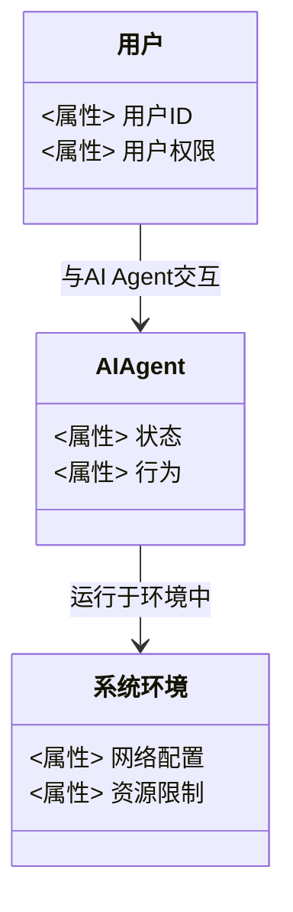

                 


```markdown
# 安全性测试：防范AI Agent的潜在风险

## 关键词：
AI Agent, 安全性测试, 潜在风险, 测试方法, 算法原理, 系统架构, 项目实战

## 摘要：
本文系统地探讨了AI Agent的安全性测试，从基本概念到算法原理，再到系统架构和项目实战，详细分析了AI Agent的潜在风险及防范措施。通过对比传统安全性测试与AI Agent测试的异同，提出了适用于AI Agent的安全性测试框架和方法，并结合实际案例，给出了详细的实现步骤和代码示例。最后，总结了最佳实践和注意事项，为读者提供了全面的安全性测试解决方案。

---

## 第一部分: AI Agent安全性测试基础

## 第1章: AI Agent与安全性测试概述

### 1.1 AI Agent的基本概念
#### 1.1.1 AI Agent的定义
AI Agent（人工智能代理）是指能够感知环境并采取行动以实现目标的智能实体。它通常具备以下核心特征：
- **自主性**：能够在没有外部干预的情况下独立运作。
- **反应性**：能够根据环境反馈实时调整行为。
- **目标导向**：所有行动都以实现特定目标为导向。
- **学习能力**：能够通过数据和经验优化自身的决策过程。

#### 1.1.2 AI Agent的核心特征
AI Agent的核心特征包括：
- **感知能力**：通过传感器或接口获取环境信息。
- **决策能力**：基于感知信息做出最优决策。
- **执行能力**：通过动作执行器与环境互动。
- **自适应能力**：根据反馈不断优化自身行为。

#### 1.1.3 AI Agent的应用场景
AI Agent广泛应用于多个领域，包括：
- **智能助手**：如Siri、Alexa等。
- **自动驾驶**：如特斯拉的Autopilot系统。
- **智能推荐系统**：如Netflix的个性化推荐。
- **机器人控制**：如工业机器人和家庭服务机器人。

### 1.2 安全性测试的定义与重要性
#### 1.2.1 安全性测试的定义
安全性测试是指通过模拟攻击或异常情况，验证系统在面对潜在威胁时的防护能力和恢复能力。其目标是确保系统在各种恶意攻击下仍能正常运行，并保护用户数据和系统安全。

#### 1.2.2 AI Agent安全性测试的重要性
随着AI Agent在各个领域的广泛应用，其安全性问题日益突出。AI Agent的决策依赖于算法和数据，一旦受到攻击，可能导致严重的后果，例如：
- **数据泄露**：攻击者可能通过漏洞获取敏感数据。
- **决策错误**：攻击可能导致AI Agent做出错误的决策，引发安全事故。
- **系统瘫痪**：攻击可能导致整个系统崩溃，影响正常运行。

#### 1.2.3 安全性测试的分类与特点
安全性测试可以根据不同的标准进行分类，常见的分类包括：
- **黑盒测试**：不考虑系统内部结构，仅通过输入输出进行测试。
- **白盒测试**：需要了解系统内部结构，针对特定漏洞进行测试。
- **灰盒测试**：介于黑盒和白盒之间，结合两者的优点。
- **动态测试**：在运行时动态分析系统行为。
- **静态测试**：通过代码分析等静态方法进行测试。

### 1.3 AI Agent潜在风险的背景与问题描述
#### 1.3.1 AI Agent的潜在风险来源
AI Agent的安全风险主要来源于以下几个方面：
- **数据泄露**：AI Agent依赖大量数据进行决策，数据泄露可能导致隐私问题。
- **算法漏洞**：AI算法可能存在逻辑漏洞，攻击者可以利用这些漏洞进行攻击。
- **恶意输入**：攻击者可以通过输入恶意数据干扰AI Agent的决策过程。
- **系统故障**：系统故障可能导致AI Agent无法正常工作，引发安全事故。

#### 1.3.2 问题背景与风险分析
随着AI技术的快速发展，AI Agent的应用场景越来越多，但其安全性问题却未得到充分重视。AI Agent的复杂性和自主性使其更容易成为攻击目标。攻击者可以通过多种方式干扰AI Agent，导致严重的后果。

#### 1.3.3 安全性测试的目标与边界
安全性测试的目标是通过测试发现并修复系统中的安全漏洞，确保系统在各种攻击下仍能正常运行。其边界包括：
- **攻击范围**：测试的攻击类型和强度。
- **测试环境**：测试的环境和条件。
- **测试目标**：测试的具体目标和范围。

### 1.4 本章小结
本章介绍了AI Agent的基本概念及其在各个领域的应用，分析了安全性测试的重要性，并讨论了AI Agent潜在风险的来源和安全性测试的目标与边界。

---

## 第2章: AI Agent安全性测试的核心概念

### 2.1 安全性测试的目标与方法
#### 2.1.1 安全性测试的目标
安全性测试的目标包括：
- **发现漏洞**：通过测试发现系统中的安全漏洞。
- **评估风险**：评估漏洞可能带来的风险。
- **验证防护措施**：验证系统防护措施的有效性。

#### 2.1.2 常用的安全性测试方法
常用的AI Agent安全性测试方法包括：
- **模拟攻击**：通过模拟攻击行为测试系统的防护能力。
- **异常检测**：通过分析系统行为检测异常行为。
- **数据验证**：通过数据验证确保输入数据的安全性。

#### 2.1.3 安全性测试的关键要素
安全性测试的关键要素包括：
- **测试用例**：设计合理的测试用例。
- **测试环境**：确保测试环境与实际环境一致。
- **测试工具**：使用专业的测试工具提高测试效率。

### 2.2 AI Agent与传统安全性测试的对比
#### 2.2.1 传统安全性测试的特点
传统安全性测试主要针对的是静态系统，测试方法相对固定，测试目标明确。

#### 2.2.2 AI Agent引入的新挑战
AI Agent的自主性和动态性给安全性测试带来了新的挑战：
- **动态行为**：AI Agent的行为是动态变化的，难以预测。
- **复杂决策**：AI Agent的决策过程复杂，难以通过传统方法进行测试。
- **数据依赖性**：AI Agent依赖大量数据进行决策，数据安全问题突出。

#### 2.2.3 两者的联系与区别
尽管AI Agent与传统系统在安全性测试上有相似之处，但AI Agent的动态性和复杂性要求安全性测试方法需要进行创新和调整。

### 2.3 安全性测试的流程与框架
#### 2.3.1 测试流程的概述
安全性测试的流程通常包括：
1. **需求分析**：明确测试目标和范围。
2. **测试设计**：设计测试用例和测试方案。
3. **测试执行**：执行测试用例，记录测试结果。
4. **结果分析**：分析测试结果，发现漏洞。
5. **修复验证**：验证漏洞修复效果。

#### 2.3.2 测试框架的设计
测试框架的设计需要考虑以下方面：
- **测试用例管理**：如何管理和组织测试用例。
- **测试执行引擎**：如何高效执行测试用例。
- **结果分析工具**：如何分析测试结果并生成报告。

#### 2.3.3 流程中的关键节点
在测试流程中，关键节点包括：
- **测试用例设计**：确保测试用例覆盖所有可能的攻击场景。
- **测试执行**：确保测试环境与实际环境一致。
- **结果分析**：准确识别系统漏洞并提出修复建议。

### 2.4 核心概念的ER实体关系图
以下是核心概念的ER实体关系图：

```mermaid
erDiagram
    actor 测试人员 {
        <属性> 测试用例
        <属性> 测试结果
    }
    class AI Agent {
        <属性> 状态
        <属性> 行为
    }
    class 系统环境 {
        <属性> 网络配置
        <属性> 资源限制
    }
    测试人员 --> AI Agent : 执行测试用例
    AI Agent --> 系统环境 : 运行于环境中
```

### 2.5 本章小结
本章详细探讨了AI Agent安全性测试的核心概念，包括测试目标、方法、流程与框架，并通过ER实体关系图展示了核心概念之间的关系。

---

## 第3章: AI Agent安全性测试的算法原理

### 3.1 基于概率的攻击检测算法
#### 3.1.1 算法的基本原理
基于概率的攻击检测算法通过分析系统行为的概率分布来检测异常行为。其基本原理是：正常行为的概率分布与异常行为的概率分布存在显著差异。

#### 3.1.2 算法的数学模型
基于概率的攻击检测算法的数学模型如下：

$$ P(A|E) = \frac{P(E|A)P(A)}{P(E)} $$

其中：
- \( P(A|E) \)：在观察到事件E的情况下，事件A发生的概率。
- \( P(E|A) \)：在事件A发生的情况下，观察到事件E的概率。
- \( P(A) \)：事件A的先验概率。
- \( P(E) \)：事件E的全概率。

#### 3.1.3 算法的实现步骤
基于概率的攻击检测算法的实现步骤如下：

1. **数据收集**：收集系统行为数据。
2. **数据预处理**：对数据进行清洗和标准化处理。
3. **模型训练**：训练概率分布模型。
4. **异常检测**：根据概率分布模型检测异常行为。

### 3.2 基于行为分析的异常检测算法
#### 3.2.1 算法的基本原理
基于行为分析的异常检测算法通过分析系统行为的模式来检测异常行为。其基本原理是：正常行为具有一定的模式，异常行为会打破这种模式。

#### 3.2.2 算法的数学模型
基于行为分析的异常检测算法的数学模型如下：

$$ S = \sum_{i=1}^{n} (x_i - \mu)^2 $$

其中：
- \( S \)：系统行为的异常程度。
- \( x_i \)：系统行为的数据点。
- \( \mu \)：系统行为的平均值。

#### 3.2.3 算法的实现步骤
基于行为分析的异常检测算法的实现步骤如下：

1. **数据收集**：收集系统行为数据。
2. **数据预处理**：对数据进行清洗和标准化处理。
3. **模式识别**：识别正常行为的模式。
4. **异常检测**：检测偏离正常模式的行为。

### 3.3 算法的对比与优化
#### 3.3.1 算法的对比分析
基于概率的攻击检测算法和基于行为分析的异常检测算法各有优缺点：

- **基于概率的攻击检测算法**：优点是能够捕捉到低概率的异常行为，缺点是计算复杂度较高。
- **基于行为分析的异常检测算法**：优点是计算复杂度低，缺点是可能无法捕捉到低概率的异常行为。

#### 3.3.2 算法的优化策略
为了提高算法的检测效果，可以采用以下优化策略：
- **混合算法**：将基于概率的攻击检测算法和基于行为分析的异常检测算法结合起来。
- **在线学习**：通过在线学习不断更新模型，提高检测效果。
- **特征选择**：选择最具代表性的特征进行分析，提高检测效率。

### 3.4 本章小结
本章详细介绍了两种主要的攻击检测算法，并通过对比分析提出了优化策略，为实际应用提供了理论基础。

---

## 第4章: AI Agent安全性测试的系统分析与架构设计

### 4.1 系统分析与需求定义
#### 4.1.1 问题场景介绍
在本章中，我们将以一个智能助手AI Agent为例，分析其安全性测试的需求和挑战。

#### 4.1.2 项目介绍
本项目旨在开发一个智能助手AI Agent，并对其进行全面的安全性测试，确保其在面对各种攻击时仍能正常运行。

### 4.2 系统功能设计
#### 4.2.1 领域模型类图
以下是智能助手AI Agent的领域模型类图：



#### 4.2.2 系统架构设计
以下是系统的架构设计：


### 4.3 系统架构设计
#### 4.3.1 系统架构设计
系统架构设计包括以下几个部分：
- **AI Agent模块**：包括状态管理器、行为管理器和数据管理器。
- **测试环境模块**：包括测试用例生成器、测试执行器和结果分析器。

#### 4.3.2 系统接口设计
系统接口设计包括：
- **用户接口**：与AI Agent交互的接口。
- **测试接口**：用于安全性测试的接口。

#### 4.3.3 系统交互设计
以下是系统的交互设计：

```mermaid
sequenceDiagram
    actor 测试人员
    system AI Agent
    system 测试环境
    测试人员 -> AI Agent: 发起安全性测试
    AI Agent -> 测试环境: 执行测试用例
    测试环境 -> 测试人员: 返回测试结果
```

### 4.4 本章小结
本章通过系统分析与架构设计，明确了AI Agent安全性测试的实现方案，并通过类图和序列图展示了系统的整体结构和交互过程。

---

## 第5章: AI Agent安全性测试的项目实战

### 5.1 环境安装与配置
#### 5.1.1 开发环境
- **操作系统**：Linux Ubuntu 20.04
- **编程语言**：Python 3.8
- **开发工具**：PyCharm
- **依赖库**：numpy、scikit-learn、matplotlib

#### 5.1.2 安装步骤
1. 安装Python和pip：
   ```bash
   apt-get update && apt-get install python3 python3-pip
   ```
2. 安装依赖库：
   ```bash
   pip install numpy scikit-learn matplotlib
   ```

### 5.2 核心代码实现
#### 5.2.1 数据预处理
```python
import numpy as np
from sklearn.preprocessing import StandardScaler

# 加载数据
data = np.loadtxt('system_behavior.csv', delimiter=',')

# 标准化处理
scaler = StandardScaler()
data_scaled = scaler.fit_transform(data)
```

#### 5.2.2 模型训练
```python
from sklearn.gaussian_mixture import GaussianMixture

# 训练概率分布模型
model = GaussianMixture(n_components=2, random_state=42)
model.fit(data_scaled)
```

#### 5.2.3 异常检测
```python
# 预测异常行为
labels = model.predict(data_scaled)
# 可视化结果
import matplotlib.pyplot as plt

plt.scatter(data_scaled[:, 0], data_scaled[:, 1], c=labels, cmap='viridis')
plt.xlabel('行为特征1')
plt.ylabel('行为特征2')
plt.title('异常行为检测结果')
plt.show()
```

### 5.3 案例分析与详细解读
#### 5.3.1 案例分析
假设我们有一个智能助手AI Agent，我们可以通过上述代码实现对其行为的异常检测。

#### 5.3.2 详细解读
- **数据预处理**：标准化处理确保数据在不同特征上的尺度一致，有助于模型训练。
- **模型训练**：使用高斯混合模型训练概率分布模型，识别正常行为和异常行为。
- **异常检测**：通过模型预测结果，识别异常行为，并通过可视化工具展示检测结果。

### 5.4 项目小结
本章通过实际案例展示了AI Agent安全性测试的实现过程，包括环境安装、数据预处理、模型训练和异常检测等步骤，帮助读者掌握安全性测试的核心技术。

---

## 第6章: AI Agent安全性测试的最佳实践与注意事项

### 6.1 最佳实践
#### 6.1.1 测试用例设计
- **覆盖所有可能的攻击场景**：确保测试用例覆盖所有可能的攻击场景。
- **动态调整测试用例**：根据系统更新动态调整测试用例。

#### 6.1.2 测试环境搭建
- **模拟真实环境**：测试环境应尽可能接近真实环境。
- **隔离测试环境**：确保测试环境与生产环境隔离，避免测试对实际系统造成影响。

#### 6.1.3 测试结果分析
- **记录详细日志**：记录测试过程中的详细日志，便于后续分析。
- **定期回顾测试结果**：定期回顾测试结果，优化测试策略。

### 6.2 小结
本章总结了AI Agent安全性测试的最佳实践，包括测试用例设计、测试环境搭建和测试结果分析等方面。

### 6.3 注意事项
- **数据隐私**：测试过程中需要注意数据隐私，避免数据泄露。
- **系统稳定性**：测试过程中需要注意系统稳定性，避免测试对实际系统造成影响。
- **测试人员能力**：测试人员需要具备一定的技术能力，能够设计和执行有效的测试用例。

### 6.4 拓展阅读
- **推荐书籍**：《软件工程：实践者的研究方法》
- **推荐博客**：[AI安全博客](https://www.ai-security.blog)
- **推荐课程**：Coursera上的《AI安全与伦理》课程

### 6.5 本章小结
本章总结了AI Agent安全性测试的最佳实践，并提出了注意事项和拓展阅读资源，帮助读者进一步提升安全性测试的能力。

---

## 第7章: 总结与展望

### 7.1 本项目总结
本项目通过理论分析和实际案例，详细探讨了AI Agent安全性测试的核心技术，包括算法原理、系统架构和项目实战等方面。

### 7.2 对未来的展望
随着AI技术的不断发展，AI Agent的安全性测试将面临更多的挑战和机遇。未来的研究方向包括：
- **智能化测试工具**：开发更加智能化的测试工具，提高测试效率。
- **自适应测试策略**：开发自适应的测试策略，应对动态变化的威胁。
- **多模态测试方法**：结合多种测试方法，提高测试效果。

### 7.3 本章小结
本章总结了本项目的主要内容，并对未来的研究方向进行了展望，为读者提供了进一步研究的思路。

---

## 附录: 工具与资源

### 附录A: 安装与配置
- **Python安装**：[Python官方文档](https://docs.python.org/)
- **依赖库安装**：[PyPI](https://pypi.org/)

### 附录B: 术语表
- **AI Agent**：人工智能代理。
- **安全性测试**：确保系统在面对攻击时的安全性测试。
- **异常检测**：检测系统中的异常行为。

### 附录C: 参考文献
- [1] Bishop, C. M. (2006). Pattern Recognition and Machine Learning.
- [2] Hastie, T., Tibshirani, R., & Friedman, J. (2009). The Elements of Statistical Learning.
- [3] Russell, S., & Norvig, P. (2010). Artificial Intelligence: A Modern Approach.

---

## 作者：AI天才研究院/AI Genius Institute & 禅与计算机程序设计艺术/Zen And The Art of Computer Programming

---

感谢您的耐心阅读！如需进一步探讨或合作，请随时联系！
```

