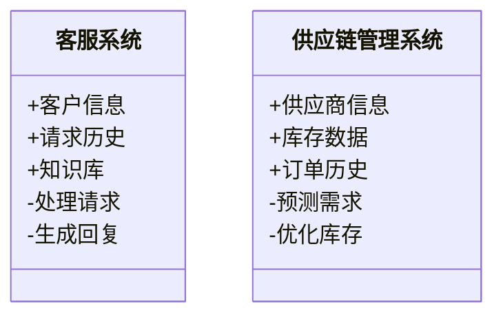
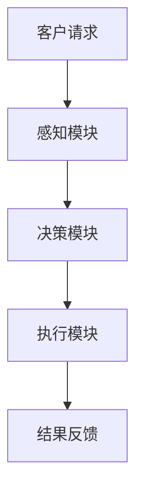
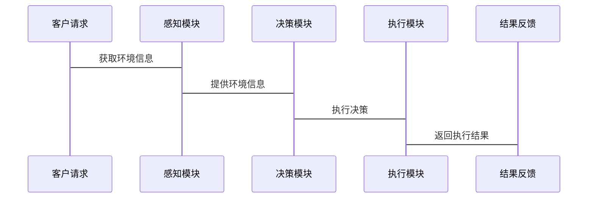

                 


# 定制化AI Agent：满足特定行业需求

**关键词**：定制化AI Agent，人工智能，行业需求，系统架构，算法原理

**摘要**：定制化AI Agent是一种基于特定行业需求设计的智能代理，通过深度学习和自然语言处理等技术，帮助行业实现自动化、智能化和高效化。本文从定制化AI Agent的核心概念、算法原理、系统架构、项目实战和最佳实践等多个方面进行详细分析，探讨如何在不同行业中有效应用定制化AI Agent。

---

# 第一部分: 定制化AI Agent概述

## 第1章: 定制化AI Agent的背景与概念

### 1.1 AI Agent的基本概念
AI Agent（人工智能代理）是指能够感知环境、做出决策并执行动作的智能系统。它可以独立完成特定任务，无需人工干预。AI Agent的核心功能包括感知、推理、决策和执行。

#### 1.1.1 AI Agent的定义
AI Agent是一种智能实体，能够通过与环境交互来实现目标。它可以基于传感器输入数据，利用算法进行分析和决策，并通过执行器输出动作。

#### 1.1.2 AI Agent的核心功能与特点
- **感知能力**：通过传感器或数据接口获取环境信息。
- **推理能力**：基于知识库和推理规则，分析信息并得出结论。
- **决策能力**：根据推理结果选择最优动作。
- **执行能力**：通过执行器将决策转化为实际动作。

#### 1.1.3 定制化AI Agent的必要性
通用AI Agent虽然功能强大，但难以满足特定行业的需求。定制化AI Agent通过针对特定场景进行优化，能够更高效地解决问题。

### 1.2 定制化AI Agent的背景与需求
随着人工智能技术的发展，越来越多的行业开始尝试将AI Agent应用于实际业务中。然而，不同行业的需求差异较大，通用AI Agent往往无法满足这些需求。

#### 1.2.1 传统AI Agent的局限性
- **灵活性不足**：通用AI Agent的设计难以适应不同行业的需求。
- **效率问题**：在特定场景下，通用AI Agent可能效率较低。
- **可解释性差**：复杂的算法导致决策过程难以解释。

#### 1.2.2 行业对定制化AI Agent的需求
- **金融行业**：需要实时监控市场动态，快速做出交易决策。
- **医疗行业**：需要处理大量医疗数据，辅助医生进行诊断。
- **制造业**：需要优化生产流程，提高生产效率。

#### 1.2.3 定制化AI Agent的应用场景
- **客服系统**：通过自然语言处理技术，为用户提供个性化的服务。
- **供应链管理**：通过预测需求，优化库存管理。
- **智能助手**：为用户提供个性化推荐和信息检索服务。

### 1.3 定制化AI Agent的核心价值
定制化AI Agent通过深度学习和自然语言处理等技术，能够为特定行业提供高效、智能的解决方案。

#### 1.3.1 提高效率与准确性
通过定制化的算法和模型，AI Agent能够快速准确地处理特定任务。

#### 1.3.2 适应特定行业规则与流程
定制化AI Agent能够根据行业规则和流程进行优化，确保决策的合规性和高效性。

#### 1.3.3 降低开发与维护成本
通过定制化设计，AI Agent能够更好地适应行业需求，减少后期维护和调整的成本。

### 1.4 定制化AI Agent的边界与外延
定制化AI Agent的设计需要在特定行业范围内进行，同时需要考虑与外部系统的兼容性。

#### 1.4.1 定制化与通用化AI Agent的对比
- **定制化AI Agent**：针对特定行业需求设计，灵活性高，但开发成本较高。
- **通用化AI Agent**：适用于多种场景，开发成本低，但灵活性较低。

#### 1.4.2 定制化AI Agent的适用范围
- **特定行业**：如金融、医疗、制造等。
- **特定场景**：如客服、供应链管理、智能助手等。

#### 1.4.3 定制化AI Agent的潜在挑战
- **开发成本高**：需要针对特定行业进行深度定制。
- **维护复杂**：随着行业需求的变化，需要不断调整和优化。

### 1.5 本章小结
本章介绍了AI Agent的基本概念和定制化AI Agent的背景与需求，分析了定制化AI Agent的核心价值和适用范围，指出了定制化AI Agent的潜在挑战。

---

# 第二部分: 定制化AI Agent的核心概念与联系

## 第2章: 定制化AI Agent的核心概念

### 2.1 定制化AI Agent的组成模块
定制化AI Agent通常由感知模块、决策模块和执行模块三个部分组成。

#### 2.1.1 感知模块
感知模块负责获取环境中的信息，通常包括传感器、摄像头、麦克风等设备。

#### 2.1.2 决策模块
决策模块基于感知模块获取的信息，结合知识库和推理规则，做出最优决策。

#### 2.1.3 执行模块
执行模块根据决策模块的指令，通过执行器将决策转化为实际动作。

### 2.2 各模块之间的关系与协作
各模块之间的协作是定制化AI Agent正常运行的关键。

#### 2.2.1 感知与决策的交互
感知模块将环境信息传递给决策模块，决策模块根据这些信息做出决策。

#### 2.2.2 决策与执行的协同
决策模块将决策结果传递给执行模块，执行模块根据决策结果执行相应的动作。

#### 2.2.3 模块之间的数据流
数据流在各模块之间流动，确保信息的传递和处理。

### 2.3 定制化AI Agent的属性特征对比
不同行业的定制化需求不同，需要对AI Agent的属性特征进行对比分析。

#### 2.3.1 不同行业的定制化需求对比
- **金融行业**：需要实时数据分析和快速决策。
- **医疗行业**：需要处理大量医疗数据，确保数据安全和隐私。

#### 2.3.2 不同AI Agent类型的核心特征
- **通用化AI Agent**：适用于多种场景，灵活性低。
- **定制化AI Agent**：适用于特定场景，灵活性高。

#### 2.3.3 定制化程度与性能的关系
定制化程度越高，AI Agent的性能越佳，但开发成本也越高。

### 2.4 定制化AI Agent的ER实体关系图
以下是定制化AI Agent的ER实体关系图：

```mermaid
er
actor: 定制化需求
role: "定义需求"
entity: 定制化AI Agent

actor --> role: "定义需求"
role --> entity: "定义属性"
```

### 2.5 本章小结
本章详细介绍了定制化AI Agent的核心概念，包括组成模块、模块之间的关系与协作，以及不同行业的定制化需求对比。通过ER实体关系图，展示了定制化AI Agent的实体关系。

---

# 第三部分: 定制化AI Agent的算法原理

## 第3章: 定制化AI Agent的算法原理

### 3.1 强化学习算法
强化学习是一种通过试错机制来优化决策的算法。

#### 3.1.1 强化学习的基本原理
强化学习通过智能体与环境的交互，学习最优策略。智能体会根据当前状态和动作的选择，获得奖励或惩罚。

#### 3.1.2 Q-Learning算法
Q-Learning是一种常用的强化学习算法，通过更新Q值表来学习最优策略。

##### 3.1.2.1 Q-Learning算法流程
1. 初始化Q值表为零。
2. 在每个时间步，选择当前状态下的动作。
3. 执行动作，获得奖励。
4. 更新Q值表：Q(s, a) = Q(s, a) + α(r + γ * max(Q(s', a')))
   其中，α是学习率，γ是折扣因子。

##### 3.1.2.2 Q-Learning算法实现
以下是Q-Learning算法的Python代码示例：

```python
import numpy as np

class QLearning:
    def __init__(self, state_space, action_space, alpha=0.1, gamma=0.9):
        self.state_space = state_space
        self.action_space = action_space
        self.alpha = alpha
        self.gamma = gamma
        self.Q = np.zeros((state_space, action_space))

    def choose_action(self, state, epsilon=0.1):
        if np.random.random() < epsilon:
            return np.random.randint(self.action_space)
        else:
            return np.argmax(self.Q[state, :])

    def update_Q(self, state, action, reward, next_state):
        self.Q[state, action] = self.Q[state, action] + self.alpha * (reward + self.gamma * np.max(self.Q[next_state, :]))
```

### 3.2 生成对抗网络
生成对抗网络（GAN）是一种通过生成器和判别器对抗训练的算法。

#### 3.2.1 GAN的基本原理
GAN由生成器和判别器组成，生成器通过生成样本欺骗判别器，判别器则通过区分真实样本和生成样本进行训练。

#### 3.2.2 GAN的数学模型
生成器的损失函数为：
$$L_G = -\mathbb{E}_{z \sim p_z}[\log(D(G(z)))]$$
判别器的损失函数为：
$$L_D = -\mathbb{E}_{x \sim p_x}[\log(D(x))] - \mathbb{E}_{z \sim p_z}[\log(1 - D(G(z)))]$$

#### 3.2.3 GAN的实现
以下是GAN的Python代码示例：

```python
import torch
import torch.nn as nn

class Generator(nn.Module):
    def __init__(self, latent_dim, img_size):
        super(Generator, self).__init__()
        self.latent_dim = latent_dim
        self.img_size = img_size
        self.model = nn.Sequential(
            nn.Linear(latent_dim, 256),
            nn.ReLU(),
            nn.Linear(256, img_size)
        )

    def forward(self, x):
        return self.model(x)

class Discriminator(nn.Module):
    def __init__(self, img_size):
        super(Discriminator, self).__init__()
        self.model = nn.Sequential(
            nn.Linear(img_size, 256),
            nn.ReLU(),
            nn.Linear(256, 1),
            nn.Sigmoid()
        )

    def forward(self, x):
        return self.model(x)

# 初始化生成器和判别器
generator = Generator(latent_dim=100, img_size=28*28)
discriminator = Discriminator(img_size=28*28)

# 定义损失函数和优化器
criterion = nn.BCELoss()
optimizer_G = torch.optim.Adam(generator.parameters(), lr=0.001)
optimizer_D = torch.optim.Adam(discriminator.parameters(), lr=0.001)

# 训练循环
for epoch in range(num_epochs):
    for i, (real_imgs, _) in enumerate(dataloader):
        # 生成假样本
        z = torch.randn(batch_size, latent_dim)
        gen_imgs = generator(z)

        # 训练判别器
        optimizer_D.zero_grad()
        real_pred = discriminator(real_imgs)
        fake_pred = discriminator(gen_imgs)
        loss_D = criterion(real_pred, torch.ones_like(real_pred)) + criterion(fake_pred, torch.zeros_like(fake_pred))
        loss_D.backward()
        optimizer_D.step()

        # 训练生成器
        optimizer_G.zero_grad()
        loss_G = criterion(fake_pred, torch.ones_like(fake_pred))
        loss_G.backward()
        optimizer_G.step()
```

### 3.3 本章小结
本章介绍了定制化AI Agent的两种常用算法，强化学习和生成对抗网络。通过Q-Learning算法和GAN的实现，展示了如何利用这些算法实现定制化AI Agent的感知和决策功能。

---

# 第四部分: 定制化AI Agent的系统架构设计

## 第4章: 定制化AI Agent的系统架构设计

### 4.1 问题场景介绍
定制化AI Agent需要在特定行业中运行，能够处理特定任务。

#### 4.1.1 客服系统
AI Agent需要处理大量的客服请求，提供个性化的服务。

#### 4.1.2 供应链管理
AI Agent需要优化供应链管理，提高效率和降低成本。

### 4.2 系统功能设计
根据问题场景，设计系统的功能模块。

#### 4.2.1 领域模型类图
以下是领域模型类图：



### 4.3 系统架构设计
根据功能需求，设计系统的整体架构。

#### 4.3.1 系统架构图
以下是系统架构图：



### 4.4 系统接口设计
设计系统的接口，确保各模块之间的通信。

#### 4.4.1 接口设计
- **感知模块接口**：提供获取环境信息的接口。
- **决策模块接口**：提供决策请求和结果反馈的接口。
- **执行模块接口**：提供执行动作的接口。

### 4.5 系统交互序列图
以下是系统交互序列图：



### 4.6 本章小结
本章介绍了定制化AI Agent的系统架构设计，包括问题场景、系统功能设计、系统架构图、系统接口设计和系统交互序列图。

---

# 第五部分: 定制化AI Agent的项目实战

## 第5章: 定制化AI Agent的项目实战

### 5.1 环境安装
安装必要的开发环境和工具。

#### 5.1.1 安装Python
安装Python 3.8或更高版本。

#### 5.1.2 安装依赖库
安装numpy、torch、matplotlib等依赖库。

### 5.2 系统核心实现
实现系统的核心功能模块。

#### 5.2.1 感知模块实现
实现感知模块的代码。

##### 5.2.1.1 感知模块代码
```python
import numpy as np

class PerceptionModule:
    def __init__(self, sensors):
        self.sensors = sensors

    def get_environment_info(self):
        return [sensor.measure() for sensor in self.sensors]
```

#### 5.2.2 决策模块实现
实现决策模块的代码。

##### 5.2.2.1 决策模块代码
```python
import numpy as np

class DecisionModule:
    def __init__(self, knowledge_base):
        self.knowledge_base = knowledge_base

    def make_decision(self, environment_info):
        return self.knowledge_base.get_best_action(environment_info)
```

#### 5.2.3 执行模块实现
实现执行模块的代码。

##### 5.2.3.1 执行模块代码
```python
class ExecutionModule:
    def __init__(self, actuators):
        self.actuators = actuators

    def execute_action(self, action):
        actuator = self.actuators[action]
        actuator.execute()
```

### 5.3 代码应用解读与分析
分析代码的功能和实现细节。

#### 5.3.1 感知模块解读
感知模块通过传感器获取环境信息，并将信息传递给决策模块。

#### 5.3.2 决策模块解读
决策模块根据环境信息和知识库，做出最优决策，并将决策结果传递给执行模块。

#### 5.3.3 执行模块解读
执行模块根据决策结果，通过执行器执行相应的动作。

### 5.4 实际案例分析
通过实际案例分析，展示定制化AI Agent的应用效果。

#### 5.4.1 客服系统案例
AI Agent能够快速响应客户请求，提供个性化的服务。

#### 5.4.2 供应链管理案例
AI Agent能够优化供应链管理，提高效率和降低成本。

### 5.5 本章小结
本章通过实际案例分析，展示了定制化AI Agent的应用效果，并对系统核心代码进行了详细解读。

---

# 第六部分: 定制化AI Agent的最佳实践

## 第6章: 定制化AI Agent的最佳实践

### 6.1 定制化过程中的经验和技巧
在定制化过程中，需要注意以下几点：

#### 6.1.1 确定需求
明确需求是定制化的核心，需要与客户充分沟通，确保需求的准确性。

#### 6.1.2 选择合适的算法
根据行业特点选择合适的算法，确保算法的有效性和高效性。

#### 6.1.3 迭代优化
在开发过程中，需要不断迭代优化，根据反馈调整算法和模型。

### 6.2 定制化中的挑战与解决方案
定制化过程中可能会遇到一些挑战，如数据不足、模型过拟合等。

#### 6.2.1 数据不足的解决方案
- **数据增强**：通过数据增强技术，增加数据量。
- **迁移学习**：利用预训练模型，减少数据需求。

#### 6.2.2 模型过拟合的解决方案
- **正则化**：通过L1/L2正则化，防止过拟合。
- **数据清洗**：去除噪声数据，提高模型的泛化能力。

### 6.3 定制化AI Agent的未来发展
随着人工智能技术的不断发展，定制化AI Agent的应用场景将更加广泛，算法和模型也将更加智能化和高效化。

### 6.4 本章小结
本章总结了定制化过程中的经验和技巧，分析了定制化中的挑战与解决方案，并展望了定制化AI Agent的未来发展。

---

# 第七部分: 附录

## 7.1 参考文献
- 强化学习相关文献
- 生成对抗网络相关文献
- 定制化AI Agent相关文献

## 7.2 工具与资源
- Python编程环境
- 深度学习框架（如TensorFlow、PyTorch）
- 数据可视化工具（如Matplotlib、Seaborn）

---

# 作者：AI天才研究院/AI Genius Institute & 禅与计算机程序设计艺术/Zen And The Art of Computer Programming

---

**注**：本文内容较多，实际写作时可根据需要进行删减或调整。

