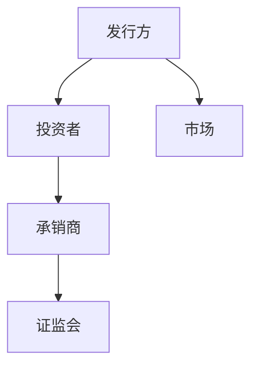

                 

# 定向增发策略：参与上市公司融资的机会

> 关键词：定向增发、策略分析、投资者选择、市场分析、公司估值

> 摘要：定向增发是上市公司融资的重要方式之一，本文将从定向增发的基本概念、核心要素、策略制定、系统分析、项目实战等方面进行详细分析，探讨如何制定有效的定向增发策略，帮助投资者和上市公司更好地把握融资机会。

---

## 第一部分: 定向增发的背景与概念

### 第1章: 定向增发的背景与概念

#### 1.1 定向增发的定义与特点

##### 1.1.1 定向增发的定义
定向增发（Non-public Offering）是指上市公司向特定的机构投资者、战略投资者或现有股东发行新股的一种融资方式。与公开增发相比，定向增发具有保密性高、灵活性强、发行对象有限等特点。

##### 1.1.2 定向增发与公开增发的区别
- **发行对象**：定向增发针对特定投资者，而公开增发面向全体公众。
- **发行程序**：定向增发流程更简单，时间更短，而公开增发需要通过证监会审核。
- **发行价格**：定向增发价格通常低于市场价，而公开增发价格根据市场情况确定。

##### 1.1.3 定向增发的市场环境
近年来，随着资本市场的不断发展，定向增发已成为企业融资的重要手段。尤其是在经济下行周期，企业通过定向增发可以获得更多资金支持，同时避免公开增发的高成本和复杂流程。

#### 1.2 定向增发的流程与参与者

##### 1.2.1 定向增发的流程
1. **确定发行对象**：上市公司与潜在投资者协商，确定发行对象。
2. **签订认购协议**：双方签订认购协议，明确发行价格、数量等条款。
3. **提交证监会审核**：上市公司向证监会提交相关材料，获得批准。
4. **发行与上市**：按照协议完成新股发行，并更新公司股权结构。

##### 1.2.2 参与者角色分析
- **上市公司**：发起增发的主体，希望通过增发筹集资金。
- **投资者**：参与增发的机构投资者或战略投资者，希望通过投资获得收益。
- **承销商**：负责增发的具体操作，包括发行、分配等环节。
- **监管机构**：证监会等机构负责审核和监管增发过程。

##### 1.2.3 监管框架与政策影响
定向增发受到证监会的严格监管，包括发行对象的选择、定价机制、锁定期等。政策的变化对定向增发的市场环境和操作流程有重要影响。

#### 1.3 定向增发的市场现状与趋势

##### 1.3.1 近年来市场发展概况
近年来，定向增发市场规模持续扩大，尤其是在经济不景气时期，企业通过定向增发融资的需求增加。

##### 1.3.2 市场趋势分析
随着资本市场的开放和改革，定向增发的市场环境不断完善，未来将更加注重投资者利益和市场公平。

##### 1.3.3 行业分布与典型案例
定向增发在金融、科技、制造等行业应用广泛，典型案例包括某公司通过定向增发引入战略投资者，提升企业竞争力。

#### 1.4 本章小结
本章介绍了定向增发的基本概念、流程、参与者以及市场现状，为后续分析奠定了基础。

---

## 第二部分: 定向增发的核心要素分析

### 第2章: 定向增发的核心要素分析

#### 2.1 定向增发的定价策略

##### 2.1.1 定价方式与折扣率
定向增发的定价通常低于市场价，常见的定价方式包括市价折扣、净资产收益率（ROE）折扣等。折扣率的确定需要综合考虑市场环境、公司估值等因素。

##### 2.1.2 市场环境对定价的影响
市场环境（如整体市场走势、行业景气度等）对定向增发的定价有重要影响。在市场低迷时，发行价格通常会有更大的折扣。

##### 2.1.3 投资者参与定价的策略
投资者可以通过参与定价协商，争取更优惠的价格。具体策略包括与公司协商折扣率、签订对赌协议等。

#### 2.2 定向增发的投资者选择

##### 2.2.1 投资者类型与特点
- **机构投资者**：如基金、券商等，具有专业的投资能力和较高的风险承受能力。
- **战略投资者**：通常为产业资本，希望通过投资获得长期利益。

##### 2.2.2 投资者选择的标准
选择投资者时，公司通常会考虑其财务实力、行业地位、投资期限等因素。优质投资者能够为公司带来资金支持和战略资源。

##### 2.2.3 不同投资者的博弈分析
在定向增发中，投资者之间的博弈主要体现在价格谈判、锁定期等方面。公司需要平衡不同投资者的利益，制定合理的发行方案。

#### 2.3 定向增发的锁定期与退出机制

##### 2.3.1 锁定期的定义与影响
锁定期是指投资者在一定时间内不得转让所获配的股份。锁定期的长短直接影响投资者的流动性需求和公司的股权稳定性。

##### 2.3.2 锁定期对市场的影响
较长的锁定期可能抑制市场的短期波动，但过短的锁定期可能导致市场抛售压力增加。

##### 2.3.3 退出机制的设计与优化
退出机制包括股权转让、减持等方式。优化退出机制需要综合考虑市场环境、公司发展等因素。

#### 2.4 本章小结
本章分析了定向增发的定价策略、投资者选择和锁定期等核心要素，为后续策略制定提供了理论支持。

---

## 第三部分: 定向增发的策略制定与实施

### 第3章: 定向增发的策略制定与实施

#### 3.1 定向增发的市场分析

##### 3.1.1 行业分析与投资机会
通过行业分析，确定哪些行业具有较高的增发需求和投资机会。例如，科技行业在技术升级中的增发需求较高。

##### 3.1.2 市场情绪与资金流动
市场情绪和资金流动对定向增发的定价和投资者参与有重要影响。在市场情绪乐观时，增发成功的概率更高。

##### 3.1.3 宏观经济环境的影响
宏观经济环境（如GDP增速、利率水平等）对定向增发的市场需求和成本有直接影响。

#### 3.2 定向增发的公司基本面分析

##### 3.2.1 公司财务状况评估
通过财务报表分析公司的盈利能力、偿债能力和发展潜力。例如，ROE（净资产收益率）是衡量公司盈利能力的重要指标。

##### 3.2.2 公司治理结构分析
良好的公司治理结构能够保障投资者权益，降低增发风险。

##### 3.2.3 公司未来发展规划
公司的发展战略和未来规划是决定其增发需求和投资价值的重要因素。

#### 3.3 定向增发的市场时机选择

##### 3.3.1 市场周期分析
通过分析市场周期，确定增发的最佳时机。例如，在市场底部区域进行增发可以降低发行成本。

##### 3.3.2 估值分析与套利机会
通过对公司估值的分析，寻找增发的套利机会。例如，当公司股价低于增发价格时，参与增发可以锁定收益。

##### 3.3.3 技术分析与市场信号
技术分析可以帮助判断市场趋势和投资机会。例如，K线图中的某些形态可能预示着市场的拐点。

#### 3.4 定向增发的实施风险与应对

##### 3.4.1 市场风险与对策
市场风险包括股价波动、政策变化等。对策包括分散投资、设置止损等。

##### 3.4.2 政策风险与应对
政策变化可能影响增发的实施和退出机制。应对措施包括密切关注政策变化、与公司保持沟通等。

##### 3.4.3 公司风险与防范措施
公司经营状况变化可能影响增发的收益。防范措施包括签订对赌协议、设定业绩承诺等。

#### 3.5 本章小结
本章从市场分析、公司基本面、市场时机选择和风险应对四个方面，提出了定向增发的策略制定框架。

---

## 第四部分: 定向增发的系统分析与架构设计

### 第4章: 定向增发的系统分析与架构设计

#### 4.1 系统分析框架

##### 4.1.1 问题场景介绍
通过系统分析，我们可以更好地理解定向增发的复杂性，并制定科学的策略。

##### 4.1.2 项目目标与范围
项目目标包括优化增发流程、降低增发成本、提高投资者收益等。项目范围涵盖从发行准备到实施的全过程。

##### 4.1.3 系统功能需求
系统需要具备发行方案设计、投资者管理、风险评估等功能。

#### 4.2 系统架构设计

##### 4.2.1 系统架构图（Mermaid）

##### 4.2.2 功能模块设计
- **发行方案模块**：负责设计增发方案，包括发行价格、数量等。
- **投资者管理模块**：管理投资者信息，包括资质审核、认购额度分配等。
- **风险评估模块**：评估增发过程中的各种风险，并提出应对措施。

##### 4.2.3 系统交互设计
- **发行方与投资者交互**：签订认购协议，确认发行价格和数量。
- **投资者与承销商交互**：支付认购款项，完成股权分配。
- **证监会与发行方交互**：审核发行方案，批准增发申请。

#### 4.3 本章小结
本章通过系统分析，提出了定向增发的系统架构设计，为实际操作提供了参考。

---

## 第五部分: 定向增发的项目实战

### 第5章: 定向增发的项目实战

#### 5.1 项目准备

##### 5.1.1 项目背景
某公司计划通过定向增发筹集资金，用于技术研发和市场拓展。

##### 5.1.2 项目目标
- 筹集资金：计划发行1亿股，每股价格为5元。
- 选择投资者：引入战略投资者和机构投资者。

#### 5.2 项目实施

##### 5.2.1 发行方案设计
- 发行价格：5元，较市场价6元折价16.67%。
- 发行对象：战略投资者和机构投资者。

##### 5.2.2 投资者选择与谈判
- 与战略投资者签订长期合作协议，确保其长期支持。
- 与机构投资者协商认购额度和锁定期。

##### 5.2.3 证监会审核与发行
- 提交发行申请，获得证监会批准。
- 完成新股发行，更新公司股权结构。

#### 5.3 项目总结

##### 5.3.1 成功因素
- 合理的发行价格和折扣率。
- 优质的投资者选择。
- 科学的系统设计。

##### 5.3.2 经验教训
- 在市场低迷时期，增发难度较大，需提前做好准备。
- 投资者选择需综合考虑短期收益和长期利益。

##### 5.3.3 项目小结
通过本项目实战，我们验证了定向增发策略的有效性，并总结了宝贵的经验。

#### 5.4 本章小结
本章通过一个具体案例，详细讲解了定向增发的项目实施过程，帮助读者更好地理解和应用策略。

---

## 第六部分: 定向增发策略的总结与展望

### 第6章: 定向增发策略的总结与展望

#### 6.1 总结与回顾

##### 6.1.1 核心观点回顾
定向增发是上市公司融资的重要方式，其成功实施需要综合考虑定价策略、投资者选择、市场时机等因素。

##### 6.1.2 策略要点总结
- 合理定价，吸引优质投资者。
- 灵活选择投资者，平衡各方利益。
- 把握市场时机，降低增发风险。

#### 6.2 展望与建议

##### 6.2.1 当前研究的不足
目前的研究主要集中在理论分析，缺乏实证研究和案例分析。

##### 6.2.2 未来研究方向
未来可以进一步研究定向增发对上市公司长期发展的影响，以及如何优化增发后的管理。

##### 6.2.3 对投资者的建议
投资者在参与定向增发时，应注重公司的基本面和市场环境，合理评估风险和收益。

#### 6.3 本章小结
本章总结了定向增发策略的核心观点，并对未来研究和实践提出了展望。

---

## 作者：AI天才研究院/AI Genius Institute  
邮箱：contact@aitalentinstitute.com  
网址：https://www.zhihu.com/z专栏/禅与计算机程序设计艺术

