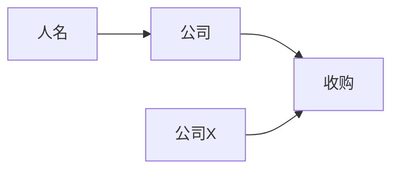

                 


# 实体提取：增强AI Agent的信息处理能力

## 关键词：实体提取，信息抽取，AI Agent，自然语言处理，知识图谱，深度学习

## 摘要：实体提取是自然语言处理中的关键技术，用于从文本中提取命名实体，从而增强AI Agent的信息处理能力。本文详细探讨了实体提取的核心概念、算法原理、系统架构设计以及实际应用案例，帮助读者全面理解和掌握这一技术。

---

# 第一部分: 实体提取的背景与核心概念

## 第1章: 实体提取的定义与背景

### 1.1 实体提取的定义

实体提取（Entity Extraction）是自然语言处理（NLP）中的关键技术，旨在从文本中识别和抽取命名实体，如人名、地名、组织名、时间、日期、货币等。这些实体是文本中的关键信息，能够帮助AI Agent理解和处理文本内容。

#### 1.1.1 实体提取的核心概念

- **实体**：文本中的具体对象，可以是人名、地名、组织名等。
- **实体类型**：实体的分类，如PER（人名）、LOC（地名）、ORG（组织名）、TIME（时间）、DATE（日期）、MONEY（货币）等。
- **实体提取**：从文本中识别和定位实体的过程。

#### 1.1.2 实体提取的背景

AI Agent需要处理大量的文本信息，例如用户查询、社交媒体数据、新闻报道等。为了更好地理解和处理这些信息，AI Agent需要能够提取文本中的关键实体，从而进行后续的分析和推理。

#### 1.1.3 实体提取的边界与外延

实体提取不仅关注实体的识别，还关注实体之间的关系。例如，在“Apple收购了公司X”中，不仅需要识别“Apple”和“公司X”这两个实体，还需要理解它们之间的“收购”关系。

---

## 第2章: 实体提取的核心概念与联系

### 2.1 实体提取的核心原理

实体提取的核心原理是通过模式匹配、统计学习或深度学习方法，从文本中识别出命名实体。

#### 2.1.1 实体提取的基本原理

- **模式匹配**：基于正则表达式或规则的实体识别方法。例如，识别日期可以使用“\d{4}-\d{2}-\d{2}”的模式。
- **统计学习**：基于机器学习的实体识别方法，如条件随机场（CRF）。
- **深度学习**：基于神经网络的实体识别方法，如卷积神经网络（CNN）和循环神经网络（RNN）。

#### 2.1.2 实体提取的核心要素

- **实体类型**：实体的分类，如人名、地名、组织名等。
- **实体特征**：实体的上下文信息，如词性、位置、邻近词等。
- **实体关系**：实体之间的关联，如“苹果公司收购了公司X”。

### 2.2 实体提取的模式对比

#### 2.2.1 实体提取的模式对比表格

| 模式类型      | 基于规则 | 统计学习 | 深度学习 |
|---------------|----------|----------|----------|
| 优点          | 简单易实现，适合规则明确的场景 | 精度高，能够处理复杂模式 | 强大学习能力，适合大规模数据 |
| 缺点          | 易受规则限制，难以处理复杂场景 | 需要大量标注数据 | 计算资源消耗大，需要大量数据 |
| 适用场景      | 小规模、规则明确的场景 | 中大规模数据 | 复杂场景和大规模数据 |

#### 2.2.2 实体提取的ER实体关系图



---

# 第二部分: 实体提取的算法原理

## 第3章: 实体提取的算法原理

### 3.1 实体提取的常用算法

#### 3.1.1 条件随机场（CRF）

CRF是一种常用的统计学习模型，用于序列标注任务，如实体提取。

##### 3.1.1.1 CRF的数学模型

CRF的目标是通过最大化条件概率来预测序列标签。其数学模型如下：

$$ P(y|x) = \frac{1}{Z(x)} \exp\left(\sum_{i=1}^n \sum_{k=1}^K w_k f_k(x,y)\right) $$

其中，$y$ 是标签序列，$x$ 是输入序列，$w_k$ 是权重，$f_k$ 是特征函数，$Z(x)$ 是归一化因子。

##### 3.1.1.2 CRF的实现步骤

1. 数据预处理：将文本数据转换为特征向量。
2. 模型训练：使用训练数据训练CRF模型，提取特征并计算权重。
3. 实体识别：基于CRF模型对测试数据进行实体识别。

#### 3.1.2 循环神经网络（RNN）

RNN是一种深度学习模型，用于处理序列数据。

##### 3.1.2.1 RNN的数学模型

RNN的状态转移方程如下：

$$ s_t = f(s_{t-1}, x_t) $$

其中，$s_t$ 是时间步$t$的状态，$x_t$ 是输入向量，$f$ 是非线性激活函数。

##### 3.1.2.2 RNN的实现步骤

1. 数据预处理：将文本数据转换为向量表示。
2. 模型训练：使用RNN训练模型，提取特征并优化权重。
3. 实体识别：基于RNN模型对测试数据进行实体识别。

---

# 第三部分: 实体提取的系统分析与架构设计

## 第4章: 实体提取的系统分析与架构设计

### 4.1 实体提取的系统架构设计

#### 4.1.1 系统功能模块设计

- **数据预处理模块**：对文本数据进行分词、停用词处理等。
- **模型训练模块**：训练实体提取模型。
- **实体识别模块**：基于训练好的模型进行实体识别。
- **结果输出模块**：输出实体识别结果。

#### 4.1.2 系统架构设计


#### 4.1.3 系统接口设计

- **输入接口**：接受文本数据。
- **输出接口**：输出实体识别结果。

---

# 第四部分: 实体提取的项目实战

## 第5章: 实体提取的项目实战

### 5.1 项目背景与需求分析

#### 5.1.1 项目背景

本文将以医疗领域的实体提取为例，展示如何从医疗文本中提取疾病名称、症状、药物等实体。

#### 5.1.2 项目需求

- 实体类型：疾病、症状、药物、患者。
- 实体特征：上下文信息、词性信息。
- 实体关系：疾病与症状的关系，药物与患者的关系。

### 5.2 项目核心实现

#### 5.2.1 环境安装

```python
pip install numpy
pip install scikit-learn
pip install spacy
```

#### 5.2.2 核心代码实现

```python
import spacy
nlp = spacy.load("en_core_web_sm")
doc = nlp("Patient has diabetes and is taking insulin.")
for ent in doc.ents:
    print(ent.text, ent.label_)
```

#### 5.2.3 代码解读与分析

上述代码使用spaCy库进行实体识别。`doc.ents`获取文本中的实体，`ent.text`是实体文本，`ent.label_`是实体标签。

---

# 第五部分: 实体提取的最佳实践

## 第6章: 实体提取的最佳实践

### 6.1 实体提取的常见挑战与解决方案

#### 6.1.1 数据质量问题

- 解决方案：使用高质量的标注数据，进行数据清洗。

#### 6.1.2 模型性能问题

- 解决方案：使用深度学习模型，如BERT，提升模型性能。

### 6.2 实体提取的未来发展

- **技术趋势**：从规则驱动向数据驱动转变。
- **应用场景**：从单任务实体提取向多任务学习扩展。

---

# 第六部分: 总结

## 第7章: 总结

### 7.1 实体提取的核心要点

- 实体提取是AI Agent信息处理的关键技术。
- 实体提取的核心原理包括模式匹配、统计学习和深度学习。
- 实体提取的系统架构设计需要考虑数据预处理、模型训练和实体识别。

### 7.2 未来展望

随着深度学习技术的发展，实体提取将更加智能化和高效化，应用场景也将更加广泛。

---

# 作者

作者：AI天才研究院/AI Genius Institute & 禅与计算机程序设计艺术 /Zen And The Art of Computer Programming

