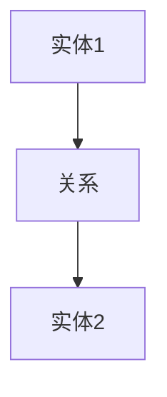
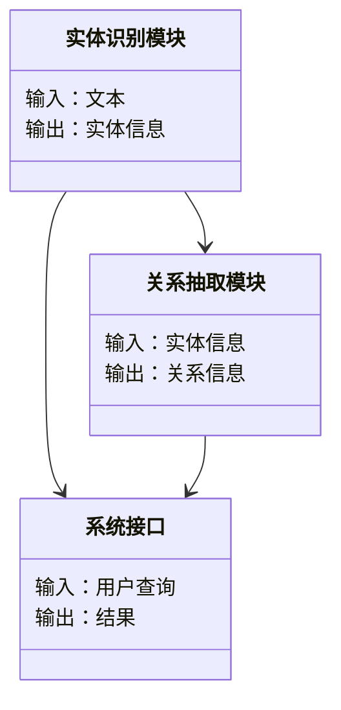
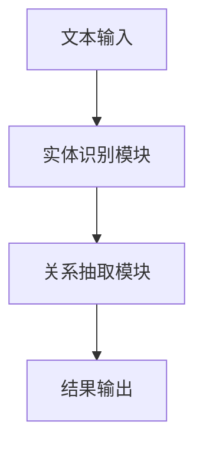

                 


# 实体识别与关系抽取：增强AI Agent的理解深度

## 关键词：
实体识别、关系抽取、自然语言处理、AI Agent、深度学习、NLP、知识图谱

## 摘要：
实体识别与关系抽取是自然语言处理中的两大核心任务，它们通过从文本中提取出命名实体和实体间的关系，为AI Agent提供了理解和推理的基础。本文将深入探讨实体识别与关系抽取的核心概念、算法原理、系统架构，并结合实际案例，展示如何通过这些技术提升AI Agent的理解深度。文章内容涵盖从基础理论到实际应用的完整链条，旨在为读者提供一个全面的知识框架。

---

# 第1章: 实体识别与关系抽取概述

## 1.1 实体识别的基本概念

### 1.1.1 实体识别的定义与问题背景
实体识别（Named Entity Recognition，NER）是自然语言处理中的基础任务，旨在从文本中识别出特定的命名实体，如人名、地名、组织名、时间、日期等。实体识别的核心问题在于如何准确地定位和分类这些实体，尤其是在复杂的上下文环境中。

例如，对于文本“张三在2023年10月10日参加了北京国际会议”，实体识别的目标是提取出“张三”（人名）、“2023年10月10日”（日期）和“北京国际会议”（组织名）。

### 1.1.2 实体识别的核心目标与应用场景
实体识别的核心目标是将文本中的命名实体进行分类和定位。其主要应用场景包括：
1. **信息抽取**：从新闻、社交媒体等文本中提取关键信息。
2. **问答系统**：帮助系统理解问题中的实体信息。
3. **知识图谱构建**：为知识图谱提供基础实体信息。

### 1.1.3 实体识别与自然语言处理的关系
实体识别是自然语言处理（NLP）中的重要组成部分，它依赖于分词、词性标注等基础任务，同时也为信息抽取、关系抽取等高级任务提供输入。

---

## 1.2 关系抽取的基本概念

### 1.2.1 关系抽取的定义与问题背景
关系抽取（Relation Extraction）旨在从文本中识别出实体之间的关系。例如，在文本“张三参加了北京国际会议”中，关系抽取的目标是识别出“参加”这一关系，并将其关联到实体“张三”和“北京国际会议”。

### 1.2.2 关系抽取的核心目标与应用场景
关系抽取的核心目标是发现文本中实体之间的语义关系。其主要应用场景包括：
1. **知识图谱构建**：通过抽取实体间的关系，构建完整的知识图谱。
2. **信息检索**：根据实体关系进行信息的高效检索。
3. **智能对话系统**：帮助系统理解用户输入中的关系信息，提供更智能的交互体验。

### 1.2.3 关系抽取与实体识别的关系
关系抽取依赖于实体识别的结果，但又不仅仅是实体识别的简单扩展。关系抽取需要进一步分析实体之间的语义联系，其复杂性和挑战性更高。

---

## 1.3 实体识别与关系抽取的结合

### 1.3.1 实体识别与关系抽取的协同作用
实体识别和关系抽取相辅相成。实体识别为关系抽取提供基础实体信息，而关系抽取则通过分析实体间的联系，进一步丰富语义信息。

### 1.3.2 实体识别与关系抽取的联合学习
联合学习是一种新兴的研究方向，旨在同时优化实体识别和关系抽取的性能。通过共享模型参数，联合学习可以更好地捕捉实体识别和关系抽取之间的语义关联。

### 1.3.3 实体识别与关系抽取的边界与外延
实体识别和关系抽取的边界在于：实体识别关注单个实体的识别，而关系抽取关注实体之间的关系。两者的外延可以通过知识图谱的构建进一步拓展。

---

## 1.4 本章小结
本章介绍了实体识别和关系抽取的基本概念、核心目标以及它们在自然语言处理中的重要性。通过对比分析，我们明确了实体识别与关系抽取之间的联系与区别，并为后续章节的深入探讨奠定了基础。

---

# 第2章: 实体识别与关系抽取的核心概念与联系

## 2.1 实体识别的核心原理

### 2.1.1 实体识别的特征提取
实体识别的特征提取主要依赖于词性标注、上下文信息和位置信息。例如，名词短语通常是实体的重要特征。

### 2.1.2 实体识别的模式匹配
基于规则的实体识别方法通过预定义的模式匹配文本中的实体。例如，日期的模式可以表示为“数字+年+数字+月+数字+日”。

### 2.1.3 实体识别的上下文分析
上下文分析是实体识别的关键，尤其在处理歧义词时。例如，“苹果”可以指水果或公司名称，上下文信息可以帮助准确识别。

---

## 2.2 关系抽取的核心原理

### 2.2.1 关系抽取的特征提取
关系抽取的特征提取包括实体对的词性组合、句法结构和语义信息。例如，动词通常是关系的重要特征。

### 2.2.2 关系抽取的模式匹配
基于规则的关系抽取方法通过预定义的关系模式匹配文本中的关系。例如，“参加”可以表示参与关系。

### 2.2.3 关系抽取的上下文分析
上下文分析是关系抽取的关键，尤其是在处理复杂句式时。例如，“张三参加了北京国际会议”中的关系抽取需要考虑动词“参加”和实体“张三”、“北京国际会议”的关系。

---

## 2.3 实体识别与关系抽取的特征对比

### 2.3.1 实体识别与关系抽取的特征对比表格

| 特征维度 | 实体识别 | 关系抽取 |
|----------|----------|----------|
| 输入形式 | 单个实体 | 实体对     |
| 输出形式 | 实体标签 | 关系标签   |
| 关键特征 | 名词短语、位置信息 | 动词、句法结构 |

### 2.3.2 实体识别与关系抽取的ER实体关系图


---

## 2.4 本章小结
本章详细分析了实体识别和关系抽取的核心原理，并通过特征对比和ER图展示了两者的联系与区别。这为后续章节的算法实现奠定了理论基础。

---

# 第3章: 实体识别与关系抽取的算法原理

## 3.1 实体识别的算法原理

### 3.1.1 基于规则的实体识别算法
基于规则的实体识别方法通过预定义的模式匹配文本中的实体。例如，日期的模式可以表示为“数字+年+数字+月+数字+日”。

### 3.1.2 基于统计的实体识别算法
基于统计的实体识别算法（如CRF模型）通过统计学方法学习实体的特征，实现自动分类。

### 3.1.3 基于深度学习的实体识别算法
基于深度学习的实体识别算法（如LSTM-CRF模型）通过神经网络学习文本的语义信息，实现更准确的实体识别。

---

## 3.2 关系抽取的算法原理

### 3.2.1 基于规则的关系抽取算法
基于规则的关系抽取方法通过预定义的关系模式匹配文本中的关系。例如，“参加”可以表示参与关系。

### 3.2.2 基于统计的关系抽取算法
基于统计的关系抽取算法（如CRF模型）通过统计学方法学习关系的特征，实现自动分类。

### 3.2.3 基于深度学习的关系抽取算法
基于深度学习的关系抽取算法（如LSTM-CRF模型）通过神经网络学习文本的语义信息，实现更准确的关系抽取。

---

## 3.3 实体识别与关系抽取的联合学习

### 3.3.1 联合学习的基本原理
联合学习通过共享模型参数，同时优化实体识别和关系抽取的性能。

### 3.3.2 联合学习的算法实现
联合学习的算法实现通常采用端到端的神经网络模型，例如双向LSTM结合CRF。

### 3.3.3 联合学习的优缺点分析
联合学习的优点是能够捕捉实体识别和关系抽取之间的语义关联，缺点是模型复杂度较高，训练时间较长。

---

## 3.4 本章小结
本章详细分析了实体识别和关系抽取的算法原理，并通过对比分析展示了联合学习的优势与挑战。这为后续章节的系统设计和项目实战奠定了技术基础。

---

# 第4章: 实体识别与关系抽取的系统分析与架构设计

## 4.1 问题场景介绍
本章以构建一个智能问答系统为例，介绍实体识别与关系抽取的系统架构设计。

## 4.2 系统功能设计

### 4.2.1 领域模型设计


### 4.2.2 系统架构设计


### 4.2.3 接口与交互设计
系统接口包括文本输入接口和结果输出接口，交互流程如下：
```mermaid
sequenceDiagram
    用户 -> 系统接口：提交查询
    系统接口 -> 实体识别模块：进行实体识别
    实体识别模块 -> 系统接口：返回实体信息
    系统接口 -> 关系抽取模块：进行关系抽取
    关系抽取模块 -> 系统接口：返回关系信息
    系统接口 -> 用户：返回结果
```

---

## 4.3 本章小结
本章通过系统架构设计展示了实体识别与关系抽取在实际应用中的重要作用，并为后续章节的项目实战奠定了基础。

---

# 第5章: 实体识别与关系抽取的项目实战

## 5.1 环境安装
本项目基于Python 3.8及以上版本，主要使用spaCy和spaCy+flair工具包。

## 5.2 核心代码实现

### 5.2.1 实体识别代码
```python
import spacy

nlp = spacy.load("en_core_web_sm")

text = "张三在2023年10月10日参加了北京国际会议"
doc = nlp(text)

for token in doc.ents:
    print(token.text, token.label_)
```

### 5.2.2 关系抽取代码
```python
from flair import SequenceTagger
from flair.models import SequenceTagger
from flair.data import Corpus
from flair.tokenization import Tokenizer

tagger = SequenceTagger.load('ner')
text = "张三参加了北京国际会议"
sents = tagger.predict([text])

for sentence in sents:
    for token in sentence.tokens:
        print(token.text, token.tag)
```

## 5.3 案例分析
以文本“张三参加了北京国际会议”为例，展示实体识别和关系抽取的实现过程。

## 5.4 项目小结
本章通过实际案例展示了实体识别与关系抽取的实现过程，帮助读者理解理论知识的实际应用。

---

# 第6章: 实体识别与关系抽取的最佳实践与小结

## 6.1 关键点总结
实体识别与关系抽取是自然语言处理中的基础任务，其准确性直接影响后续应用的效果。

## 6.2 注意事项
1. 实体识别要注意上下文信息的分析。
2. 关系抽取要注意实体对的语义关联。
3. 联合学习可以提高实体识别与关系抽取的性能。

## 6.3 拓展阅读
1. 《自然语言处理入门》
2. 《深度学习与自然语言处理》

---

# 作者：AI天才研究院 & 禅与计算机程序设计艺术

