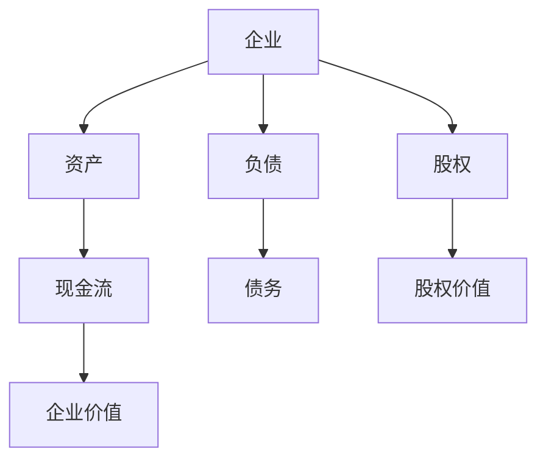
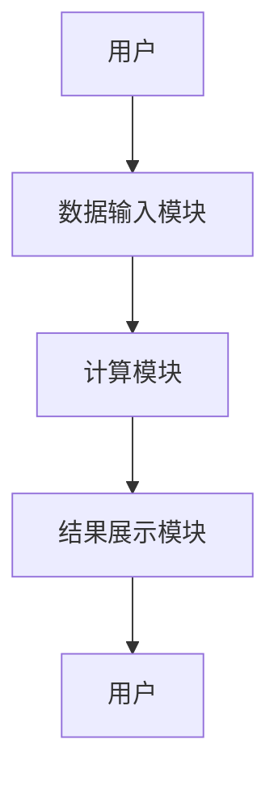
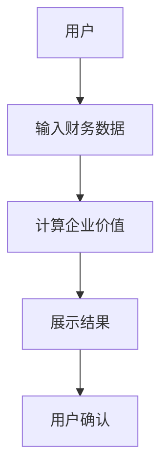

                 


# 实例演示：如何计算企业价值

## 关键词：企业价值，财务分析，WACC模型，股权自由现金流，系统架构，项目实战

## 摘要：  
企业价值计算是企业财务管理中的核心任务之一，涉及对企业未来现金流的评估和折现。本文通过详细分析企业价值的核心概念、计算模型、算法实现、系统架构设计以及实际项目案例，为读者提供从理论到实践的全面指导。通过本文的学习，读者将能够掌握企业价值计算的基本原理和实际应用方法，并能够独立完成企业价值的估算。

---

## 第一部分：企业价值计算的背景与基础

### 第1章：企业价值的基本概念与问题背景

#### 1.1 企业价值的核心概念
- **1.1.1 企业价值的定义与内涵**
  - 企业价值（Enterprise Value，EV）是指企业整体的经济价值，包括股权和债权的价值总和。
  - EV = 股权价值 + 税后利息税盾价值 + 其他调整项。
  - 企业价值不仅考虑了企业的财务状况，还考虑了其市场地位、竞争优势等因素。

- **1.1.2 企业价值计算的必要性**
  - 企业价值是企业战略决策的重要依据，如并购、融资、估值等。
  - 企业价值计算能够帮助投资者评估企业的内在价值，做出投资决策。

- **1.1.3 企业价值与股东价值的关系**
  - 企业价值是股东价值的函数，但两者关注的角度不同。
  - 股东价值主要关注股权部分的价值，而企业价值则是整个企业的估值。

#### 1.2 企业价值计算的背景与问题描述
- **1.2.1 企业价值计算的现实需求**
  - 随着全球经济的快速发展，企业价值计算的需求日益增长。
  - 企业价值计算在并购交易中尤为重要，能够帮助买卖双方确定合理的交易价格。

- **1.2.2 传统财务分析的局限性**
  - 传统财务分析主要依赖历史数据，无法充分反映未来现金流的潜在价值。
  - 传统方法忽略了市场波动和宏观经济因素对企业价值的影响。

- **1.2.3 现代企业价值评估的挑战**
  - 数据的获取和处理难度增加。
  - 市场波动和不确定性对企业价值的影响更加复杂。

#### 1.3 企业价值计算的目标与边界
- **1.3.1 企业价值计算的主要目标**
  - 评估企业的整体价值，为投资决策提供依据。
  - 确定企业的公平市场价值，用于并购定价。

- **1.3.2 计算范围的界定**
  - 企业价值计算通常包括企业的全部资产和负债。
  - 需要明确计算的边界，如是否包含子公司或关联企业。

- **1.3.3 与相关概念的区分**
  - 区分企业价值与股权价值。
  - 区分企业价值与市场价值。

---

## 第二部分：企业价值的核心概念与联系

### 第2章：企业价值的构成要素与计算模型

#### 2.1 核心概念原理
- **2.1.1 企业价值的构成要素**
  - 自由现金流：企业产生的可用于偿还债务和再投资的现金流。
  - 加权平均资本成本（WACC）：企业的平均资本成本，用于折现现金流。

- **2.1.2 财务指标在价值计算中的作用**
  - 自由现金流（FCFF）：企业扣除所有支出后的剩余现金流。
  - WACC：用于折现现金流的无风险利率。

- **2.1.3 市场因素对企业价值的影响**
  - 市场利率变化会影响WACC，从而影响企业价值。
  - 行业趋势和竞争格局也会影响企业未来的现金流。

#### 2.2 核心概念属性对比表
以下表格对比了财务指标与非财务指标在企业价值计算中的作用：

| 指标类型 | 财务指标 | 非财务指标 | 对企业价值的影响 |
|----------|----------|------------|------------------|
| 现金流   | 自由现金流（FCFF） | -                | 直接影响企业价值的计算 |
| 资本成本 | WACC     | -                | 用于折现现金流 |
| 市场因素 | 市场利率   | 行业趋势     | 间接影响企业价值 |

#### 2.3 实体关系图（ER图）
以下为企业价值计算的实体关系架构：



---

## 第三部分：企业价值计算的算法原理

### 第3章：企业价值计算的数学模型与公式

#### 3.1 基础公式与模型
- **3.1.1 股权自由现金流模型**
  - 自由现金流公式：
    $$ FCFF = EBIT(1 - 税率) + 折旧 - 资本支出 $$
  - 企业价值公式：
    $$ EV = \frac{FCFF}{WACC} $$

- **3.1.2 加权平均资本成本（WACC）公式**
  $$ WACC = w_d \cdot r_d + w_e \cdot r_e (1 - 税率) $$

- **3.1.3 企业价值与股权价值的关系公式**
  $$ EV = Equity Value + Interest Tax Shield $$

#### 3.2 算法流程图
以下为企业价值计算的算法流程图：

```mermaid
graph TD
    A[开始] --> B[输入企业财务数据]
    B --> C[计算自由现金流]
    C --> D[计算加权平均资本成本(WACC)]
    D --> E[计算企业价值]
    E --> F[结束]
```

#### 3.3 算法实现代码
以下为Python代码示例：

```python
def calculate_enterprise_value(free_cash_flow, wacc):
    enterprise_value = free_cash_flow / wacc
    return enterprise_value

# 示例数据
free_cash_flow = 1000000  # 自由现金流（单位：元）
wacc = 0.08  # 加权平均资本成本

enterprise_value = calculate_enterprise_value(free_cash_flow, wacc)
print(f"企业价值为：${enterprise_value:.2f}")
```

---

## 第四部分：企业价值计算的系统架构与设计

### 第4章：企业价值计算系统设计

#### 4.1 系统功能模块设计
- **4.1.1 数据输入模块**
  - 接收企业的财务数据，如EBIT、税率、资本支出等。
- **4.1.2 计算模块**
  - 计算自由现金流和WACC，最终计算企业价值。
- **4.1.3 结果展示模块**
  - 展示计算结果，并提供可视化界面。

#### 4.2 系统架构设计图
以下为系统架构设计图：



#### 4.3 系统接口设计
- 数据输入接口：接收企业的财务数据。
- 计算接口：调用自由现金流和WACC计算函数。
- 展示接口：将结果以图表形式展示。

#### 4.4 系统交互流程图
以下为系统交互流程图：



---

## 第五部分：企业价值计算的项目实战

### 第5章：企业价值计算的项目实现

#### 5.1 环境安装与配置
- 安装Python和必要的库，如NumPy和Pandas。

#### 5.2 核心实现代码
以下为Python代码实现：

```python
import numpy as np
import pandas as pd

def calculate_wacc(wd, rd, we, re, tax_rate):
    wacc = wd * rd + we * re * (1 - tax_rate)
    return wacc

def calculate_fcff(ebit, tax_rate, depreciation, capital_expenditure):
    fcff = ebit * (1 - tax_rate) + depreciation - capital_expenditure
    return fcff

def calculate_enterprise_value(ebit, tax_rate, depreciation, capital_expenditure, wd, rd, we, re, tax_rate):
    wacc = calculate_wacc(wd, rd, we, re, tax_rate)
    fcff = calculate_fcff(ebit, tax_rate, depreciation, capital_expenditure)
    ev = fcff / wacc
    return ev

# 示例数据
ebit = 1000000
tax_rate = 0.25
depreciation = 200000
capital_expenditure = 300000
wd = 0.4
rd = 0.05
we = 0.6
re = 0.1

ev = calculate_enterprise_value(ebit, tax_rate, depreciation, capital_expenditure, wd, rd, we, re, tax_rate)
print(f"企业价值为：${ev:.2f}")
```

#### 5.3 实际案例分析
以下为案例分析：

**案例背景**：某企业2023年的EBIT为100万元，税率25%，折旧20万元，资本支出30万元，WACC为8%。

**计算步骤**：
1. 计算自由现金流：
   $$ FCFF = 1000000 \times (1 - 0.25) + 200000 - 300000 = 700000 \text{元} $$
2. 计算企业价值：
   $$ EV = \frac{700000}{0.08} = 8750000 \text{元} $$

**结论**：企业的价值为875万元。

---

## 第六部分：总结与最佳实践

### 第6章：总结与最佳实践

#### 6.1 小结
- 企业价值计算是企业财务管理的重要组成部分，涉及多方面的知识和技能。
- 本文通过理论与实践相结合的方式，详细讲解了企业价值计算的核心概念、算法实现和系统设计。

#### 6.2 注意事项
- 数据的准确性和完整性是企业价值计算的关键。
- 在实际应用中，需考虑宏观经济因素和行业趋势的影响。

#### 6.3 拓展阅读
- 建议读者进一步学习资本预算理论和金融市场分析，以更好地理解企业价值计算的复杂性。

---

## 作者：AI天才研究院/AI Genius Institute & 禅与计算机程序设计艺术/Zen And The Art of Computer Programming

---

通过本文的学习，读者可以系统地掌握企业价值计算的核心原理和实际应用方法。从理论到实践，从算法到系统设计，本文为读者提供了全面的指导，帮助读者在企业价值评估领域取得更大的进步。

