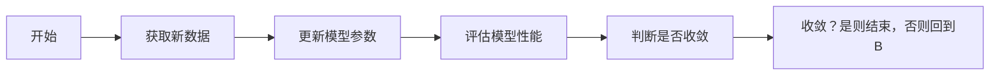
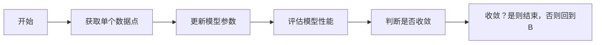

                 


# 实时学习：即时更新AI Agent的知识库

---

## 关键词：
实时学习，AI Agent，知识库，动态更新，在线学习，增量学习，机器学习

---

## 摘要：
实时学习是指在动态变化的环境中，AI Agent能够持续更新其知识库以适应新信息和新任务的学习方式。本文将探讨实时学习的核心概念、算法原理、系统架构以及在实际应用中的实现方法。通过分析动态更新机制、在线学习算法和增量学习方法，本文为AI Agent的知识库管理提供了理论支持和实践指导，帮助读者理解如何构建高效、灵活的知识更新系统。

---

# 第一部分: 实时学习与AI Agent知识库的背景

## 第1章: 实时学习的背景与意义

### 1.1 传统知识库的局限性
传统知识库在静态环境中表现良好，但面对动态变化的数据和需求时，更新成本高且效率低。实时学习通过动态更新机制，能够快速适应新信息，显著提升了AI Agent的灵活性和实用性。

### 1.2 AI Agent知识库的特点
- **动态更新**：能够实时吸收新数据，保持知识库的最新性。
- **结构化表示**：采用结构化的数据存储方式，便于快速检索和更新。
- **可扩展性**：支持新增知识点，适应不同应用场景的需求。

### 1.3 问题背景与目标
- **问题背景**：在动态环境中，传统知识库无法满足实时更新的需求，导致AI Agent的知识过时，影响决策能力。
- **问题解决**：通过实时学习，AI Agent能够持续更新知识库，保持其准确性和适用性。
- **目标与边界**：实时学习的目标是实现知识库的动态更新，提升AI Agent的适应性和智能性。其边界包括数据源的质量、更新频率和计算资源的限制。

---

## 第2章: 实时学习的核心概念

### 2.1 实时学习的定义与原理
实时学习是一种基于动态数据流的机器学习方法，通过在线更新模型或知识库，适应数据的变化。其核心在于持续优化AI Agent的知识表示，确保其在实时应用中的有效性。

### 2.2 AI Agent知识库的结构化表示
知识库的结构化表示是实时学习的基础，通常采用图结构或向量表示，便于快速更新和检索。

### 2.3 实时学习的关键特征
| 特征         | 描述                                                                 |
|--------------|----------------------------------------------------------------------|
| 实时性       | 知识库能够实时更新，适应数据流的变化                               |
| 自适应性     | 根据新数据自动调整知识表示，保持准确性                               |
| 增量性       | 在原有知识基础上，逐步更新，避免重新训练整个模型                 |
| 分布式       | 支持多节点协作，提升更新效率                                       |

### 2.4 实时学习与其他学习方式的对比
| 对比维度     | 在线学习      | 增量学习      | 批量学习      |
|--------------|--------------|--------------|--------------|
| 数据处理方式 | 流式数据      | 增量数据      | 批量数据      |
| 更新频率     | 实时          | 周期性        | 一次性        |
| 资源消耗     | 较低          | 较低          | 较高          |

### 2.5 知识库动态更新的机制
- **触发机制**：根据预设的阈值或事件触发更新。
- **更新策略**：采用基于时间或基于数据变化的策略，选择性更新关键知识点。
- **一致性保证**：确保知识库在更新过程中的逻辑一致性，避免冲突。

---

## 第3章: 实时学习的算法原理

### 3.1 增量学习算法
增量学习是一种典型的实时学习方法，适用于数据流环境。其核心在于在每一步仅更新模型的一部分，避免重新训练整个模型。

#### 3.1.1 增量学习的流程


#### 3.1.2 增量学习的数学模型
增量学习的更新规则可以表示为：
$$
\theta_{t+1} = \theta_t + \eta (y_t - \hat{y}_t) \cdot X_t
$$
其中，$\theta_t$ 是当前参数，$\eta$ 是学习率，$y_t$ 是真实标签，$\hat{y}_t$ 是预测标签，$X_t$ 是输入数据。

### 3.2 在线学习算法
在线学习与增量学习类似，但更强调实时性。其核心在于处理无限数据流，每次仅处理单个样本。

#### 3.2.1 在线学习的流程


#### 3.2.2 在线学习的数学模型
在线学习的更新规则可以表示为：
$$
\theta_{t+1} = \theta_t + \eta (y_t - \hat{y}_t) \cdot x_t
$$
其中，$\theta_t$ 是当前参数，$\eta$ 是学习率，$y_t$ 是真实标签，$\hat{y}_t$ 是预测标签，$x_t$ 是当前输入。

### 3.3 算法实现与代码示例
以下是一个增量学习的Python实现示例：
```python
import numpy as np

def incremental_learning(X, y, theta, eta):
    for i in range(X.shape[0]):
        x = X[i]
        y_pred = np.dot(theta, x)
        error = y[i] - y_pred
        theta += eta * error * x
    return theta

# 示例数据
X = np.array([[1, 2], [3, 4]])
y = np.array([5, 6])
theta = np.array([0, 0])
eta = 0.1

theta_updated = incremental_learning(X, y, theta, eta)
print(theta_updated)
```

---

## 第4章: 系统分析与架构设计

### 4.1 问题场景介绍
实时学习系统需要处理动态变化的数据流，确保知识库的实时更新。应用场景包括金融数据分析、实时推荐系统和智能监控系统。

### 4.2 系统功能设计
- **数据采集模块**：实时获取新数据，处理并传递给学习模块。
- **学习模块**：执行增量或在线学习，更新知识库。
- **知识库管理模块**：维护知识库的结构和一致性。
- **评估模块**：监控学习效果，调整学习参数。

### 4.3 系统架构设计


### 4.4 接口与交互设计
- **数据接口**：定义数据输入和输出的格式，确保兼容性。
- **学习接口**：提供参数配置和模型更新的接口，支持动态调整。

---

## 第5章: 项目实战

### 5.1 环境与工具安装
- **Python**：安装最新版本的Python。
- **NumPy**：用于数值计算。
- **scikit-learn**：用于机器学习算法实现。

### 5.2 核心代码实现
```python
from sklearn.linear_model import SGDClassifier
from sklearn.metrics import accuracy_score
import numpy as np

# 示例数据流
data_stream = [(X1, y1), (X2, y2), ...]

# 初始化模型
model = SGDClassifier()

# 实时更新
for X, y in data_stream:
    model.partial_fit(X, y)
    if i % 10 == 0:
        print(f"Iteration {i}, Accuracy: {accuracy_score(y_true, model.predict(X_test))}")
```

### 5.3 实际案例分析
假设我们有一个实时推荐系统，需要根据用户的实时行为更新推荐模型。通过增量学习，系统可以在每次用户互动后更新推荐策略，提高推荐的准确性。

### 5.4 项目总结
实时学习的实现需要考虑数据流的处理、模型的更新频率以及系统的资源消耗。通过合理设计架构和算法，可以实现高效的知识库更新。

---

## 第6章: 最佳实践与注意事项

### 6.1 小结
实时学习的核心在于动态更新知识库，保持AI Agent的适应性。通过增量学习和在线学习算法，可以实现高效的知识更新。

### 6.2 注意事项
- **数据质量**：实时学习依赖于高质量的数据流，数据噪声会影响模型性能。
- **模型收敛**：需要监控模型的收敛性，避免过拟合或欠拟合。
- **资源管理**：实时学习通常需要较高的计算资源，需合理分配资源。

### 6.3 拓展阅读
- 建议深入研究实时学习的相关论文，如《Incremental Learning: A Survey》和《Real-Time Machine Learning with Online Algorithms》。

---

## 作者：AI天才研究院 & 禅与计算机程序设计艺术

---

希望这篇文章能够帮助读者深入理解实时学习的概念和实现方法，为构建高效、灵活的AI Agent知识库提供有价值的参考。

