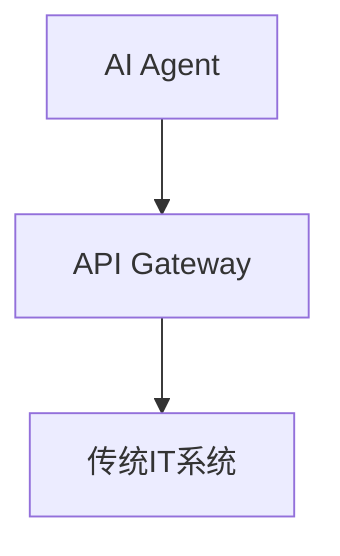
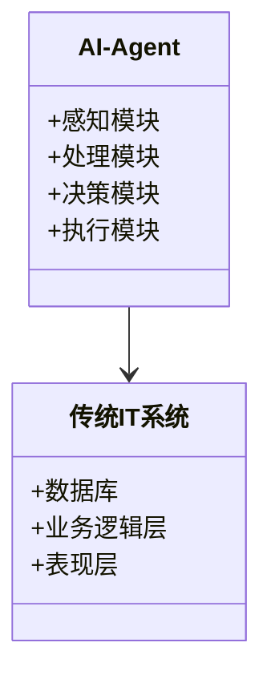
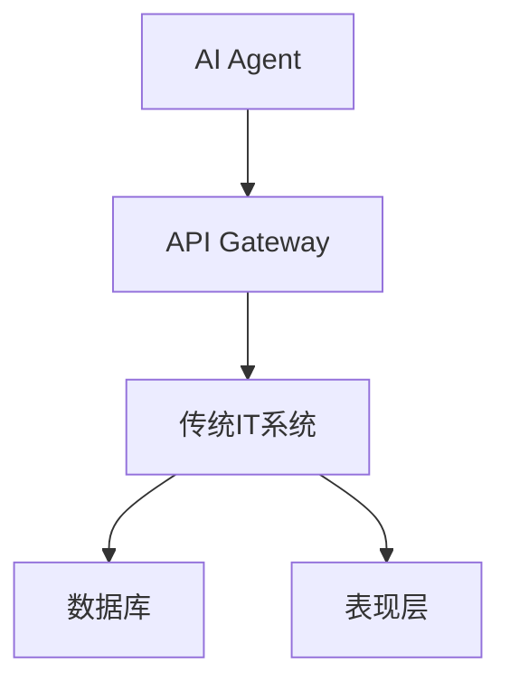
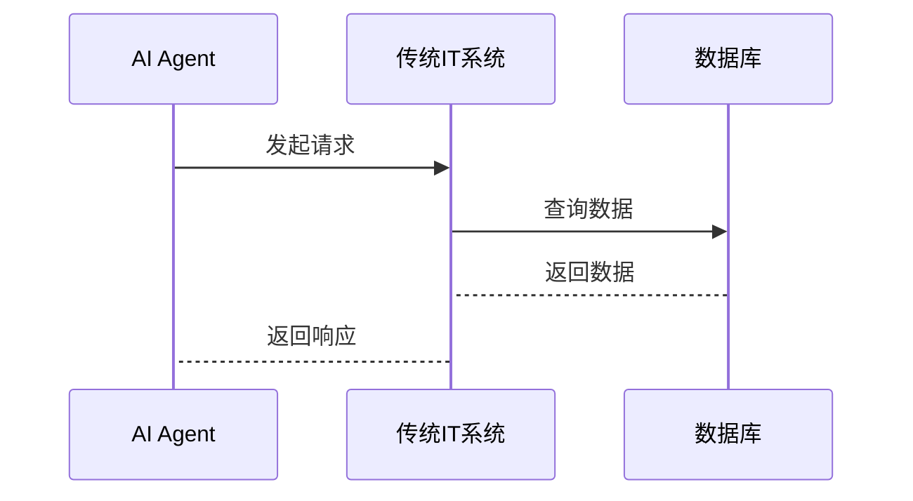

                 


# 实现AI Agent与传统IT系统的无缝集成

## 关键词：AI Agent, 传统IT系统, 系统集成, 通信协议, 数据集成

## 摘要：随着人工智能技术的快速发展，AI Agent（智能体）在企业信息化中的应用越来越广泛。然而，AI Agent与传统IT系统的集成仍面临诸多挑战。本文详细探讨了AI Agent的核心原理、通信协议设计、数据集成方法、系统架构优化以及实际项目中的实现技巧。通过案例分析和最佳实践，本文为技术从业者提供了实现AI Agent与传统IT系统无缝集成的深度指导。

---

# 第一部分：AI Agent与传统IT系统概述

## 第1章：AI Agent与传统IT系统概述

### 1.1 AI Agent的定义与特点

#### 1.1.1 AI Agent的基本概念
AI Agent是一种能够感知环境、自主决策并执行任务的智能实体。它可以基于实时数据做出决策，例如聊天机器人、推荐系统等。

#### 1.1.2 AI Agent的核心特点
- **自主性**：无需外部干预，自主完成任务。
- **反应性**：能够实时感知环境并调整行为。
- **学习能力**：通过数据训练不断提升性能。
- **可扩展性**：支持多种任务和场景。

#### 1.1.3 AI Agent与传统IT系统的区别
| 属性      | AI Agent                          | 传统IT系统                      |
|-----------|----------------------------------|----------------------------------|
| 决策方式  | 基于数据和模型进行决策          | 基于规则和逻辑进行操作          |
| 灵活性    | 高，能够适应变化                | 较低，依赖预先设定的规则          |
| 可扩展性  | 支持多种场景和任务              | 通常针对特定场景设计              |

### 1.2 传统IT系统的概述

#### 1.2.1 传统IT系统的组成
- **数据层**：存储数据，如数据库。
- **业务逻辑层**：处理业务逻辑，如订单处理。
- **表现层**：用户交互界面，如Web界面。

#### 1.2.2 传统IT系统的特点
- **稳定性**：经过长期使用，可靠性高。
- **可维护性**：基于明确的规则，易于维护。
- **局限性**：难以适应动态变化的环境。

### 1.3 AI Agent与传统IT系统集成的意义

#### 1.3.1 提升系统智能化水平
通过引入AI Agent，传统IT系统能够实现自动化决策和问题解决。

#### 1.3.2 增强系统灵活性与适应性
AI Agent能够快速响应变化，提升系统的灵活性。

#### 1.3.3 优化企业业务流程
AI Agent可以优化流程，减少人工干预，提升效率。

### 1.4 本章小结
本章介绍了AI Agent和传统IT系统的定义、特点及其集成的意义，为后续章节奠定了基础。

---

# 第二部分：AI Agent的核心原理与技术

## 第2章：AI Agent的核心原理

### 2.1 AI Agent的结构与功能

#### 2.1.1 AI Agent的组成模块
- **感知模块**：采集环境数据，如传感器或API调用。
- **处理模块**：分析数据，如机器学习模型。
- **决策模块**：基于分析结果做出决策。
- **执行模块**：执行决策，如调用API或触发事件。

#### 2.1.2 AI Agent的功能特点
- **自主决策**：无需人工干预。
- **实时响应**：能够快速处理数据并做出决策。
- **自适应能力**：能够根据环境变化调整行为。

### 2.2 AI Agent的工作流程

#### 2.2.1 信息感知与数据采集
AI Agent通过传感器、API或其他数据源采集环境数据。

#### 2.2.2 数据处理与分析
数据经过预处理、特征提取和模型训练，生成决策依据。

#### 2.2.3 决策与执行
基于分析结果，AI Agent做出决策并执行任务。

### 2.3 AI Agent与传统IT系统的区别

#### 2.3.1 功能实现方式
AI Agent通过数据驱动的方式实现功能，传统IT系统基于规则驱动。

#### 2.3.2 技术实现原理
AI Agent依赖机器学习和大数据技术，传统IT系统依赖规则和逻辑编程。

#### 2.3.3 交互方式
AI Agent能够主动适应变化，传统IT系统依赖固定规则。

### 2.4 本章小结
本章详细讲解了AI Agent的核心原理及其与传统IT系统的区别。

---

# 第三部分：AI Agent与传统IT系统的通信协议

## 第3章：通信协议与数据交互

### 3.1 通信协议概述

#### 3.1.1 通信协议的基本概念
通信协议是数据传输的标准规则，如HTTP、WebSocket等。

#### 3.1.2 常见的通信协议类型
- **同步协议**：如HTTP。
- **异步协议**：如WebSocket。
- **消息队列**：如Kafka。

#### 3.1.3 选择通信协议的考虑因素
- **实时性**：需要快速响应的任务选择WebSocket。
- **数据量**：大量数据传输选择消息队列。
- **复杂性**：简单任务选择HTTP。

### 3.2 AI Agent与传统IT系统的数据交互

#### 3.2.1 数据格式与编码
- **JSON**：常用的数据交换格式。
- **XML**：结构化数据描述语言。

#### 3.2.2 数据传输协议
- **HTTP**：基于请求-响应的通信方式。
- **gRPC**：高效的RPC通信协议。

#### 3.2.3 数据安全与加密
- **SSL/TLS**：保障数据传输的安全性。
- **JWT**：用于身份验证和授权。

### 3.3 实现无缝集成的通信协议设计

#### 3.3.1 协议栈设计


#### 3.3.2 通信接口设计
- **REST API**：标准的HTTP接口。
- **gRPC**：高效的二进制协议。

#### 3.3.3 通信异常处理
- **断路器模式**：防止链路拥塞。
- **重试机制**：处理临时性故障。

### 3.4 本章小结
本章探讨了通信协议的选择与设计，确保AI Agent与传统IT系统之间的高效交互。

---

# 第四部分：数据集成与系统整合

## 第4章：数据集成与系统整合

### 4.1 数据集成的基本概念

#### 4.1.1 数据集成的定义
数据集成是将不同来源的数据整合到一个系统中，确保数据一致性和完整性。

#### 4.1.2 数据集成的类型
- **内部集成**：同一系统内部的数据整合。
- **外部集成**：不同系统之间的数据整合。

#### 4.1.3 数据集成的挑战
- **数据格式不一致**：不同系统数据结构不同。
- **数据冗余**：重复数据导致的存储浪费。
- **数据一致性**：如何保证数据同步。

### 4.2 数据清洗与预处理

#### 4.2.1 数据清洗方法
- **去重**：删除重复数据。
- **填充缺失值**：处理空值，如用均值填充。
- **数据标准化**：统一数据格式。

#### 4.2.2 数据预处理技术
- **特征选择**：选择重要特征。
- **特征工程**：构造新特征。

#### 4.2.3 数据标准化与归一化
- **标准化**：将数据按比例缩放到同一范围内。
- **归一化**：将数据按比例缩放到[0,1]范围。

### 4.3 数据同步与一致性维护

#### 4.3.1 数据同步机制
- **同步复制**：实时同步数据。
- **异步复制**：延迟同步数据。

#### 4.3.2 数据一致性保证
- **ACID原则**：确保事务的原子性、一致性、隔离性和持久性。
- **分布式锁**：防止数据冲突。

#### 4.3.3 数据冲突处理
- **版本控制**：记录数据版本，解决冲突。
- **优先级规则**：根据优先级处理冲突。

### 4.4 系统整合的实现

#### 4.4.1 系统整合的步骤
1. **需求分析**：明确整合的目标和范围。
2. **数据建模**：设计数据模型。
3. **接口设计**：设计API接口。
4. **数据迁移**：将数据迁移到新系统。
5. **测试验证**：测试整合后的系统。

#### 4.4.2 数据整合案例
```python
# 数据清洗示例
import pandas as pd

df = pd.read_csv('data.csv')
df.drop_duplicates(inplace=True)
df['age'].fillna(df['age'].mean(), inplace=True)
print(df)
```

### 4.5 本章小结
本章详细讲解了数据集成的方法和系统整合的步骤，为实现AI Agent与传统IT系统的无缝集成提供了数据层面的支持。

---

# 第五部分：系统分析与架构设计方案

## 第5章：系统分析与架构设计

### 5.1 问题场景介绍

#### 5.1.1 项目背景
某电商公司希望引入AI Agent来优化订单处理流程。

#### 5.1.2 项目目标
实现AI Agent与现有订单系统的无缝集成，提升订单处理效率。

### 5.2 系统功能设计

#### 5.2.1 领域模型设计


#### 5.2.2 系统架构设计


#### 5.2.3 系统接口设计
- **API接口**：AI Agent通过API调用传统IT系统。
- **消息队列**：处理大量数据时使用Kafka。

#### 5.2.4 系统交互设计


### 5.3 本章小结
本章通过实际案例分析了系统分析与架构设计，展示了如何实现AI Agent与传统IT系统的无缝集成。

---

# 第六部分：项目实战

## 第6章：项目实战

### 6.1 环境安装

#### 6.1.1 安装Python环境
```bash
python -m pip install --upgrade pip
pip install python-dotenv
pip install requests
pip install numpy
pip install pandas
pip install scikit-learn
```

#### 6.1.2 安装传统IT系统
- **安装MySQL**：配置数据库。
- **安装Web框架**：如Django或Flask。

### 6.2 系统核心实现源代码

#### 6.2.1 AI Agent实现
```python
import requests
import json

class AIAgent:
    def __init__(self, api_key):
        self.api_key = api_key
        self.base_url = 'http://api_gateway'
    
    def perceive(self):
        # 获取环境数据
        response = requests.get(f'{self.base_url}/data', params={'key': self.api_key})
        return json.loads(response.text)
    
    def decide(self, data):
        # 数据处理和分析
        # 假设这是一个简单的分类问题
        if data['score'] > 85:
            return 'approve'
        else:
            return 'reject'
    
    def execute(self, action):
        # 执行决策
        response = requests.post(f'{self.base_url}/{action}', json={'key': self.api_key})
        return response.status_code == 200
```

#### 6.2.2 传统IT系统实现
```python
from django.urls import path
from django.http import JsonResponse

def handle_request(request):
    if request.method == 'GET':
        # 获取数据
        data = {'status': 'success'}
        return JsonResponse(data)
    elif request.method == 'POST':
        # 处理请求
        data = {'status': 'success'}
        return JsonResponse(data)

urlpatterns = [
    path('data', handle_request),
    path('approve', handle_request),
    path('reject', handle_request),
]
```

### 6.3 代码应用解读与分析

#### 6.3.1 AI Agent代码解读
- **perceive方法**：调用API获取环境数据。
- **decide方法**：基于数据做出决策。
- **execute方法**：执行决策并返回结果。

#### 6.3.2 传统IT系统代码解读
- **handle_request方法**：处理HTTP请求，返回响应。
- **URL配置**：定义API接口。

### 6.4 实际案例分析

#### 6.4.1 案例背景
某电商公司希望AI Agent能够自动审批订单，提升效率。

#### 6.4.2 系统实现
AI Agent调用传统IT系统的API，获取订单信息后，决定是否批准订单。

#### 6.4.3 测试与验证
- **单元测试**：测试AI Agent的各模块。
- **集成测试**：测试AI Agent与传统IT系统的交互。

### 6.5 本章小结
本章通过实际项目实战，详细讲解了如何实现AI Agent与传统IT系统的集成。

---

# 第七部分：最佳实践与小结

## 第7章：最佳实践

### 7.1 最佳实践 tips

#### 7.1.1 明确需求
在集成前，明确AI Agent的需求和目标。

#### 7.1.2 选择合适的通信协议
根据需求选择合适的通信协议，如HTTP或WebSocket。

#### 7.1.3 数据一致性保证
确保数据在集成过程中保持一致性和完整性。

#### 7.1.4 系统架构优化
设计合理的系统架构，确保系统的可扩展性和可维护性。

### 7.2 小结

#### 7.2.1 本文总结
本文详细探讨了AI Agent与传统IT系统的集成，从核心原理到实际项目实现，为技术从业者提供了系统的指导。

#### 7.2.2 展望未来
未来，随着AI技术的发展，AI Agent与传统IT系统的集成将更加紧密，为企业创造更大的价值。

---

# 作者

**作者：AI天才研究院 & 禅与计算机程序设计艺术**

**简介**：专注于人工智能与计算机程序设计的研究与实践，致力于为企业提供智能化解决方案，帮助企业在数字化转型中获得竞争优势。

--- 

以上是《实现AI Agent与传统IT系统的无缝集成》的完整目录和内容框架，您可以根据需要进一步扩展每个章节的内容，添加具体的代码示例、详细的设计图以及更多的实际案例分析。

