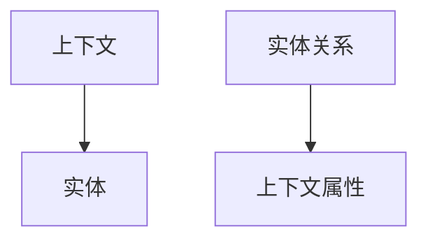
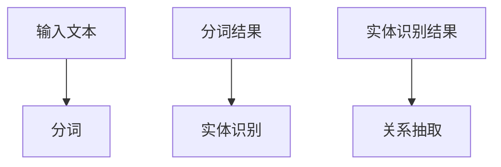
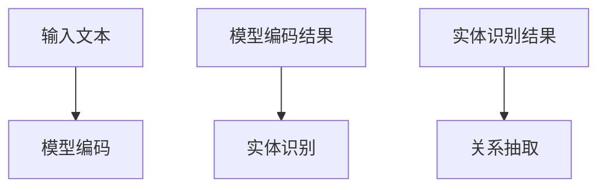
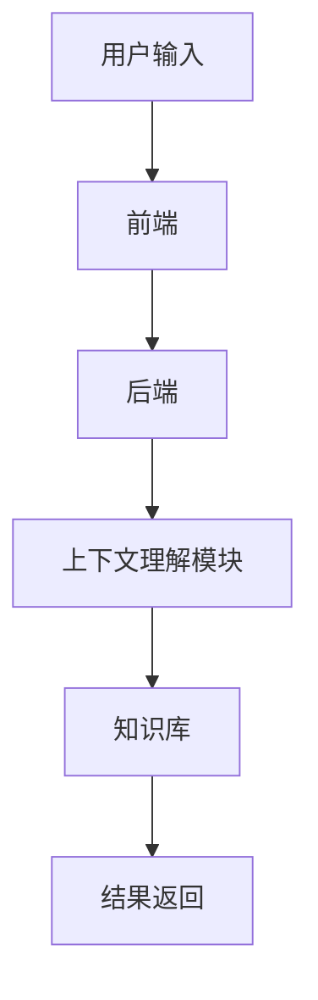
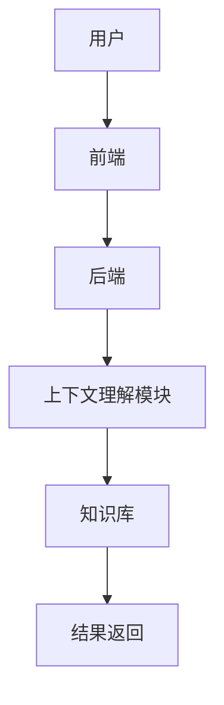

                 


# 实现AI Agent的上下文理解与管理

> 关键词：AI Agent，上下文理解，自然语言处理，知识图谱，对话系统

> 摘要：本文系统地探讨了AI Agent的上下文理解与管理的核心技术，从背景、算法原理、系统架构到实战项目，全面解析如何实现高效的上下文理解与管理，助力AI Agent在复杂场景中的智能交互。

---

# 第一部分: AI Agent的上下文理解与管理基础

## # 第1章: 背景介绍

### 1.1 问题背景

#### 1.1.1 上下文理解的定义与重要性
上下文理解是指AI Agent能够解析和处理当前对话或任务中的上下文信息，包括语义、实体、关系和意图。它是实现智能交互的基础，能够帮助AI Agent更好地理解用户需求，提供更精准的服务。

#### 1.1.2 当前AI Agent面临的挑战
- **语义理解不足**：现有技术在复杂语境下的理解能力有限。
- **实时性要求高**：上下文理解需要在实时交互中快速响应。
- **多模态数据处理**：需要整合文本、语音、图像等多种数据源。

#### 1.1.3 上下文理解在AI Agent中的作用
- **提升交互效率**：通过上下文理解，减少重复提问，提高用户体验。
- **增强智能决策**：基于上下文信息，AI Agent能够做出更准确的决策。

### 1.2 问题描述

#### 1.2.1 AI Agent与上下文理解的关系
AI Agent通过上下文理解与用户进行有效交互，理解用户意图和背景信息，从而提供个性化服务。

#### 1.2.2 上下文理解的核心问题
- 如何准确提取实体和关系。
- 如何处理模糊和歧义信息。
- 如何维护上下文的动态更新。

#### 1.2.3 上下文理解的边界与外延
- **边界**：上下文理解仅限于当前对话或任务的相关信息。
- **外延**：结合知识图谱和外部数据库，扩展上下文信息。

### 1.3 核心概念与联系

#### 1.3.1 上下文理解的原理
- **信息抽取**：从文本中提取实体、关系和事件。
- **语义分析**：通过语义网络或深度学习模型，理解文本的深层含义。

#### 1.3.2 核心概念对比表
| 对比维度 | 基于规则的方法 | 基于模型的方法 |
|----------|----------------|----------------|
| 精度     | 高             | 中             |
| 灵活性   | 低             | 高             |
| 开发复杂度 | 低             | 高             |

#### 1.3.3 ER实体关系图


---

## # 第2章: 核心概念与联系

### 2.1 上下文理解的原理

#### 2.1.1 信息抽取与语义分析
- **信息抽取**：使用NLP技术提取文本中的实体、关系和事件。
- **语义分析**：通过词义网络或深度学习模型，理解文本的语义。

#### 2.1.2 上下文推理与关联
- **推理**：基于已有的知识库，推导出隐含的信息。
- **关联**：将当前上下文与历史上下文进行关联，维护对话的连贯性。

### 2.2 核心概念对比表
| 技术 | 基于规则 | 基于模型 |
|------|----------|----------|
| 优点 | 高精度   | 强大的泛化能力 |
| 缺点 | 缺乏灵活性 | 开发复杂 |

### 2.3 实体关系图


---

## # 第3章: 算法原理讲解

### 3.1 上下文理解的算法原理

#### 3.1.1 基于规则的上下文理解算法
- **规则定义**：通过预定义的规则，匹配文本中的特定模式。
- **流程**：
  1. 分词。
  2. 实体识别。
  3. 关系抽取。

#### 3.1.2 基于模型的上下文理解算法
- **模型选择**：使用深度学习模型（如BERT）进行上下文理解。
- **流程**：
  1. 输入文本。
  2. 模型编码。
  3. 输出实体和关系。

#### 3.1.3 混合模型的上下文理解算法
- **混合策略**：结合规则和模型的优势，提升理解精度。

### 3.2 算法流程图

#### 基于规则的上下文理解算法流程图


#### 基于模型的上下文理解算法流程图


### 3.3 数学模型与公式

#### 3.3.1 基于概率的实体识别模型
$$ P(word|entity) = \frac{P(entity|word) \cdot P(word)}{P(entity)} $$

#### 3.3.2 基于深度学习的关系抽取模型
$$ P(rel|context) = \text{BERT}(context) $$

---

## # 第4章: 系统分析与架构设计

### 4.1 问题场景介绍

#### 4.1.1 应用场景
- **客服系统**：通过上下文理解，快速定位用户问题。
- **智能助手**：根据上下文提供个性化服务。

### 4.2 系统功能设计

#### 4.2.1 领域模型


#### 4.2.2 系统架构


### 4.3 系统接口设计

#### 4.3.1 API接口
- **输入接口**：`POST /api/context/input`
- **输出接口**：`GET /api/context/output`

#### 4.3.2 交互流程图


---

## # 第5章: 项目实战

### 5.1 环境安装

#### 5.1.1 安装Python
```bash
python --version
pip install --upgrade pip
```

#### 5.1.2 安装NLP库
```bash
pip install numpy
pip install scikit-learn
pip install transformers
```

### 5.2 核心代码实现

#### 5.2.1 实体识别代码
```python
from transformers import pipeline

nlp = pipeline("ner")
result = nlp("The customer wants to book a flight to Paris.")
print(result)
```

#### 5.2.2 关系抽取代码
```python
from transformers import pipeline

nlp = pipeline("relation_extraction")
result = nlp("The customer bought a ticket from the agent.")
print(result)
```

### 5.3 案例分析

#### 5.3.1 案例背景
- **项目名称**：智能客服系统
- **应用场景**：处理用户关于航班预订的问题。

#### 5.3.2 实施步骤
1. **环境搭建**：安装必要的库。
2. **数据准备**：收集客服对话数据。
3. **模型训练**：训练实体识别和关系抽取模型。
4. **系统集成**：将模型集成到客服系统中。

### 5.4 项目小结
- **成功经验**：通过上下文理解，显著提高了客服系统的响应速度和准确性。
- **改进建议**：进一步优化模型，提升处理复杂语境的能力。

---

## # 第6章: 最佳实践与小结

### 6.1 小结
- **上下文理解的重要性**：是AI Agent实现智能交互的关键。
- **算法选择**：根据实际需求选择合适的方法。
- **系统设计**：注重模块化和可扩展性。

### 6.2 注意事项
- **数据质量**：确保训练数据的多样性和代表性。
- **模型调优**：定期更新模型，提升理解能力。

### 6.3 拓展阅读
- **推荐书籍**：《自然语言处理入门》。
- **推荐论文**：《BERT: Pre-training of Deep Bidirectional Transformers for NLP》。

---

# 结语

上下文理解与管理是实现高效AI Agent的核心技术。通过本文的系统介绍，读者可以全面了解相关理论、算法和实践方案。未来，随着NLP技术的不断进步，AI Agent的上下文理解能力将更加智能化和人性化。

---

作者：AI天才研究院/AI Genius Institute & 禅与计算机程序设计艺术 /Zen And The Art of Computer Programming

