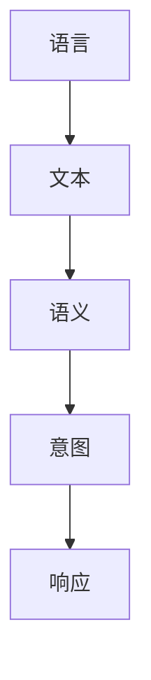
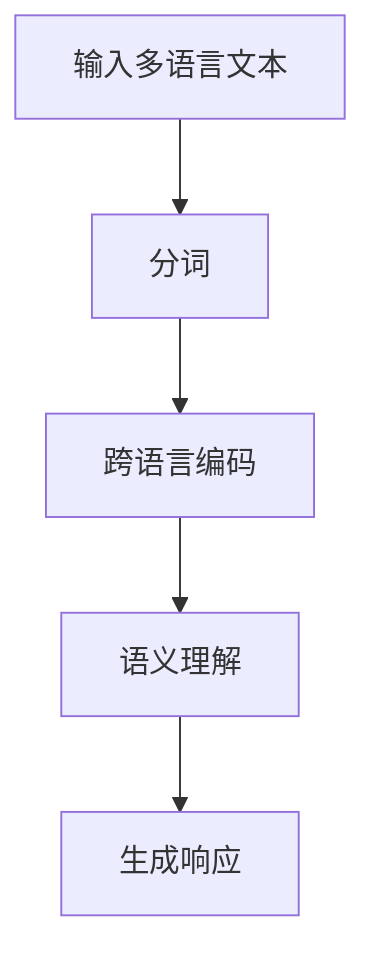
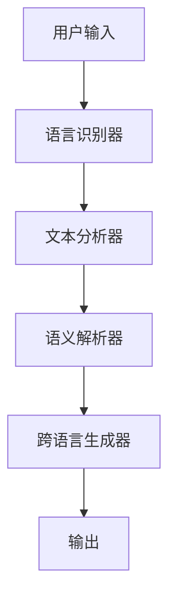
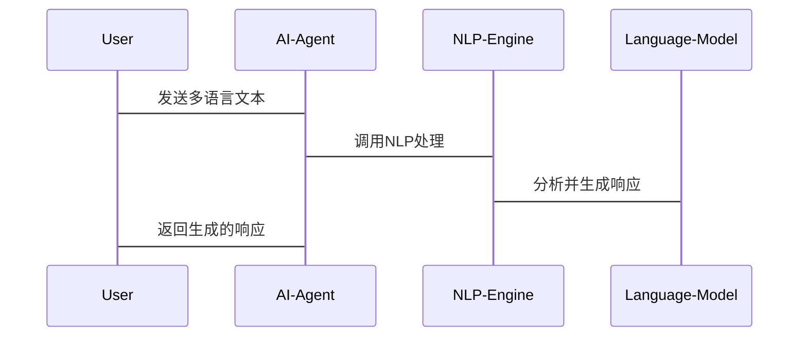

                 


```markdown
# 实现AI Agent的多语言支持

> 关键词：AI Agent，多语言支持，自然语言处理，跨语言理解，Transformer模型，系统架构设计

> 摘要：本文深入探讨了实现AI Agent多语言支持的核心技术与方法，从背景介绍、核心概念、算法原理到系统架构设计，结合实际案例分析，全面解析如何构建支持多种语言的AI Agent系统。

---

# 第一部分: AI Agent与多语言支持的背景介绍

## 第1章: AI Agent与多语言支持的背景介绍

### 1.1 AI Agent的基本概念
#### 1.1.1 AI Agent的定义与特点
AI Agent（智能代理）是指能够感知环境、自主决策并执行任务的智能体。其特点包括：
- **自主性**：无需外部干预，自主完成任务。
- **反应性**：能够实时感知环境并做出反应。
- **目标导向**：以特定目标为导向，优化行动路径。
- **学习能力**：通过数据和经验不断优化性能。

#### 1.1.2 多语言支持的必要性
在实际应用中，AI Agent需要与全球用户互动，支持多语言能力是其必备技能。例如：
- **全球化应用**：支持多种语言可以扩大产品的用户群体。
- **跨文化适应性**：不同语言背后有不同的文化背景和语境，支持多语言能够提升用户体验。
- **多场景应用**：在客服、教育、医疗等领域，多语言支持能够覆盖更广泛的应用场景。

#### 1.1.3 当前AI Agent的应用场景
当前，AI Agent已在多个领域展现出强大的应用潜力，例如：
- **智能客服**：通过多语言支持，为全球用户提供7x24小时的客户服务。
- **教育助手**：为不同语言背景的学生提供个性化的学习支持。
- **智能音箱**：支持多种语言的语音交互，提升家庭用户的便利性。

### 1.2 多语言支持的核心问题
#### 1.2.1 语言理解与生成的挑战
多语言支持的核心难点在于不同语言之间的语法规则、语义差异和文化背景的复杂性。例如：
- **语法差异**：中文是语境驱动型语言，而英文是形态驱动型语言，这对模型的处理能力提出了更高要求。
- **语义理解**：同一概念在不同语言中可能有多种表达方式，模型需要能够准确理解并生成对应语言的表达。

#### 1.2.2 跨语言信息处理的复杂性
跨语言信息处理涉及多个步骤，包括：
- **语言识别**：自动识别输入语言并切换到相应处理模块。
- **跨语言转换**：将一种语言的信息转换为另一种语言，同时保持原意不变。
- **语言切换与适配**：动态切换语言并调整模型参数以适应不同语言的处理需求。

#### 1.2.3 多语言环境下AI Agent的适应性
在多语言环境下，AI Agent需要具备快速适应不同语言环境的能力，这涉及到：
- **动态语言切换**：根据用户输入实时切换处理语言。
- **语言环境感知**：通过上下文感知用户语言偏好并进行动态调整。
- **多语言模型的泛化能力**：模型需要在不同语言之间保持一致性，同时针对每种语言进行优化。

### 1.3 本章小结
- **AI Agent的基本概念**：AI Agent是一种能够自主感知、决策和执行任务的智能体。
- **多语言支持的必要性**：在全球化背景下，支持多语言能力是扩大用户群体和提升用户体验的关键。
- **当前应用场景**：AI Agent已在智能客服、教育助手和智能音箱等领域展现出广泛的应用潜力。

---

# 第二部分: 多语言支持的核心概念与联系

## 第2章: 多语言支持的核心概念与联系

### 2.1 多语言支持的核心原理
#### 2.1.1 自然语言处理（NLP）的基础
自然语言处理是实现多语言支持的核心技术，主要包括：
- **语言分析**：包括分词、句法分析和语义分析。
- **文本生成**：基于预训练语言模型生成自然语言文本。
- **跨语言处理**：实现不同语言之间的信息转换和交互。

#### 2.1.2 跨语言理解与生成的机制
跨语言理解与生成涉及以下几个关键步骤：
1. **语言识别**：通过输入文本的特征（如字符、词法结构）识别出语言类型。
2. **跨语言映射**：将一种语言的语义映射到另一种语言。
3. **语言生成**：根据目标语言的语法规则生成相应的文本。

#### 2.1.3 多语言模型的训练策略
多语言模型的训练策略包括：
- **多任务学习**：在同一模型中同时学习多种语言的NLP任务。
- **预训练与微调**：利用大规模多语言语料库进行预训练，然后在特定任务上进行微调。

### 2.2 多语言支持的核心要素对比
#### 2.2.1 不同语言的语法规则对比
不同语言在语法结构上有显著差异，例如：
- **中文**：缺乏形态变化，依赖语境和语序。
- **英文**：具有丰富的形态变化，如复数、时态等。

#### 2.2.2 语言间的语义差异
同一概念在不同语言中可能有不同的表达方式，例如：
- **直接翻译**：某些词语在不同语言中有直接对应的翻译。
- **文化差异**：某些概念在不同文化背景中有不同的含义。

#### 2.2.3 文化背景对语言理解的影响
文化背景影响语言的使用方式和语义理解，例如：
- **礼貌用语**：不同语言中表达礼貌的方式不同。
- **隐喻与象征**：某些隐喻在一种语言中可能有明确的对应，而在另一种语言中可能没有。

### 2.3 多语言支持的ER实体关系图


### 2.4 本章小结
- **多语言支持的核心原理**：基于自然语言处理技术，实现跨语言的信息理解和生成。
- **核心要素对比**：不同语言在语法、语义和文化背景上有显著差异，需要在模型中进行适配和优化。
- **ER实体关系图**：通过实体关系图可以清晰地理解多语言支持的核心要素及其相互关系。

---

# 第三部分: 多语言AI Agent的算法原理

## 第3章: 多语言AI Agent的算法原理

### 3.1 多语言模型的训练算法
#### 3.1.1 基于Transformer的多语言模型
Transformer模型通过自注意力机制实现了强大的语言理解能力。其核心公式如下：
$$
\text{Attention}(Q,K,V) = \text{softmax}(\frac{QK^T}{\sqrt{d_k}})V
$$

#### 3.1.2 多任务学习在多语言支持中的应用
多任务学习通过共享不同任务的特征表示，提高了模型的多语言处理能力。例如：
- **跨语言文本匹配**：在不同语言中判断文本是否具有相同的语义。
- **跨语言文本生成**：将一种语言的文本生成为另一种语言的文本。

#### 3.1.3 预训练与微调的结合
预训练阶段利用大规模多语言语料库进行无监督学习，微调阶段在特定任务上进行有监督优化。例如：
1. 预训练：在多语言语料库上训练语言模型。
2. 微调：在特定语言任务上进行优化。

### 3.2 多语言支持的算法流程


### 3.3 算法的数学模型与公式
#### 3.3.1 Transformer模型的数学公式
$$
\text{Attention}(Q,K,V) = \text{softmax}(\frac{QK^T}{\sqrt{d_k}})V
$$

#### 3.3.2 多语言模型的损失函数
$$
\mathcal{L} = -\sum_{i=1}^{n} \log p(y_i|x_i)
$$

### 3.4 本章小结
- **多语言模型的训练算法**：基于Transformer的模型通过自注意力机制实现了强大的跨语言处理能力。
- **算法流程**：从输入到输出的多步骤处理流程，包括分词、编码、语义理解和生成响应。
- **数学模型与公式**：通过数学公式理解模型的工作原理及其优化目标。

---

# 第四部分: 多语言AI Agent的系统架构设计

## 第4章: 多语言AI Agent的系统架构设计

### 4.1 系统功能设计
#### 4.1.1 多语言理解模块
多语言理解模块负责接收用户输入并进行语言识别和语义解析。例如：
- **语言识别**：通过输入文本的特征识别出语言类型。
- **语义解析**：将输入文本转换为统一的语义表示。

#### 4.1.2 跨语言生成模块
跨语言生成模块负责根据解析出的语义生成目标语言的文本。例如：
- **翻译**：将源语言文本翻译为目标语言文本。
- **生成**：根据语义生成目标语言的自然语言文本。

#### 4.1.3 语言切换与适配模块
语言切换与适配模块负责动态切换语言并调整模型参数。例如：
- **语言切换**：根据用户输入实时切换处理语言。
- **语言适配**：针对目标语言优化模型参数。

### 4.2 系统架构图


### 4.3 系统交互流程


### 4.4 本章小结
- **系统功能设计**：多语言理解模块、跨语言生成模块和语言切换与适配模块共同构成了AI Agent的核心功能。
- **系统架构图**：通过图形化的系统架构图可以清晰地理解各个模块之间的关系和交互流程。
- **系统交互流程**：从用户输入到系统输出的完整交互流程，展示了系统各部分的协同工作。

---

# 第五部分: 项目实战

## 第5章: 项目实战

### 5.1 环境配置
实现一个多语言AI Agent需要以下环境配置：
- **编程语言**：Python 3.8+
- **深度学习框架**：TensorFlow或PyTorch
- **NLP库**：Hugging Face的Transformers库
- **其他依赖**：numpy、pandas等。

### 5.2 核心代码实现
以下是一个简单的多语言AI Agent的实现示例：

#### 5.2.1 语言识别器
```python
from langdetect import detect

def detect_language(text):
    return detect(text)
```

#### 5.2.2 跨语言生成器
```python
from googletrans import Translator

def translate_text(text, target_lang):
    translator = Translator()
    translated = translator.translate(text, dest=target_lang)
    return translated.text
```

#### 5.2.3 AI Agent主程序
```python
class AI-Agent:
    def __init__(self):
        self.translator = Translator()

    def process_input(self, text):
        # 语言识别
        lang = detect_language(text)
        # 语义解析（简化）
        # 假设text是问候语，直接翻译成目标语言
        response = self.translator.translate(text, dest=lang)
        return response.text

# 示例使用
agent = AI-Agent()
response = agent.process_input("Hello", "zh")
print(response)  # 输出：你好
```

### 5.3 案例分析与详细讲解
以实现一个多语言问候语生成器为例：
1. **用户输入**：输入“Hello”。
2. **语言识别**：识别出输入语言为英文。
3. **语义解析**：解析出问候语的语义。
4. **生成响应**：将问候语翻译成目标语言（中文）。
5. **输出结果**：输出“你好”。

### 5.4 本章小结
- **环境配置**：介绍了实现一个多语言AI Agent所需的环境配置。
- **核心代码实现**：通过示例代码展示了如何实现语言识别和跨语言生成功能。
- **案例分析**：通过具体案例分析了AI Agent的实现过程及其实际应用。

---

# 第六部分: 总结与最佳实践

## 第6章: 总结与最佳实践

### 6.1 总结
本文从AI Agent的基本概念出发，深入探讨了实现多语言支持的核心技术与方法。通过背景介绍、核心概念、算法原理到系统架构设计的逐步分析，全面解析了如何构建支持多种语言的AI Agent系统。

### 6.2 最佳实践
#### 6.2.1 模型选择
- 选择适合多语言任务的预训练模型，如M-BERT、XLM或Marian。
- 根据具体任务需求选择合适的模型参数和训练策略。

#### 6.2.2 语言切换与适配
- 实现动态语言切换功能，确保用户输入能够实时识别并切换语言。
- 根据目标语言的特点对模型进行针对性优化。

#### 6.2.3 语义理解与生成
- 使用先进的NLP技术（如BERT、GPT）提高语义理解与生成能力。
- 针对不同语言的特点进行优化，提升模型的多语言处理能力。

### 6.3 注意事项
- **模型泛化能力**：多语言模型需要在多种语言上进行充分的训练和验证。
- **文化敏感性**：在处理不同语言时，需要注意文化差异，避免语义误解。
- **性能优化**：多语言处理可能会增加计算开销，需要进行性能优化。

### 6.4 拓展阅读
- 《Transformers: State-of-the-Art Pretraining, Pretrained Models and Fine-Tuning for NLP》
- 《Cross-Language Transfer of Pretrained Models for Sequence Tagging》

### 6.5 本章小结
- **总结**：本文全面解析了实现AI Agent多语言支持的核心技术和方法。
- **最佳实践**：提供了一系列实用的建议和注意事项，帮助读者更好地实现多语言AI Agent。
- **拓展阅读**：推荐了一些深入理解多语言NLP技术的优质资源。

---

# 结语

实现AI Agent的多语言支持是一项复杂但极具挑战性的任务。通过本文的深入分析与讲解，读者可以全面理解多语言支持的核心技术与实现方法。未来，随着NLP技术的不断发展，AI Agent的多语言支持能力将更加智能化和人性化，为全球用户提供更优质的服务。

---

作者：AI天才研究院/AI Genius Institute & 禅与计算机程序设计艺术 /Zen And The Art of Computer Programming
```

