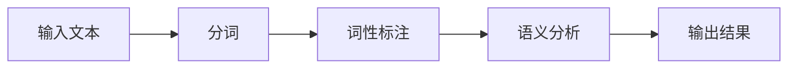
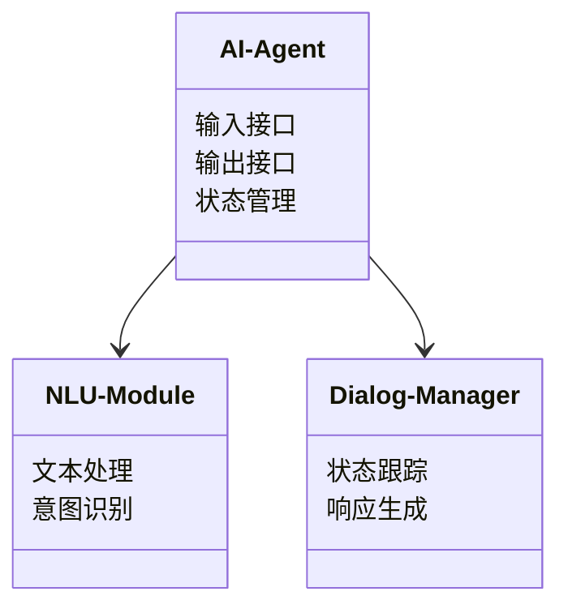
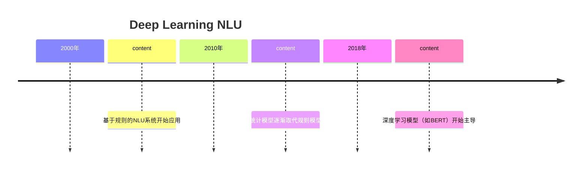
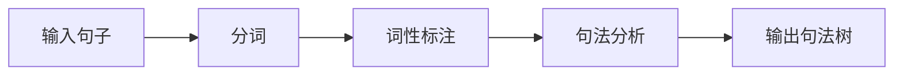
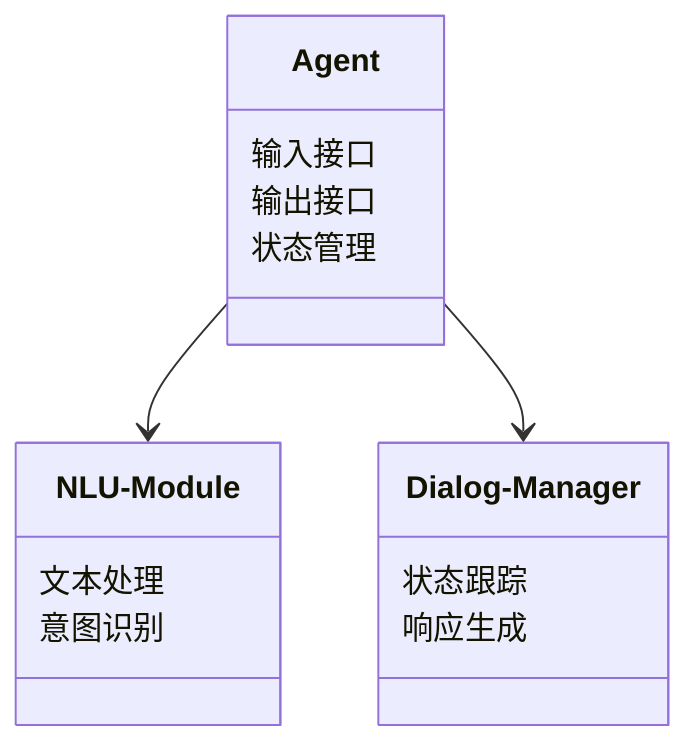

                 


# 实现AI Agent的自然语言理解能力

## 关键词：AI Agent，自然语言理解，NLP，深度学习，机器学习，技术实现

## 摘要：  
本文系统地探讨了实现AI Agent自然语言理解能力的核心技术与方法。从自然语言理解（NLU）的基本概念出发，分析了其在AI Agent中的重要性，介绍了主流的NLU模型及其应用，详细讲解了NLU的关键技术，包括词法分析、句法分析和语义理解，并结合深度学习模型（如BERT、GPT）进行了深入剖析。通过系统架构设计和项目实战，展示了如何将NLU技术应用于实际的AI Agent开发中。最后，总结了实现AI Agent自然语言理解能力的关键点，并展望了未来的发展方向。

---

## 第一部分: 自然语言理解与AI Agent概述

### 第1章: 自然语言理解的基本概念

#### 1.1 自然语言理解的定义与作用

自然语言理解（NLU）是指计算机能够理解人类自然语言（如中文、英文）的能力。其核心目标是让计算机能够像人类一样，准确地理解用户输入的文本或语音内容，并提取其中的语义信息。

**图1.1 自然语言理解的基本流程**  


NLU在AI Agent中的作用不可替代。通过NLU，AI Agent能够准确理解用户的意图，从而提供更智能、更个性化的服务。

#### 1.2 AI Agent的定义与分类

**AI Agent**是指具备人工智能能力的代理程序，能够感知环境、理解用户需求，并通过执行一系列动作来实现目标。AI Agent可以分为以下几类：

| 类型 | 描述 | 适用场景 |
|------|------|----------|
| 任务型 | 专注于完成特定任务（如信息查询、任务执行） | 例如智能助手、客服系统 |
| 对话型 | 专注于与用户进行自然语言对话 | 例如智能音箱、聊天机器人 |
| 学习型 | 具备自学习能力，能够通过数据优化自身能力 | 例如智能推荐系统 |

**图1.2 AI Agent的模块结构**  


---

### 第2章: 自然语言理解技术的发展与现状

#### 2.1 自然语言理解技术的历史演变

自然语言理解技术经历了多个阶段：

1. **规则驱动阶段**：基于专家制定的规则进行文本处理，例如基于关键词匹配的简单对话系统。
2. **统计机器学习阶段**：利用统计方法（如SVM、朴素贝叶斯）进行模式识别。
3. **深度学习阶段**：采用神经网络模型（如RNN、Transformer）进行端到端学习。

**图2.1 NLU技术的发展时间线**  


#### 2.2 主流的自然语言理解模型

当前主流的NLU模型包括：

- **BERT**：基于Transformer的双向模型，擅长上下文理解。
- **GPT**：生成式模型，擅长文本生成和对话。
- **SVM**：经典的统计模型，适用于分类任务。

**图2.2 不同NLU模型的应用场景**  
```mermaid
decision
    title 选择NLU模型
    input: 任务类型
    if 生成任务则选择 GPT
    else if 分类任务则选择 SVM
    else 选择 BERT
```

---

## 第二部分: 自然语言理解的核心技术与算法

### 第4章: 词法分析与句法分析

#### 4.1 词法分析的基本原理

词法分析是NLU的基础，主要包括分词、词性标注和命名实体识别。

**代码示例：Python中的分词实现**
```python
import jieba

text = "我爱自然语言处理"
words = jieba.lcut(text)
print(words)  # 输出: ['我', '爱', '自然语言处理']
```

#### 4.2 句法分析的核心算法

句法分析旨在理解句子的结构。常用的算法包括基于短语的句法分析和基于依存句法的分析。

**图4.1 句法分析流程**  


### 第5章: 语义理解与上下文分析

#### 5.1 语义理解的基本概念

语义理解旨在捕捉文本的深层含义。常用的技术包括语义角色标注和语义网络构建。

**数学模型：词嵌入表示**
$$
\text{嵌入向量} = \text{输入文本} \times \text{词嵌入矩阵}
$$

#### 5.2 上下文分析的重要性

上下文分析通过结合前后文信息，提高语义理解的准确性。

**代码示例：使用BERT进行上下文分析**
```python
from transformers import BertTokenizer, BertModel

tokenizer = BertTokenizer.from_pretrained('bert-base-cased')
model = BertModel.from_pretrained('bert-base-cased')

text = "我今天很忙，明天可以吗？"
inputs = tokenizer(text, return_tensors='np')
outputs = model(**inputs)
print(outputs.last_hidden_state)
```

---

## 第三部分: 系统架构与实现

### 第7章: AI Agent的系统架构设计

#### 7.1 系统功能设计

AI Agent的系统架构通常包括以下几个模块：

**图7.1 AI Agent的类图**


#### 7.2 系统架构实现

实现AI Agent的系统架构时，建议采用微服务架构，并使用容器化技术（如Docker）进行部署。

**代码示例：Docker部署AI Agent**
```dockerfile
# Dockerfile
FROM python:3.8-slim

WORKDIR /app

COPY requirements.txt .
RUN pip install --no-cache-dir -r requirements.txt

COPY . .

CMD ["python", "app.py"]
```

---

## 第四部分: 总结与展望

### 第9章: 总结与展望

#### 9.1 全书内容回顾

通过本文的讲解，我们了解了实现AI Agent自然语言理解能力的核心技术，包括NLU的基本概念、主流模型、系统架构设计以及项目实战。

#### 9.2 未来的发展方向

未来，NLU技术将朝着多模态、更高效的方向发展。多模态NLU能够结合视觉、听觉等多种信息，提高理解的准确性。同时，更高效的模型架构（如更轻量的Transformer变体）将推动NLU技术在资源受限环境中的应用。

---

## 附录

### 附录A: 必要的Python库与工具

以下是实现AI Agent自然语言理解能力所需的常用Python库：

- **nltk**：自然语言处理工具包。
- **spacy**：用于分词和句法分析。
- **transformers**：深度学习模型库（如BERT、GPT）。

### 附录B: 常见问题解答

- **问题1**：如何选择合适的NLU模型？
  - 答案：根据任务类型选择，生成任务选GPT，分类任务选SVM，理解任务选BERT。

- **问题2**：如何优化NLU模型的准确率？
  - 答案：增加训练数据、调整模型参数、使用数据增强技术。

---

## 作者

**作者：AI天才研究院/AI Genius Institute & 禅与计算机程序设计艺术 /Zen And The Art of Computer Programming**

---

以上是《实现AI Agent的自然语言理解能力》的技术博客文章的完整内容，涵盖了从基础概念到系统实现的各个方面，适合希望深入了解并实践AI Agent自然语言理解能力的读者阅读。

