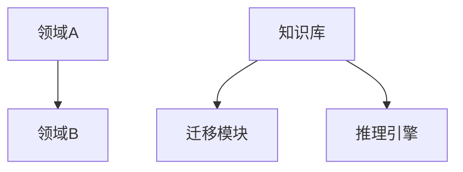
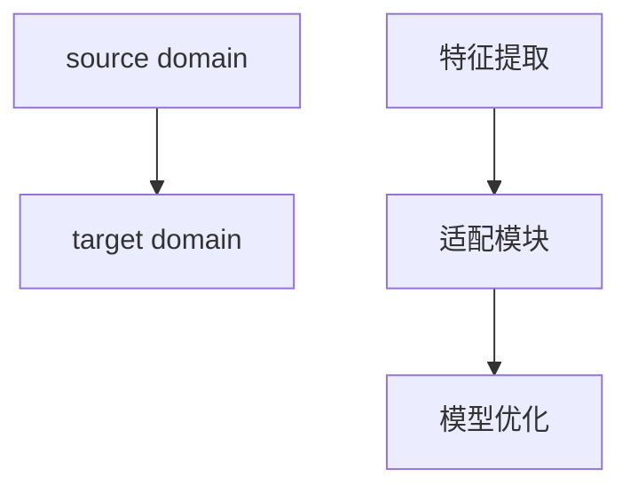
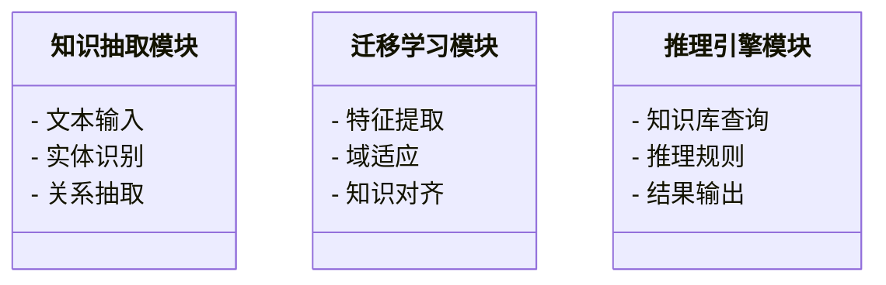
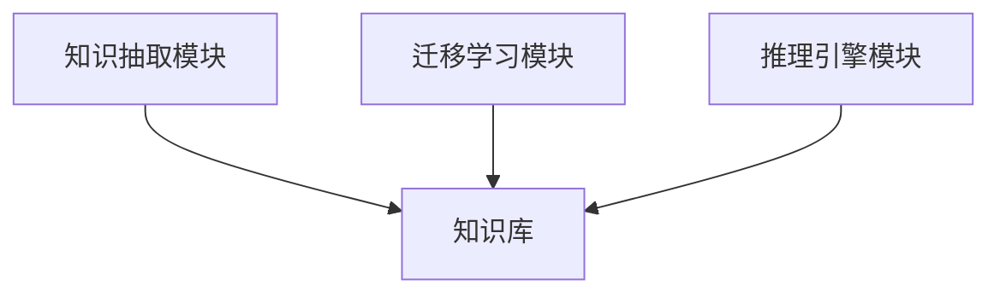
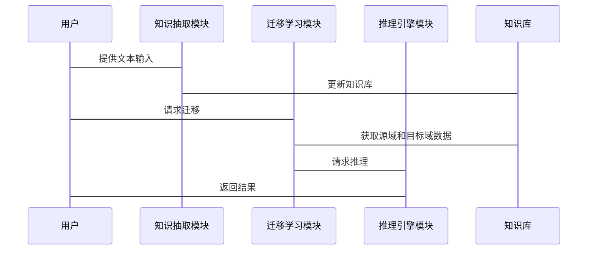

                 


# 实现AI Agent的跨领域知识迁移

> 关键词：AI Agent, 跨领域知识迁移, 迁移学习, 知识表示, 系统架构设计

> 摘要：本文深入探讨了AI Agent在跨领域知识迁移中的实现方法，从基础概念到算法原理，再到系统架构设计，结合实际案例，详细分析了实现跨领域知识迁移的关键技术与挑战。通过本文的学习，读者能够掌握AI Agent在跨领域应用中的核心方法和实践技巧。

---

# 第二部分: 跨领域知识迁移的核心概念与联系

# 第2章: 知识表示与迁移学习

## 2.1 知识表示方法

### 2.1.1 符号表示法
符号表示法是通过逻辑符号和规则来描述知识的一种方法。例如，可以使用谓词逻辑来表示“猫是动物的一种”，即 `Cat(x) ∧ Animal(y)`。这种方法适用于规则明确的领域，但在处理复杂语义时较为困难。

### 2.1.2 向量表示法
向量表示法将知识转化为向量空间中的点，例如词嵌入（Word Embedding）方法。通过训练，每个概念可以表示为一个向量，便于计算相似性。例如，使用Word2Vec将“猫”和“狗”表示为向量，并计算它们的余弦相似度。

### 2.1.3 图结构表示法
图结构表示法将知识建模为图结构，例如知识图谱。节点表示为概念，边表示为关系。这种方法能够捕捉复杂的语义关系，适用于跨领域知识的表示。

### 2.1.4 对比与应用场景
表2-1展示了三种知识表示方法的对比：

| 方法         | 优点                     | 缺点                     | 适用场景               |
|--------------|--------------------------|--------------------------|------------------------|
| 符号表示法    | 明确的逻辑关系           | 难以处理语义复杂性       | 规则明确的领域         |
| 向量表示法    | 捕捉语义相似性            | 语义理解依赖于训练数据   | 多领域数据             |
| 图结构表示法  | 能够表示复杂关系         | 实现复杂                | 知识图谱构建           |

## 2.2 迁移学习原理

### 2.2.1 迁移学习的定义
迁移学习是指将从一个领域（源域）学习到的知识迁移到另一个领域（目标域）。例如，将图像分类模型从自然场景迁移到医学图像分析。

### 2.2.2 迁移学习的核心要素
1. **源域和目标域**：分别表示两个不同领域。
2. **共享特征**：源域和目标域之间共享的特征。
3. **适应策略**：将源域的特征迁移到目标域的方法。

### 2.2.3 迁移学习的分类
1. **基于特征的方法**：直接迁移特征。
2. **基于模型的方法**：迁移模型参数。
3. **自适应方法**：通过对抗训练等方法使源域和目标域对齐。

## 2.3 跨领域知识迁移的关键技术

### 2.3.1 知识抽取与表示
知识抽取是将文本中的实体、关系和属性提取出来，表示为结构化数据。例如，从文本中提取“猫属于动物”并表示为 `(猫, 属于, 动物)`。

### 2.3.2 域适应（Domain Adaptation）
域适应是通过调整模型参数或特征，使模型在目标域上表现良好。例如，使用对抗训练使源域和目标域的特征对齐。

### 2.3.3 知识融合与推理
知识融合将多个领域的知识整合到一个统一的表示中，推理则是基于知识图谱进行逻辑推理。例如，推理“猫是宠物的一种”。

## 2.4 ER实体关系图



## 2.5 本章小结
本章介绍了知识表示方法、迁移学习原理和关键技术，通过对比分析和ER图展示了跨领域知识迁移的核心概念。

---

# 第三部分: 跨领域知识迁移的算法原理

# 第3章: 迁移学习算法详解

## 3.1 参数初始化与迁移策略

### 3.1.1 参数初始化方法
1. **随机初始化**：初始化模型参数为随机值。
2. **预训练初始化**：使用预训练模型的参数作为初始值。

### 3.1.2 迁移策略
1. **迁移特征**：将源域的特征直接迁移到目标域。
2. **参数微调**：在目标域上微调模型参数。

## 3.2 基于深度学习的迁移学习

### 3.2.1 深度迁移学习算法
深度迁移学习通过深度神经网络提取高层特征。例如，使用卷积神经网络（CNN）提取图像的特征。

### 3.2.2 对抗训练
对抗训练通过生成对抗网络（GAN）使源域和目标域的特征对齐。例如，使用对抗训练使图像风格迁移。

## 3.3 自适应特征选择

### 3.3.1 特征选择方法
1. **基于统计的方法**：选择具有高方差的特征。
2. **基于模型的方法**：选择对目标域有最大影响力的特征。

### 3.3.2 特征选择算法
例如，使用Lasso回归进行特征选择，公式为：
$$ \text{minimize} \sum_{i=1}^{n} (y_i - \beta x_i)^2 + \lambda \sum_{j=1}^{p} |\beta_j| $$

## 3.4 领域适配算法

### 3.4.1 领域适配方法
1. **最大均值差异（MMD）**：通过最小化源域和目标域的均值差异。
2. **条件分布适配（CDA）**：通过条件分布使源域和目标域对齐。

### 3.4.2 领域适配流程图



## 3.5 本章小结
本章详细讲解了迁移学习的算法原理，包括参数初始化、深度学习、自适应特征选择和领域适配方法。

---

# 第四部分: 跨领域知识迁移的系统分析与架构设计

# 第4章: 系统分析与架构设计

## 4.1 系统功能设计

### 4.1.1 功能模块
1. **知识抽取模块**：抽取实体、关系和属性。
2. **迁移学习模块**：实现跨领域知识迁移。
3. **推理引擎模块**：基于知识库进行推理。

### 4.1.2 功能模块类图



## 4.2 系统架构设计

### 4.2.1 系统架构图



## 4.3 系统接口设计

### 4.3.1 接口定义
1. `extract_entities(text: str) -> List[str]`：提取实体。
2. `adapt_domain(source_features: List, target_features: List) -> List`：实现域适应。
3. `infer(query: str, knowledge_base: dict) -> Result`：进行推理。

## 4.4 系统交互流程

### 4.4.1 交互流程图



## 4.5 本章小结
本章从系统功能设计、架构设计、接口设计和交互流程四个方面详细分析了跨领域知识迁移系统的实现。

---

# 第五部分: 跨领域知识迁移的项目实战

# 第5章: 项目实战

## 5.1 环境安装

### 5.1.1 安装依赖
1. Python 3.8+
2. PyTorch 1.9+
3. transformers库
4. mermaid-diagram库

```bash
pip install torch transformers mermaid-diagram
```

## 5.2 核心代码实现

### 5.2.1 知识抽取模块

```python
import torch
from transformers import AutoTokenizer, AutoModelForMaskedLM

class KnowledgeExtractor:
    def __init__(self):
        self.tokenizer = AutoTokenizer.from_pretrained('bert-base-cased')
        self.model = AutoModelForMaskedLM.from_pretrained('bert-base-cased')

    def extract_entities(self, text):
        # 实体抽取逻辑
        pass
```

### 5.2.2 迁移学习模块

```python
class DomainAdapter:
    def __init__(self, source_features, target_features):
        self.source = source_features
        self.target = target_features

    def adapt(self):
        # 域适应逻辑
        pass
```

### 5.2.3 推理引擎模块

```python
class Reasoner:
    def __init__(self, knowledge_base):
        self.kb = knowledge_base

    def infer(self, query):
        # 推理逻辑
        pass
```

## 5.3 案例分析与代码解读

### 5.3.1 案例分析
以医疗领域到金融领域的知识迁移为例，假设知识库包含医疗术语和金融术语，推理引擎需要在两者之间进行推理。

### 5.3.2 代码解读
```python
# 初始化知识库
medical_kb = {
    '实体': ['病', '症状', '药物'],
    '关系': [('症状', '病'), ('药物', '症状')]
}

financial_kb = {
    '实体': ['股票', '公司', '市场'],
    '关系': [('公司', '市场')]
}

# 初始化推理引擎
reasoner = Reasoner(medical_kb.union(financial_kb))

# 请求推理
reasoner.infer('股票与公司之间的关系')
```

## 5.4 本章小结
本章通过一个实际案例，详细讲解了跨领域知识迁移的实现过程，包括环境安装、代码实现和案例分析。

---

# 第六部分: 最佳实践与总结

# 第6章: 最佳实践与总结

## 6.1 最佳实践

### 6.1.1 数据质量
确保源域和目标域的数据质量，避免数据偏差。

### 6.1.2 模型选择
选择适合迁移学习的模型，如预训练语言模型。

### 6.1.3 域适应方法
根据具体任务选择合适的域适应方法，如对抗训练或特征对齐。

## 6.2 小结
本文系统地介绍了AI Agent在跨领域知识迁移中的实现方法，从基础概念到算法原理，再到系统架构设计，结合实际案例，详细分析了实现跨领域知识迁移的关键技术与挑战。

## 6.3 注意事项

### 6.3.1 数据隐私
确保数据迁移过程中的隐私保护。

### 6.3.2 模型泛化能力
避免过度依赖特定领域，保持模型的泛化能力。

## 6.4 未来研究方向

### 6.4.1 多领域迁移
研究多领域知识迁移的统一框架。

### 6.4.2 实时迁移
探索实时跨领域知识迁移的方法。

## 6.5 作者信息

作者：AI天才研究院/AI Genius Institute & 禅与计算机程序设计艺术 /Zen And The Art of Computer Programming

---

通过本文的学习，读者能够全面理解AI Agent在跨领域知识迁移中的实现方法，掌握相关的核心技术和实践技巧。

