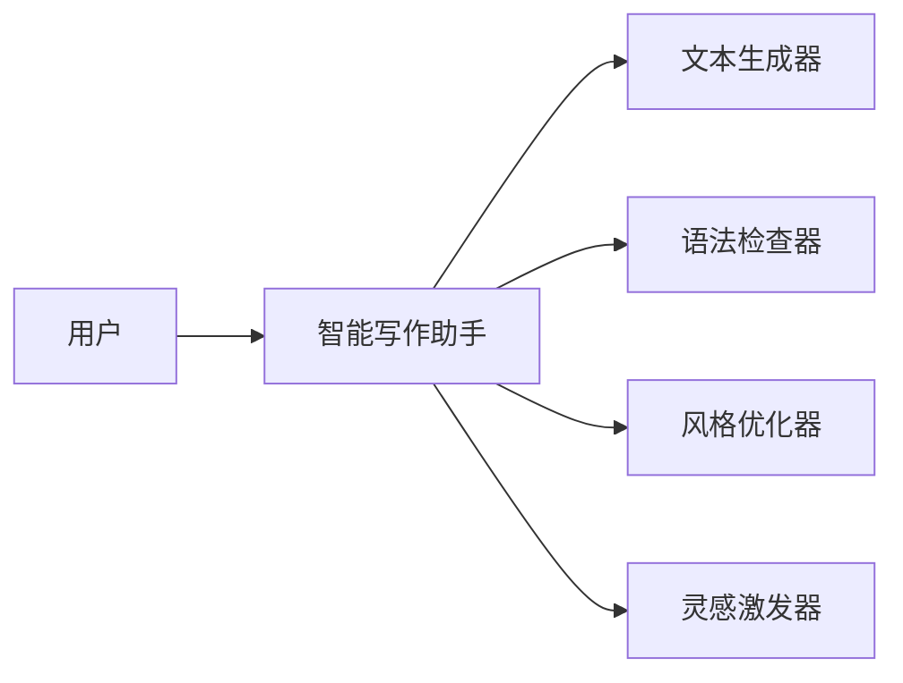
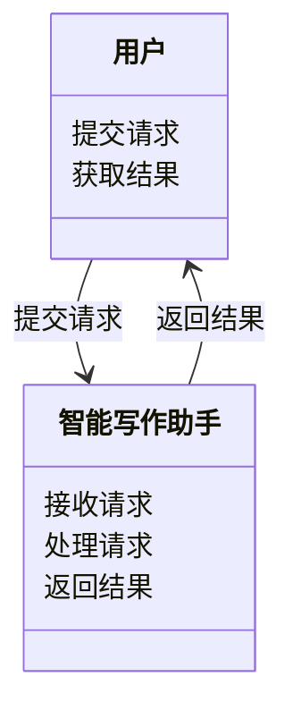
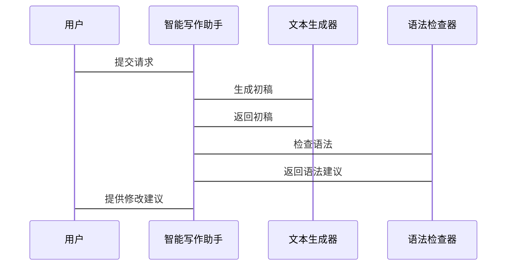

                 


# 实现基于AI Agent的智能写作助手

> 关键词：AI Agent, 智能写作助手, 自然语言处理, 生成式AI, 多智能体协作, 知识图谱, 系统架构

> 摘要：本文详细探讨了基于AI Agent的智能写作助手的实现方法，从背景介绍、核心概念到技术原理、系统架构，再到项目实战和最佳实践，全面解析了如何利用AI技术提升写作效率和质量。通过本文的学习，读者将深入了解AI Agent在写作中的具体应用，掌握相关算法原理和系统设计方法。

---

# 第一部分: AI Agent与智能写作助手的背景介绍

# 第1章: AI Agent与智能写作助手概述

## 1.1 AI Agent的基本概念

### 1.1.1 AI Agent的定义
AI Agent（人工智能代理）是指能够感知环境并采取行动以实现目标的智能实体。它可以理解用户需求、执行任务并提供反馈，从而帮助用户完成复杂任务。

### 1.1.2 AI Agent的核心属性
| 核心属性 | 描述 |
|----------|------|
| 感知能力 | 能够接收并理解输入数据 |
| 决策能力 | 根据输入数据做出最优决策 |
| 执行能力 | 执行决策并输出结果 |
| 学习能力 | 通过反馈不断优化自身行为 |

### 1.1.3 AI Agent与传统写作工具的对比

| 对比维度 | 传统写作工具 | AI Agent写作助手 |
|----------|----------------|-------------------|
| 功能 | 提供基本的文字处理功能 | 提供智能生成、修改建议、灵感激发 |
| 智能性 | 基于规则，缺乏自主性 | 基于AI算法，具备自主学习能力 |
| 交互方式 | 单向输入输出 | 支持多轮交互，提供动态反馈 |

## 1.2 智能写作助手的背景与问题背景

### 1.2.1 写作过程中的常见问题
- **灵感枯竭**：写作过程中常常遇到“写不动”的问题。
- **效率低下**：需要反复修改和调整内容。
- **语法错误**：传统工具难以提供准确的语法建议。
- **个性化需求**：不同用户需要不同的写作风格和建议。

### 1.2.2 AI技术如何解决这些问题
- 利用自然语言处理技术提供语法检查。
- 基于知识图谱生成相关灵感和建议。
- 使用生成式AI快速生成初稿并优化内容。

### 1.2.3 AI Agent在写作中的具体应用场景
- **内容生成**：根据用户提供的主题生成初稿。
- **语法检查**：实时检查语法错误并提供建议。
- **风格调整**：根据用户需求调整文章风格。
- **灵感激发**：基于知识图谱提供相关主题和内容建议。

## 1.3 问题描述与目标设定

### 1.3.1 智能写作助手的核心目标
- 提供高效的写作工具，提升写作效率。
- 提供个性化的写作建议，优化写作质量。
- 降低写作门槛，帮助更多人轻松完成写作任务。

### 1.3.2 AI Agent在写作中的具体任务
- 文本生成：根据用户输入生成相关内容。
- 语法检查：实时检查语法错误。
- 风格优化：根据用户需求调整文章风格。
- 内容扩展：根据初稿扩展相关内容。

### 1.3.3 边界与外延
- 边界：专注于写作过程中的辅助功能，不涉及内容创作的最终决策。
- 外延：AI Agent可以与其他工具集成，提供更全面的写作支持。

## 1.4 核心概念与联系

### 1.4.1 AI Agent的核心概念原理
AI Agent通过感知环境、分析需求、执行任务并提供反馈，帮助用户完成写作任务。其核心在于将多种AI技术（如NLP、知识图谱、生成式AI）有机结合，实现智能化的写作辅助。

### 1.4.2 AI Agent与智能写作助手的关系
AI Agent是智能写作助手的核心技术，通过提供智能生成、语法检查、风格优化等功能，帮助用户完成写作任务。

### 1.4.3 智能写作助手的实体关系图


---

# 第二部分: AI Agent的核心概念与技术原理

# 第2章: AI Agent的核心技术原理

## 2.1 多智能体协作

### 2.1.1 多智能体协作的基本原理
多智能体协作是指多个AI Agent协同工作，共同完成复杂任务。每个Agent负责不同的子任务，通过通信和协作实现整体目标。

### 2.1.2 多智能体协作在写作中的应用
- **内容生成**：多个Agent分别负责主题生成、段落扩展、语言优化等任务。
- **风格调整**：多个Agent协作，根据用户需求调整文章风格。
- **语法检查**：多个Agent分工合作，确保语法和标点的准确性。

### 2.1.3 多智能体协作的优缺点对比

| 对比维度 | 优点 | 缺点 |
|----------|------|------|
| 效率 | 提高任务完成效率 | 需要复杂的通信和协作机制 |
| 功能 | 实现复杂任务 | 开发和维护成本较高 |
| 灵活性 | 更灵活，适应不同需求 | 协调难度较大 |

## 2.2 自然语言处理技术

### 2.2.1 NLP技术在写作中的应用
- **语法检查**：使用分词、句法分析等技术实时检查语法错误。
- **语义理解**：理解用户意图，提供个性化建议。
- **文本生成**：基于NLP模型生成高质量文本。

### 2.2.2 常见的NLP算法及其特点

| 算法名称 | 描述 | 特点 |
|----------|------|------|
| 词袋模型 | 将文本表示为词袋 | 简单但信息量有限 |
| TF-IDF | 计算词的重要性 | 常用于文本相似性计算 |
| Word2Vec | 将词表示为向量 | 常用于词嵌入 |
| GPT | 基于Transformer的生成模型 | 常用于文本生成 |

### 2.2.3 NLP技术对写作质量的提升
- 提供语法检查和改进建议。
- 基于语义理解提供个性化写作建议。
- 生成高质量文本，提升写作效率。

## 2.3 知识图谱与推理

### 2.3.1 知识图谱的基本概念
知识图谱是一种结构化的知识表示方式，通过实体和关系描述现实世界中的信息。

### 2.3.2 知识图谱在写作中的应用
- **主题生成**：基于知识图谱生成相关主题建议。
- **内容扩展**：根据初稿扩展相关内容。
- **灵感激发**：基于知识图谱提供相关灵感和建议。

### 2.3.3 基于知识图谱的推理过程
- **实体识别**：识别文本中的实体。
- **关系抽取**：抽取实体之间的关系。
- **推理**：基于关系推理出新的知识。

## 2.4 生成式AI的原理与实现

### 2.4.1 生成式AI的基本原理
生成式AI通过训练大规模数据生成新的文本内容，其核心是基于概率分布的学习。

### 2.4.2 基于Transformer的生成模型
- **Transformer结构**：由编码器和解码器组成，支持并行处理。
- **自注意力机制**：捕捉文本中长距离依赖关系。
- **生成过程**：通过解码器生成下一个字符，逐步生成完整文本。

### 2.4.3 生成式AI的训练过程
1. **数据预处理**：对文本数据进行清洗和分词。
2. **模型训练**：使用Adam优化器和交叉熵损失函数优化模型。
3. **微调优化**：在特定领域数据上进行微调，提升生成质量。

---

# 第三部分: AI Agent的算法原理与数学模型

# 第3章: 生成式AI的算法原理

## 3.1 生成式AI的基本原理

### 3.1.1 生成式AI的核心思想
生成式AI通过学习数据分布，生成与训练数据相似的新内容。

### 3.1.2 基于概率分布的生成模型
- **概率分布**：描述数据生成的概率。
- **生成过程**：通过最大化似然函数生成新数据。

### 3.1.3 生成式AI的数学模型
- **损失函数**：交叉熵损失函数。
  $$ L = -\frac{1}{N}\sum_{i=1}^{N} \log p(y_i|x_i) $$
- **优化目标**：最小化损失函数，优化模型参数。

## 3.2 基于Transformer的生成模型

### 3.2.1 Transformer的基本结构
- **编码器**：将输入文本转换为向量表示。
- **解码器**：根据编码器输出生成目标文本。

### 3.2.2 自注意力机制的数学公式
$$ \text{Attention}(Q, K, V) = \text{softmax}\left(\frac{QK^T}{\sqrt{d_k}}\right)V $$

### 3.2.3 生成过程的详细步骤
1. **输入处理**：将输入文本转换为向量。
2. **自注意力计算**：计算查询、键、值向量。
3. **解码器输出**：根据注意力结果生成下一个字符。
4. **循环生成**：逐步生成完整文本。

## 3.3 生成式AI的训练过程

### 3.3.1 数据预处理
- **分词**：将文本分割为词或句子。
- **编码**：将词映射为数字表示。

### 3.3.2 模型训练
- **训练数据**：使用大规模文本数据。
- **优化算法**：使用Adam优化器。
- **损失函数**：交叉熵损失函数。
  $$ L = -\frac{1}{N}\sum_{i=1}^{N} \log p(y_i|x_i) $$

### 3.3.3 微调优化
- **领域数据**：在特定领域数据上进行微调。
- **超参数调整**：优化学习率、批次大小等参数。

---

# 第四部分: 系统分析与架构设计

# 第4章: 系统分析与架构设计

## 4.1 项目背景与目标

### 4.1.1 项目背景
- 开发一款基于AI Agent的智能写作助手，帮助用户高效完成写作任务。

### 4.1.2 项目目标
- 提供文本生成、语法检查、风格优化等功能。
- 实现多智能体协作，提升写作效率和质量。

## 4.2 系统功能设计

### 4.2.1 功能模块划分
- **文本生成器**：生成初稿。
- **语法检查器**：检查语法错误。
- **风格优化器**：调整文章风格。
- **灵感激发器**：提供写作灵感。

### 4.2.2 领域模型设计


### 4.2.3 系统架构设计


### 4.2.4 系统接口设计
- **输入接口**：接收用户的写作请求。
- **输出接口**：返回生成文本、建议或错误信息。

### 4.2.5 系统交互设计


---

# 第五部分: 项目实战与最佳实践

# 第5章: 项目实战

## 5.1 环境安装与配置

### 5.1.1 安装Python
- 使用Anaconda安装Python 3.8及以上版本。

### 5.1.2 安装依赖库
- 使用pip安装以下库：
  ```bash
  pip install numpy torch transformers
  ```

## 5.2 系统核心实现

### 5.2.1 文本生成器实现
```python
import torch
from transformers import GPT2LMHeadModel, GPT2Tokenizer

tokenizer = GPT2Tokenizer.from_pretrained('gpt2')
model = GPT2LMHeadModel.from_pretrained('gpt2')

def generate_text(prompt):
    inputs = tokenizer.encode(prompt, return_tensors='pt')
    outputs = model.generate(inputs, max_length=50, do_sample=True)
    return tokenizer.decode(outputs[0], skip_special_tokens=True)
```

### 5.2.2 语法检查器实现
```python
import language_tool

def check_grammar(text):
    errors = language_tool.check(text)
    return [error.description for error in errors]
```

### 5.2.3 风格优化器实现
```python
def optimize_style(text):
    # 实现风格优化算法
    pass
```

## 5.3 案例分析与实际应用

### 5.3.1 案例分析
- **案例1**：生成一篇科技新闻稿。
- **案例2**：优化一篇学术论文。

### 5.3.2 代码实现与解读
- **文本生成器**：使用GPT-2生成初稿。
- **语法检查器**：使用language_tool检查语法错误。
- **风格优化器**：根据用户需求调整文章风格。

## 5.4 项目小结

### 5.4.1 项目总结
- 成功实现了基于AI Agent的智能写作助手。
- 提供了文本生成、语法检查、风格优化等功能。

### 5.4.2 实践经验
- 系统设计需要充分考虑模块化和可扩展性。
- 模型优化需要结合具体应用场景进行微调。

---

# 第六部分: 最佳实践与拓展阅读

# 第6章: 最佳实践

## 6.1 最佳实践 tips

### 6.1.1 系统设计
- 系统模块化设计，便于功能扩展。
- 系统架构采用微服务架构，便于维护和优化。

### 6.1.2 模型优化
- 根据具体场景进行模型微调，提升生成质量。
- 使用更先进的模型（如GPT-3）提升生成效果。

### 6.1.3 用户体验
- 提供友好的用户界面，提升用户体验。
- 支持多语言写作，满足不同用户需求。

## 6.2 小结与注意事项

### 6.2.1 小结
- 基于AI Agent的智能写作助手能够显著提升写作效率和质量。
- 系统设计和模型优化是实现高效写作助手的关键。

### 6.2.2 注意事项
- 确保数据安全，保护用户隐私。
- 定期更新模型，保持生成内容的时效性。

## 6.3 拓展阅读

### 6.3.1 拓展阅读资料
- 《The Anatomy of Efficient Natural Language Processing Systems》
- 《Advanced Topics in Generative AI》
- 《Multi-Agent Systems and Applications》

---

# 作者：AI天才研究院/AI Genius Institute & 禅与计算机程序设计艺术 /Zen And The Art of Computer Programming

---

通过本文的详细讲解，读者可以全面了解基于AI Agent的智能写作助手的实现方法，从背景介绍到技术原理，再到系统设计和项目实战，帮助读者掌握相关知识并应用于实际场景中。

