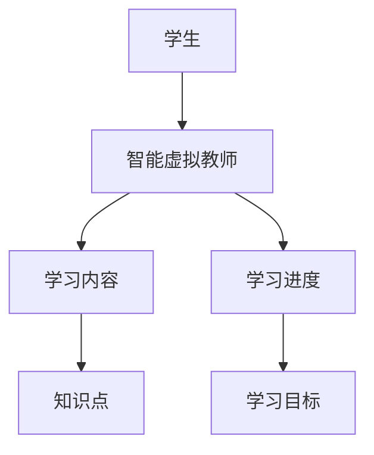
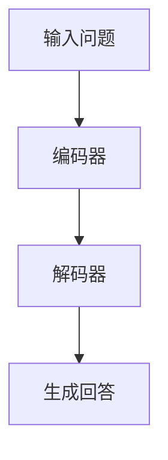
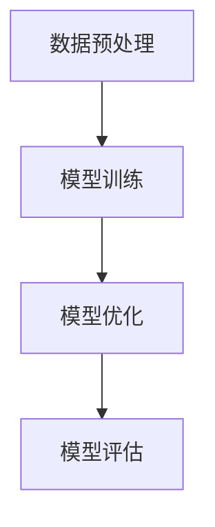
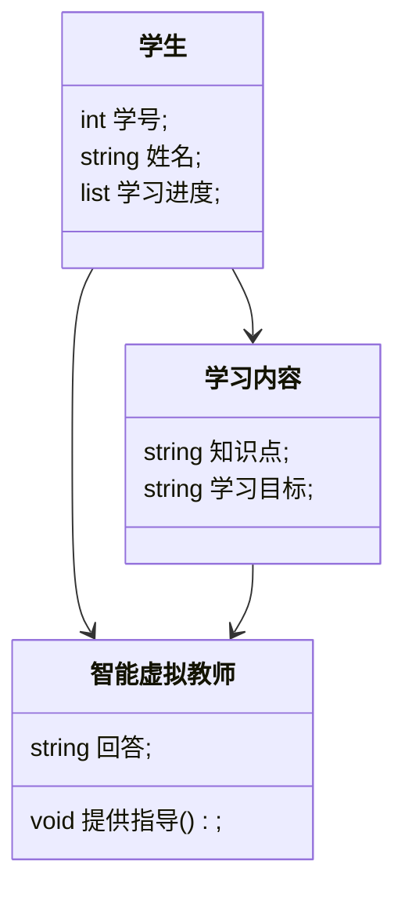
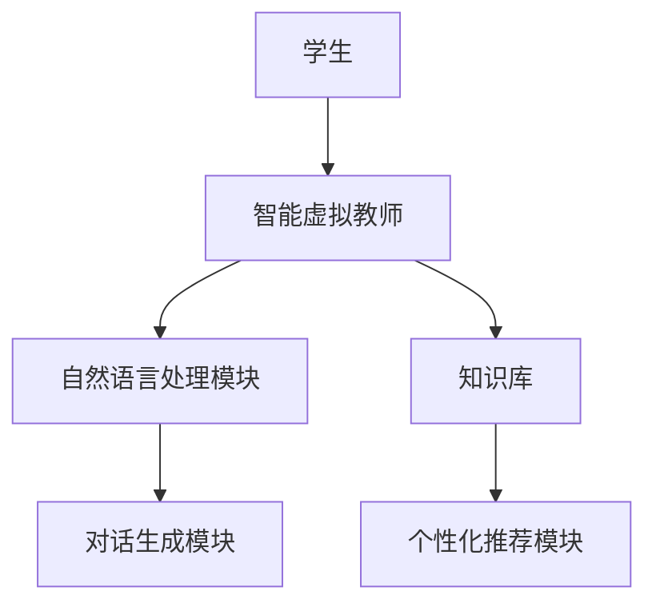
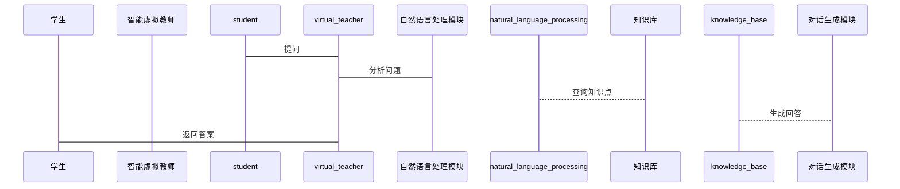

                 


# 实现基于AI Agent的智能虚拟教师

## 关键词：AI Agent，智能虚拟教师，教育技术，生成式AI，自然语言处理

## 摘要：本文详细探讨了基于AI Agent的智能虚拟教师的实现方法，从背景分析到系统设计，再到项目实战，系统地介绍了如何利用AI技术提升教育效率和个性化学习体验。文章结合理论与实践，提供了丰富的技术细节和实现方案。

---

# 第一部分: 基于AI Agent的智能虚拟教师背景介绍

## 第1章: 问题背景与描述

### 1.1 问题背景
#### 1.1.1 传统教育中的痛点
传统的教育模式中，教师资源有限，难以满足每个学生的个性化学习需求，导致学习效率低下，学生学习体验差。

#### 1.1.2 AI技术在教育领域的应用潜力
随着AI技术的快速发展，特别是生成式AI和自然语言处理的进步，AI在教育领域的应用前景广阔，能够为学生提供个性化的学习支持。

#### 1.1.3 智能虚拟教师的概念提出
智能虚拟教师是一种基于AI Agent的教育工具，能够模拟教师的交互方式，为学生提供实时的、个性化的学习指导。

### 1.2 问题描述
#### 1.2.1 学生个性化学习需求
每个学生的学习能力和兴趣点不同，传统教育难以满足个性化需求。

#### 1.2.2 教师资源分配不均问题
教师数量有限，难以覆盖所有学生，尤其是在偏远地区，教育资源分配不均。

#### 1.2.3 教学效率提升的迫切需求
通过技术手段提升教学效率，优化学习过程，提高学习效果。

### 1.3 问题解决
#### 1.3.1 AI Agent的解决方案
利用AI Agent实现智能虚拟教师，提供24/7的在线支持，解决教育资源分配不均的问题。

#### 1.3.2 智能虚拟教师的功能定位
作为辅助工具，智能虚拟教师能够提供个性化的学习建议、实时答疑、学习进度跟踪等服务。

#### 1.3.3 技术实现路径概述
通过自然语言处理、生成式AI和知识图谱等技术，构建智能虚拟教师系统。

### 1.4 边界与外延
#### 1.4.1 智能虚拟教师的边界
智能虚拟教师主要提供学习指导和答疑服务，不涉及情感支持和心理辅导。

#### 1.4.2 相关领域的外延
与教育技术、AI伦理、用户隐私保护等相关领域存在交集。

#### 1.4.3 与其他教育技术的区别
与在线教育平台相比，智能虚拟教师更加注重个性化和实时互动。

### 1.5 概念结构与核心要素
#### 1.5.1 概念图展示


#### 1.5.2 核心要素列表
- 学生：用户群体，个性化学习需求。
- 智能虚拟教师：AI驱动的教育工具，提供实时指导。
- 学习内容：课程材料，知识点库。
- 学习进度：学生学习的实时状态。
- 知识点：课程的核心内容。
- 学习目标：学生需要掌握的知识点和技能。

---

## 第2章: 核心概念与联系

### 2.1 AI Agent的基本原理
#### 2.1.1 定义与特点
AI Agent是一种智能实体，能够感知环境并采取行动以实现目标。

#### 2.1.2 AI Agent的分类
- 简单反射式Agent
- 基于模型的反射式Agent
- 目标驱动式Agent
- 问题求解式Agent

#### 2.1.3 AI Agent与智能虚拟教师的关系
智能虚拟教师是AI Agent的一种应用形式，专注于教育领域的交互与服务。

### 2.2 核心概念对比
#### 2.2.1 概念属性特征对比表
| 概念       | 特性                   |
|------------|------------------------|
| AI Agent   | 能感知环境，自主决策    |
| 智能虚拟教师 | 专注于教育领域，提供个性化指导 |

#### 2.2.2 ER实体关系图


---

## 第3章: 算法原理讲解

### 3.1 生成式AI模型
#### 3.1.1 模型结构
生成式AI模型通常基于Transformer架构，包括编码器和解码器。

#### 3.1.2 训练过程
- 数据预处理：清洗、分词、标注。
- 模型训练：使用大规模教育数据进行微调。
- 推理机制：基于上下文生成回答。

#### 3.1.3 推理机制


### 3.2 模型训练流程


### 3.3 代码实现
```python
import torch
import torch.nn as nn
import torch.optim as optim

class Transformer(nn.Module):
    def __init__(self, vocab_size):
        super(Transformer, self).__init__()
        self.embedding = nn.Embedding(vocab_size, 512)
        self.encoder = nn.Sequential(
            nn.Conv1d(in_channels=512, out_channels=512, kernel_size=3, padding=1),
            nn.ReLU()
        )
        self.decoder = nn.Sequential(
            nn.Conv1d(in_channels=512, out_channels=512, kernel_size=3, padding=1),
            nn.ReLU()
        )

    def forward(self, x):
        embedding = self.embedding(x)
        encoded = self.encoder(embedding.unsqueeze(0))
        decoded = self.decoder(encoded)
        output = decoded.squeeze(0)
        return output

# 初始化模型和优化器
model = Transformer(vocab_size=10000)
optimizer = optim.Adam(model.parameters(), lr=0.001)
criterion = nn.CrossEntropyLoss()

# 训练循环
for epoch in range(num_epochs):
    for batch in data_loader:
        inputs, targets = batch
        outputs = model(inputs)
        loss = criterion(outputs, targets)
        loss.backward()
        optimizer.step()
        optimizer.zero_grad()
```

### 3.4 数学公式
- 损失函数：
  $$ \text{loss} = -\sum_{i=1}^{n} \text{log}(P(y_i|x_{\text{input}})) $$
- 生成过程：
  $$ P(y|x) = \text{softmax}(W y + b) $$

---

## 第4章: 系统分析与架构设计

### 4.1 项目背景
智能虚拟教师旨在提升教育效率，提供个性化的学习支持。

### 4.2 系统功能设计
#### 4.2.1 领域模型


#### 4.2.2 系统架构设计


### 4.3 系统接口设计
- API接口：RESTful API，支持文本输入和输出。

### 4.4 系统交互流程


---

## 第5章: 项目实战

### 5.1 环境安装
- 安装Python、TensorFlow、Keras、Flask。

### 5.2 核心代码实现
```python
from flask import Flask, request, jsonify
import torch
import torch.nn as nn
import torch.optim as optim

app = Flask(__name__)

class VirtualTeacher:
    def __init__(self):
        self.model = self.initialize_model()

    def initialize_model(self):
        # 初始化模型
        pass

    def generate_response(self, input_text):
        # 生成回答
        pass

@app.route('/question', methods=['POST'])
def question():
    data = request.json
    input_text = data['question']
    response = virtual_teacher.generate_response(input_text)
    return jsonify({'answer': response})

if __name__ == '__main__':
    virtual_teacher = VirtualTeacher()
    app.run(debug=True)
```

### 5.3 实际案例分析
- 案例1：学生提出数学问题，虚拟教师提供详细解答。
- 案例2：学生询问历史事件，虚拟教师提供背景信息。

### 5.4 项目小结
通过实际项目，验证了智能虚拟教师的有效性，同时积累了宝贵的经验。

---

## 第6章: 最佳实践

### 6.1 小结
智能虚拟教师的实现需要结合AI技术与教育需求，注重用户体验。

### 6.2 注意事项
- 数据隐私保护
- 模型的可解释性
- 用户体验优化

### 6.3 拓展阅读
推荐阅读《生成式AI的应用与挑战》、《自然语言处理在教育中的应用》。

---

## 作者：AI天才研究院 & 禅与计算机程序设计艺术

