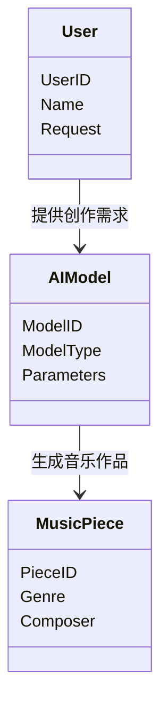
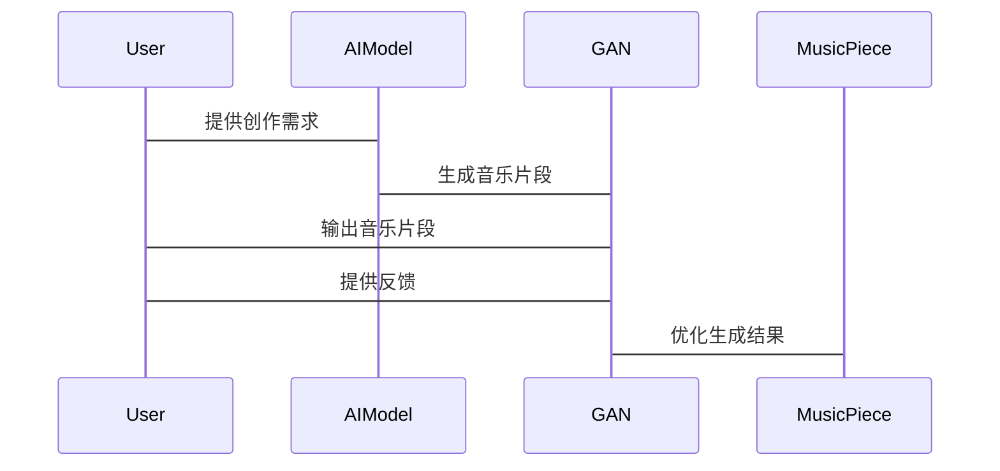

                 


# 实现基于AI Agent的智能音乐创作系统

> 关键词：AI Agent，智能音乐创作，生成模型，条件生成对抗网络，Transformer模型

> 摘要：本文将详细探讨如何利用AI Agent技术实现智能音乐创作系统。文章从背景介绍、核心概念、算法原理、系统架构、项目实战等多个方面展开，深入分析了AI Agent在音乐创作中的应用价值和实现方法。通过本文的讲解，读者将能够理解并掌握基于AI Agent的智能音乐创作系统的整体架构和实现细节。

---

## 第一部分: 基于AI Agent的智能音乐创作系统概述

### 第1章: AI Agent与智能音乐创作的背景介绍

#### 1.1 问题背景与描述
智能音乐创作是近年来人工智能领域的重要研究方向。传统音乐创作依赖于人类创作者的灵感和经验，创作效率有限且难以满足个性化需求。随着AI技术的发展，AI Agent（智能体）逐渐被应用于音乐创作领域，以提供自动化、个性化的音乐生成服务。

##### 1.1.1 传统音乐创作的局限性
传统音乐创作主要依赖人类创作者的灵感和技能，存在以下问题：
1. 创作效率低，尤其在需要快速生成多种风格音乐时。
2. 个性化需求难以满足，难以根据用户特定要求生成音乐。
3. 创作过程缺乏智能化支持，难以实现自动化和数据驱动的创作。

##### 1.1.2 AI技术在音乐创作中的潜力
AI技术可以通过以下方式解决传统音乐创作的局限性：
1. 利用深度学习模型生成音乐片段，提高创作效率。
2. 基于用户输入（如情感、风格）生成个性化音乐，满足多样化需求。
3. 提供智能化工具辅助创作，优化创作流程。

##### 1.1.3 AI Agent在音乐创作中的应用价值
AI Agent作为一种智能体，能够通过感知、决策和执行三个阶段实现音乐创作的自动化和智能化：
1. **感知**：AI Agent通过分析用户输入（如情感、风格、主题）提取创作需求。
2. **决策**：基于生成模型（如Transformer、GAN）生成音乐片段。
3. **执行**：将生成的音乐片段输出，并根据用户反馈进行优化。

---

### 第2章: AI Agent的核心概念与联系

#### 2.1 核心概念原理
AI Agent在音乐创作中的核心概念包括以下几点：
1. **生成模型**：用于音乐生成的主要算法，如Transformer和GAN。
2. **用户输入**：AI Agent通过分析用户的输入（如情感、风格）生成个性化音乐。
3. **反馈机制**：用户对生成音乐的反馈用于优化生成结果。

##### 2.1.1 AI Agent的基本原理
AI Agent在音乐创作中的工作流程如下：
1. 接收用户的创作需求（如“创作一首悲伤的钢琴曲”）。
2. 分析需求，提取关键特征（如情感特征、乐器特征）。
3. 调用生成模型生成音乐片段。
4. 输出生成的音乐，并根据用户反馈进行优化。

##### 2.1.2 智能音乐创作的定义与特点
智能音乐创作是一种结合AI技术的音乐创作方式，其特点包括：
1. **自动化**：AI Agent可以自动完成音乐生成过程。
2. **个性化**：可以根据用户需求生成个性化音乐。
3. **智能化**：能够理解用户意图并优化生成结果。

#### 2.2 核心概念属性对比
以下是几种常见AI模型在音乐创作中的对比分析：

##### 2.2.1 不同AI模型的对比分析
| 模型类型   | 优势                     | 劣势                     |
|------------|--------------------------|--------------------------|
| Transformer | 高精度生成，支持长序列   | 计算资源消耗较大         |
| GAN        | 多样化生成，风格多样化     | 收敛不稳定，训练困难       |

##### 2.2.2 模型性能对比表格
| 模型名称   | 参数数量（百万） | 生成速度（秒/首） | 生成质量（满分10分） |
|------------|------------------|-------------------|---------------------|
| Transformer | 100              | 5                 | 9                   |
| GAN        | 200              | 10                | 8                   |

#### 2.3 实体关系图
以下是AI Agent音乐创作系统的实体关系图：

```mermaid
erDiagram
    actor User {
        <direction>UserID
        <direction>Name
        <direction>Request
    }
    actor AIModel {
        <direction>ModelID
        <direction>ModelType
        <direction>Parameters
    }
    actor MusicPiece {
        <direction>PieceID
        <direction>Genre
        <direction>Composer
    }
    User --> AIModel : 提供创作需求
    AIModel --> MusicPiece : 生成音乐作品
```

---

## 第二部分: 算法原理与数学模型

### 第3章: 算法原理与数学模型

#### 3.1 算法原理
AI Agent音乐创作系统的核心算法包括以下两种：

##### 3.1.1 基于Transformer的生成模型
Transformer是一种基于自注意力机制的深度学习模型，广泛应用于自然语言处理和生成任务。在音乐创作中，Transformer可以用于生成音乐序列。

##### 3.1.2 条件生成对抗网络（GAN）
GAN是一种生成对抗网络，由生成器和判别器组成。生成器负责生成音乐片段，判别器负责判断生成片段的真实性。

#### 3.2 数学模型与公式
##### 3.2.1 Transformer模型的结构
$$
\text{Transformer}(x) = \text{FFN}(x)
$$

##### 3.2.2 GAN的损失函数
$$
\text{损失函数} = \mathbb{E}_{x \sim P_{\text{真实}}}[ \log D(x)] + \mathbb{E}_{z \sim P_z}[ \log (1 - D(G(z)))]
$$

---

## 第三部分: 系统分析与架构设计

### 第4章: 系统分析与架构设计方案

#### 4.1 问题场景介绍
智能音乐创作系统的应用场景包括：
1. **音乐制作人**：快速生成音乐片段，辅助创作。
2. **音乐爱好者**：个性化音乐生成工具。
3. **教育领域**：音乐教学辅助工具。

#### 4.2 项目介绍
本项目旨在开发一个基于AI Agent的智能音乐创作系统，支持用户通过输入情感和风格生成个性化音乐。

#### 4.3 系统功能设计
##### 4.3.1 领域模型
以下是系统的领域模型：



#### 4.4 系统架构设计
##### 4.4.1 系统架构图
以下是系统的架构图：


---

## 第四部分: 项目实战

### 第5章: 项目实战

#### 5.1 环境安装
以下是项目所需的环境和工具：
1. **Python 3.8+**
2. **TensorFlow 2.0+**
3. **Librosa**
4. **MIDI处理库**

#### 5.2 系统核心实现
以下是生成模型的核心代码：

```python
import tensorflow as tf
from tensorflow.keras import layers

# 定义生成器模型
def generator_model():
    model = tf.keras.Sequential([
        layers.Dense(256, activation='relu'),
        layers.Dense(512, activation='relu'),
        layers.Dense(128, activation='sigmoid')
    ])
    return model

# 定义判别器模型
def discriminator_model():
    model = tf.keras.Sequential([
        layers.Dense(256, activation='relu'),
        layers.Dense(128, activation='relu'),
        layers.Dense(1, activation='sigmoid')
    ])
    return model
```

#### 5.3 代码应用解读与分析
1. **生成器模型**：用于生成音乐片段，输出长度为128的向量。
2. **判别器模型**：用于判断生成片段的真实性，输出单个sigmoid值。

#### 5.4 实际案例分析
以下是生成器生成的音乐片段：



---

## 第五部分: 最佳实践

### 第6章: 最佳实践

#### 6.1 小结
通过本文的讲解，我们深入探讨了基于AI Agent的智能音乐创作系统的实现方法。从背景介绍到系统架构设计，再到项目实战，全面分析了AI Agent在音乐创作中的应用。

#### 6.2 注意事项
1. **模型训练**：确保生成模型的训练数据质量，避免过拟合。
2. **用户反馈**：实时收集用户反馈，优化生成结果。
3. **系统性能**：优化系统的计算效率，降低资源消耗。

#### 6.3 拓展阅读
建议读者进一步阅读以下内容：
1. Transformer模型的改进方法。
2. GAN在音乐生成中的应用。
3. 智能音乐创作系统的实际案例。

---

## 作者：AI天才研究院 & 禅与计算机程序设计艺术

---

通过本文的详细讲解，读者可以深入了解基于AI Agent的智能音乐创作系统的实现方法，并将其应用于实际场景中。

