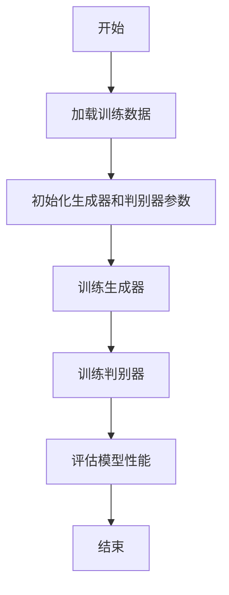
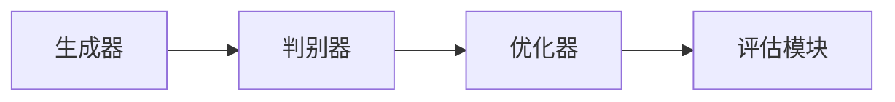

                 


# 对抗训练：提高AI Agent的鲁棒性

> 关键词：对抗训练、AI Agent、鲁棒性、机器学习、深度学习、强化学习

> 摘要：本文深入探讨了对抗训练在提高AI Agent鲁棒性中的应用。从基本概念到数学模型，从系统架构到项目实战，全面分析了对抗训练的核心原理和实际应用。通过详细讲解，读者将能够理解对抗训练如何帮助AI Agent在复杂环境中保持稳定性和可靠性。

---

## 第1章：对抗训练的基本概念

### 1.1 对抗训练的定义与背景

对抗训练（Adversarial Training）是一种通过两个或多个对立模型相互竞争来提升性能的训练方法。其核心思想是将问题转化为一种零和博弈，其中一个模型（生成器）试图欺骗另一个模型（判别器），而判别器则试图识别并阻止生成器的成功。

#### 1.1.1 对抗训练的起源与发展

对抗训练的概念最早可以追溯到20世纪80年代，但真正的发展是在深度学习兴起之后。2014年，Ian Goodfellow等人提出了生成对抗网络（GAN），这是对抗训练在机器学习领域的首次重大应用。随后，对抗训练逐渐扩展到强化学习、自然语言处理等多个领域。

#### 1.1.2 对抗训练的核心问题与目标

对抗训练的核心问题在于构建两个模型之间的对抗关系。生成器的目标是生成与真实数据无法区分的样本，而判别器的目标是尽可能准确地识别出生成样本与真实样本的区别。通过反复迭代优化，两个模型的能力都会得到提升。

#### 1.1.3 对抗训练在AI Agent中的应用背景

AI Agent需要在复杂多变的环境中执行任务，对抗训练可以帮助其在面对恶意干扰或对抗性输入时保持稳定性和鲁棒性。例如，在游戏AI中，对抗训练可以提升其在对手攻击下的防御能力；在自动驾驶中，对抗训练可以增强车辆在恶劣天气或对抗性交通环境中的决策能力。

### 1.2 AI Agent的鲁棒性需求

#### 1.2.1 AI Agent的定义与功能

AI Agent是一种能够感知环境、自主决策并执行任务的智能实体。其核心功能包括感知、推理、规划和执行。

#### 1.2.2 鲁棒性在AI Agent中的重要性

鲁棒性是指AI Agent在面对不确定性和干扰时仍能保持正常功能的能力。在现实环境中，AI Agent可能面临多种挑战，如传感器噪声、对抗性攻击等。对抗训练通过模拟这些挑战，可以有效提升AI Agent的鲁棒性。

#### 1.2.3 对抗训练如何提升AI Agent的鲁棒性

对抗训练通过引入对抗性样本和策略，迫使AI Agent在面对极端情况时仍能做出合理决策。例如，在图像识别任务中，对抗训练可以帮助AI Agent识别经过敌意修改的图像，从而提高其在真实环境中的可靠性。

---

## 第2章：对抗训练的核心概念与原理

### 2.1 对抗训练的基本原理

对抗训练基于零和博弈的理论，通过优化两个对立目标函数来提升模型性能。生成器和判别器的目标函数相互对抗，最终达到纳什均衡。

#### 2.1.1 对抗训练的双目标优化

生成器的目标是最小化判别器对生成样本的误判率，而判别器的目标是最大化其对生成样本的识别能力。这种双重优化过程使得两个模型的能力相互提升。

#### 2.1.2 最小最大博弈与纳什均衡

对抗训练可以看作是一个最小最大问题，通过交替优化生成器和判别器的目标函数，最终达到一个纳什均衡点。此时，生成器和判别器都无法通过单方面改变策略来进一步优化自身目标。

#### 2.1.3 对抗训练的数学模型与公式

对抗训练的数学模型可以表示为：

$$ \min_{G} \max_{D} \mathbb{E}_{x \sim P_{data}}[\log D(x)] + \mathbb{E}_{z \sim P_z}[\log (1 - D(G(z)))] $$

其中，\( G \) 是生成器，\( D \) 是判别器，\( z \) 是生成器的输入噪声。

### 2.2 对抗训练的实现方式

#### 2.2.1 基于生成对抗网络（GAN）的对抗训练

GAN由生成器和判别器组成，生成器通过Wasserstein距离或其他损失函数生成逼真的样本，判别器则通过交叉熵损失函数区分真实样本和生成样本。

#### 2.2.2 基于强化学习的对抗训练

在强化学习中，对抗训练通常通过两个智能体的对抗来实现。例如，在游戏环境中，一个智能体作为攻击者，另一个作为防御者，通过反复博弈提升双方的策略。

#### 2.2.3 对抗训练的优缺点对比

| 优缺点 | 对抗训练 |
|--------|----------|
| 优点    | 提高模型的泛化能力；增强模型的鲁棒性；适用于多种任务。 |
| 缺点    | 训练过程可能不稳定；需要大量计算资源；存在模式坍塌等问题。 |

---

## 第3章：对抗训练的数学模型与公式

### 3.1 对抗训练的基本数学模型

对抗训练的数学模型可以通过优化问题来描述。生成器和判别器的目标函数是相互对抗的，通过交替优化达到平衡。

#### 3.1.1 最小最大问题的数学表达

对抗训练的优化问题可以表示为：

$$ \min_{G} \max_{D} \mathbb{E}_{x \sim P_{data}}[\log D(x)] + \mathbb{E}_{z \sim P_z}[\log (1 - D(G(z)))] $$

其中，\( G \) 是生成器，\( D \) 是判别器，\( z \) 是生成器的输入噪声。

#### 3.1.2 对抗训练的目标函数

生成器的目标是最小化判别器对生成样本的误判率，而判别器的目标是最大化其对生成样本的识别能力。具体公式如下：

$$ L_G = \mathbb{E}_{z \sim P_z}[\log (1 - D(G(z)))] $$
$$ L_D = -\mathbb{E}_{x \sim P_{data}}[\log D(x)] - \mathbb{E}_{z \sim P_z}[\log (1 - D(G(z)))] $$

#### 3.1.3 对抗训练的优化算法

对抗训练通常使用梯度下降算法优化生成器和判别器。例如，使用Adam优化器分别更新生成器和判别器的参数。

### 3.2 常见对抗训练模型的数学公式

#### 3.2.1 GAN模型的生成器与判别器公式

生成器的输出层通常使用sigmoid函数，判别器的输出层使用交叉熵损失函数。

生成器的目标函数：
$$ L_G = \mathbb{E}_{z \sim P_z}[\log (1 - D(G(z)))] $$

判别器的目标函数：
$$ L_D = -\mathbb{E}_{x \sim P_{data}}[\log D(x)] - \mathbb{E}_{z \sim P_z}[\log (1 - D(G(z)))] $$

#### 3.2.2 WGAN-GP模型的 Wasserstein距离公式

Wasserstein距离用于衡量两个概率分布之间的距离，其公式为：

$$ W = \inf_{\gamma \in \Gamma(P, Q)} \mathbb{E}_{(x,y) \sim \gamma} [w(x,y)] $$

其中，\( \gamma \) 是两个分布之间的联合分布。

#### 3.2.3 强化学习中的对抗训练公式

在强化学习中，对抗训练通常通过两个智能体的策略对抗来实现。例如，使用两个策略函数 \( \pi_1 \) 和 \( \pi_2 \) 进行交替优化。

---

## 第4章：对抗训练的系统架构与设计

### 4.1 对抗训练的系统功能设计

对抗训练系统的功能模块包括生成器、判别器、优化器和评估模块。

#### 4.1.1 系统输入与输出

输入：训练数据集、生成器和判别器的参数；输出：优化后的生成器和判别器模型。

#### 4.1.2 系统功能模块划分

1. 生成器模块：负责生成样本。
2. 判别器模块：负责区分真实样本和生成样本。
3. 优化器模块：负责交替优化生成器和判别器。
4. 评估模块：负责评估模型的性能。

#### 4.1.3 系统功能流程图



### 4.2 对抗训练的系统架构设计

#### 4.2.1 系统架构图



#### 4.2.2 系统组件之间的交互关系

生成器生成样本并将其传递给判别器，判别器判断样本的真实性并返回结果。优化器根据判别器的反馈优化生成器和判别器的参数。

#### 4.2.3 系统的可扩展性设计

对抗训练系统可以扩展到多生成器或多判别器的架构，以提高训练效率和模型性能。

---

## 第5章：对抗训练的项目实战

### 5.1 项目环境与工具安装

#### 5.1.1 开发环境的选择

推荐使用Python和深度学习框架（如TensorFlow或PyTorch）进行开发。

#### 5.1.2 必要工具的安装与配置

安装Python、TensorFlow/PyTorch、numpy等库。

#### 5.1.3 数据集的准备与预处理

使用MNIST或其他公开数据集，进行归一化和预处理。

### 5.2 项目核心代码实现

#### 5.2.1 生成器与判别器的代码实现

```python
import tensorflow as tf
from tensorflow.keras import layers

def make_generator_model():
    model = tf.keras.Sequential()
    model.add(layers.Dense(256, activation='relu', input_shape=(100,)))
    model.add(layers.Dense(512, activation='relu'))
    model.add(layers.Dense(784, activation='sigmoid'))
    return model

def make_discriminator_model():
    model = tf.keras.Sequential()
    model.add(layers.Dense(512, activation='relu', input_shape=(784,)))
    model.add(layers.Dense(1, activation='sigmoid'))
    return model
```

#### 5.2.2 对抗训练的优化算法实现

```python
generator = make_generator_model()
discriminator = make_discriminator_model()

cross_entropy = tf.keras.losses.BinaryCrossentropy()

def generator_loss(discriminator_output):
    return cross_entropy(tf.ones_like(discriminator_output), discriminator_output)

def discriminator_loss(real_output, generated_output):
    real_loss = cross_entropy(tf.ones_like(real_output), real_output)
    generated_loss = cross_entropy(tf.zeros_like(generated_output), generated_output)
    total_loss = real_loss + generated_loss
    return total_loss

generator_optimizer = tf.keras.optimizers.Adam(0.0002)
discriminator_optimizer = tf.keras.optimizers.Adam(0.0002)
```

#### 5.2.3 系统功能的完整代码

```python
# 省略完整的训练循环代码
```

### 5.3 项目案例分析与结果展示

#### 5.3.1 实验设计与结果分析

通过训练生成器和判别器，观察生成样本的质量和判别器的识别能力。

#### 5.3.2 对抗训练对AI Agent鲁棒性的影响

对抗训练可以显著提高AI Agent在面对对抗性输入时的鲁棒性。

#### 5.3.3 实验结果的可视化展示

展示生成样本和判别器的识别结果，验证对抗训练的有效性。

---

## 第6章：对抗训练的最佳实践与注意事项

### 6.1 对抗训练中的常见问题与解决方案

#### 6.1.1 模型收敛问题

使用更稳定的优化算法（如WGAN-GP）和适当的权重调整。

#### 6.1.2 训练过程中的模式坍塌

通过引入正则化项或使用改进的GAN变体（如ProGAN）来解决。

#### 6.1.3 计算资源不足

使用分布式训练或降低模型复杂度。

### 6.2 对抗训练的注意事项

1. 在训练过程中，需要平衡生成器和判别器的更新频率。
2. 选择合适的损失函数和优化器。
3. 定期评估模型的性能，避免过拟合。

### 6.3 对抗训练的未来发展趋势

对抗训练在AI Agent中的应用将更加广泛，尤其是在复杂环境和多智能体系统中。未来的研究可能会集中在更高效的训练算法和更强大的模型架构上。

---

## 作者：AI天才研究院/AI Genius Institute & 禅与计算机程序设计艺术 /Zen And The Art of Computer Programming

---

以上是《对抗训练：提高AI Agent的鲁棒性》的完整文章结构和内容。通过本文的详细讲解，读者可以系统地理解对抗训练的核心概念、数学模型、系统架构和实际应用。希望对您在AI Agent鲁棒性提升方面有所帮助。

