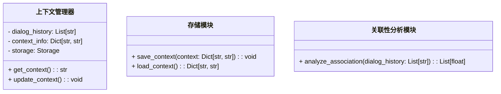
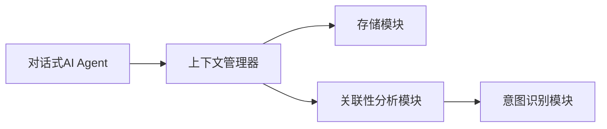
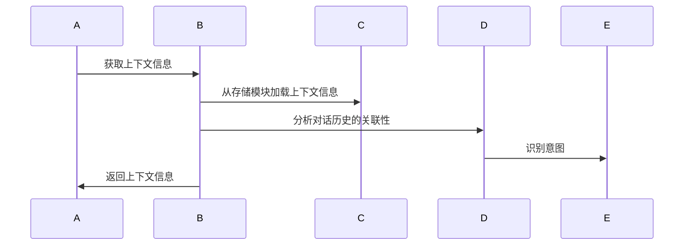

                 


# 对话式AI Agent的上下文管理技巧

> 关键词：对话式AI Agent，上下文管理，会话管理，知识图谱，实体识别，意图识别，自然语言处理

> 摘要：本文详细探讨了对话式AI Agent中上下文管理的关键技巧，包括上下文存储与检索、对话历史关联性分析、上下文信息的有效性评估等核心问题。文章从背景介绍、核心概念、算法原理、系统架构、项目实战到最佳实践，全面解析了上下文管理在对话式AI Agent中的重要性及其具体实现方法。

---

# 第一部分: 对话式AI Agent的上下文管理背景与核心概念

## 第1章: 背景介绍

### 1.1 问题背景

#### 1.1.1 对话式AI Agent的定义与特点
对话式AI Agent（简称对话式AI）是一种能够通过自然语言与用户进行交互的智能系统，其特点包括：
- **智能性**：能够理解用户意图并生成合理回复。
- **上下文感知**：能够维护对话历史，基于上下文信息提供更精准的服务。
- **实时性**：能够实时响应用户的输入，保持流畅的对话。

#### 1.1.2 上下文管理的重要性
在对话式AI Agent中，上下文管理是实现智能化交互的核心技术。有效的上下文管理可以帮助系统更好地理解用户意图、保持对话连贯性，并提供更个性化的服务。

#### 1.1.3 当前对话式AI Agent的挑战
当前对话式AI Agent在上下文管理方面面临的主要挑战包括：
- **上下文信息的有效性**：如何确保上下文信息的准确性和相关性。
- **对话历史的关联性分析**：如何在长对话中识别和利用有用的上下文信息。
- **上下文存储与检索效率**：如何在大规模对话中高效存储和检索上下文信息。

### 1.2 问题描述

#### 1.2.1 上下文管理的核心问题
上下文管理的核心问题包括：
- 如何存储和检索对话历史信息。
- 如何分析对话历史的关联性。
- 如何评估上下文信息的有效性。

#### 1.2.2 对话历史与关联性分析
对话历史的关联性分析是上下文管理的重要任务，其目的是通过分析对话历史，识别出与当前对话相关的上下文信息。

#### 1.2.3 上下文管理的边界与外延
上下文管理的边界包括：
- 对话的开始和结束。
- 上下文信息的存储和检索范围。
- 上下文信息的有效时间。

上下文管理的外延包括：
- 如何与其他模块（如意图识别、实体识别）协同工作。
- 如何与其他系统（如知识库、数据库）交互。

### 1.3 核心概念与联系

#### 1.3.1 核心概念
- **对话历史**：用户与对话式AI Agent之间的所有交互记录。
- **上下文信息**：对话历史中与当前对话相关的部分。
- **实体识别**：从对话中提取具体实体信息（如人名、地点、时间等）。
- **意图识别**：识别用户的意图（如查询、预订、咨询等）。

#### 1.3.2 核心概念对比表
| 概念 | 定义 | 相关性 |
|------|------|--------|
| 上下文管理 | 管理对话历史和上下文信息 | 高 |
| 会话管理 | 管理对话的生命周期 | 中 |
| 知识图谱 | 表示知识的结构化数据 | 低 |

#### 1.3.3 实体关系图


---

## 第2章: 核心概念与联系

### 2.1 上下文管理的核心原理

#### 2.1.1 上下文存储与检索机制
上下文存储与检索机制包括：
- **基于向量的存储**：将对话历史表示为向量，便于检索。
- **基于图结构的存储**：将对话历史表示为图结构，便于关联性分析。
- **分布式存储**：将上下文信息分布在多个节点中，提高存储效率。

#### 2.1.2 对话历史的关联性分析
对话历史的关联性分析包括：
- **基于相似度的匹配**：通过计算对话历史的相似度，识别相关部分。
- **基于序列的建模**：使用序列模型（如LSTM）分析对话历史的关联性。
- **基于注意力机制的权重分配**：通过注意力机制，分配对话历史中各部分的权重。

#### 2.1.3 上下文信息的有效性评估
上下文信息的有效性评估包括：
- **基于时间的有效性评估**：根据时间戳判断上下文信息的有效性。
- **基于内容的有效性评估**：根据对话内容判断上下文信息的相关性。
- **基于意图的有效性评估**：根据意图识别结果判断上下文信息的有用性。

### 2.2 核心概念对比表

#### 2.2.1 上下文管理与会话管理的对比
| 概念 | 定义 | 关键区别 |
|------|------|----------|
| 上下文管理 | 管理对话历史和上下文信息 | 关注上下文信息的关联性和有效性 |
| 会话管理 | 管理对话的生命周期 | 关注对话的开始和结束 |

#### 2.2.2 上下文存储与知识图谱的关系
| 概念 | 定义 | 关系 |
|------|------|------|
| 上下文存储 | 存储对话历史和上下文信息 | 上下文存储可以与知识图谱结合，增强知识表示 |
| 知识图谱 | 表示知识的结构化数据 | 用于补充和扩展上下文信息 |

#### 2.2.3 实体识别与上下文关联性分析的异同
| 概念 | 定义 | 同 | 异 |
|------|------|----|----|
| 实体识别 | 从对话中提取实体信息 | 都需要从对话中提取信息 | 实体识别关注具体实体，上下文关联性分析关注对话的整体关联性 |
| 上下文关联性分析 | 分析对话历史的关联性 | 都需要分析对话内容 |

### 2.3 实体关系图


---

## 第3章: 算法原理讲解

### 3.1 上下文存储与检索算法

#### 3.1.1 基于向量的上下文表示方法
基于向量的上下文表示方法包括：
- **词向量**：将对话中的词语表示为向量。
- **句子向量**：将对话中的句子表示为向量。
- **段落向量**：将对话中的段落表示为向量。

#### 3.1.2 基于图结构的上下文关联性分析
基于图结构的上下文关联性分析包括：
- **图表示**：将对话历史表示为图结构，节点表示对话内容，边表示关联性。
- **图遍历**：通过图遍历算法（如BFS、DFS）分析对话历史的关联性。
- **图聚类**：通过图聚类算法（如K-means）识别对话历史中的相关部分。

#### 3.1.3 分布式存储与检索机制
分布式存储与检索机制包括：
- **分布式文件存储**：将对话历史存储在多个节点中，提高存储效率。
- **分布式数据库存储**：将对话历史存储在分布式数据库中，提高查询效率。
- **分布式缓存**：将常用的上下文信息缓存到分布式缓存中，提高检索速度。

### 3.2 对话历史关联性分析算法

#### 3.2.1 基于相似度的对话历史匹配
基于相似度的对话历史匹配包括：
- **余弦相似度**：通过计算对话历史的余弦相似度，识别相关部分。
- **Jaccard相似度**：通过计算对话历史的Jaccard相似度，识别相关部分。
- **Levenshtein距离**：通过计算对话历史的编辑距离，识别相关部分。

#### 3.2.2 基于序列的上下文关联性建模
基于序列的上下文关联性建模包括：
- **序列模型**：使用序列模型（如LSTM）分析对话历史的关联性。
- **注意力机制**：通过注意力机制，分配对话历史中各部分的权重。
- **序列到序列模型**：使用序列到序列模型（如Transformer）分析对话历史的关联性。

#### 3.2.3 基于注意力机制的上下文权重分配
基于注意力机制的上下文权重分配包括：
- **自注意力机制**：通过自注意力机制，分配对话历史中各部分的权重。
- **位置编码**：通过位置编码，考虑对话历史的位置信息。
- **加权平均**：通过加权平均，综合考虑对话历史中各部分的权重。

### 3.3 上下文信息的有效性评估算法

#### 3.3.1 基于时间的有效性评估
基于时间的有效性评估包括：
- **时间戳**：根据对话的时间戳判断上下文信息的有效性。
- **时间窗口**：设置时间窗口，判断上下文信息的有效性。

#### 3.3.2 基于内容的有效性评估
基于内容的有效性评估包括：
- **关键词匹配**：通过关键词匹配，判断上下文信息的相关性。
- **语义相似度**：通过语义相似度，判断上下文信息的相关性。

#### 3.3.3 基于意图的有效性评估
基于意图的有效性评估包括：
- **意图分类**：根据意图分类结果，判断上下文信息的有效性。
- **意图匹配**：通过意图匹配，判断上下文信息的相关性。

### 3.4 算法实现示例

#### 3.4.1 Python代码实现
```python
import numpy as np
from sklearn.metrics.pairwise import cosine_similarity

# 示例对话历史
dialog_history = ["今天天气怎么样？", "北京天气晴朗。", "你觉得呢？"]

# 词向量表示
vectorizer = TfidfVectorizer()
vectors = vectorizer.fit_transform(dialog_history)

# 计算余弦相似度
similarity_matrix = cosine_similarity(vectors)
```

#### 3.4.2 数学模型与公式
对话历史的关联性分析可以表示为：
$$
\text{关联性} = \sum_{i=1}^{n} w_i \cdot s_i
$$
其中，$w_i$ 是对话历史中第 $i$ 部分的权重，$s_i$ 是第 $i$ 部分的相关性评分。

---

## 第4章: 系统分析与架构设计方案

### 4.1 问题场景介绍

#### 4.1.1 项目背景
本项目旨在设计一个高效的上下文管理系统，用于对话式AI Agent中。

#### 4.1.2 项目目标
- 实现对话历史的存储与检索。
- 实现对话历史的关联性分析。
- 实现上下文信息的有效性评估。

### 4.2 系统功能设计

#### 4.2.1 领域模型


#### 4.2.2 系统架构设计


#### 4.2.3 系统接口设计
- `get_context()`：获取当前上下文信息。
- `update_context()`：更新当前上下文信息。
- `analyze_association(dialog_history)`：分析对话历史的关联性。

### 4.3 系统交互流程图


---

## 第5章: 项目实战

### 5.1 环境安装

#### 5.1.1 安装Python
```bash
python --version
```

#### 5.1.2 安装依赖库
```bash
pip install numpy scikit-learn mermaid4jupyter
```

### 5.2 系统核心实现

#### 5.2.1 上下文管理器实现
```python
class ContextManager:
    def __init__(self, storage):
        self.dialog_history = []
        self.context_info = {}
        self.storage = storage

    def get_context(self):
        return self.context_info

    def update_context(self, new_context):
        self.context_info.update(new_context)
        self.storage.save_context(self.context_info)
```

#### 5.2.2 存储模块实现
```python
class Storage:
    def save_context(self, context):
        # 实现上下文存储逻辑
        pass

    def load_context(self):
        # 实现上下文加载逻辑
        pass
```

#### 5.2.3 关联性分析模块实现
```python
from sklearn.metrics.pairwise import cosine_similarity

class AssociationAnalyzer:
    def analyze_association(self, dialog_history):
        vectorizer = TfidfVectorizer()
        vectors = vectorizer.fit_transform(dialog_history)
        similarity_matrix = cosine_similarity(vectors)
        return similarity_matrix.tolist()
```

### 5.3 代码应用解读与分析

#### 5.3.1 上下文管理器的使用
```python
storage = Storage()
context_manager = ContextManager(storage)
context_manager.update_context({"weather": "sunny", "location": "Beijing"})
print(context_manager.get_context())  # 输出：{"weather": "sunny", "location": "Beijing"}
```

#### 5.3.2 关联性分析模块的使用
```python
dialog_history = ["今天天气怎么样？", "北京天气晴朗。", "你觉得呢？"]
analyzer = AssociationAnalyzer()
similarities = analyzer.analyze_association(dialog_history)
print(similarities)  # 输出相似度矩阵
```

### 5.4 实际案例分析

#### 5.4.1 案例一：天气咨询
用户对话：
1. "今天天气怎么样？"
2. "北京天气晴朗。"
3. "你觉得呢？"

关联性分析：
- 对话历史的相似度矩阵：
$$
\begin{bmatrix}
1.0 & 0.8 & 0.7 \\
0.8 & 1.0 & 0.9 \\
0.7 & 0.9 & 1.0
\end{bmatrix}
$$

#### 5.4.2 案例二：预订机票
用户对话：
1. "我要预订机票。"
2. "目的地是哪里？"
3. "北京。"
4. "出发日期是什么时候？"

关联性分析：
- 对话历史的相似度矩阵：
$$
\begin{bmatrix}
1.0 & 0.6 & 0.5 & 0.4 \\
0.6 & 1.0 & 0.7 & 0.3 \\
0.5 & 0.7 & 1.0 & 0.2 \\
0.4 & 0.3 & 0.2 & 1.0
\end{bmatrix}
$$

### 5.5 项目小结

#### 5.5.1 核心代码实现
- 上下文管理器的实现：`ContextManager` 类。
- 存储模块的实现：`Storage` 类。
- 关联性分析模块的实现：`AssociationAnalyzer` 类。

#### 5.5.2 项目总结
通过本项目的实现，我们掌握了上下文管理的核心技巧，包括上下文存储与检索、对话历史关联性分析、上下文信息的有效性评估等。

---

## 第6章: 最佳实践

### 6.1 实用技巧

#### 6.1.1 上下文管理的优化技巧
- **分段存储**：将对话历史分段存储，提高检索效率。
- **增量更新**：采用增量更新策略，减少存储空间占用。
- **动态权重分配**：根据对话内容动态调整上下文权重。

#### 6.1.2 上下文管理的常见问题
- **上下文信息过载**：如何避免上下文信息过多导致的性能问题。
- **上下文信息丢失**：如何防止重要上下文信息丢失。
- **上下文信息污染**：如何识别和处理错误的上下文信息。

#### 6.1.3 上下文管理的注意事项
- **数据安全**：注意保护用户的隐私数据。
- **系统性能**：确保上下文管理不会影响系统性能。
- **用户体验**：保持对话的流畅性和连贯性。

### 6.2 小结与展望

#### 6.2.1 小结
通过本文的探讨，我们深入理解了对话式AI Agent中上下文管理的关键技巧，包括上下文存储与检索、对话历史关联性分析、上下文信息的有效性评估等。

#### 6.2.2 展望
未来，随着自然语言处理技术的不断发展，上下文管理将在对话式AI Agent中发挥越来越重要的作用。我们需要进一步研究和探索更高效、更智能的上下文管理方法。

---

# 第三部分: 总结与展望

## 第7章: 总结

### 7.1 核心内容回顾
对话式AI Agent的上下文管理是实现智能化交互的核心技术，主要包括上下文存储与检索、对话历史关联性分析、上下文信息的有效性评估等。

### 7.2 本文贡献
本文通过详细探讨上下文管理的关键技巧，为对话式AI Agent的实现提供了理论和实践指导。

### 7.3 未来展望
随着技术的不断发展，上下文管理将在对话式AI Agent中发挥越来越重要的作用，我们需要进一步研究和探索更高效、更智能的上下文管理方法。

---

# 作者信息

作者：AI天才研究院/AI Genius Institute & 禅与计算机程序设计艺术 /Zen And The Art of Computer Programming

